footer: ![] (img/by-sa-sm.png) B. Bockelbrink, J. Priest, L. David (v2018-10-de-0.1) - <http://sociocracy30.org>
slidenumbers: true
autoscale: true
theme: Plain Jane, 1

# [fit] Soziokratie 3.0

# Ein Praxisleitfaden

#### James Priest, Bernhard Bockelbrink, Liliana David

#### [http://patterns-de.sociocracy30.org](http://patterns.sociocracy30.org)

---

## Soziokratie 3.0 - Ein Leitfaden zur Evolution agiler und resilienter Organisationen

### Effektive Zusammenarbeit in Organisationen beliebiger Größe

- **prinzipiengetrieben** - ein ganzheitlicher Weg zur Entwicklung einer agilen und soziokratischen Geisteshaltung
- **flexibel** - unabhängige, sich gegenseitig verstärkende Muster, die Organisationen in allen Aspekten der Zusammenarbeit unterstützen, und die leicht an den eigenen Kontext angepasst werden können
- **kostenlos** - lizenziert unter einer Creative Commons Free Culture Lizenz

### Was habe ich davon?

Soziokratie 3.0 — kurz: "**S3**" — bietet Dir eine umfangreiche Sammlung von Ideen (Mustern), die sich in Organisationen als hilfreich erwiesen haben, um **Produktivität, Zusammenarbeit und Zufriedenheit zu verbessern**.

S3 unterstützt dich dabei, herauszufinden, wie du am besten deine Ziele erreichst, und wie du komplexe Herausforderungen meisterst. Schritt für Schritt, **und das ganz ohne Reorganisation oder groß angelegte Change-Initiativen**:

- Beginne dort, wo der Bedarf am größten ist, und wähle ein oder mehrere Muster für ein Experiment. **Bestimme selbst die passende Geschwindigkeit** und entwickle die erforderlichen Fähigkeiten unterwegs.

- **Unabhängig von Deiner Position in der Organisation** wirst Du Muster finden, die Dir weiterhelfen können.

### Inhalt dieses Praxisleitfadens

- eine kurze Einführung in die wesentlichen Konzepte, auf denen S3 basiert
- eine Beschreibung aller Muster in S3
- ein Anhang: 
    - Protokoll der Aktualisierungen dieses Praxisleitfadens
    - Danksagungen und Informationen zu den Autoren
    - die Lizenz
    - Glossar und Index

---

## Geschichte und Einflüsse

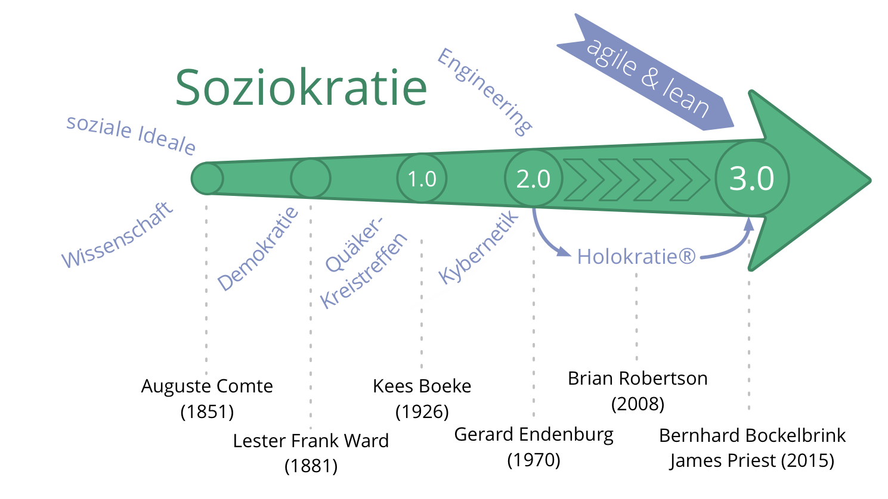

## Treiber für die Entwicklung von Soziokratie 3.0

> *Wir trafen uns 2014, um gemeinsam eine Bibliothek von frei verfügbaren Lernmaterialien herzustellen, die die Ideen der Soziokratie, Agile und Lean integrieren. Dabei entdeckten wir, dass kleine wie große Organisationen ein auf ihren spezifischen Kontext passendes Angebot aus Praktiken und Strukturen benötigen, das ihnen ermöglicht, eine agile und soziokratische Geisteshaltung zu entwickeln, um ihren eigenen Weg zu mehr Effektivität, Alignment, Wohlbefinden und Erfüllung zu finden.*

---

## Grundlegende Konzepte

Bevor Du in die Muster eintauchst, solltest Du Dich mit einigen Konzepten vertraut machen, die das Verständnis von S3 erleichtern:

- Was ist ein Muster?
- Die sieben Prinzipien
- Organisationen verstehen: 
    - Treiber, Wert und Verschwendung
    - Domänen, Delegation und Verantwortung
    - Governance und operatives Geschäft

Im Anhang findest Du ein Glossar, das kurze Erklärungen dieser und weiterer Begriffe enthält.

---

## Muster

_Ein **Muster** ist eine Vorgehensweise, um einer bestimmten Herausforderung erfolgreich zu begegnen._

- Die Muster in S3 werden durch die Beobachtung vieler Organisationen bei der Lösung ihrer Probleme und dem Umgang mit ihren Herausforderungen entdeckt.
- Die Muster können an den jeweiligen Kontext angepasst und dann weiterentwickelt werden.
- Die Muster sind thematisch in 10 Kategorien geordnet.

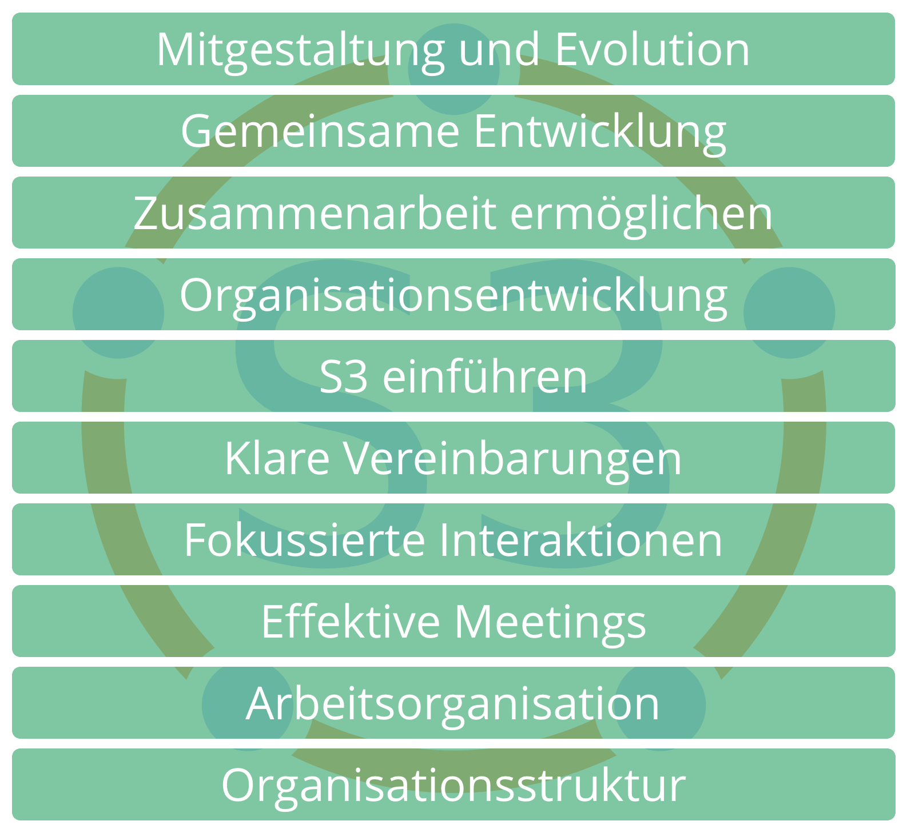

---

## Die sieben Prinzipien

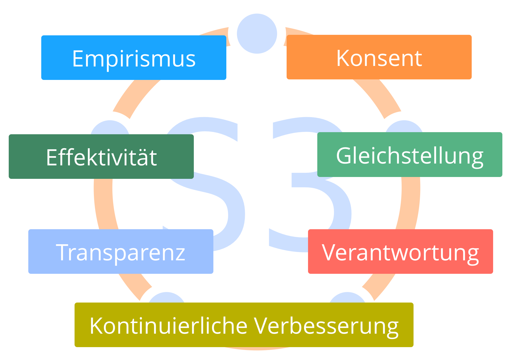

Alle Muster basieren auf den sieben Prinzipien:

**Das Prinzip der Effektivität:** *Investiere Zeit nur in das, was Dich dem Erreichen Deiner Ziele näher bringt.*

**Das Prinzip des Konsent:** *Suche nach möglichen Einwänden gegen Entscheidungen, bringe sie ein, und kümmere dich darum, dass das in ihnen enthaltene Wissen integriert wird.*

**Das Prinzip des Empirismus:** *Prüfe alle Annahmen durch Experimente und kontinuierliche Revision.*

**Das Prinzip der kontinuierlichen Verbesserung:** *Bevorzuge inkrementelle Veränderung, um stetiges empirisches Lernen zu ermöglichen.*

**Das Prinzip der Gleichstellung:** *Beziehe Menschen in die sie betreffenden Entscheidungen und deren Entwicklung ein.*

**Das Prinzip der Transparenz:** *Mache alle Informationen für jeden in der Organisation zugänglich, es sei denn, es gibt einen wichtigen Grund für Vertraulichkeit.*

**Das Prinzip der Verantwortlichkeit:** *Handle, wenn es erforderlich ist; befolge, was Du vereinbart hast und behalte die gesamte Organisation im Blick.*

### Das Prinzip der Verantwortlichkeit

*Handle, wenn es erforderlich ist; befolge, was Du vereinbart hast und behalte die gesamte Organisation im Blick.*

Handle in allen Domänen, für die du verantwortlich bist, innerhalb der Grenzen bestehender Vereinbarungen. Das betrifft die Organisation selbst, Teams, deren Teil du bist, und Rollen, die du übernommen hast.

Jeder Mitarbeiter ist verantwortlich für die effektive Zusammenarbeit aller bei der Antwort auf Organisationstreiber

Einzelpersonen und Gruppen sind jeweils verantwortlich für ihre eigene Arbeit, und für ihre Weiterentwicklung, und dafür, sich gegenseitig zu unterstützen.

jedes Mitglied einer Organisation ist verantwortlich dafür, seine Handlungen an den Werten der Organisation auszurichten

---

## Organisationen verstehen

---

### Treiber

_Ein **Treiber** ist das Motiv einer Person oder Gruppe, in einer bestimmten Situation zu handeln._

Ein Treiber …

- kann als Ausgangspunkt für Ziele, Vision oder "Bestimmung" dienen
- kann sich im Lauf der Zeit verändern

#### Treiber, Wert und Verschwendung

_**Wert** ist die Bedeutung oder der Nutzen von etwas in Bezug  auf einen bestimmten Treiber_

_**Verschwendung** ist alles, was für die effektive Antwort auf einen Treiber nicht erforderlich ist, oder ihr sogar im Wege steht._

Über das Konzept von Wert und Verschwendung können Organisationen, die Muster aus S3 verwenden, auch viele Praktiken und Ideen aus der **Lean Production** und der **Lean Softwareentwicklung** nutzen. Zum Beispiel:

- Wertstromanalyse
- verschiedene Strategien zur Vermeidung von Verschwendung
- die Kanban-Methode

---

### Domänen

_Eine **Domäne** ist ein eigener Arbeits-, Einfluss-  und Entscheidungsbereich innerhalb einer Organisation._

Alle Domänen befinden sich innerhalb der Domäne der Organisation, und können sich mit anderen Domänen überschneiden, oder auch vollständig in ihnen enthalten sein.

Domänen werden an Mitarbeiter delegiert (z.B. an eine Geschäftseinheit, eine Abteilung, ein Team oder eine Einzelperson), die dann – innerhalb der Grenzen des Autonomie- und Einflussbereiches dieser Domäne – die Verantwortung dafür übernehmen.

#### Domänen delegieren

Wer eine Domäne delegiert (die *Delegierende*) bleibt weiterhin verantwortlich für diese Domäne, stellt die erforderlichen **Ressourcen** bereit und definiert oft:

- den **Bedarf** der Organisation, aus dem heraus die Domäne entstanden ist
- **Kernaufgaben** (wesentliche Leistungen, etwaige kritische Risiken, die beachtet werden müssen, sowie weitere essentielle Arbeitsaufgaben und Entscheidungen, die delegiert wurden)
- **Einschränkungen von Autonomie und Einfluss** der *Beauftragten*, normalerweise in Bezug auf die Organisation selbst (z.B. Abhängigkeiten, Mitbestimmung der Delegierenden, oder Reporting)

#### Treiber und Domänen

Eine Domäne kann auch in Bezug auf Organisationstreiber beschrieben werden:

- ausgehend vom so genannten **Primärtreiber** der Domäne (dem übergeordneten Treiber, auf den die Domänenverantwortlichen antworten)
- sowie die Menge derjenigen Subtreiber, die im Kontext der Antwort auf diesen Primärtreibers ebenfalls berücksichtigt werden müssen: 
    - **Kernaufgaben**: alle Treiber, die direkt vom Primärtreiber abgeleitet werden können
    - Treiber für **Beschränkungen der Domäne**, die sich in der Regel auf die Organisation selbst beziehen

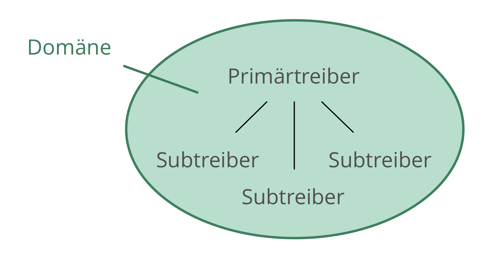

---

### Governance und operatives Geschäft

Aktivitäten in einer Organisation fallen typischerweise in eine der folgenden zwei Kategorien

_Bezogen auf Organisationen bezeichnet **Governance** alle Tätigkeiten, die mit der Festlegung von Zielen und den aus diesen Zielen resultierenden Steuerungsaufgaben zu tun haben: Menschen mit der entsprechenden Befugnissen treffen bewusst Entscheidungen, die die Wertschöpfung  der Organisation (und die der Teams und Personen innerhalb der Organisation)  mittel- und langfristig steuern, und entwickeln diese Entscheidungen stetig anhand der gewonnenen Erkenntnisse weiter. Diese Entscheidungen begrenzen Handlungsspielräume, lenken zukünftige Entscheidungen, Verteilen Ressourcen und legen Details zu Leistungen fest._

_Das **operative Geschäft** umfasst die zur Wertschöpfung erforderliche Arbeit, so wie die Organisation des Tagesgeschäfts, gelenkt durch Governance-Entscheidungen._

#### Related Concepts

**Selbststeuerung**: Eine Gruppe, sich innerhalb einer Grenzen einer Domäne selbst steuert und selbst organisiert.

**Teilautonomie**: Die Freiheit der Beauftragten, selbst zu entscheiden, wie sie in ihrer Domäne Wert schöpfen  werden, die dann weiter begrenzt wird durch ihre eigenen Steuerungsentscheidungen, und durch Einwände (u.A. von der Delegierenden und von Repräsentanten).

**Selbstorganisation**: Alle Aktivitäten und Prozesse, durch die sich eine Gruppe mittels lokaler Interaktionen und ohne externen Einfluss organisiert. In jeder Organisation und in jedem Team koexistieren Selbstorganisation und externer Einfluss.

Je nach den Einschränkungen der Domäne, die die Delegierende festlegt, haben Teams mehr oder weniger Autonomie, Steuerungsentscheidungen zu treffen und ihr operatives Geschäft zu gestalten, sind also mehr oder weniger selbststeuernd und selbstorganisierend.

---

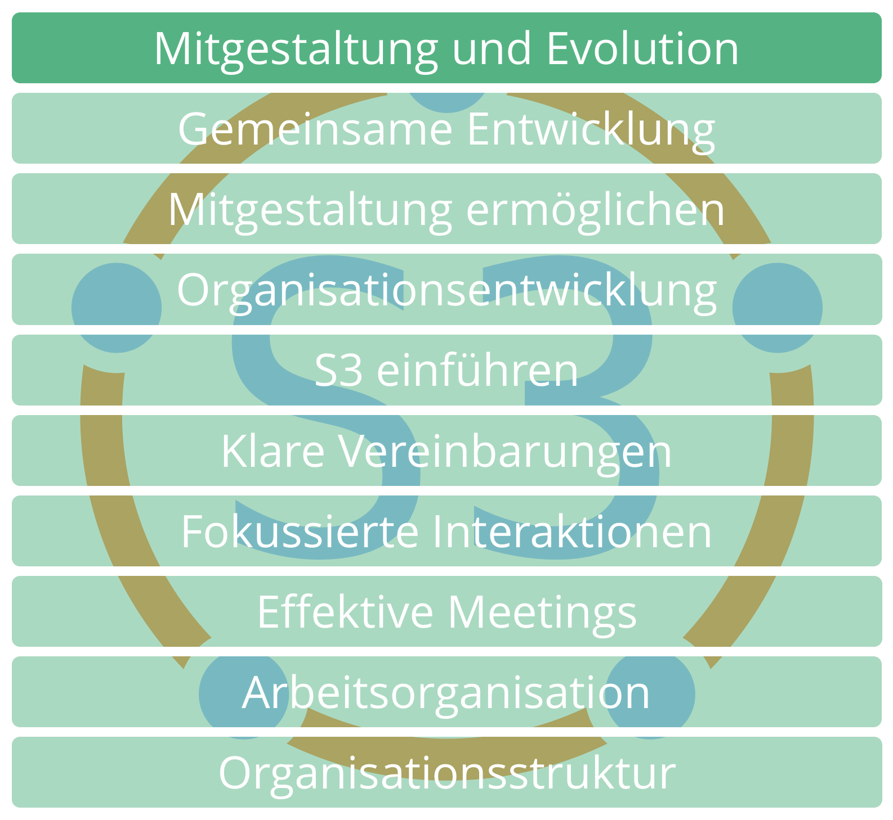

---

## Muster 1.1: Reagiere auf Organisationstreiber

**Kläre Organisationstreiber und reagiere entsprechend.**

Mögliche Reaktionen auf [Organisationstreiber](glossary:organizational-driver) sind u.A.:

- direkte Aktion ([operative Tätigkeiten](glossary:operations))
- Arbeitsorganisation 
- Steuerungsentscheidungen

Die Antwort auf einen Organisationstreiber sollte als Experiment angesehen werden, das ausgewertet und weiterentwickelt wird.

### Organisationstreiber erkennen

Ein Treiber ist das Motiv einer Person oder Gruppe, auf eine bestimmte Situation zu reagieren. Ein Treiber wird als **Organisationstreiber** betrachtet, wenn eine Reaktion darauf der Organisation hilft, Wert zu schaffen, Verschwendung zu reduzieren oder Schaden abzuwenden.

Ob es sich bei einem Treiber um einen Organisationstreiber handelt, kann leicht mit folgender Frage geklärt werden:

*Würde es der Organisation helfen, wenn wir auf diesen Treiber reagieren? Oder würde es schaden, wenn wir diesen Treiber ignorieren?*

---

## Muster 1.2: Navigiere nach Spannung

**Gehe bewusst mit Spannung um, die du in Bezug auf die Organisation empfindest: untersuche die zugrundeliegenden Ursachen und übergib die dabei entdeckten Treiber an die zuständige Domäne.**

**Herausforderungen und Chancen** für eine Organisation werden durch ihre Mitglieder aufgedeckt, in dem diese den Gründen nachspüren, warum sie Spannung empfinden.

**Anmerkung:** Eine *Spannung* ist eine persönliche Erfahrung: Ein Symptom von Unstimmigkeit zwischen persönlicher Wahrnehmung und Erwartung (oder Präferenz).

Spüre Spannungen nach, und beschreibe Situation und Bedarf der Organisation, um **Treiber zu entdecken**. Manchmal zeigt diese Untersuchung auch Missverständnisse auf, wodurch sich die Spannung oft auflöst.

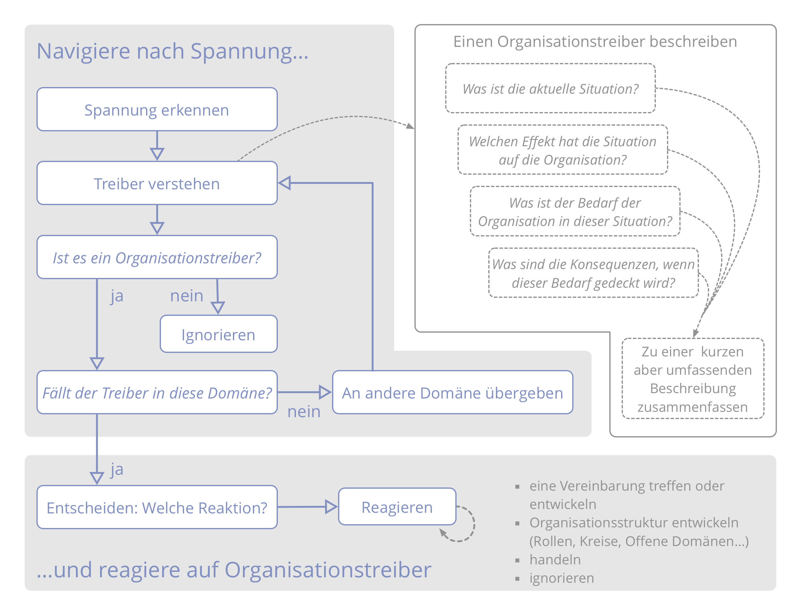

---

## Muster 1.3: Organisationstreiber beschreiben

**Beschreibe Organisationstreiber, um sie zu verstehen, zu kommunizieren und sie im Gedächtnis zu behalten.**

[Treiber](glossary:organizational-driver) können von Einzelpersonen oder auch gemeinsam von einer Gruppe beschrieben werden. Je nach Blickwinkel kann derselbe Treiber als zu lösendes **Problem** oder auch als **Chance** beschrieben werden, die die Organisation nutzen kann.

Eine einfache Methode, einen Treiber zu beschreiben:

- **Was gerade passiert:** 
    - die **aktuelle Situation**
    - den **Effekt** dieser Situation auf die Organisation
- und **warum wir handeln sollten:** 
    - den **Bedarf** der Organisation bezogen auf diese Situation
    - die **Konsequenzen**, wenn dieser Bedarf gedeckt wird

Verfasse eine knappe Zusammenfassung, die gerade genug Informationen enthält, um die Notwendigkeit einer Aktion oder einer Entscheidung zu erklären.

### Beispiel:

> *"Die Küche ist ein Durcheinander: Es gibt keine sauberen Tassen, das Waschbecken ist voller Geschirr und es ist unmöglich, sich schnell einen Kaffee holen und wieder an die Arbeit zu gehen. Die Küche muss benutzbar sein, damit wir uns auf unsere Arbeit konzentrieren können."*

### 1. Aktuelle Situation

> *“Die Küche ist ein Durcheinander: Es gibt keine sauberen Tassen, das Waschbecken ist voller Geschirr...”*

Beschreibe die aktuelle Situation:

- Skizziere die wesentlichen Aspekte der Situation, und erkläre den Kontext, soweit erforderlich.
- Bemühe dich um Objektivität: beschreibe Beobachtungen, und vermeide Beurteilungen.

### 2. Effekt

> *“...es ist unmöglich, sich schnell einen Kaffee holen und wieder an die Arbeit zu gehen.”*

Erkläre den Effekt dieser Situation auf die Organisation:

- Zeige, **warum** sich die Organisation um diese Situation kümmern sollte: wie betrifft das die Organisation? 
- Benenne klar, ob ein Effekt belegt ist oder nur vermutet wird. 
- Erläutere Herausforderungen, Verluste, Chancen oder Nutzen. 

### 3. Bedarf

> *“Die Küche muss benutzbar sein...”*

Erkläre den [Bedarf](glossary:need) der Organisation bezogen auf diese Situation:

- Ein **Bedarf einer Organisation** ist etwas, das Team (bzw. ein einzelner Mitarbeiter) benötigt, um sich effektiv um seine [Domäne](glossary:domain) kümmern zu können. 
- Benenne explizit, wer den Bedarf hat ("wir benötigen", "sie benötigen", "ich benötige").
- Bei Uneinigkeit über den Bedarf ist es oft hilfreich, sich von der Formulierung spezifischer Lösungsstrategien zu lösen und sich darauf zu konzentrieren, was der Organisation in dieser Situation fehlt.

### 4. Konsequenzen

> *“...damit wir uns auf unsere Arbeit konzentrieren können.”*

Beschreibe die Konsequenzen, wenn dieser Bedarf gedeckt wird:

- Beschreibe das [angestrebte Ergebnis](glossary:intended-outcome), sowie potenzielle Vorteile oder Chancen.
- Die Konsequenzen können auch offensichtlich oder implizit sein, insbesondere wenn der Effekt der Situation auf die Organisation bereits gut beschrieben ist.

### Verfasse eine Zusammenfassung

Beschränke dich auf 1-2 Sätze, so dass der Treiber leicht verständlich und gut zu merken ist.

Zusätzlich zu dieser Zusammenfassung können im Logbuch natürlich auch noch weitere Details zum Treiber dokumentiert werden.

### Treiber überprüfen

Stelle sicher, dass die Beschreibung eines Treibers regelmäßig überprüft wird, um das Verständnis der Situation und des Bedarfs zu vertiefen.

Hilfreiche Fragen für eine Evaluation

- Ist die Beschreibung der Situation weiterhin zutreffend?
- Verbinden wir mit dieser Situation immer noch den gleichen Bedarf?
- Befindet sich der Treiber immer noch innerhalb unserer Domäne?
- Ist der Treiber immer noch relevant?

---

## Muster 1.4: Konsententscheidung

**Ein (moderierter) Gruppenprozess zur Entscheidungsfindung: sammle Einwände, und integriere das dahinterstehende Wissen, um Vorschläge und bestehende Vereinbarungen weiterzuentwickeln**

Vorschläge werden zu [Vereinbarungen](glossary:agreement), wenn sie als *gut und sicher genug* bis zum Termin der nächsten Überprüfung betrachtet werden.

Ungelöste [Einwände](glossary:objection) verhindern, dass ein Vorschlag zu einer Vereinbarung wird.

Das Zurückhalten von Einwänden kann die Ziele eines Teams oder der gesamten Organisation gefährden.

### Impliziter Konsentvertrag

1. Wenn es keine Einwände gegen eine Vereinbarung gibt, beabsichtige ich, diese Vereinbarung im Rahmen meiner Möglichkeiten umzusetzen.
2. Ich stimme zu, Einwände einzubringen, sobald sie mir bewusst werden.

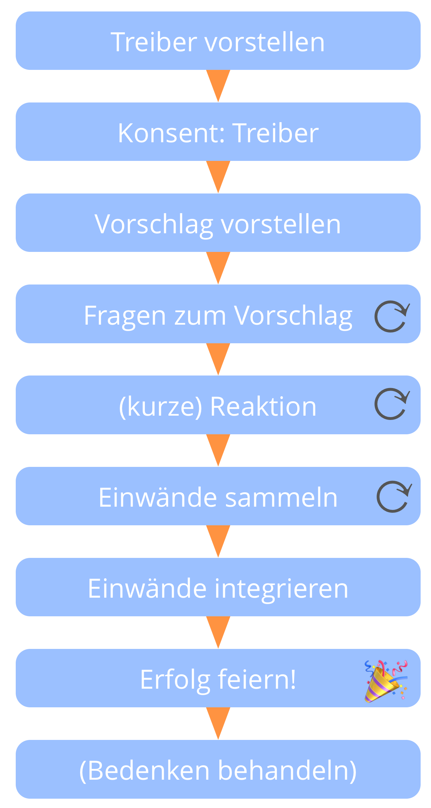

---

## Muster 1.5: Einwand

_Ein **Einwand** ist ein _Argument_, warum eine geplante Handlung oder Entscheidung die effektive Reaktion auf einen Organisationstreiber verhindert._

Einwände gegen Vorschläge, Entscheidungen, bestehenden [Vereinbarungen](glossary:agreement) oder Massnahmen enthalten wesentliche Informationen über **negative Konsequenzen** oder sonstige **Verbesserungspotenziale**. verwendet.

Es liegt in der Verantwortung des Einzelnen, mögliche Einwände zu einzubringen.

Das Zurückhalten von Einwänden kann die Fähigkeit von Personen, Teams oder der gesamten Organisation beeinträchtigen, effektiv auf [Organisationstreiber](glossary:organizational-driver) zu reagieren.

Die Möglichkeit, *potentielle* Einwände jederzeit einbringen zu können bedeutet, dass Entscheidungen lediglich *gut genug für den Moment sein müssen, und sicher genug, um sie auszuprobieren*.

Die für die betreffende Aktion oder Entscheidung Verantwortlichen sind ebenfalls verantwortlich dafür, *Argumente zu bedenken und Einwände zu berücksichtigen*.

Berücksichtige bei der Suche nach potenziellen Einwänden:

- warum das [angestrebte Ergebnis](glossary:intended-outcome) nicht (vollständig) erreicht werden kann: **Effektivität**
- warum es verschwenderisch wäre, dem Vorschlag (oder der existierenden Vereinbarung) zu folgen: **Effizienz**
- die negativen Konsequenzen, die an anderer Stelle entstehen würden (in derselben [Domäne](glossary:domain), in der größeren Organisation, oder auch darüberhinaus): **Seiteneffekte**

Nutze die von Einwänden aufgedeckten Informationen zur Verbesserung

- laufender und geplanter Aktivitäten
- der Ausführung von Entscheidungen
- bestehender Vereinbarungen
- Vorschlägen
- dem gemeinsamen Verständnis von Treibern

### Einwände qualifizieren

Nicht alle vorgebrachten Argumente sind Einwände. Unterscheide zwischen Einwänden, die immer nützliche Informationen enthüllen, und sonstigen Argumenten, die nur auf Meinungen, Vorlieben oder Bedenken basieren.

Um herauszufinden, um ob ein vorgebrachtes Argument tatsächlich einen Einwand darstellt, könnte ein Moderator z.B. folgende Frage stellen:

*"Denkt Ihr, dass es sich bei diesem Argument um einen Einwand handelt?"*

Wenn alle Teilnehmer dem Argument zustimmen, handelt es sich üblicherweise um einen Einwand. Falls nicht, versuche, hinter dem Argument einen tatsächlichen Einwand zu finden, oder Missverständnisse aufzudecken.

### Einwände verstehen

Hilfreiche Fragen zum gemeinsamen Verständnis von Einwänden:

- Inwiefern bezieht ich dieses Argument auf diesen Vorschlag bzw. diese Vereinbarung?
- Zeigt dieser Einwand auf, wie eine (vorgeschlagene oder bestehende) **Aktivität oder Vereinbarung**: 
    - die Reaktion auf einen Organisationstreiber beeinträchtigt?
    - hier und jetzt verbessert werden kann?
    - dem Beitrag eines Beteiligten im Weg steht?
    - im Widerspruch zu den Werten der Organisation steht?
    - nicht als ‘sicher genug’ angesehen werden kann?

### Bedenken

_Ein **Bedenken** ist die Ansicht, dass etwas - selbst in der Abwesenheit von Einwänden - eine effektiv(er)en Antwort auf einen Organisationstreiber behindern **könnte**._

In einer _Konsententscheidung_ können Bedenken Wege aufzeigen, wie eine Vereinbarung weiterentwickelt werden kann, z.B. über die Anpassung von Evaluationskriterien und -zeitpunkt.

Bringe Bedenken ein, wenn du sie als wichtig erachtest, und protokolliere sie im mindesten Falle mit Evaluationskriterien.

Wenn du im Zweifel bist, ob es sich bei einem Argument um einen Einwand oder ein Bedenken handelt, frage die Gruppe, ob sie es für einen Einwand halten.

---

## Muster 1.6: Einwände integrieren

**Integriere Einwände einzeln nacheinander, indem jeweils das im Einwand enthaltene Wissen in Änderungsanträgen formuliert wird.**

Wähle für jeden [Einwand](glossary:objection) zunächst diejenige Option, die für diesen Einwand am meisten Erfolg verspricht, wenn die Option nicht zum Erfolg führt, versuche einfach eine andere. Jeder Versucht wir die Gruppe dabei unterstützen, mehr über den Einwand zu verstehen, sich schrittweise an einen Änderungsantrag heranzutasten, der den Einwand erfolgreich integriert.

Es ist oft eine guter Anfang, den Einwandgeber zuerst nach einem möglichen Änderungsantrag zu fragen.

Es ist in der Regel am effektivsten, **jeden Einwand einzeln zu betrachten**, alle Einwände gegen den aus diesem Einwand resultierenden Änderungsanträgen zu integrieren, und dann erst mit dem nächsten Einwand fortzufahren.

---

## Muster 1.7: Vereinbarungen entwickeln

**Entwickle alle Vereinbarungen ständig weiter, und reduziere dabei Verschwendung.**

Regelmäßige Überprüfung aller Vereinbarungen ist eine ist eine essentielle Voraussetzung für lernende Organisationen:

- passe Vereinbarungen an sich verändernde Gegebenheiten an
- integriere gewonnene Erkenntnisse, um Vereinbarungen effektiver zu machen

Stelle sicher, dass für jede [Vereinbarung](glossary:agreement) ein Termin zur Evaluation festgelegt wird.

Im einfachsten Fall beschränkt sich die Prüfung einer Vereinbarung darauf, festzustellen, dass sie weiterhin relevant ist und kein Einwände gegen ihren Fortbestand existieren.

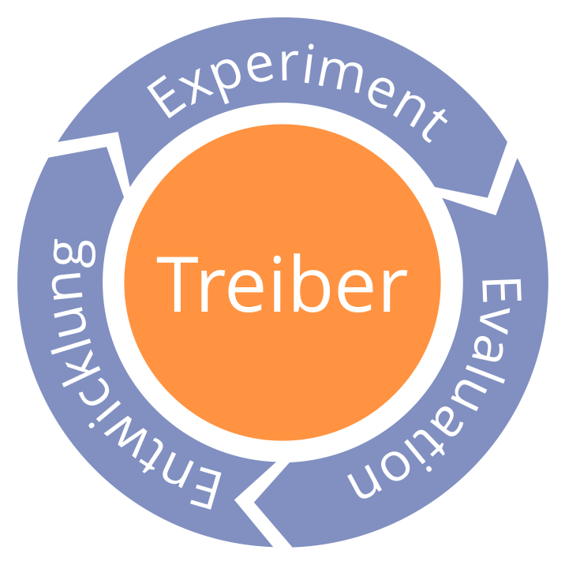

Vereinbarungen werden oft _Governance-Meetings_ evaluiert, aber in manchen Fällen ist es ratsam, einen gesonderten Termin anzusetzen.

Die Abstände zwischen den Evaluationen sollte der Vereinbarung und dem Kontext angemessen sein, falls erforderlich, kann auch eine vorgezogene Evaluation stattfinden.

Elemente dieses Musters können auch von Einzelpersonen bei der Prüfung ihrer Entscheidungen angewendet werden.

### Kurzes Format

- *Wie hat uns diese Vereinbarung weitergeholfen?*
- *Gibt es einen Grund, diese Vereinbarung zu beenden?*
- *Wie kann diese Vereinbarung verbessert werden?*
- Nicht vergessen, den nächsten Überprüfungstermin festzulegen.

### Ausführliches Format

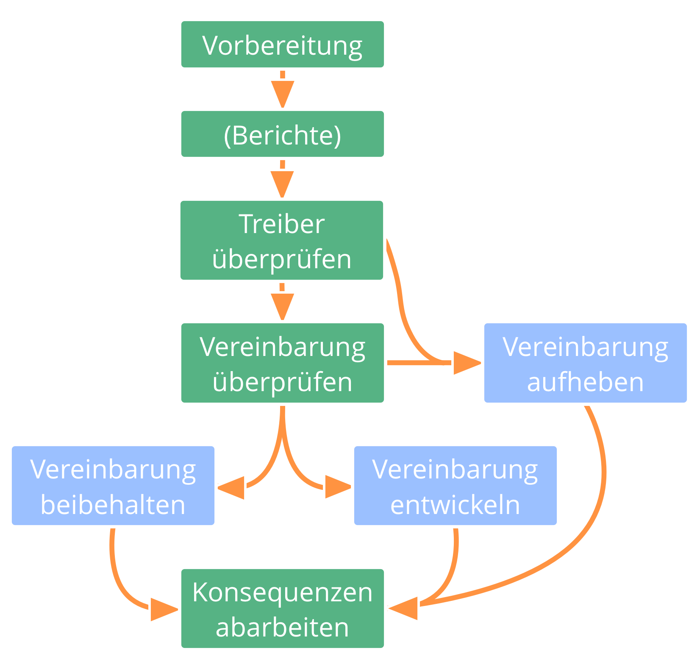

Vorbereitung:

- Termin für Überprüfung vereinbaren
- Notwendige Informationen bereitstellen

Nachbereitung:

- den nächsten Überprüfungstermin vereinbaren
- getroffene Entscheidungen und resultierende Aufgaben dokumentieren, und an die betreffenden Personen kommunizieren
- Auswirkungen auf andere Vereinbarungen überlegen

---

## Muster 1.8: Die Betroffenen entscheiden

**Beteilige alle von einer Entscheidung Betroffen, um alle für die Entscheidung erforderlichen Informationen verfügbar zu machen, und um Gleichstellung und Verantwortlichkeit sicher zu stellen.**

Für grössere Gruppen:

- Moderiere einen mehrstufigen Prozess und bilde Gruppen, die Delegierte wählen
- nutze Online-Werkzeuge, um asynchrone und mehrstufige Prozesse mit festem Zeitrahmen für jeden Prozessschritt durchzuführen

Erwäge, die Betroffenen auch bei der Überprüfung und Weiterentwicklung der Entscheidungen miteinzubeziehen.

---

## Muster 1.9: Vorschläge gemeinsam gestalten

**Bringe Menschen zusammen, um gemeinsam einen Vorschlag für die Reaktion auf einen Organisationstreiber zu entwickeln: Nutze das kollektive Wissen der Gruppe, und fördere Engagement und Verantwortungsbewusstsein.**

Es gibt zahlreiche Wege, Vorschläge in einer Gruppe zu erarbeiten. Sie alle folgen in der Regel diesem Muster:

1. Einigung auf den [Treiber](glossary:organizational-driver) (bzw. das Problem, die Herausforderung, oder den Bedarf)
2. Untersuchen des Themas und Verstehen der Limitierungen
3. Ideen sammeln
4. Einen konkreten Vorschlag gestalten (oft in einer kleineren Gruppe)

Ein klar definierter Gruppenprozess zur Vorschlagsgestaltung in der Gruppe ist das S3-Muster _Proposal Forming_.

Inspiration für die Schritte 2 und 3 findet man z.B. in den klassischen Moderationstechniken, und im Design Thinking.

Gemeinsame Vorschlagsgestaltung kann auch für Telekonferenzen und Online-Meetings adaptiert werden. Es ist auch möglich, den Prozess asynchron (und über einen längeren Zeitraum) mit sehr großen Gruppen durchzuführen.

---

## Muster 1.10: Proposal Forming

**Ein (moderiertes) Format zur gemeinsamen Gestaltung eines Vorschlags zur Antwort auf einen Treiber.**

- nutzt das kollektive Wissen und die Vielfalt der Perspektiven innerhalb einer Gruppe
- bezieht die gesamte Gruppe in die Gestaltung von Vereinbarungen mit ein
- fördert Verantwortlichkeit und Unterstützung der resultierenden Vereinbarung

*Proposal Forming* kann auch von Einzelpersonen angewendet werden.

### Proposal Forming: Ablauf

**Zustimmung zum Treiber**: Stelle den [Treiber](glossary:organizational-driver) kurz vor. *Ist dieser Treiber für uns relevant? Will jemand etwas hinzufügen?*

**Das gemeinsames Verständnis des Treibers vertiefen**: Die Teilnehmer können Fragen stellen, um mehr über den Treiber zu erfahren.

**Überlegungen sammeln**, formuliert als Fragen in Bezug auf mögliche Lösungen. Diese Fragen deuten entweder auf Einschränkungen (Informationsfragen) oder Möglichkeiten (generative Fragen) hin.

**Beantwortung** der Informationsfragen (soweit möglich)

Überlegungen **priorisieren**

**Ideen sammeln** als mögliche Bestandteile eines Vorschlags

**Formulieren eines Vorschlags** zur Antwort auf den Treiber, unter Berücksichtigung der gesammelten Ideen und Informationen. Dieser Schritt erfolgt typischerweise in einer kleineren Gruppe von "Gestaltern".

### Gestalter bestimmen

Bedenke:

- Wer sollte dabei sein?
- Wer will dabei sein?
- Wer könnte sonst noch einen wertvollen Beitrag leisten?
- Berücksichtige Expertise, besondere Perspektiven und Inspiration.

In der Regel ist eine Gruppe von 2–3 Gestaltern angemessen. Prüfe, ob es Einwände gegen die vorgeschlagenen Gestalter gibt.

---

## Muster 1.11: Wahl

**Ein Gruppenprozess zur Besetzung von Rollen nach Befähigung.**

Anstatt Personen eine _Rolle_ zuzuweisen, oder per Mehrheit zu bestimmen, verwende diesen Auswahlprozess, um:

- das Wissen der gesamten Gruppe zu nutzen, indem begründete Nominierungen vorgebracht und bedacht werden
- die Verantwortlichkeit der gesamten Gruppe für die resultierende Entscheidung zu stärken
- die Unterstützung der Rolleninhaberin für durch die Gruppe sicherzustellen

### Wahlverfahren

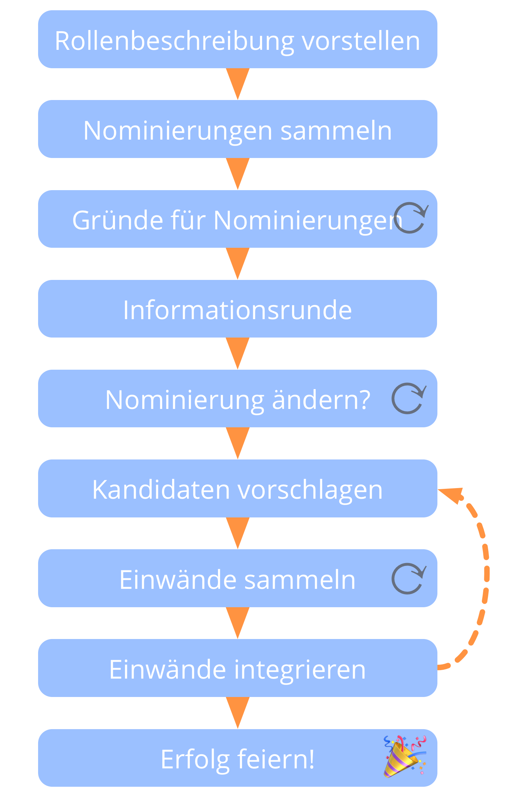

1. **Rollenbeschreibung vorstellen**. Falls möglich, die Rollenbeschreibung den Teilnehmern bereits vor der Wahl zugänglich machen.
2. **Nominierungen sammeln:** Teilnehmer schreiben ihren Vorschlag (und ihren Namen) auf einen Zettel. Teilnehmer dürfen sich auch selbst nominieren, oder passen.
3. **Gründe für die Nominierungen:** die Teilnehmer erklären in einer Runde kurz, wen sie nominieren, und erläutern kurz ihre Gründe für die Nominierung 
4. **Informationsrunde** Teilnehmer können weitere Informationen einbringen, die sie für relevant für die Wahl erachten, oder auch nach Informationen fragen
5. **Nominierungen ändern:** Die Teilnehmer bekommen Gelegenheit, ihre Nominierung aufgrund der bisher gehörten Informationen zu ändern. Dabei teilen die Teilnehmer auch die Gründe für die Änderung mit.
6. **Einen Kandidaten vorschlagen:** Die Moderatorin führt den Prozess, einen passendenden Kandidaten anhand der vorgebrachten Argumente vorzuschlagen, z.B. durch 
    - Vorschlag der Moderatorin oder eines Teilnehmers
    - die Bitte an (einige der) Nominierten, gemeinsam einen Kandidaten vorzuschlagen
    - kurzen Dialog in der Gruppe, um den geeignetsten Kandidaten zu identifizieren
7. **Einwände sammeln:** alle Teilnehmer (auch der vorgeschlagene Kandidat) geben gleichzeitig per Handzeichen bekannt, ob sie einen [Einwand](glossary:objection) gegen die Wahl des Kandidaten für die Rolle haben. 
8. **Einwände integrieren**, dabei zuerst etwaige Einwände des vorgeschlagenen Kandidaten behandeln. Es gibt _verschiedene Methoden, Einwände zu integrieren_, das Ergebnis könnten z.B. Änderungen in der Rollenbeschreibung oder die Nominierung einer anderen Person sein. Wenn alle Einwände behandelt wurden, wird der letztendliche Kandidat nochmals gefragt, ob er die Rolle annimmt.
9. **Erfolg feiern:** Bestätige, dass eine Einigung erzielt wurde, und danke der Person, die die Rolle von nun an übernimmt.

Vermeide es, vor der Wahl Interesse an der Rolle oder persönliche Meinungen zu bekunden, um die Anderen nicht unnötig zu beeinflussen.

Manchmal enthüllt ein das Wahlverfahren einen Mangel an zeitlicher Kapazität, Fähigkeiten oder relevanter Erfahrung. Die Gruppe muss dann externe Kandidaten prüfen, die Prioritäten neu bewerten oder andere Wege finden, sich um die betreffende Domäne zu kümmern.

Dieses Muster kann auf andere Situationen angepasst werden, in denen eine Auswahl aus verschiedenen Optionen getroffen werden muss.

---

## Muster 1.12: Driver Mapping

Ein Workshop-Format um einer komplexen Situation effektiv zu begegnen: Unternehmensgründung, Projektbeginn, Umgang mit Hindernissen bzw. Chancen, oder die Entwicklung einer Organisationsstruktur, die den [Wertfluss](glossary:flow-of-value) unterstützt.

Kleine oder grosse Gruppen identifizieren und organisieren Treiber, um dann in selbstorganisierenden Gruppen schnell von Konzept zu Umsetzung zu gelangen.

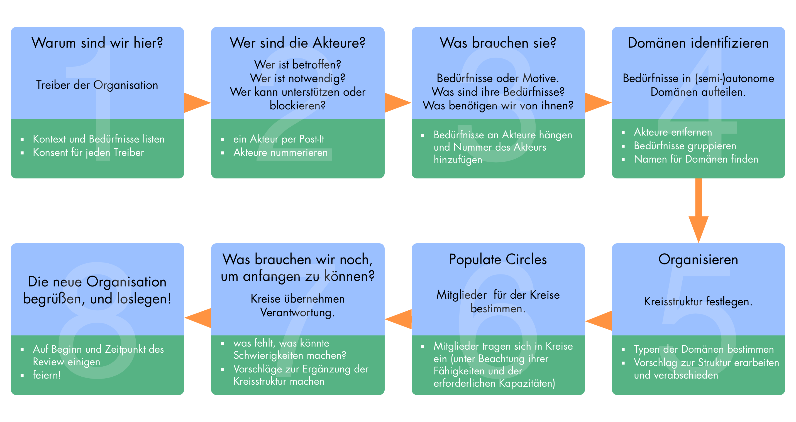

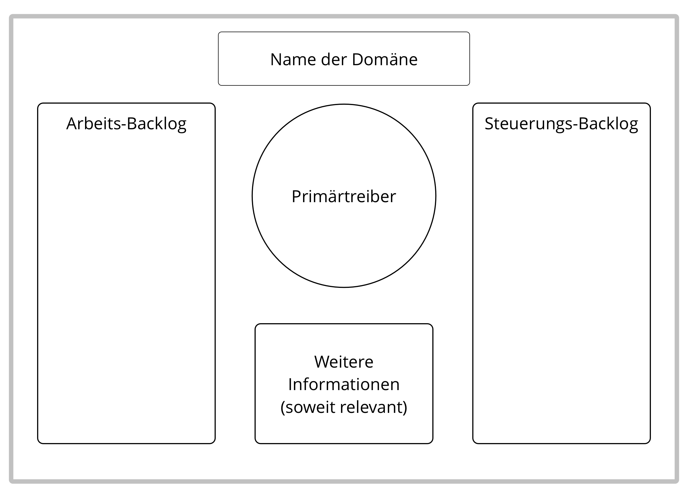

---

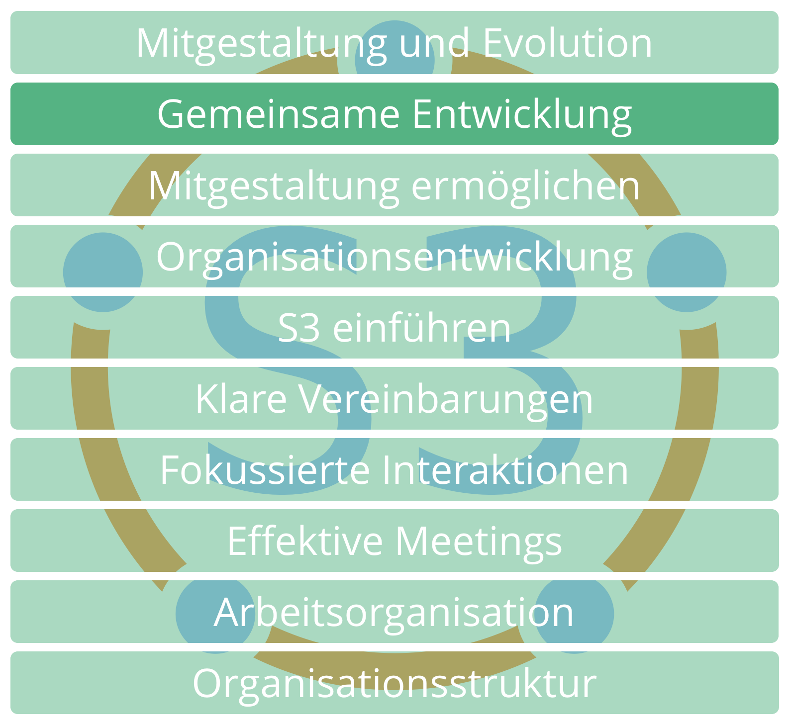

---

## Muster 2.1: Um Hilfe bitten

**Ein einfacher Weg um zu Lernen zu ermöglichen, Fähigkeiten zu entwickeln, und Beziehungen aufzubauen, und dabei die Autonomie des Einzelnen zu respektieren.**

Frage einen Kollegen, "*Wärest du bereit, mir mit … zu helfen*?" Die gefragte Person antwortet nur mit einem einfachen "*ja*" oder "*nein*".

- wenn die Bitte abgelehnt wird, akzeptiert der Fragende das ohne Nachfrage oder gar Verhandlungen
- erscheint der gefragten Person die Bitte unklar, bittet sie um weitere Informationen
- wenn du eine Bitte um Hilfe annimmst, unterstütze deinen Kollegen, so gut es dir in dieser Situation möglich ist

---

## Muster 2.2: Peer-Feedback

Lade einen Kollegen ein, dir konstruktives Feedback zu geben über:

- die Art und Weise, wie Du eine Rolle ausfüllst
- deine Mitarbeit im Allgemeinen
- weitere spezielle Aspekte, die dich interessieren

Bedenke:

- bitte die Kollegen, sich auf das Gespräch vorzubereiten
- frage sowohl nach **Würdigungen** als auch nach **konstruktiven, handlungsorientierten Verbesserungsvorschlägen**
- frage nach, um das Feedback besser zu verstehen, aber vermeide Diskussion oder Bewertung
- entscheide nach dem Gespräch selbst, wie du mit dem Feedback umgehst

---

## Muster 2.3: Entwicklungsgespräch

**Unterstützt euch gegenseitig dabei, euch in eueren Rollen und Teams weiterzuentwickeln.**

Der Rolleninhaber – oder das sich entwickelnde Team – führt im Entwicklungsgespräch, indem sie den Prozess initiiert, und jeden Prozessschritt beginnt.

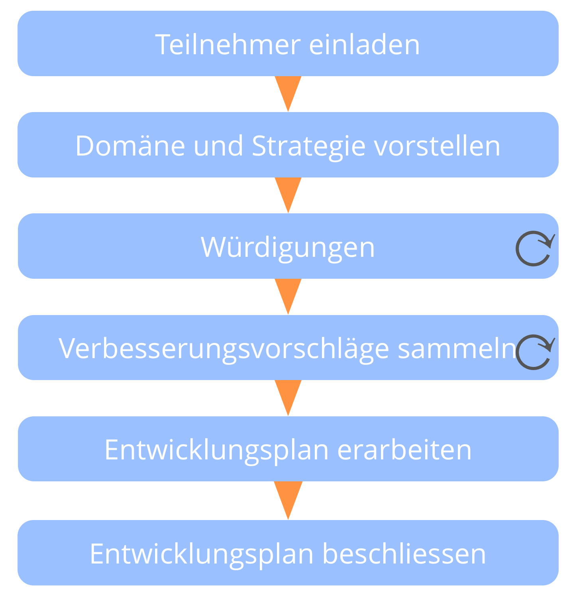

Stelle sicher, dass die eingeladenen Teilnehmer unterschiedliche Perspektiven beitragen, und dass das Gespräch _moderiert_ wird.

Verbesserungsvorschläge können sich auf persönliche Entwicklung, Zusammenarbeit, [Strategie](glossary:strategy) oder auch auf Anpassungen Beschreibung der [Domäne](glossary:domain) (inkl. des [Treibers](glossary:organizational-driver)) beziehen.

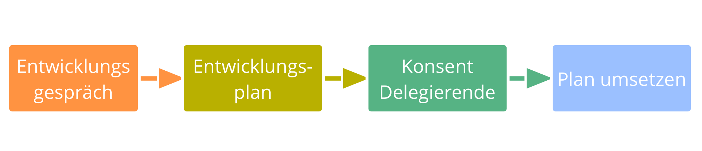

---

## Muster 2.4: Entwicklungsplan

**Ein Plan, um sich effektiver um eine Domäne zu kümmern, der von Delegierenden und Beauftragten vereinbart wird.**

Der Entwicklungsplan kann für einen Mitarbeiter in einer Rolle oder für eine Team (z.B. eine Abteilung, einen _Kreis_, ein Team oder eine _offene Domäne_) erstellt werden.

Die Entwicklung kann sich auf eine Klarstellung von _Treiber_ oder [Domäne](glossary:domain) beziehen, auf eine Anpassung der [Strategie](glossary:strategy), auf neue oder veränderte Vereinbarung, und auf konkrete Aufgaben für die Beauftragten oder auch für die Delegierenden.

Der Entwicklungsplan (inklusive aller zugehörigen Empfehlungen zu Änderungen der Beschreibungen von [Domänen](glossary:domain) oder [Treibern](glossary:organizational-driver)) erfordert Konsent von [Delegierenden](glossary:delegator) und [Beauftragten](glossary:delegatee).

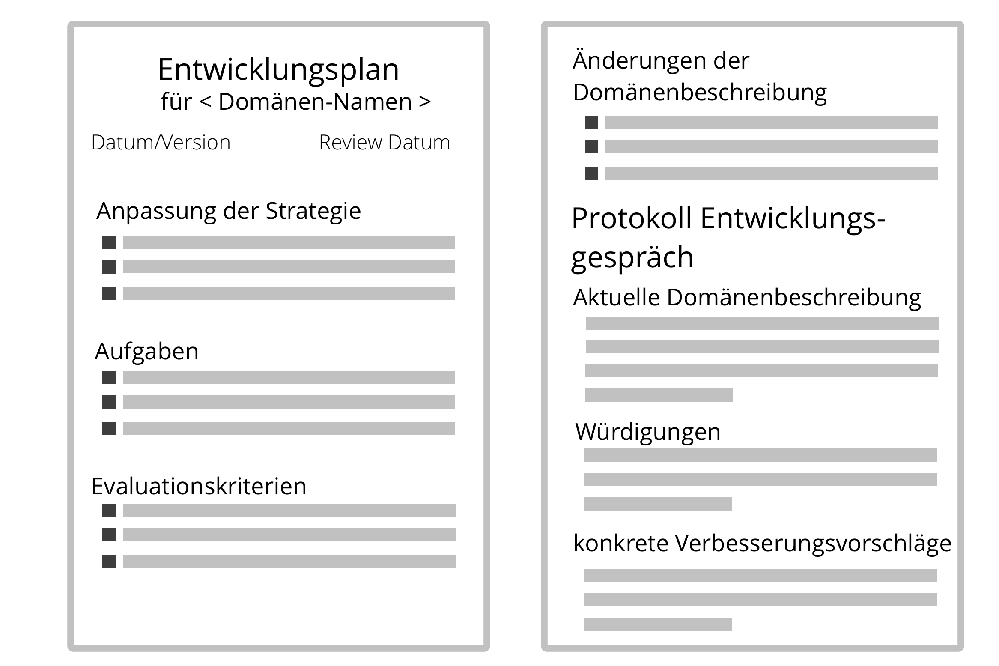

---

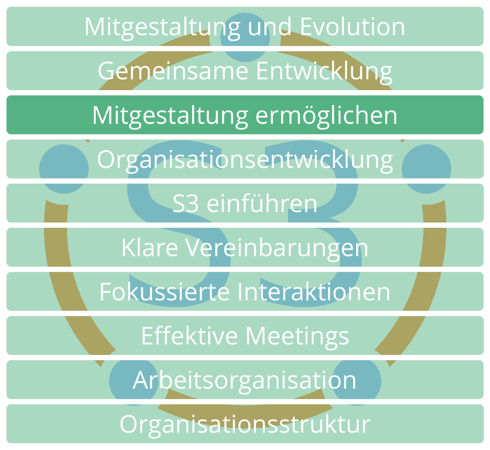

---

## Muster 3.1: Kunstvolle Teilnahme

**Nimm dir vor, nach bestem Wissen und Können zu effektiver Zusammenarbeit beizutragen.**

*“Ist mein Verhalten der beste Beitrag, den ich zu dieser Zusammenarbeit im Moment leisten kann?”*

Kunstvolle Teilnahme kann im Einzelfall auch bedeuten, andere zu unterbrechen, Einwände zu erheben oder [Vereinbarungen](glossary:agreement) zu brechen.

*Kunstvolle Teilnahme* ist eine **Selbstverpflichtung**:

- **berücksichtige und befolge alle Vereinbarungen**, so gut es dir unter den momentanen Bedingungen möglich ist
- entwickle **Bewusstsein und Verständnis** für individuelle und kollektive Bedürfnisse
- **entwickle die erforderlichen Fähigkeiten**
- **unterstütze Andere** in deren kunstvoller Teilnahme
- mache andere auf Hindernisse und Verbesserungsvorschläge aufmerksam

### Vorteile der kunstvollen Teilnahme

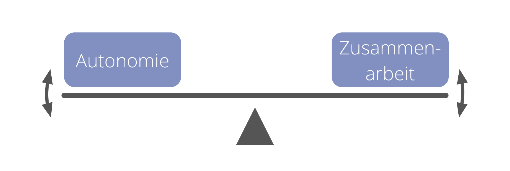

Kunstvolle Teilnahme:

- ermöglicht Mitgestaltung und Entwicklung von Vereinbarungen
- hilft Teams dabei, stärker zu werden
- fördert Selbstverantwortung, Integrität und Vertrauen
- unterstützt eine Kultur der gegenseitigen Unterstützung und der engen Zusammenarbeit
- die ist noch wirksamer, wenn sich mehrere Mitarbeiter dazu entschliessen

### Kunstvolle Teilnahme: Selbsteinschätzung

- Wie werde ich mich und andere darin unterstützen, kunstvoller teilzunehmen? 
- Welche meiner Interaktionen sind hinderlich oder ineffektiv?
- Welche Vereinbarungen finde ich schwierig einzuhalten oder mitzugestalten? Was kann ich dagegen tun?
- Welche Fähigkeiten kann ich entwickeln um meine kunstvolle Teilnahme zu unterstützen?
- Was würde kunstvolle Teilnahme bedeuten in Bezug auf … 
    - meine Alltagsaktivitäten?
    - meine Zusammenarbeit und Interaktion mit Anderen?
    - die Organisation? … unsere Kunden?
    - das weitere Umfeld?

---

## Muster 3.2: Die Sieben Prinzipien leben

**Richte die Zusammenarbeit an den sieben Prinzipien aus.**

Eine Organisation oder Gruppe, die die Sieben Prinzipien anwendet, benötigt weniger expliziten Vereinbarungen, und kann S3-Muster besser an ihren Kontext anpassen.

Um das zu ermöglichen, müssen sich auch die Werte einer Organisation an den Sieben Prinzipien ausrichten, oder diese zumindest ermöglichen.

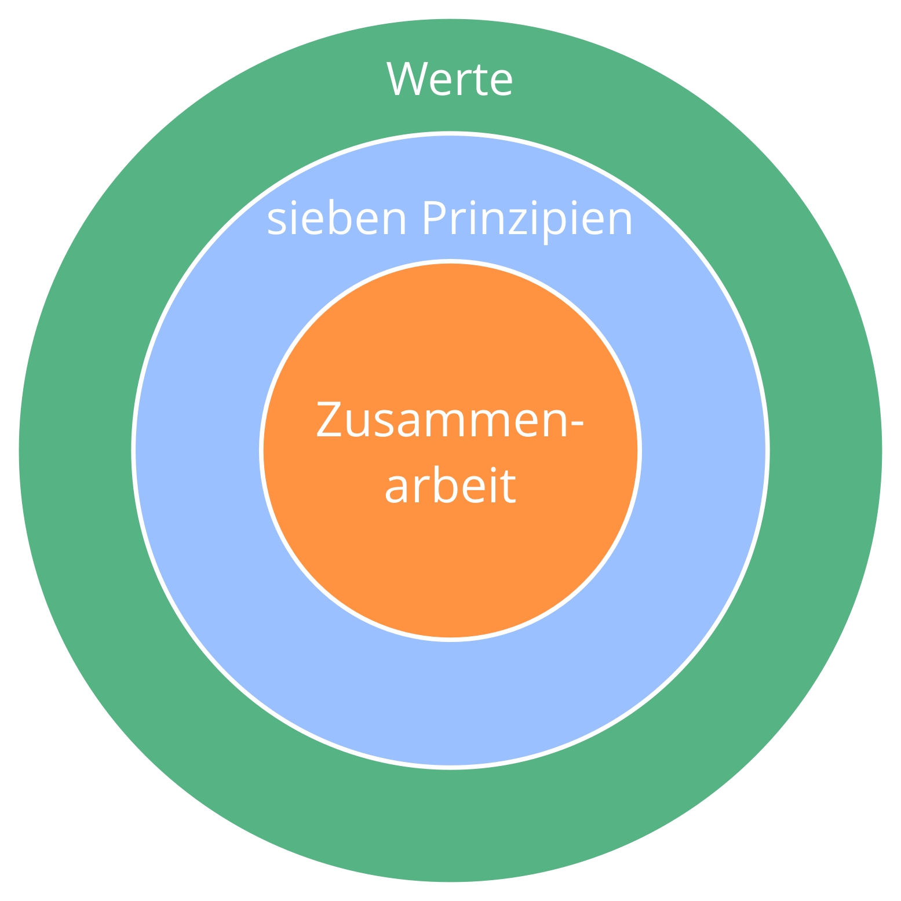

---

## Muster 3.3: Gemeinsame Werte

**Gestalte bewusst die Kultur der Organisation.**

_**Werte** sind wichtige Prinzipien, an denen Personen ihr Verhalten ausrichten. Werte begrenzen den Handlungsspielraum und definieren ethische Rahmenbedingungen._

- Jedes Mitglied einer Organisation bringt eigene Werte mit, die aus persönlichen Erfahrungen und Überzeugungen resultieren.
- Ein Team oder eine Organisation kann sich **auf gemeinsame Werte einigen,** an denen sie ihre Zusammenarbeit ausrichtet.

Aus Werten kann angemessenes Handeln abgeleitet werden, auch wenn es für ein Thema keine expliziten [Vereinbarungen](glossary:agreement) gibt

Die Einigung auf gemeinsame Werte fördert die Effektivität einer Organisation:

- geringeres Potential für **Missverständnisse**
- gemeinsame **Ausrichtung** von Entscheidungen und Aktivität
- **Attraktion neuer Mitarbeiter, Partner und Kunden**, die sich mit den Werten der Organisation identifizieren

Die Einigung auf gemeinsame Werte stellt eine Vereinbarung dar, die **regelmässig überprüft und weiterentwickelt** werden sollte.

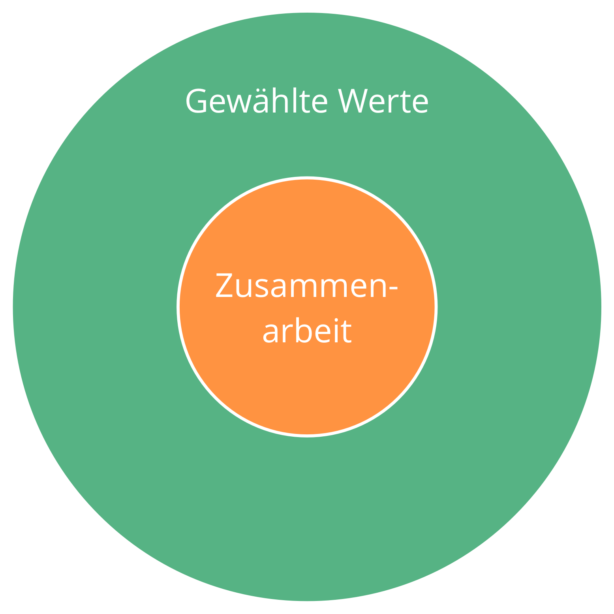

---

## Muster 3.4: Governance-Moderator(in)

**Wähle jemanden, der die Steuerungsmeetings moderiert.**

Ein _Governance_-Moderator …

- stellt sicher, dass die _Steuerungsmeetings_ moderiert und ausgewertet werden
- wird in der Regel vom [Team](glossary:team) aus seinen Mitgliedern und auf eine bestimmte Zeit gewählt
- macht sich mit dem _Steuerungsbacklog_ vertraut
- lädt oft Andere dazu ein, einzelne Tagesordnungspunkte zu moderieren

Um die Gruppe effektiv unterstützen zu können, sollte sich ein ein Governance-Moderator mit folgenden Mustern vertraut machen:

- _Runden_
- _Proposal Forming_
- _Konsententscheidung_
- _Wahl_
- _Meetings evaluieren_
- _Einwände integrieren_
- _Entwicklungsgespräch_

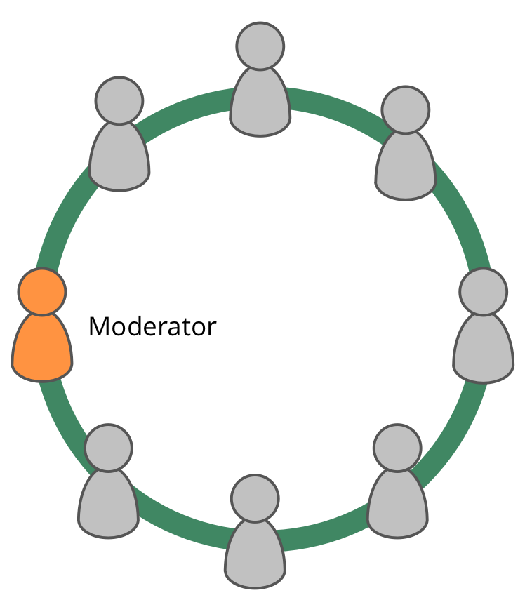

---

## Muster 3.5: Vereinbarungen brechen

[Vereinbarungen](glossary:agreement) zu brechen ist manchmal **notwendig,** kann allerdings auch die **Gemeinschaft belasten**.

Übernimm die Verantwortung:

- **Beseitige** die entstandenen Störungen
- **Kläre die Situation** bei nächster Gelegenheit mit Betroffenen und Zuständigen
- **Initiiere Änderungen**, anstatt dieselbe Vereinbarung wiederholt zu brechen

---

## Muster 3.6: Verträge für erfolgreiche Zusammenarbeit

**Stelle durch die gemeinsame Gestaltung von gesetzeskonformen und für beide Seiten vorteilhaften Verträgen Stelle von Anfang an die Weichen für erfolgreiche Zusammenarbeit, und entwickle dabei gleichzeitig eine Vertrauensbasis zwischen den Vertragspartnern.**

Ein **Vertrag** ist eine Sammlung von Zusagen, die zwei oder mehrere Parteien als gesetzlich bindend vereinbaren, d.h. wenn eine dieser Zusagen nicht eingehalten wird, stehen den geschädigten Parteien Rechtsmittel (oder alternative Wege der Schlichtung) zu.

Eine essentielle Voraussetzung für erfolgreiche Zusammenarbeit ist die Entwicklung eines gemeinsamen Verständnisses der gegenseitigen Erwartungen und Bedürfnisse.

Bereits während der Vertragsverhandlungen sollte bereits der Umgang miteinander eingeübt werden, der auch für die spätere Zusammenarbeit gewünscht ist, und die Chance genutzt werden, gute Beziehungen mit den anderen Vertragspartnern aufzubauen.

Dieses Muster bezieht sich auf diejenigen Verträge, die den Rahmen zur Zusammenarbeit einer Organisation mit weiteren Parteien (z.B. Angestellte, Freiberufler, Berater, Dienstleister, Zulieferer, Anteilseigner oder Kunden) festlegen. Besonders relevant ist dieses Muster, wenn es um Verträge geht, die großen Einfluss auf die Zukunft einer Organisation haben, z.B.:

- Arbeitsverträge und Verträge mit externen Dienstleistern oder Beratern in _Hilfsrollen_, sowie alle Vereinbarungen, die aus denen sich Veränderungen von Vergütung oder Arbeitszeit ergeben
- Verträge über die Zusammenarbeit mit Kunden, Lieferanten oder Dienstleistern
- Verträge mit Anteilseignern

**Anmerkung:** Viele Vereinbarungen, die die Zusammenarbeit innerhalb einer Organisation betreffen, erfordern keine eigenen Verträge, das sie bereits von bestehenden Verträgen (z.B. dem Arbeitsvertrag) abgedeckt werden.

### Erfolgskriterien für produktive Vertragsverhandlungen

Stelle während den Vertragsverhandlungen folgendes sicher:

- es besteht Einigkeit über die Gründe für die Zusammenarbeit, sowie über das angestrebte Ergebnis und über etwaige wesentlichen Einschränkungen
- alle Parteien verstehen, was von ihnen im Rahmen des Vertrages erwartet wird
- alle Parteien, die von einem Vertrag betroffen sind, werden in die Gestaltung des Vertrages mit einbezogen, und gehen das Vertragsverhältnis freiwillig ein
- die Erwartungen sind realistisch
- die Vereinbarung ist für alle Beteiligten vorteilhaft
- alle Beteiligten haben vor, den Vertrag einzuhalten

Wenn aus irgendeinem Grund eine oder mehrere dieser Kriterien nicht erfüllt werden kann, ist es wahrscheinlich ratsam, die Vertragsverhandlungen abzubrechen und den Vertrag nicht einzugehen.

### Verträge gemeinsam gestalten

Die Art und Weise, die ein Vertrag ausgehandelt wird, kann erheblich zur Vertrauensbildung zwischen den beteiligten Parteien beitragen. Betrachte Vertragsverhandlungen als Einigungsprozess zwischen Partnern, nicht als Wettstreit zwischen Konkurrenten.

- Der Vertrag sollte alle Erwartungen an jeden der Vertragspartner beinhalten, und jede Erwartung sollten ausreichend detailliert dokumentiert werden.
- Verwende eine klare und einfache Sprache, die alle Parteien verstehen können, und beschreibe etwaige Rechtsfolgen klar und deutlich.
- Wenn es erforderlich ist, Fachbegriffe zu verwenden, die einer der Parteien nicht geläufig sind, sollten diese in einem Glossar erklärt werden, das Vertragsbestandteil wird.
- Lasse dich von einem Anwalt beraten, der die von dir angestrebte Kultur unterstützt, und auch Branchenkompetenz hat

### Während der Verhandlungen

- Stelle sicher, dass alle die zu den Vertragsverhandlungen entsandten Delegation der einzelnen Parteien alle dort betroffenen [Domänen](glossary:domain) repräsentieren (also z.B. nicht nur die Verkaufsabteilung, sondern auch Entwicklung, Produktion und Support) 
- Verfasse eine klare Beschreibung der angestrebten Kultur, und beleuchte dabei sowohl die Gemeinsamkeiten als auch die kulturellen Unterschiede der zukünftigen Vertragspartner.
- Dokumentiere die Gründe für die geplante Zusammenarbeit, und sei ehrlich in Bezug auf im Rahmen der Zusammenarbeit relevante Erwartungen und Bedürfnisse aller Parteien.
- lege alle für die geplante Zusammenarbeit relevanten Informationen offen (falls erforderlich unter einer Vertraulichkeitsvereinbarung)
- einige dich zunächst auf die Rahmenbedingungen der Zusammenarbeit und auf die daraus resultierenden Erwartungen an die einzelnen Parteien, und überlege danach, wie diese am Besten rechtssicher formuliert werden können
- Erstelle eine Übersicht aller besonderen Gesetze und Verordnungen, denen der Vertrag unterliegt
- Verhandle in mehreren Iterationen, damit genug Zeit und Gelegenheit bleibt, Implikationen zu erwägen und entsprechende Änderungen vorzuschlagen
- Dokumentiere den Verlauf jedes Treffens, um Missverständnisse zu vermeiden

### Betrachte alle Phasen der Zusammenarbeit

Wenn alle Unterzeichner zustimmen, kann ein Vertrag jederzeit geändert werden. Trotzdem wird das Konfliktpotenzial drastisch reduziert, wenn man bereits bei der Gestaltung des Vertrages die gesamte Zusammenarbeit, von Anfang bis Ende, betrachte.

- lege Onboarding-Verfahren fest, um einen guten Einstieg in die Zusammenarbeit zu ermöglichen
- definiere eine Probezeit, während der alle Parteien die Zusammenarbeit ausprobieren können, und definiere klar, wie der Vertrag während der Probezeit (auch einseitig) gekündigt werden kann
- jeder Vertrag sollte auch regelmäßige Evaluationstreffen vorsehen, in denen die Unterzeichner zum Erfahrungsaustausch zusammenkommen und gemeinsam überlegen, ob und wie der Vertrag das Gelernte sowie an sich ändernde Gegebenheiten angepasst werden sollte
- kläre im Voraus, was im Falle von Vertragsverletzungen geschehen soll
- erwäge die Möglichkeiten alternativer Streitbeilegungsverfahren (Alternative Dispute Resolution), wie z.B. Mediation, Schieds- oder Schlichtungsverfahren.
- viele Verträge können auch auf eine bestimmte Zeit abgeschlossen werden, so dass sie auslaufen und erneuert werden müssen

### Kultur

Jeder Vertrag beeinflusst die Kultur der durch ihn geregelten Zusammenarbeit, selbst dann, wenn er nur vorzuschreiben scheint, *was* geliefert werden muss:

- gestalte bewusst die angestrebte Kultur der Zusammenarbeit, indem im Vertrag auch Erwartungen formuliert werden, *wie* die Arbeit und Zusammenarbeit ablaufen soll 
- richte den Vertrag an der Organisationskultur aller Beteiligten sowie an den gesetzlichen Anforderungen aus
- gestalte Verträge so, dass sie die Übernahme von Verantwortung nicht nur ermöglichen, sondern auch begünstigen

Oft sind die Standardverträge in einer Branche nicht im Einklang mit der Kultur, die man erreichen möchte. In diesem Falle ist es hilfreich, in der eigenen Organisation eine Sammlung von Vorlagen für Verträge und Einzelklauseln aufzubauen und diese auch mit anderen zu teilen, so dass man bei der Gestaltung neuer Verträge bereits diese gesammelten Erfahrungen zurückgreifen kann.

---

## Muster 3.7: Gehaltstransparenz

**Gestalte eine gerechte Gehaltsformel und mache sie transparent.**

Um Gehaltstransparenz zu erzielen, werden Gehälter nicht mehr individuell verhandelt, sondern anhand einer festgelegten Gehaltsformel berechnet. Diese Gehaltsformeln — und manchmal auch die daraus resultierenden Gehälter — sind allen Mitarbeitern bekannt, und sind in einigen Fällen sogar öffentlich.

Eine Gehaltsformel muss zum Kontext eines Unternehmens passen, und von allen Stakeholdern als fair empfunden werden.

Die Einschätzung von Fairness ist von Person zu Person verschieden, und hängt zudem vom Kontext ab, so dass die Entwicklung einer Gehaltsformel die Entwicklung eines gemeinsamen Verständnisses von Fairness zugrunde liegt.

Bei der Entwicklung einer Gehaltsformel für eine Organisation, eine Abteilung oder ein Team sollte folgendes berücksichtigt werden:

- Was wäre eine angemessenes fixes Grundgehalt, das die Erfüllung der Grundbedürfnisse garantiert?
- Wie kann man individuelle Bedürfnisse, Investment, Produktivität oder Leistung vergüten?
- Wie sollen Gewinne und Verluste des Unternehmens in Einklang mit Erwartungen und Bedürfnissen der verschiedenen Stakeholder gebracht werden?

Lege fest, welchen Einfluss die Übernahme bestimmter Rollen auf das Gehalt haben soll, und _entwickle eine Strategie_, wie die Umstellung vom alten Gehaltsmodell auf die neue Gehaltsformel (und ggf. auch auf neue Verträge) vollzogen wird.

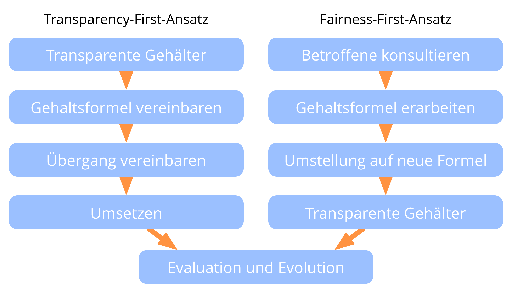

---

## Muster 3.8: Hilfsrolle

**Wende das Muster "Rolle" auf externe Vertragspartner an.**

- kläre und beschreibe den [Treiber](glossary:organizational-driver) für die _Rolle_.
- beschreibe die Domäne
- führe eine Wahl durch, wenn das sinnvoll erscheint
- begrenze die Laufzeit von Verträgen
- plane regelmässige _Entwicklungsgespräche_ ein

Auch Externe Mitarbeiter müssen der Übernahme einer Rolle zustimmen.

**Siehe auch:** [Verträge für erfolgreiche Zusammenarbeit](contract-for-successful-collaboration)

---

## Muster 3.9: Statuten

Verankere S3-Prinzipien und Pattern in Deinen Statuten, um **Rechtssicherheit** und **Organisationskultur** zu sichern

Bedenke:

- Konsent und Gleichstellung in der Entscheidungsfindung
- das Auswahlverfahren für Führungsrollen
- Organisationsstruktur, [Werte](glossary:values) und [Prinzipien](glossary:principle)
- Einfluss von Eigentümern oder Aktionären
- Verteilung von Gewinn und Verlust

---

---

## Muster 4.1: Einfluss delegieren

**Delegiere nicht nur Arbeit, sondern auch Entscheidungskompetenz, um den Mitarbeitern zu ermöglichen, so autonom wie möglich wert zu schöpfen.**

Die [Delegierende](glossary:delegator) kann die [Beauftragten](glossary:delegatee) dabei unterstützen, Wert zu schaffen: 

- Der Autonomie- und Verantwortungsbereich ist klar definiert.
- Gelegenheiten zum Lernen und zur Weiterentwicklung sind sicherstellt
- Nach Bedarf wird weitere Unterstützung geleistet

Korrigiere Rahmenbedingungen schrittweise, berücksichtige dabei Fähigkeit, Zuverlässigkeit und erzielte Ergebnisse.

Dezentralisiere so weit wie möglich, behalte so viel Einfluss wie erforderlich.

---

## Muster 4.2: Kreis

_Ein **Kreis** ist ein teilautonomes und selbststeuerndes Team gleichgestellter Personen, die gemeinsam eine Domäne verantworten._

Ein Kreis …

- kann andauernd oder zeitlich begrenzt bestehen
- kann [selbstorganisierend](glossary:self-organization) sein
- ist selbst für seine Entwicklung und seine [Vereinbarungen](glossary:agreement) verantwortlich

- **teilautonom**:
    
    - die Mitglieder eines Kreises handeln innerhalb der durch die [Domäne](glossary:domain) des Kreises abgesteckten Grenzen
    - jeder Kreis kann selbstständig [Wert](glossary:value) schöpfen
- **selbstverwaltet**: 
    - die Mitglieder des Kreis entscheiden gemeinsam, wie der Kreis in seiner Domäne Wert schöpft, und definieren inhaltliche und zeitliche Rahmenbedingungen für die zu erledigende Arbeit
- **Gleichstellung der Kreismitglieder:** 
    - Jedes Mitglied eines Kreises ist gleichermaßen verantwortlich für die Steuerungsentscheidungen in der Domäne des Kreises 

---

## Muster 4.3: Rolle

**Delegation von Verantwortung einer Domäne an Personen.**

Eine Rolle ist ein Verantwortungsbereich, der durch eine [Domäne](glossary:domain) definiert und an eine Person (den **Inhaber** der Rolle) [delegiert](glossary:delegation) wird. Der Rolleninhaber kann innerhalb des durch die Domäne vorgegebenen Rahmens autonom entscheiden und handeln.

Der Inhaber einer Rolle schlägt eine [Strategie](glossary:strategy) zur Wertschöpfung in seiner Domäne vor. Diese Strategie wird dann gemeinsam mit der [Delegierenden](glossary:delegator) weiter entwickelt.

Eine Rolle ist ein einfacher Weg für eine Organisation (oder [Team](glossary:team)), um wiederkehrende Aufgaben oder einen bestimmten Arbeits- und Entscheidungsbereich an eines ihrer Mitglieder zu delegieren.

- eine Person kann die Verantwortung für mehr als eine Rolle übernehmen
- anstatt eine neues Team zu schaffen, ist es manchmal einfacher, wenn sich mehrere Personen eine Rolle teilen
- Personen die eine Rolle inne haben, werden per Konsent und für einen festgelegten Zeitraum gewählt
- Kollegen unterstützen sich gegenseitig dabei, sich in ihren jeweiligen Rollen weiterzuentwickeln

Der Rolleninhaber kann ein eigenes [Steuerungsbacklog](glossary:backlog) führen und ein [Logbuch](glossary:logbook) anlegen, um seine Strategie zur [Wertschöpfung](glossary:value) zu entwickeln.

**Anmerkung**: Richtlinien, Prozesse oder Protokolle, die von Mitarbeitern in Rollen erstellt und entwickelt werden, können genauso wie Vereinbarungen behandelt und entwickelt werden.

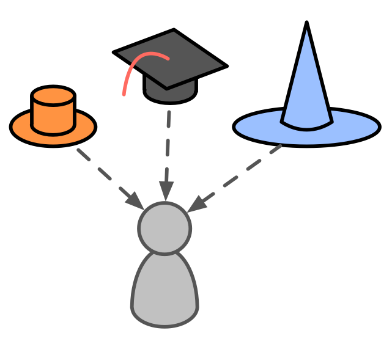

---

## Muster 4.4: Verbindungen

**Ermögliche den Fluss von Information und Einfluss zwischen zwei Teams.**

Zwei Teams wählen jeweils eines ihrer Mitglieder, das die Interessen seines Teams in den Steuerungsentscheidungen des jeweils anderen Teams vertritt.

---

## Muster 4.5: Doppelte Verbindung

**Ermögliche *bidirektionalen* Fluss von Information und Einfluss zwischen zwei Teams.**

Zwei voneinander Teams Gruppen wählen jeweils eines ihrer Mitglieder, das die Interessen seines Teams in den Steuerungsentscheidungen des jeweils anderen Teams vertritt.

Die doppelte Verbindung ermöglicht die Gleichstellung zweier Teams und kann dadurch auch dazu verwendet werden, in hierarchischen Strukturen die für effektive Steuerungsentscheidungen erforderlichen Informationen verfügbar zu machen.

---

## Muster 4.6: Repräsentant(in)

**Wähle ein Teammitglied, das das Team in den Steuerungsentscheidungen eines anderen Teams vertritt, um Mitwirkung und Informationsfluss sicherzustellen.**

Repräsentanten (auch: Delegierte oder Vertreter):

- vertreten die Interessen eines [Teams](glossary:team) in einem anderen Team
- werden für einen befristeten Zeitraum gewählt
- nehmen an den **Steuerungsentscheidungen** der anderen Gruppe teil und können: 
    - Agendapunkte vorschlagen
    - an der Ausarbeitung von Vorschlägen mitwirken
    - [Einwände](glossary:objection) gegen Vorschläge und bestehenden [Vereinbarungen](glossary:agreement) einbringen

---

## Muster 4.7: Hilfsteam

**Delegiere konkrete Anforderungen an eine Arbeitsgruppen aus gleichgestellten Mitarbeitern.**

Ein Hilfsteam:

- bietet der [Delegierenden](glossary:delegator) eine Möglichkeit, ihre Kapazität zu erhöhen
- kann selbstorganisiert sein oder durch einen _Koordinator_ gesteuert werden, der in der Regel von der Delegierenden bestimmt wird
- alle Steuerungsentscheidungen werden von der Delegierenden getroffen
- profitiert von einer klar definierten [Domäne](glossary:domain)

Mitglieder eines Hilfsteams:

- können Einwände gegen diejenigen Entscheidungen der Delegierenden erheben, die sie direkt betreffen
- können Themen zum [Steuerungsbacklog](glossary:governance-backlog) der Delegierenden hinzufügen
- werden in machen Fällen von der Delegierenden aufgefordert, _Repräsentanten_ zu Steuerungsentscheidungen der Delegierenden zu entsenden

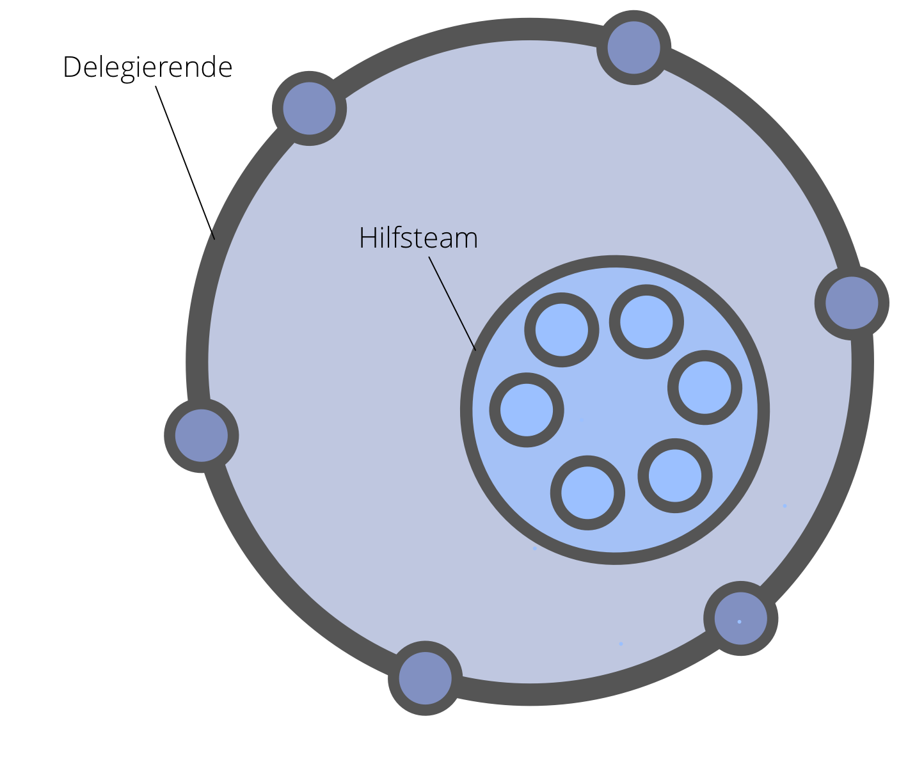

---

## Muster 4.8: Offene Domäne

**Anstatt die Verantwortung für eine Domäne fest zu vergeben, lade Personen ein, im Rahmen ihrer Möglichkeit und Kapazität beizutragen.**

Die [Delegierende](glossary:delegator) der Domäne definiert

- den [Primärtreiber](glossary:primary-driver), zentrale Verantwortlichkeiten und Grenzen der offenen Domäne
- wer in der offenen Domäne mitwirken kann
- die Teilhabe der Delegierenden an den [Steuerungsentscheidungen](glossary:governance) der Domäne

Je nach dem, wie die Delegierende die Rahmenbedingungen für die Domäne festlegt, kümmern sich die Eingeladenen nur darum, [Arbeit zu organisieren und zu erledigen](glossary:operations), oder sie tragen auch zu Steuerungsentscheidungen bei.

Die Delegierende ist verantwortlich für die regelmäßige Evaluation der offenen Domäne, um die Effektivität der Arbeit und der Entscheidungsfindung in der offenen Domäne sicherzustellen.

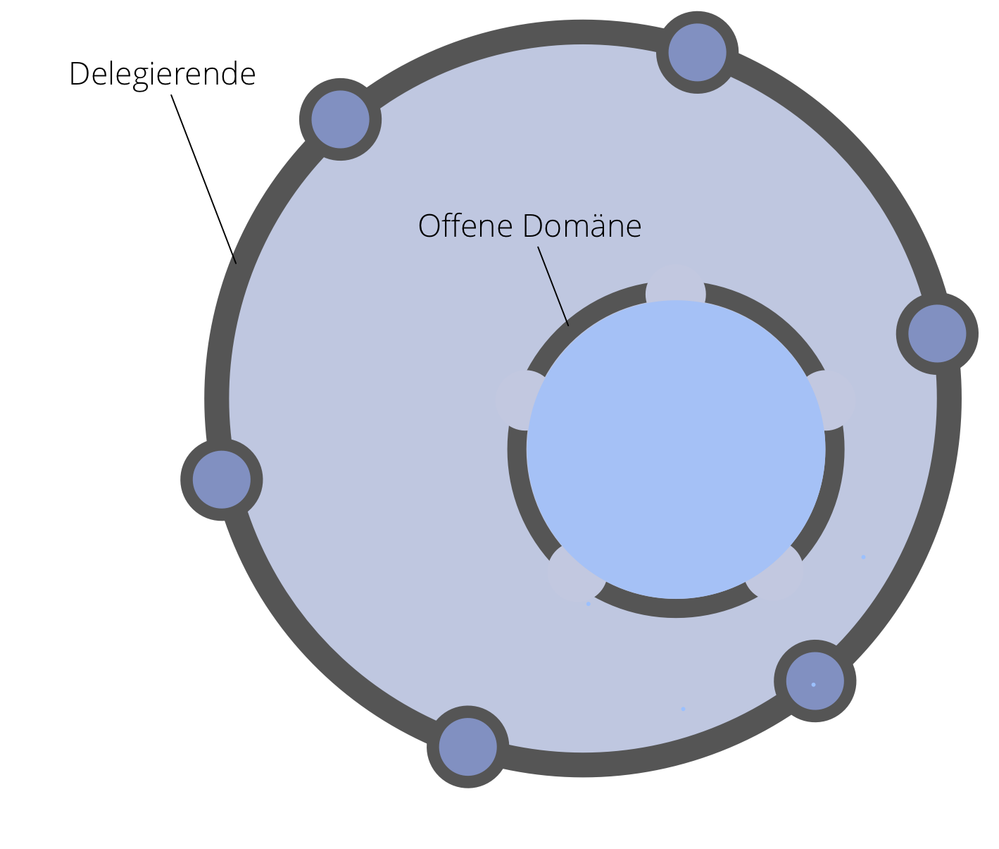

---

## Muster 4.9: Offene Systeme

**Kommuniziere mit anderen außerhalb deines Systems, um von ihnen zu lernen.**

Individuen, Teams und Organisationen können anerkennen, dass sie und ihr Umfeld gegenseitig voneinander abhängig sind. Sie können aktiv Personen von außerhalb einladen **externes Wissen, Kompetenz und Einfluss einzubringen**, um so Entscheidungen zu unterstützen und gemeinsames Lernen zu ermöglichen.

- **Externe Experten** können neue Perspektiven, Wissen und Fähigkeiten einbringen
- **Vertreter betroffener Parteien** können zu Verständnis und Entscheidungsfindung beitragen, so dass gemeinsame Ziele bessern erreicht werden können (siehe _Die Betroffenen entscheiden_)

---

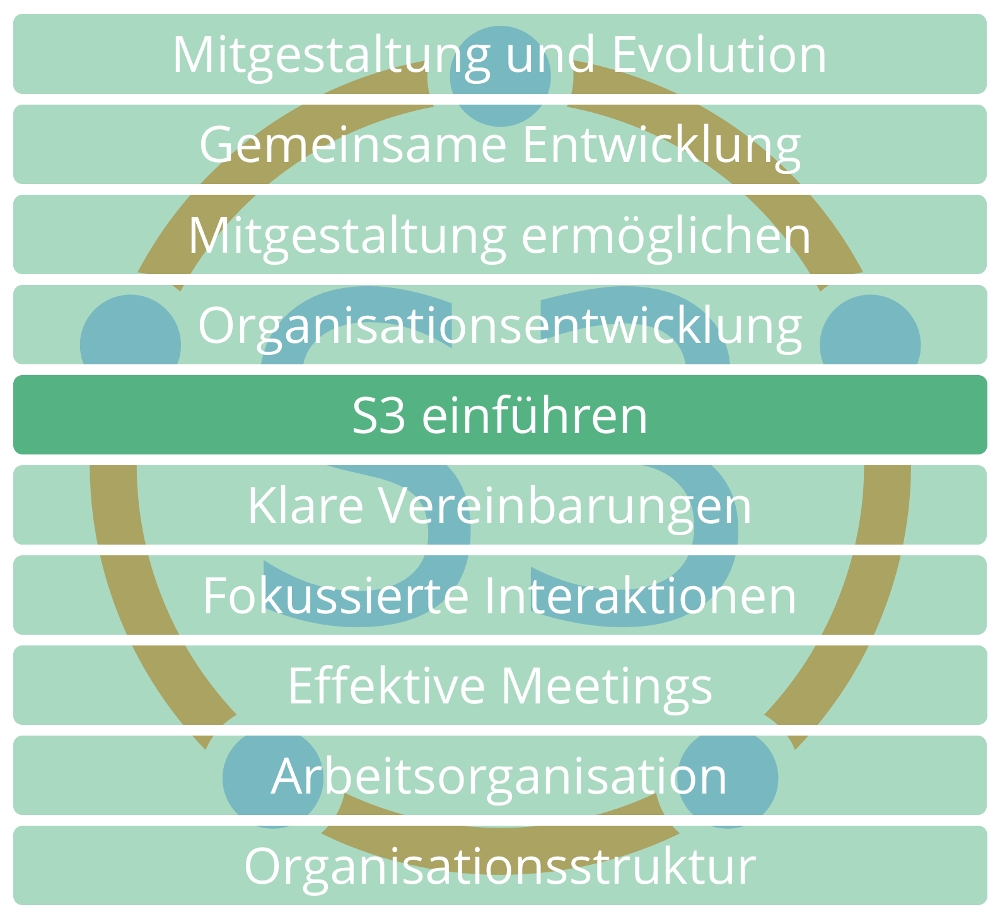

---

## Muster 5.1: Muster an den Kontext anpassen

**Adaptiere und entwickle S3-Muster, damit sie auf denen speziellen Kontext passen.**

Stelle sicher, dass alle Betroffenen:

- verstehen, warum es notwendig (oder hilfreich) ist, das Muster anzupassen
- Bei der Entscheidung, was verändert wird, anwesend oder vertreten sind
- sich bei der Anpassung an den Sieben Prinzipien orientieren

Experimentiere mit jeder Anpassung lange genug, um Vorteile und mögliche Probleme erkennen zu können.

Teile wertvolle Erfahrungen mit der S3 Community.

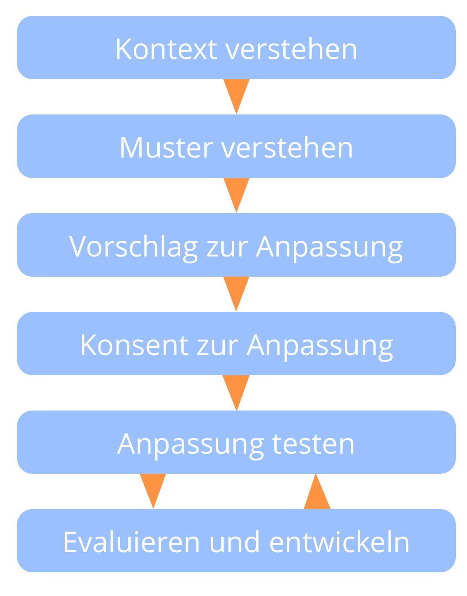

---

## Muster 5.2: Pull-System für Organisationsentwicklung

**Gestalte eine Umgebung, die Mitglieder der Organisation dazu einlädt und befähigt, den Wandel selbst voran zu treiben.**

Veränderungen die Wert schaffen:

- Experimentier mit Mustern, die helfen, aktuelle und wichtige Probleme zu lösen
- … ohne das zu beeinträchtigen, was bereits funktioniert
- hole alle Beteiligten dort ab, wo sie stehen…
- … und lasse sie gemeinsam ihr eigenes Tempo bestimmen

---

## Muster 5.3: Als Beispiel dienen

**Führe als Vorbild.**

Verhalte Dich selbst so, wie Du es Dir von anderen wünschst.

---

## Muster 5.4: Veränderung einladen

**Erkläre, warum die Veränderung notwendig ist, und lade die Menschen ein, am Veränderungsprozess teilzuhaben.**

Zur Veränderung einzuladen (anstatt sie einzufordern) reduziert Widerstände und ermöglicht den Betroffenen, selbst Entscheidungen zu treffen.

Bei der Einladung:

- sei offen in Bezug auf den Grund für die Veränderung
- kläre Erwartungen und Grenzen des Handlungsspielraumes
- vermeide Druck oder Manipulation
- schaffe den Raum für Skepsis und Zweifel

Beteilige die Betroffenen an der regelmäßigen Evaluation der Ergebnisse.

---

## Muster 5.5: Den Raum für Veränderung öffnen

**Lade alle Mitarbeiter ein, Experimente zur Entwicklung der Organisation zu überlegen und durchzuführen.**

- kläre den [Treiber](glossary:organizational-driver) für die Veränderung
- Plane regelmässige Open-Space-Veranstaltungen ein: 
    - Lade alle Mitglieder dazu ein, Experimente zu planen und durchzuführen
    - gib einen klaren Rahmen für die Experimente vor, der die Entstehung einer [soziokratischen](glossary:sociocracy) und agilen Geisteshaltung unterstützt (z.B. die sieben Prinzipien)
    - evaluiere die Ergebnisse der Experimente beim nächsten Open-Space, um daraus zu lernen

---

## Muster 5.6: Kontinuierliche Verbesserung des Arbeitsablaufs

**Entdecke Treiber und etabliere ein metrikbasiertes Pull-System für Veränderungen in der Organisation durch kontinuierliche Verbesserungen und eine Verfeinerung der Arbeitsabläufe.**

- führe für ein Team das Konsent-Prinzip und das Muster _Navigiere nach Spannung_ ein, so dass das Team seine Arbeitsabläufe selbst verbessern kann
- erwäge die Wahl eines Moderators um Gruppenprozesse zu begleiten und die Einigung auf gemeinsame Werte, an denen sich das Team orientiert
- initiiere einen Prozess kontinuierlicher Verbesserung, z.B. mit Kanban und/oder mit regelmässigen _Retrospektiven_
- Teammitglieder führen nach Bedarf selbst weite S3-Muster ein
- erweitere, soweit sinnvoll, schrittweise den Umfang des Experiments auf andere Teams
- suche bewusst nach Hindernissen, um diese aufzulösen 

### Verschwendung und kontinuierliche Verbesserung

_**Verschwendung** ist alles, was für die effektive Antwort auf einen Treiber nicht erforderlich ist, oder ihr sogar im Wege steht._

Verschwendung existiert in verschiedenen Formen und auf unterschiedlichen Abstraktionsebenen (Aufgaben, Abläufe, Organisationsstruktur, Denkmodelle…)

Eine Vorgehensweise zur ständigen Verringerung von Verschwendung bewirkt eine natürliche Entwicklung einer Organisation hin zu größerer Effektivität und zur Anpassung an wandelnde Rahmenbedingungen.

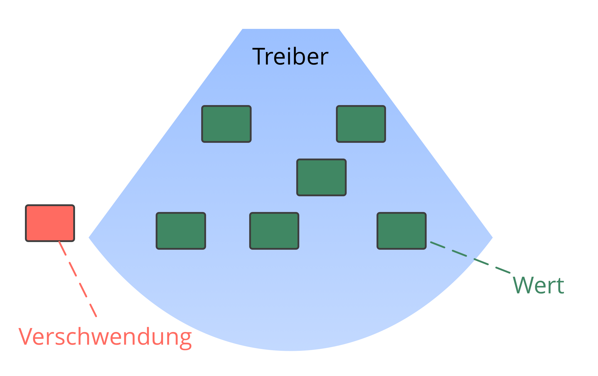

---

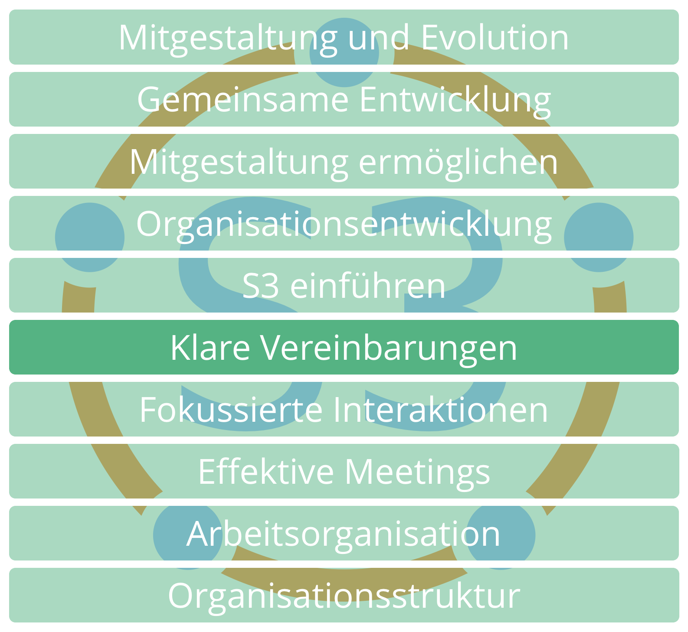

---

### S3 fördert einen hypothesengetriebenen Ansatz zur Entscheidungsfindung

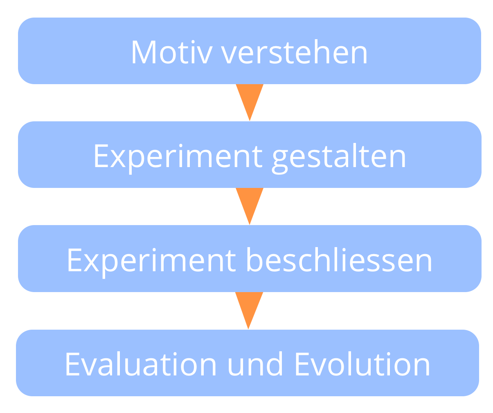

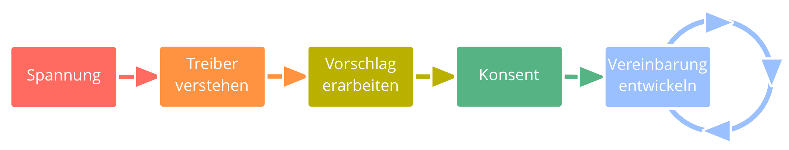

---

## Muster 6.1: Vereinbarung

_Eine **Vereinbarung** ist eine (gemeinsam) beschlossene Richtlinie, oder ein Prozess oder Protokoll, um den Wertfluss in der Organisation zu gestalten._

Vereinbarungen entstehen in Reaktion auf [Organisationstreiber](glossary:organizational-driver), und werden **regelmäßig evaluiert und weiterentwickelt.**

**Verantwortlich für eine Vereinbarung** sind diejenigen Personen, die sie getroffen haben

Eine Vereinbarung kann die auch die **Delegation von Verantwortung** an bestimmte Personen oder Teams beinhalten

Dokumentiere alle **Erwartungen**, die im Rahmen einer Vereinbarung in Bezug auf [Leistungen](glossary:deliverable), Verhalten oder Ressourcen bestehen.

**Anmerkung**: Richtlinien, Prozesse oder Protokolle, die von Mitarbeitern in Rollen erstellt und entwickelt werden, werden ebenfalls als Vereinbarungen betrachtet.

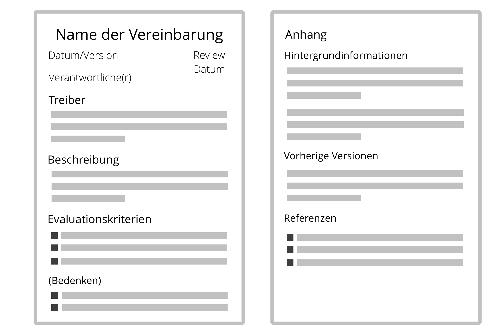

---

## Muster 6.2: Strategie entwickeln

_Eine **Strategie** ist der generelle Ansatz, wie Mitarbeiter planen, in einer bestimmten Domäne Wert zu schöpfen._

Es ist in der Regel effektiver, wenn ein Team bzw. ein Rolleninhaber bei der Entwicklung der eigenen Strategie die Führung übernimmt.

Eine Strategie enthält typischerweise eine Beschreibung des [angestrebten Ergebnisses](glossary:intended-outcome).

Da die [Delegierende](glossary:delegator) weiterhin für die [Domäne](glossary:domain) verantwortlich bleibt, ist es hilfreich, wenn sie die von den [Beauftragten](glossary:delegatee) vorgeschlagene Strategie prüft, um potenzielle Hindernisse zu identifizieren und entsprechende Verbesserungen vorzuschlagen.

Die Strategie ist eine gemeinsame Vereinbarung zwischen Delegierender und Beauftragten, die regelmäßig geprüft und angepasst werden sollte.

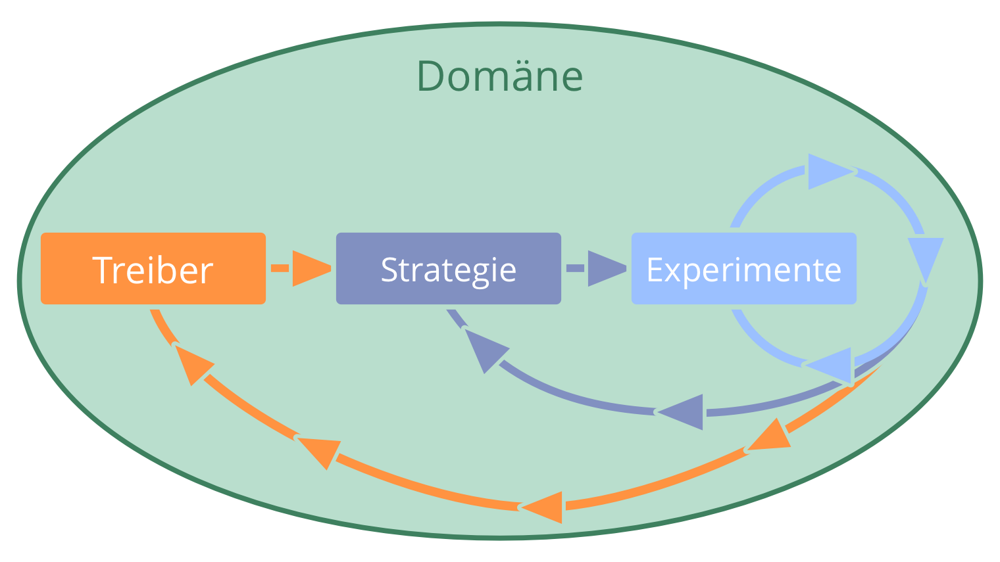

Strategien werden durch Experimente validiert und mit den daraus gewonnenen Erkenntnissen iterativ verfeinert.

---

## Muster 6.3: Domänen bestimmen

**Ein klares Verständnis der jeweiligen Verantwortungs- und Autonomiebereiche fördert Effizienz, effektive Zusammenarbeit und Agilität in der gesamten Organisation.**

Eine einfache Möglichkeit, [Domänen](glossary:domain) klar zu bestimmen ist eine **Domänenbeschreibung**, mit folgendem Inhalt:

- [Primärtreiber](glossary:primary-driver) (der **Bedarf der Organisation**, auf den innerhalb dieser Domäne reagiert werden soll)
- **Kernaufgaben** (wesentliche Leistungen, etwaige kritische Risiken, die beachtet werden müssen, sowie weitere essentielle Arbeitsaufgaben und Entscheidungen, die delegiert wurden)
- **Einschränkungen von Autonomie und Einfluss** der *Beauftragten*, normalerweise in Bezug auf die Organisation selbst (z.B. Abhängigkeiten, Mitbestimmung der [Delegierenden](glossary:delegator), oder Reporting)
- **Ressourcen** (Zeit, Geld, Infrastruktur, Rechte, Werkzeuge
- **Evaluationskriterien** und Zeitplan für die Evaluation
- Amtszeit (für Rollen)

Domänenbeschreibungen können für _Rollen_, Positionen, _Kreise_, [Teams](glossary:team), _offene Domänen_, Abteilungen, Geschäftseinheiten oder auch für die gesamte Organisation erstellt werden.

Eine weitere Möglichkeit, Domänen zu bestimmen, ist das ausfüllen einer [S3 Delegation Canvas](http://s3canvas.sociocracy30.org/s3-delegation-canvas.html).

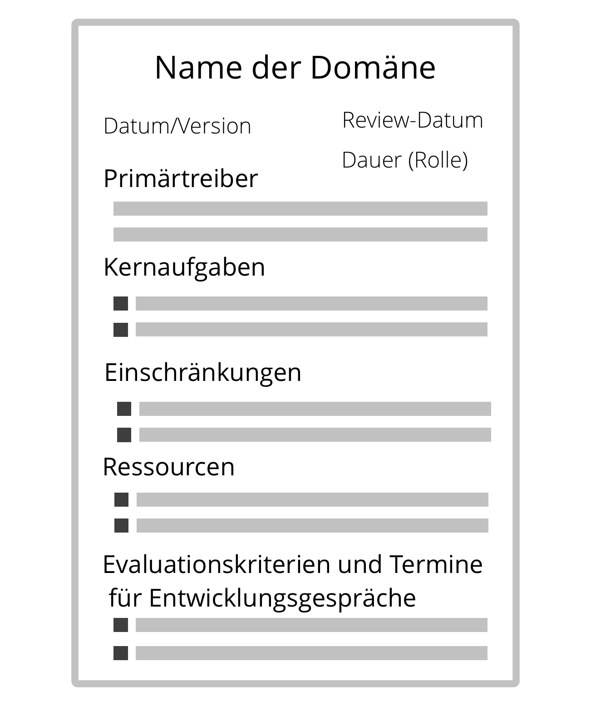

---

## Muster 6.4: Das angestrebte Ergebnis klären

**Kläre das angestrebte Ergebnis von Vereinbarungen, Aktivitäten, Projekten und Strategien.**

Es ist hilfreich, eine klare und knappe Beschreibung des angestrebten Ergebnisses abzustimmen und zu dokumentieren.

Aus dem angestrebten Ergebnis können _Evaluationskriterien_ und Metriken abgeleitet werden, anhand derer man das tatsächliche Ergebnis bewerten kann.

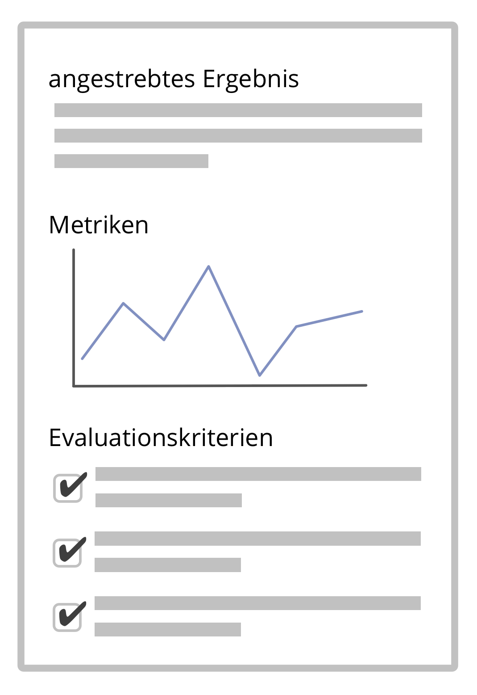

---

## Muster 6.5: Leistungen definieren

**Definiere alle auf eine Vereinbarung bezogenen Leistungen, um ein gemeinsames Verständnis der mit dieser Vereinbarung einhergehenden Erwartungen zu ermöglichen.**

_Eine **Leistung** ist ein Produkt, eine Dienstleistung, eine Komponente oder ein Rohstoff, der als Reaktion auf einen Organisationstreiber hergestellt bzw. bereitgestellt wird._

Bei der Beschreibung von Leistungen ist es hilfreich

- beschreibe ausreichend detailliert
- auf existierende Dokumente zu verweisen

Leistungen klar zu beschreiben verbessert nicht nur Kommunikation und Zusammenarbeit innerhalb der Organisation, sondern auch mit Kunden und externen Partnern.

---

## Muster 6.6: Evaluationskriterien

**Entwickle klar definierte Evaluationskriterien, um herausfinden zu können, ob die Umsetzung einer Vereinbarung den gewünschten Effekt hatte.**

- Wähle **einfache und eindeutige** Kriterien und dokumentiere sie (um unnötige Diskussionen bei der späterenEvaluierung einer [Vereinbarung](glossary:agreement) zu vermeiden).
- Definiere **handlungsorientierte Metriken**, um Ergebnisse laufend verfolgen und Abweichungen vom [angestrebten Ergebnis](glossary:intended-outcome) erkennen zu können.
- Überlege, ob es Kriterien gibt, anhand derer man feststellen kann, ob das Ergebnis einer Vereinbarung als **nicht erfolgreich** betrachtet werden kann
- Bei der Evaluation einer Vereinbarung ist es oft auch sinnvoll oder gar notwendig, die **Evaluationskriterien anzupassen**

---

## Muster 6.7: Logbuch

**Verwalte die für die Zusammenarbeit in der Organisation erforderlichen Informationen in einem gut strukturierten und leicht zugänglichen System.**

Ein Logbuch ist ein (digitales) System zur Speicherung aller für den Betrieb einer Organisation und ihrer Teams relevanten Informationen. Das Logbuch ist allen Mitgliedern einer Organisation zugänglich; einzelne Informationen können vertraulich behandelt werden, wenn dafür ein guter Grund besteht.

Verbreitete Plattformen für Logbücher sind Wikis (z.B. [Dokuwiki](https://www.dokuwiki.org/), [MediaWiki](https://www.mediawiki.org/), [Confluence](https://www.atlassian.com/software/confluence)), Content-Management-Systeme (z.B. [Wordpress](https://wordpress.org/)), [G Suite](https://gsuite.google.com), [Evernote](https://evernote.com/business) oder sogar [Trello](https://trello.com/).

### Inhalt des Logbuchs

Informationen über die gesamte Organisation:

- [Primärtreiber](glossary:primary-driver), [Strategie](glossary:strategy) und gemeinsame [Werte](glossary:values)
- Organisationsstruktur ([Domänen](glossary:domain) und deren Verbindungen)
- [Vereinbarungen](glossary:agreement) 

Informationen für bestimmte Teams oder [Rollen](glossary:role):

- Beschreibung von Domäne und Strategie
- alle Vereinbarungen (inkl. Domänenbeschreibungen, Strategien und _Entwicklungspläne_ von etwaigen [Beauftragten](glossary:delegatee))
- [Backlogs](glossary:backlog) und sonstige Informationen, die für das operative Geschäft und für [Steuerungsaufgaben](glossary:governance) relevant sind

---

## Muster 6.8: Logbuchführer(in)

**Wähle ein Teammitglied, das die Verantwortung für dafür übernimmt, dass alle für die Arbeit des Teams erforderlichen Informationen dokumentiert und verfügbar sind.**

Der Logbuchführer ist verantwortlich für die Pflege des [Logbuchs](glossary:logbook) einer Gruppe:

- Dokumentation von relevanten Details zu [Vereinbarungen](glossary:agreement), [Domänenbeschreibungen](glossary:domain), _Wahlen_, Evalutionsterminen, Sitzungsprotokollen etc.
- Organisation der Information, und Verbesserung des Logbuch-Systems
- Aktualisierung des Logbuchs
- Sicherstellung des Zugangs zum Logbuch für alle Mitglieder des Teams (sowie der restlichen Organisation, falls keine abweichende Vereinbarung getroffen wurde)
- Betreuung aller technischen Aspekte der Logbuchführung

---

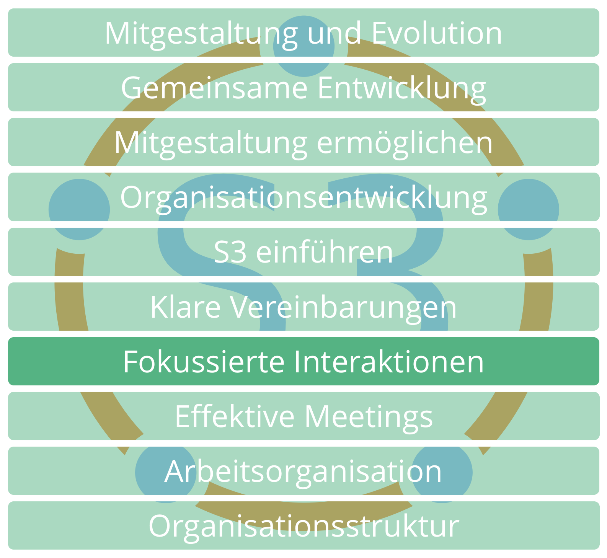

---

## Muster 7.1: Steuerungsmeeting

**Teams treffen sich in regelmäßigen Abständen um zu entscheiden, wie sie vorgehen, um ihre Ziele zu erreichen, und um inhaltliche und zeitliche und Rahmenbedingung für ihre Arbeit festzulegen.**

Ein Steuerungsmeeting ist meistens:

- moderiert 
- vorbereitet 
- zeitlich beschränkt (i.d. R. zwischen 90 und 120 Minuten)
- ... und findet alle 4 Wochen statt

Ablauf eines typischen Steuerungsmeetings:

- Eröffnungsrunde: _einstimmen aufeinander_, und auf die Ziele des Meetings
- Organisatorisches 
    - frage nach Einwänden gegen das Protokoll des letzten Steuerungs-Meetings
    - lege den Termin des nächsten Meetings fest
    - erfrage nach Last-Minute-Agendapunkten, und prüfe den Konsent zur Agenda
- Agendapunkte abarbeiten 
- _Treffen evaluieren_: Reflexion der Interaktionen, Erfolge zelebrieren, Verbesserungsvorschläge überlegen
- Schlussrunde: gemeinsamer Check In zum Abschluss des Meetings

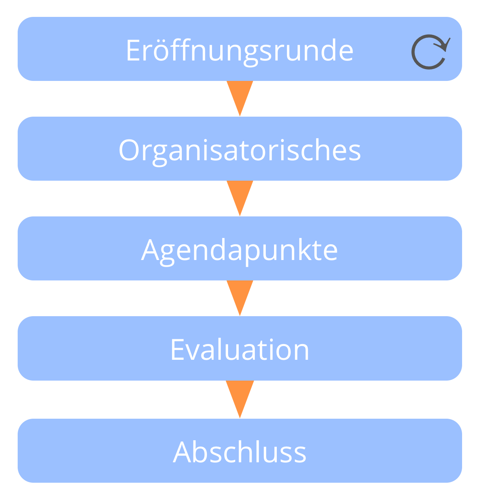

Typische Agendapunkte:

- kurze Berichte 
- Evaluation von [Vereinbarungen](glossary:agreement)
- Personen in Rollen wählen 
- neue Treiber, die Entscheidungen erfordern 
    - _gemeinsam einen Vorschlag gestalten_
    - _Vereinbarungen abstimmen_
    - _Domänen definieren_ und entscheiden, wer sie verantwortet (z.B. neue _Rollen_, _Kreise_, Teams oder _offene Domänen_)

---

## Muster 7.2: Retrospektive

**Nimm dir Zeit, über die gemachten Erfahrungen nachzudenken, zu Erkenntnisse zu gewinnen, und Arbeitsprozesse zu verbessern.**

- Ergebnis: Änderungen am Arbeitsprozess, neue Aufgaben, [ad-hoc-Vereinbarungen](glossary:agreement), sowie [Treiber](glossary:organizational-driver), die eine Vereinbarungen erfordern
- moderiertes Meeting (ca. 1h)
- findet in regelmäßigen Abständen statt (1-4 Wochen)
- Format wird jeweils an Situation und Kontext angepasst

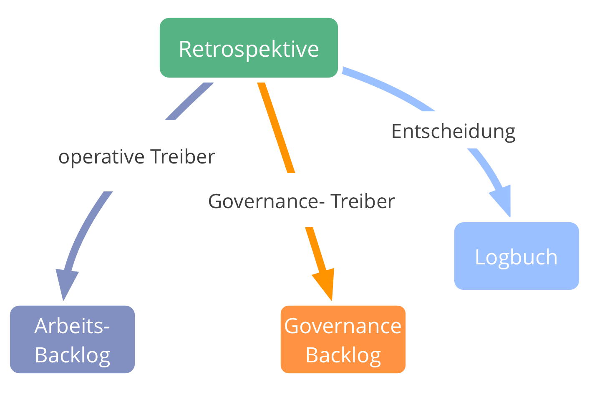

### Fünf Phasen einer Retrospektive

1. Einstimmung 
2. Informationen sammeln
3. Erkenntnisse gewinnen
4. Maßnahmen beschließen
5. Abschluss

Die Website [plans-for-retrospectives.com](http://www.plans-for-retrospectives.com/) bietet zahlreiche Aktivitäten für alle Phasen.

---

## Muster 7.3: Daily Standup

**Ein tägliches Meeting um Arbeitsaufgaben zu koordinieren, Produktivität und Effektivität zu erhöhen, und gemeinsames Lernen zu ermöglichen.**

- feste [Timebox](glossary:timebox) (üblicherweise 15 min.)
- findet jeden Tag zur selben Zeit und am selben Ort statt
- das Team versammelt sich um das Taskboard (oder ein anderes visuelles Projektmanagement-Werkzeug), um 
    - die tägliche Arbeit zu organisieren
    - sich gemeinsam um Hindernisse und Blocker zu kümmern
    - neue [Vereinbarungen](glossary:agreement) zu beschließen, oder bestehende Vereinbarungen anzupassen

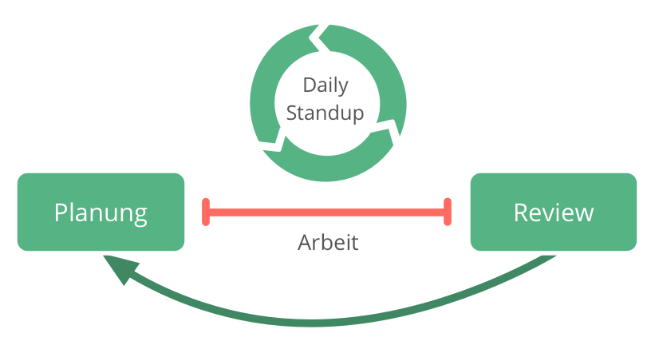

---

## Muster 7.4: Planung und Review

**Teams halten in regelmäßigen Abständen (1-4 Wochen) zeitlich begrenzte Meetings, um Iterationen zu planen und zu evaluieren**

**Planungsmeeting**: Wähle Arbeitspakete für die nächste Iteration aus, und sorge dafür, dass es zu jedem der ausgewählten Arbeitspakete eine Aufwandsschätzung gibt

**Reviewmeeting**: Abnahme fertiggestellter Arbeitspakete, Diskussion von erforderlichen Nachbessrungen und Änderungen für folgende Iterationen 

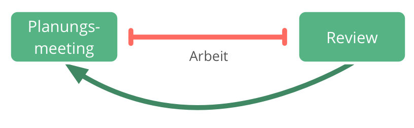

---

## Muster 7.5: Koordinationsmeeting

**Halte regelmäßige Treffen (typischerweise wöchentlich), um Bericht zu erstatten und Arbeitsaufgaben über Domänengrenzen hinweg zu koordinieren.**

- moderiere das Meeting (bestimme einen festen Zeitrahmen für jeden Austausch, und bevorzuge Runden statt Diskussionen)
- falls nützlich, erstelle vor dem Meeting eine Agenda und verteile sie vorher an die Teilnehmer 
    - informiere die Teilnehmer im Vorfeld über notwendige Vorbereitungsaufgaben
    - aus den Berichten können sich während des Meetings neue Agendapunkte ergeben

Agendapunkte

- domänenübergreifende Synchronisation und Ausrichtung
- Priorisierung von Arbeitsaufgaben 
- Hindernisse behandeln

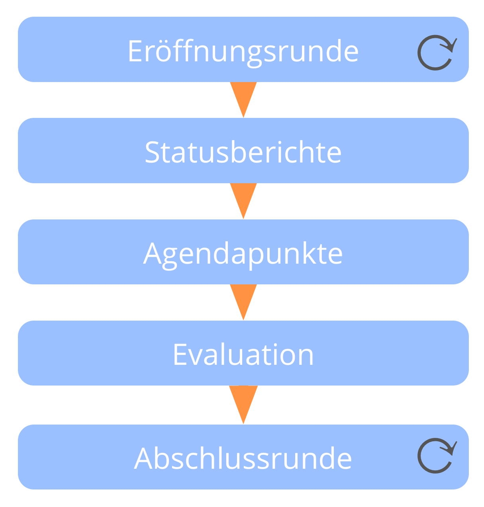

---

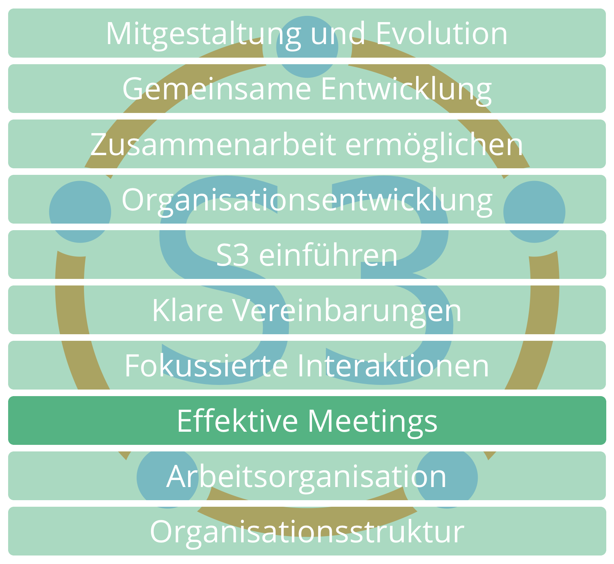

---

## Muster 8.1: Runden

**Erteile jedem in der Gruppe der Reihe nach das Wort.**

Runden sind eine Moderationstechnik, die es ermöglicht, die Gleichstellung innerhalb einer Gruppe aufrechtzuerhalten, und effektiven Austausch im Dialog unterstützt.

Erkläre den Zweck und das angestrebte Ergebnis jeder Runde.

Sorge dafür, dass die Teilnehmer in einem (ggf. offenen) Kreis sitzen. Beginne jede Runde mit einer anderen Person, und ändere die Richtung (im oder gegen den Uhrzeigersinn), um den ersten und letzten Beitrag, sowie die Reihenfolge der Teilnehmer zu variieren.

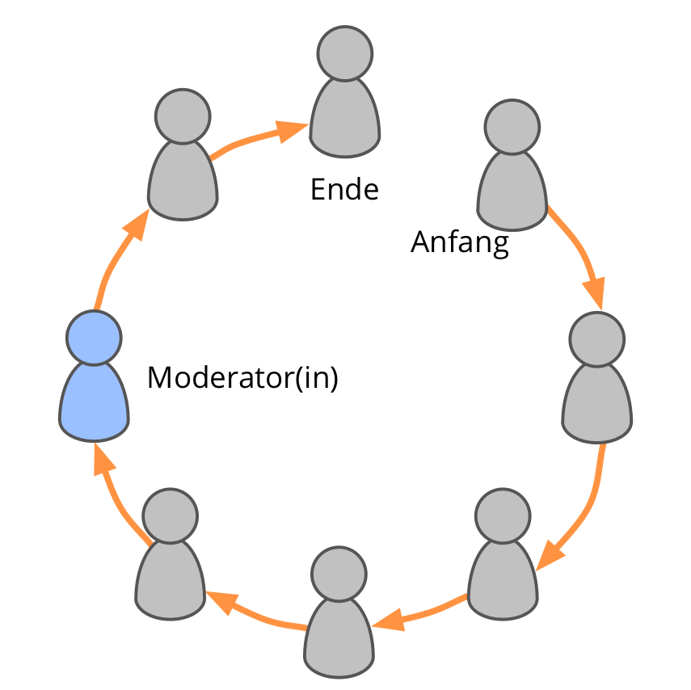

---

## Muster 8.2: Meetings moderieren

**Finde für jedes Meeting eine Moderatorin, um der Gruppe zu helfen, sich zu konzentrieren, das Meeting auf Kurs zu halten und um das Wissen und die Kreativität der Teilnehmer hervorzulocken.**

Bereite vor jedem Meeting eine Agenda vor, und finde eine Moderatorin, die

- die Gruppe durch die Agenda führt und auf die Zeit achtet
- zu jedem Agendapunkt eine passende Aktivität moderiert
- am Ende des Meetings eine _Evaluation_ durchführt

Eine Moderatorin kann auch auf einen bestimmten Zeitraum gewählt werden. Auch die Moderation durch eine unerfahrene Moderatorin macht einen großen Unterschied!

**Siehe auch:**_Meetings vorbereiten_, _Wahl_

---

## Muster 8.3: Meetings vorbereiten

**Bereite Meetings vor, um sie effektiver zu machen.**

Grundlegende Vorbereitung:

- bestimme und kommuniziere den [Treiber](glossary:driver), sowie das [angestrebte Ergebnis](glossary:intended-outcome) des Meetings
- entscheide, wer teilnehmen soll 
- erstelle eine Agenda
- plane das Meeting so, dass die Teilnehmer Zeit zur Vorbereitung haben
- lege eine angemessene Dauer fest 
- kläre wer _moderiert_, wer Protokoll führt und wer sich um die Nachbereitung kümmert

### Vorbereitung der Agenda

Beziehe die Teilnehmer in die Vorbereitung und Priorisierung der Agenda mit ein, und mache ihnen die fertige Agenda vor dem Meeting zugänglich.

Bestimme für jeden Agendapunkt

- den Treiber 
- das angestrebte Ergebnis
- den Prozess
- die Zeit, die darauf verwendet werden soll 
- wie sich die Teilnehmer für diesen Punkt vorbereiten müssen

### Unterstütze die Vorbereitung der Teilnehmer

- überlege, was vor dem Meeting erledigt werden kann
- informiere die Teilnehmer über Erwartungen und Voraussetzungen
- mache alle Materialien und Informationen verfügbar, die die Teilnehmer zur Vorbereitung benötigen

### Vorbereitung als Teilnehmen

- berücksichtige das Muster _kunstvolle Teilnahme_
- gehe die Agenda durch und überlege für jeden Punkt, wie du beitragen kannst
- bringe eventuelle Einwände gegen die Agenda vor, und kümmere dich darum, diese vor dem Meeting aufzulösen, soweit das möglich ist
- gehe Verbesserungsvorschläge aus der Evaluation des vorhergehenden Meetings durch, und überlege, wie **du** diese umsetzen kannst

---

## Muster 8.4: Check In

**Ein Check In hilft den Teilnehmern, sich ihrer selbst und der anderen bewusst zu werden, und ermöglicht ihnen, sich zu konzentrieren, präsent zu sein und bewusster teilzuhaben.**

Der Check In ist eine kurze Mitteilung darüber, wie es dir im Moment geht, die den Anderen einen Einblick in deine Gedanken, Gefühle oder Bedürfnisse ermöglicht.

Ein Check In kann in der Form einer Eröffnungs- und Schlussrunde in einer Gruppensitzung, oder auch nur als kurzer Austausch in einem Treffen zwischen zwei Personen stattfinden.

Jeder Teilnehmer kann während eines Meetings um einen Gruppen-Check-In bitten, oder einfach nur selbst einen Check In durchführen, wenn er in diesem Moment für wertvoll für die Gruppe hält.

In Rahmen eines Gruppen-Check-In kann jeder Teilnehmer passen.

Beim Check In in einer unbekannten Gruppe können Teilnehmer sich mit ihrem Namen vorstellen, und - falls relevant - auch kurz erklären, woher sie kommen. (Tipp: Vermeide es, über Funktionen oder Positionen zu erwähnen, wenn es dafür keinen expliziten Grund gibt.)

---

## Muster 8.5: Meetings evaluieren

**Investiere etwas Zeit in gemeinsame Reflexion am Ende jedes Meetings oder Workshops.**

Gemeinsam über Interaktionen nachdenken, Erfolge feiern und Verbesserungsvorschläge machen.

- reserviere 5 Minuten für ein einstündiges Meeting, und 15 Minuten für einen Tagesworkshop
- dokumentiere das Gelernte, und betrachte es vor dem nächsten Meeting

Vorschläge für Kurzformate:

- mehr / weniger / anfangen / aufhören / beibehalten
- positiv / kritisch / Verbesserungsvorschläge

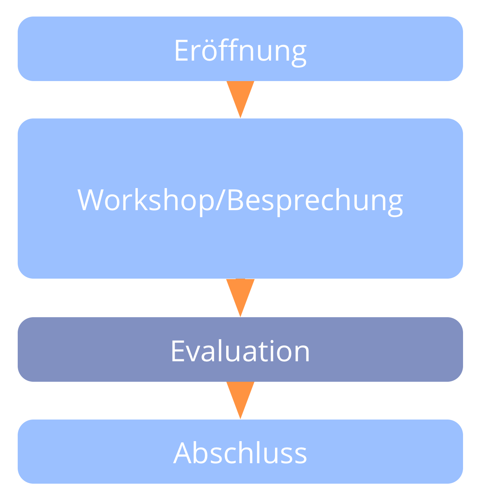

### Meetings evaluieren: ausführliches Format

Lade die Teilnehmer ein, sich Gedanken zu den folgenden Themen zu machen, und moderiere eine _Runde_, in der sich jeder kurz zu den Themen äußern kann, die dokumentiert werden sollen: 

- Effektivität und Format
- Moderation und Teilnahme
- Umgang miteinander
- Würdigungen und Erfolge ("Mir gefiel …")
- Verbesserungsvorschläge ("Ich wünschte …")
- Wilde Ideen und radikale Vorschläge ("Was wäre, wenn …")

---

## Muster 8.6: Gastgeber(in)

**Wähle eine Person, die die Verantwortung für Vor- und Nachbereitung von Meetings, Workshops oder anderer Veranstaltungen übernimmt.**

Die Rolle der Gastgeberin kann nur für eine Veranstaltung, oder für mehrere Veranstaltungen in einem bestimmten Zeitraum vergeben werden.

### Aufgaben der Gastgeberin

Vorbereitung:

- Ziele und gewünschte Ergebnisse identifizieren
- Agenda vorbereiten und verteilen
- Teilnehmer aussuchen und einladen
- Zeitbedarf für das Meeting bzw. den Workshop ermitteln, und einen passenden Termin finden
- Veranstaltungsort buchen (und bei Bedarf Anreise planen)
- Raum vorbereiten, notwendige Materialien und Informationen bereitstellen
- Wahl eines Moderators (und bei Bedarf eines Protokollführers) sicherstellen

**Nachbereitung:**Raum aufräumen, Schlüssel zurückgeben etc, sowie sicherstellen, dass das Protokoll verteil wird

**Siehe auch:**_Meetings moderieren_, _Meetings vorbereiten_

---

## Muster 8.7: Steuerungsbacklog

_Ein **Steuerungs-Backlog** ist eine sichtbare, priorisierte Liste von Themen (Treibern), die in Bezug auf die Governance einer Domäne bearbeitet werden müssen._

Das Steuerungs-Backlog enthält

- Themen, zu denen eine Entscheidung erforderlich ist
- Vorschläge, die erarbeitet und evaluiert werden müssen
- Besetzung von Rollen

**Anmerkung:** Berichte und anstehende Evaluierungen von Vereinbarungen werden üblicherweise direkt in die Agenda aufgenommen, und nicht im Backlog geführt

---

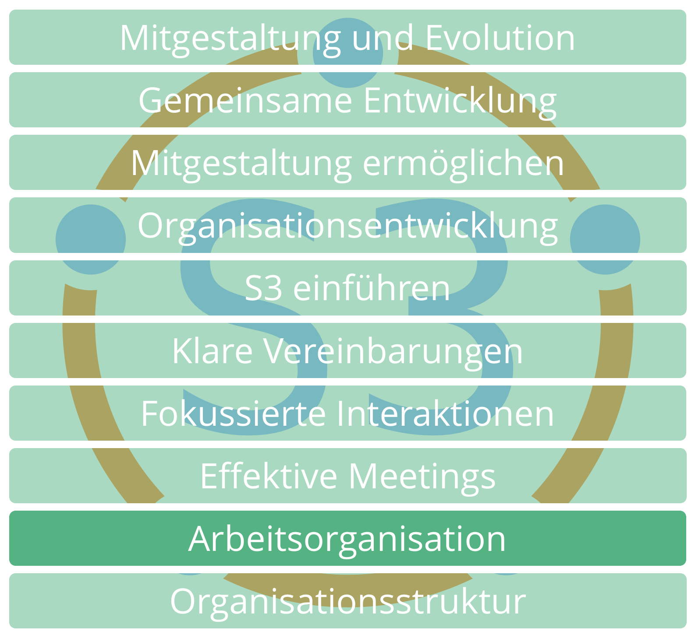

---

## Muster 9.1: Backlog

_Ein **Backlog** (Aufgabenliste) ist eineListe von (meist priorisierten) offenen Aufgaben (Leistungen), oder Treibern, die noch bearbeitet werden müssen._

Mache Backlogs für alle zugänglich - nicht nur für andere Mitglieder eines Teams, sondern für die gesamte Organisation.

Typische Backlogs:

- [Steuerungsbacklog](glossary:governance)
- [Arbeits-Backlog](glossary:operations) (To-Do-Liste)
- _Sprint_-Backlog
- Produkt-Backlog
- Impediment-Backlog

**Umsetzung:**

- **analoges Backlog**: Haftnotizen an einer Wand, oder Karteikarten mit Magneten an einem Whiteboard
- **digitales Backlog**: z.B. [Google Sheets](https://www.google.com/sheets/about/), [Trello](https://trello.com/), [Kanban Flow](https://kanbanflow.com/), [Jira](https://www.atlassian.com/software/jira), [Asana](https://asana.com/)

Jedes Element in einem (priorisierten) Backlog hat normalerweise:

- eine **kurze Beschreibung** einer [Leistung](glossary:deliverable) oder eines [Treibers](glossary:organizational-driver)
- eine **eindeutige Referenznummer** (oder ein Link) für jedes Element 
- (eine **Priorität** oder ein anderes Merkmal, das die Reihenfolge anzeigt)
- **Abhängigkeiten** zu anderen Aufgaben oder Projekten
- **Fälligkeitsdatum** (falls erforderlich)
- (optional) ein Maß für **Wert** 
- (optional) ein Maß für **Aufwand** (oft als Zeit- oder Komplexitätsschätzung)

---

## Muster 9.2: Backlogs priorisieren

**Ordne alle unfertigen Arbeitsaufgaben oder Treiber so, dass die wichtigsten ganz oben stehen. Sobald neue Kapazität frei, ziehe die wichtigste Aufgabe von oben.**

Keine zwei Elemente können dieselbe Wichtigkeit haben, d.h. es ist notwendig, sich auf Prioritäten zu einigen, was manchmal harte Entscheidungen mit sich bringt.

Ein priorisiertes [Backlog](glossary:backlog) lenkt den **Fokus** auf die wichtigsten Aufgaben oder Probleme.

---

## Muster 9.3: Arbeit visualisieren

**Führe alle Arbeitsaufgaben in einem System, dass es allen Stakeholdern einfach ermöglicht, sich über den Status aller geplanten, bearbeiteten und erledigten Aufgaben zu informieren.**

- essentiell für [Selbstorganisation](glossary:self-organization) und Pull-Systeme
- das System muss für alle Betroffenen zugänglich sein
- **analog**: Haftnotizen an der Wand, oder Karteikarten, Magnete und Whiteboard
- **digital**: [Trello](https://trello.com/), [Kanbanery](https://kanbanery.com/), [Leankit](https://leankit.com/), [Jira](https://www.atlassian.com/software/jira), [Google Sheets](https://www.google.com/sheets/about/), etc.

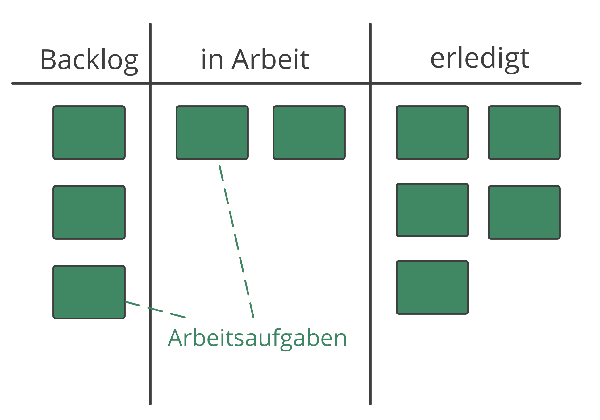

### Für jede Arbeitsaufgabe sollten folgende Dinge ersichtlich sein:

- **Art der Aufgabe** (z.B. Kundenwunsch, Projektaufgabe, Report, Nachbesserung)
- **Startdatum** (und **Fälligkeitsdatum** falls erforderlich)
- **Priorität**
- **Zustand** der Aufgabe (z.B. "unerledigt", "in Arbeit", "Review" and "erledigt")
- Hindernisse oder Blockaden
- Bearbeiter
- [Vereinbarungen](glossary:agreement) und Erwartungen zum Arbeitsablauf (z.B. Definition of Done, Policies, Qualitätsstandards)
- nutze Farben, Symbole, Highlights etc.

---

## Muster 9.4: Arbeiten nach Pull-System

**Mitarbeiter holen sich neue Arbeit, wenn sie Kapazität haben (anstatt dass ihnen Arbeit zugeteilt wird).**

Priorisiere offene Arbeitsaufgaben, so dass sichergestellt ist, dass die wichtigsten Aufgaben zuerst abgearbeitet werden.

Pull-Systeme verhindert die Überlastung des Systems (dieser Effekt wird noch verstärkt, wenn man zusätzlich auch die _Zahl der gleichzeitigen Arbeitsaufgaben pro Mitarbeiter beschränkt_).

---

## Muster 9.5: Laufende Arbeit begrenzen

**Begrenze die Anzahl an Arbeitsaufgaben für jeden Schritt deiner Arbeitsprozesse**

Laufende Arbeit kann sich u.A. beziehen auf

- die Anzahl der Elemente in einem [Backlog](glossary:backlog)
- gleichzeitige bearbeitete Projekte oder Aufgaben für Teams oder Personen
- Produkte im Portfolio

Wenn eine Aktion eine vereinbarten Grenze überschreiten würde, muss dies zuerst mit dem Team diskutiert werden

---

## Muster 9.6: Timebox

**Bestimme für alles einen festen Zeitrahmen um die Konzentration zu fördern, und um die zur Verfügung stehende Zeit bewusst zu nutzen.**

_Eine **Timebox** ist ein festgelegter Zeitrahmen, der auf eine bestimmte Aktivität verwendet wird. Am Ende der Timebox ist die Aktivität nicht zwingend abgeschlossen._

- um maximalen Nutzen aus der Timebox ziehen zu können, sollte das angestrebte Ergebnis vorher geklärt werden
- die restliche zur Verfügung stehende Zeit sollte immer für alle Teilnehmer sichtbar sein
- Verhandlungen über eine Verlängerung der Timebox sollten noch innerhalb der ursprünglichen Timebox abgeschlossen sein
- längere Aktivitäten sollten in kleinere Timeboxen aufgeteilt werden
- auch innerhalb einer Timebox sollte der Fortschritt regelmäßig überprüft werden
- manchmal hilft die Wahl eines "Zeit-Wächters", Timeboxen besser einzuhalten

Timeboxen sind anwendbar auf

- Meetings, Telefonate, Gespräche
- Aufgaben
- Experimente
- einen Versuch, ein Problem zu lösen
- E-Mails lesen
- Pausen
- eine längere Arbeitsperiode (Sprint)

---

## Muster 9.7: Fluss angleichen

**Triff Entscheidungen dort, wo auch der Wert geschaffen wird, und passen den Informationsfluss entsprechend an, um kontinuierlichen Wertfluss zu ermöglichen und zu unterstützen.**

**Wertfluss:** Leistungen wandern durch die Organisation hin zum Kunden bzw. zu sonstigen Stakeholdern.

Schaffe und erhalte die Angleichung der Flüsse durch die kontinuierliche Evolution der innerhalb der Organisation geltenden [Vereinbarungen](glossary:agreement).

- stelle sicher, dass alle Entscheidungen, die den Wertfluss betreffen, diesen auch tatsächlich positiv beeinflussen
- ermögliche Menschen mit entsprechenden Fähigkeiten und Kenntnissen, Entscheidungen zu beeinflussen
- mache alle nützlichen Informationen verfügbar
- schaffe kurze Feedback-Schleifen, um das gemeinsame Lernen zu verstärken

Wenn Entscheidungen dort getroffen werden, wo auch der Wert geschaffen wird, und der Informationsfluss den kontinuierlichen Wertfluss unterstützt, wird das Potenzial für die Akkumulation von Verschwendung reduziert.

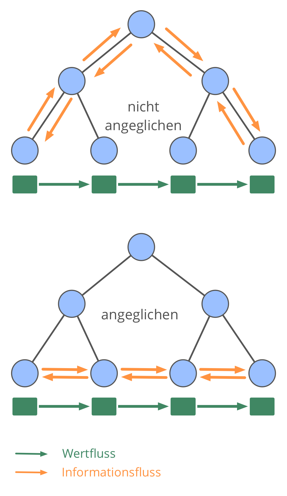

---

## Muster 9.8: Koordinator(in)

Die Koordinatorin ist verantwortlich für die **Koordination der Arbeit einer Gruppe** und wird **für einen festgelegten Zeitraum gewählt**

Die Koordinatorin wird entweder von der Gruppe selbst gewählt, oder von der [Delegierenden](glossary:delegator) bestimmt.

Mehrere Koordinatorinnen können zusammenarbeiten, um Arbeit über mehrere [Domänen](glossary:domain) hinweg zu koordinieren.

Anstatt eine Koordinatorin zu wählen, kann sich ein Team auch selbst organisieren.

---

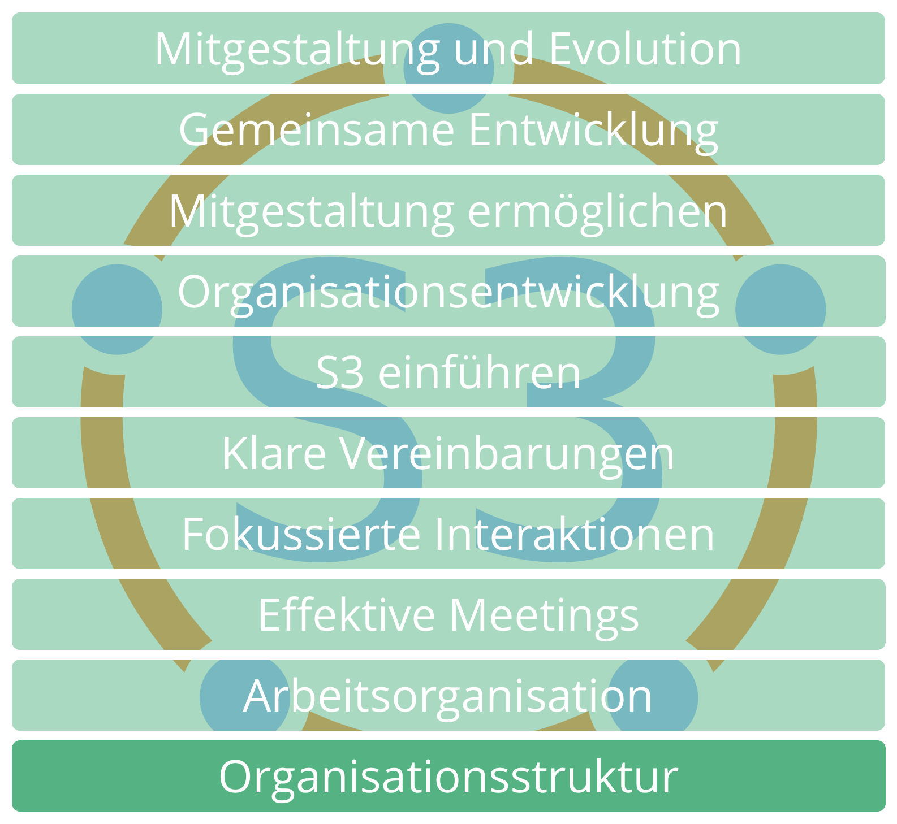

---

## Organisationsstruktur

Organisationsstruktur ist das momentane Gefüge von [Domänen](glossary:domain) und deren Verbindungen. Sie zeigt Entscheidungskompetenzen und die Kanäle, durch die Einfluss und Information fließen.

Entwickle die Struktur der Organisation ständig weiter, um

- den kontinuierlichen [Wertfluss](glossary:flow-of-value) zu unterstützen
- die effektive Zusammenarbeit bei gegenseitigen Abhängigkeiten zu ermöglichen
- sicherzustellen, das Information dort verfügbar ist, wo sie gebraucht wird
- Einfluss anhand des tatsächlichem Bedarfs zu verteilen

Die Grundbausteine für Organisationsstruktur sind voneinander abhängige und verbundene Domänen.

Domänen werden verbunden zu Hierarchien oder **Heterarchien** (auch bekannt als komplexe adaptive Systeme oder Netzwerke, in denen mehrere funktionale Strukturen parallel existieren können).

Soziokratie 3.0 beschreibt verschiedene **Strukturmuster**, aus denen eine große Vielfalt von unterschiedlichen Organisationsstrukturen entwickelt werden kann:

- die Strukturmuster haben unterschiedliche Abstraktionsebenen
- unterschiedliche Strukturmuster lösen unterschiedliche Probleme
- Strukturmuster können nach Bedarf angepasst und kombiniert werden
- weitere Strukturmuster werden entdeckt und beschrieben werden

---

## Muster 10.1: Servicekreis

**Lagere Dienstleistungen aus, die von zwei oder mehr Domänen benötigt werden.**

Ein Servicekreis wird von Mitgliedern derjenigen [Domänen](glossary:domain) besetzt, denen er dient; bei Bedarf können auch zusätzliche Personen hinzugezogen werden.

---

## Muster 10.2: Delegiertenkreis

**Delegiere die Entscheidungsbefugnis für Treiber, die mehrere Domänen betreffen an einen Kreis aus Delegierten.**

Stakeholder entsenden _Repräsentanten_, die einen Delegiertenkreis bilden, der die [Steuerungs-Entscheidungen](glossary:governance) trifft, die mehrere (oder alle) Stakeholder betreffen.

Die Entscheidungen eines Delegiertentenkreises werden in den einzelnen [Domänen](glossary:domain) ausgeführt, denen dieser Kreis dient.

Delegiertenkreise steuern eine Organisation anhand des [Wertflusses](glossary:flow-of-value), und ermöglichen die Integration einer Vielfalt an Perspektiven in Steuerungsentscheidungen. 

Ein Delegiertenkreis kann weitere Personen (z.B. externe Experten) hinzuziehen, die ihn bei einzelnen Entscheidungen oder auch als permanente Mitglieder unterstützen.

---

## Muster 10.3: Pfirsichorganisation

**Wertschöpfung in komplexen und kompetitiven Umgebungen durch *Dezentralisierung* (von Ressourcen und Einfluss) und *direkte Interaktion* zwischen Mitarbeitern und den Kunden, für die sie Wert schöpfen.**

Die Teams in der Peripherie

- … schaffen Wert in direktem Austausch mit der Außenwelt (Kunden, Partner, Kommunen, Communities etc.) 
- …verwalten die Finanzen und steuern die Organisation

Das Zentrum erbringt Dienstleistungen, um die Peripherie zu unterstützen.

[Domänen](glossary:domain) werden so verbunden, dass die zu Entscheidungen erforderlichen Einflussmöglichkeiten geschaffen werden, und um Zusammenarbeit bei gegenseitigen Abhängigkeiten zu ermöglichen.

---

## Muster 10.4: Doppelt verbundene Hierarchie

**Delegiere alle Governance-Entscheidungen an selbststeuernde Kreise, und verbinde diese Kreise jeweils nach oben und unten über den Austausch von Delegierten, um eine herkömmliche Hierarchie in eine Struktur zu überführen, die es leichter macht, das kollektive Wissen zu nutzen und Engagement zu fördern.**

1. Alle Governance-Entscheidungen werden von Einzelpersonen auf Teams übertragen, indem [selbststeuernde](glossary:self-governance) [Kreise](glossary:circle) auf allen Ebenen der Organisation gebildet werden.

2. Die Mitglieder eines jeden Kreises entsenden Delegierte in den nächsthöheren sowie in alle tieferen Kreise, die ihre Interessen in den Governance-Entscheidungen</a> dieser Kreise vertreten.

Die doppelt verbundene Hierarchie

- ermöglicht Gleichstellung bei Governance-Entscheidungen
- und ermöglicht zudem weiterhin eine Hierarchie im operativen Geschäft (sollte das dem Wertfluss dienlich sein) 

**See also:** _Kreis_, _Doppelte Verbindung_, _Repräsentant_

---

## Muster 10.5: Serviceorganisation

**Zusammenarbeit mehrerer Stakeholder, und Ausrichtung auf ein gemeinsames Ziel (bzw. einen gemeinsamen Treiber).**

- verbessert die Gleichstellung der beteiligten Organisationen
- ermöglicht gemeinsame Ausrichtung über Abteilungs- und Organisationsgrenzen hinweg
- unterstützt die Zusammenarbeit zwischen Organisationen bzw. Abteilungen, die unterschiedlichen Ziele verfolgen, oder sich im Konflikt miteinander befinden
- geeignet für einmalige Projekte oder fortwährende Zusammenarbeit

**Anmerkung:** das Muster "Serviceorganisation" wird oft auch als **Backbone-Organisation** bezeichnet.

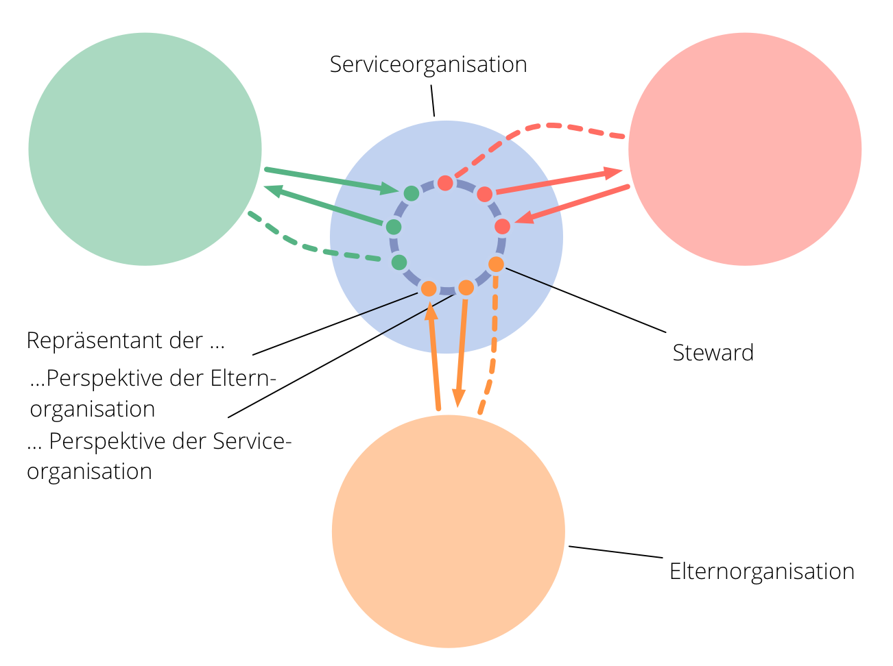

---

## Muster 10.6: Fraktalorganisation

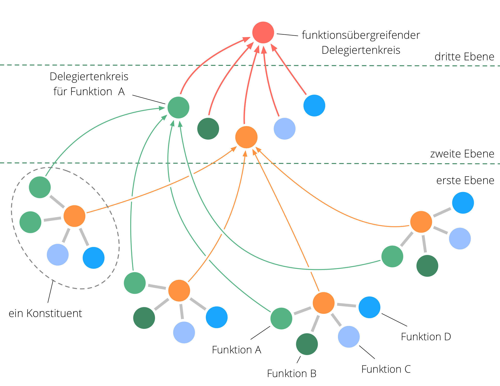

Mehrere Organisationen (oder Domänen) mit ähnlichen Strukturen und Zielen tauschen sich über Erfahrungen aus, und koordinieren ihre Aktivitäten (falls hilfreich).

- eine Möglichkeit, mehrere Organisationen gemeinsam zu steuern, und gleichzeitig die Autonomie der einzelnen Organisationen weitgehend zu erhalten
- diese Struktur fördert bedarfsorientiert Innovation und Erfahrungsaustausch auch in großen Communities

---

# Anhang

- Änderungsprotokoll 
- Links
- Lizenz
- Autoren
- Glossar
- Index der Muster

---

## Änderungsprotokoll 

### Änderungen zum 22.9.2018

**Allgemeine Änderungen**

- Abschnitt zu Governance in der Einführung aktualisiert
- Bildunterschriften zu allen Illustrationen hinzugefügt
- Patternkategorie "Mitgestaltung ermöglichen" umbenannt in "Zusammenarbeit ermöglichen"
- in der Webseite zeigen Begriffe aus dem Glossar nun ihre Bedeutung, wenn sie man mit der Maus berührt
- viele Links zum Glossar auf der Web-Version hinzugefügt

**Glossar:**

- [Team](glossary:team) in's Glossar aufgenommen (und den Begriff "Gruppe" im Leitfaden durch "Team" ersetzt, wo passend)
- Definition für [Leistung](glossary:deliverable) überarbeitet
- In der englischen Version den Begriff **driver statement** aus Text und Glossar entfernt.
- Definitionen für [Governance](glossary:governance), [operatives Geschäft](glossary:operations) und [Selbstorgansation](glossary:self-organization) überarbeitet

**Abbildungen:**

- Vorlagen für Domänen- und Rollenbeschreibung aktualisiert
- Abbildungen für _Kreise verbinden_ und _doppelte Verbindung_ überarbeitet

**Änderungen der Muster:**

- _Vereinbarung_: Beschreibung stellt nun klar, dass alle auf die Vereinbarung bezogenen Erwartungen dokumentiert werden sollten
- _Leistungen definieren_: Zusammenfassung aktualisiert
- _Organisationstreiber beschreiben:_ Abschnitt zur Zusammenfassung der Beschreibung überarbeitet
- _Einwände integrieren:_ Zusammenfassung und Beschreibung hinzugefügt

### Änderungen zum 17.8.2018

**Allgemeine Änderungen**

- zu vielen Mustern eine kurze Zusammenfassung hinzugefügt, und bestehende Zusammenfassungen überarbeitet
- viele Stichpunkte entfernt und zu ganzen Sätzen ergänzt
- sprachliche Überarbeitung
- Links zur Web-Version des Praxisleitfadens ergänzt 

**Glossar**

- **überarbeitet**Bedenken, Governance, Einwand, Leistung, operatives Geschäft, Primärtreiber, Rolle, Selbstorganisation, Subtreiber, Teilautonomie, Werte
- **hinzugefügt**: Delegation, Hilfsteam, Konstituente, Koordination, Offene Domäne, Wertfluss
- **entfernt:** Nachbartreiber

**Änderungen in der Einleitung**

- Treiber für die Entwicklung von Soziokratie 3.0 hinzugefügt
- Die sieben Prinzipien: 
    - *The Principle of Empiricism*: removed reference to “falsification” 
    - *The Principle of Consent* is now explained more clearly as “Raise, seek-out and resolve objections to decisions and actions” 
- *Governance, Semi-Autonomy and Self-Organization*: we refined the definitions of Governance, Operations, and Self-Organization, removed any reference to “coordination”, and clarified the distinction between governance and operations
- *Drivers and Domains* - we clarified how domains can be understood in relation to organizational drivers

**Änderungen der Muster:**

- _Gemeinsame Werte_: Beschreibung überarbeitet
- _Fluss angleichen_: Beschreibung und Illustration überarbeitet
- _Muster an Kontext anpassen_: Beschreibung überarbeitet
- _Vereinbarung_:: Beschreibung überarbeitet, Vorlage aktualisiert
- _Kunstvolle Teilnahme:_ Zusammenfassung überarbeitet
- _Das angestrebte Ergebnis klären_ (umbenannt von *angestrebtes Ergebnis*): Beschreibung überarbeitet
- _Konsententscheidung_: Beschreibung und Illustration überarbeitet
- _kontinuierliche Prozessverbesserung_: Beschreibung überarbeitet
- _Contract For Successful Collaboration_: renamed the pattern to a more descriptive name, and explained process of creating contracts, and what needs to be in them
- _Coordination Meeting_: clarified agenda items, updated illustration
- _Delegiertenkreis_: Beschreibung überarbeitet
- _Einfluss delegieren_: : Beschreibung überarbeitet
- _Leistungen definieren_: Beschreibung überarbeitet
- _Describe Organizational Drivers_: made explicit that a driver statement is typically only 1-2 sentences, revised section about explaining the need, moved the section about reviewing driver statements from *Respond to Organizational Drivers* to this pattern, and added a new illustration that explains *how* to describe organizational drivers
- _Doppelte Verbindung_: Beschreibung angepasst an *Verbindung*
- _Double-Linked Hierarchy_: explained in more detail what a double-linked hierarchy is, and how it is created
- _Evaluate and Evolve Agreements_: rearranged the text so it's clear there is a long and a short format
- _Evaluation Criteria_: suggested clarifying a threshold for success, and we explained about evolving evaluation criteria with agreements
- _Meetings moderieren_: Beschreibung überarbeitet
- _Fraktalorganisation_: Beschreibung überarbeitet und erweitert
- _Governance-Backlog:_ Beschreibung überarbeitet
- _Governance-Meeting:_ Beschreibung überarbeitet, Agendapunkte genauer erläutert
- _Veränderung einladen_: Beschreibung überarbeitet
- _Kreise verbinden_: Beschreibung angeglichen an _doppelte Verbindung_
- _Logbook_: clarified that there is no difference between logbooks for groups and logbooks for roles
- _Navigate Via Tension_: improved description, added a new illustration to clarify the distinction between *Navigate Via Tension*, *Describe Organizational Drivers* and *Respond to Organizational Drivers*
- _Objection_: clarified the difference between objection and concern, clarified what qualifies as an objection, and how to qualify objections in a group context
- _Offene Domäne_: Beschreibung und Illustration überarbeitet
- _Offene Systeme_: Beschreibung überarbeitet
- _Open Space for Change_: renamed from *Open S3 Adoption*, improved description
- _Pfirsichorganisation_: Klärung der Beziehung zwischen Peripherie und Zentrum
- _Proposal Forming_: revised text and illustration to make process of choosing tuners more clear, updated template for proposal to align with template for agreement
- _Repräsentant_: Beschreibung überarbeitet
- _Einwände integrieren_ beide Illustrationen überarbeitet
- _Respond to Organizational Drivers_: improved description, simplified qualification of organizational drivers
- _Rolle_: Beschreibung überarbeitet
- _Wahl_: Beschreibung überarbeitet, Erklärung der einzelnen Schritte
- _Runden_: Beschreibung überarbeitet
- _Transparent Salary_: added more details about fairness, and on how to develop a salary formula

**Folgende Muster wurden umbenannt:**

- *Vereinbarungen prüfen* in *Vereinbarungen entwickeln*
- *Angestrebtes Ergebnis* in *Das angestrebte Ergebnis klären* 
- *S3 per Open-Space* in *Den Raum für Veränderung öffnen*
- *Contracting and Accountability* to *Contract For Successful Collaboration*

**Folgende Muster wurden hinzugefügt:**

- _Check In_
- _Vorschläge gemeinsam gestalten_
- _Meetings vorbereiten_
- _Timebox_

### Änderungen zum 21.3.2018

- das Muster *Treiber beschreiben* wurde umbenannt in *Organisationstreiber beschreiben*
- _Organisationstreiber beschreiben_: Erklärung der vier Aspekte eines Treibers: aktuelle Situation, Effekt der Situation auf die Organisation, Bedarf der Organisation in Bezug auf die Situation, und die Konsequenzen, wenn der Bedarf gedeckt wird
- *Bedarf* zum Glossar hinzugefügt

### Änderungen zum 16.11.2017

- kleine Korrekturen
- Glossareinträge für *Kreis* und *Rolle* an Beschreibung der Muster angepasst
- *Entwicklungsplan*: Zuständigkeiten genauer erklärt
- *Rolle*: Entwicklung der Strategie genauer erklärt

### Änderungen zum 10.11.2017

- verschiedene Klarstellungen und Korrekturen
- *Kreis*: Klärung der Beziehung zwischen Kreis und Domäne
- *Rolle*: Beschreibung überarbeitet
- *Runden*: Beschreibung überarbeitet
- *Offene Domänen*, *Hilfsteam* und *Offene Systeme* in die Kategorie "Organisationsentwicklung" verschoben
- mehrere Begriffe zum Glossar hinzugefügt

### Änderungen zum 21.10.2017

- Liliana Davids zu Autoren hinzugefügt
- den Begriff «Framework» fallen gelassen (ersetzt durch «Praktischer Leitfaden»)
- Reihenfolge der Patterns aktualisiert
- Index aller Patterns hinzugefügt 
- Glossar hinzugefügt 
- Danksagungen hinzugefügt
- mehrere kleinere Klärungen und Korrekturen an Texten und Illustrationen
- Vorlagen für Vereinbarungen und Entwicklungsplan angepasst

**Änderungen in der Einleitung**

- neuer Abschnitt "was habe ich davon?"
- Definitionen für Governance, Selbstorganisation, Teilautonomie und operatives Geschäft hinzugefügt
- Klärung von Domänen und ihrer Beziehung zu Treibern 
- Kernkonzepte besser erklärt
- handlungsorientierte Beschreibung der Prinzipien

**Änderungen der Muster**

- *Kunstvolle Teilnahme*: Beschreibung überarbeitet
- *Vereinbarung*: Erklärung, dass das Konzept von Vereinbarungen auch innerhalb einer Rolle angewendet werden kann
- *Domänen bestimmen*: Beschreibung überarbeitet
- *Kreis*: Beschreibung überarbeitet und Glossareintrag für "Kreis" aktualisiert
- *Treiber*: Definition überarbeitet
- *Entwicklungsplan*: Beschreibung überarbeitet und Vorlage aktualisiert
- *Strategie entwickeln*: Beschreibung überarbeitet, klare Definition von Strategie
- *doppelt verbundene Hierarchie*: neue Illustration
- *Vereinbarungen prüfen*: Fragen an Entwicklungsgespräch angepasst
- *Steuerungsbacklog*: Beschreibung überarbeitet
- *Logbuch*: Informationen zu Governance in persönlichen Logbüchern
- *Einwände*: Abschnitt zur Qualifikation von Einwänden überarbeitet
- *Peer Review*: Beschreibung überarbeitet
- *Auf Organisationstreiber reagieren*: Abschnitt zur Qualifikation von Treibern eingefügt
- *Rolle*: der Inhaber einer Rolle kann ein Steuerungsbacklog führen
- *Proposal Forming*: Beschreibung überarbeitet, Schritt zur Priorisierung der Kriterien hinzugefügt, Fragen zur Auswahl von Gestaltern hinzugefügt, 
- *Einwände integrieren*: neue Illustration

**Folgende Muster wurden umbenannt:**

- *Backbone-Organisation* in *Serviceorganisation*
- *Entwicklungsgespräch* (nur auf Englisch umbenannt)
- *Strategie* in *Strategie entwickeln*
- *Domänenbeschreibung* in *Domänen bestimmen*
- *Leistungen definieren* (nur auf Englisch umbenannt)

**Folgende Muster wurden hinzugefügt:**

- *Einfluss delegieren*
- *Treiber beschreiben*
- *Offene Domäne*

**Folgende Muster wurden entfernt:**

- *Koordinationskreis*
- *Verschachtelte Domänen*
- *Treiber beurteilen*

---

## Links

**Die jeweils aktuellste Version des Praxisleitfadens:**

[Online-Version](http://patterns.sociocracy30.org), die über [hypothes.is annotiert werden kann](https://via.hypothes.is/http://patterns.sociocracy30.org/) und zur einfacheren Navigation einen Index und eine Landkarte der Patterns enthält. 

weitere Sprachen und Formate des Praxisleitfadens gibt es unter <http://sociocracy30.org/guide/>

**Weitere Materialien zu S3**: <http://sociocracy30.org/resources/>

**S3 Webseite**: <http://sociocracy30.org>

Folge uns auf **twitter**: [@sociocracy30](http://twitter.com/sociocracy30)

---

## Lizenz

Dieses Werk von Bernhard Bockelbrink, James Priest und Liliana David ist lizenziert unter der Creative Commons Attribution-ShareAlike 4.0 International License. Die vollständige Lizenz findet sich unter <http://creativecommons.org/licenses/by-sa/4.0/>.

---

## Danksagung

Soziokratie 3.0 ist das Ergebnis von über Generationen gesammelter Weisheit und Erfahrungen. Allen Mitwirkenden gemein ist das Streben danach, neue Wege zu harmonischer, bewusster und effektiver Zusammenarbeit zu entwickeln.

Besondere Anerkennung gebührt Gerard Endenburg und allen anderen, die viel Zeit in die Entwicklung und Dokumentation der Soziokratischen Kreismethode investierten, welche wiederum eine wesentliche Inspiration für Soziokratie 3.0 darstellt.

Weiterhin danken wir all jenen, die unermüdlich an der Förderung einer agilen Geisteshaltung arbeiten, und agile Praktiken entwicklen und teilen. 

Schlussendlich gebührt unser Dank unseren zahlreichen Kollegen und Kunden - sowie den Teilnehmern unserer Kurse und Workshops - die sich entschlossen haben, Soziokratie 3.0 kennenzulernen und damit zu experimentieren. Danke für Euer wertvolles und wertschätzendes Feedback, das uns hilft, zu lernen und zu wachsen, und die Muster in S3 weiterzuentwickeln.

Folgenden Personen wollen wir besonders danken für ihren Beitrag zu Soziokratie 3.0, oder für ihre Arbeit, die S3 wesentlich beeinflusst hat:

Gojko Adzic, Lyssa Adkins, Christopher Alexander, David J. Anderson, Ruth Andrade, Jurgen Appelo, Kent Beck, Sue Bell, Angelina Bockelbrink, Jesper Boeg, Kees Boeke, Mary Boone, John Buck, Betty Cadbury, Diana Leafe Christian, Mike Cohn, Stephen Covey, Gigi Coyle, Jef Cumps, David Deida, Esther Derby, Kourosh Dini, Jutta Eckstein, Frands Frydendal, Gerard Endenburg, Andreas Hertel, Andrei Iuoraia, François Knuchel, Diana Larsen, Helmut Leitner, Jim and Michele McCarthy, Pieter van der Meche, Daniel Mezick, Susanne Mühlbauer, Niels Pfläging, Mary and Tom Poppendieck, Karl Popper, Brian Robertson, Marshall Rosenberg, Dave Snowden, Hal and Sidra Stone, Ken Schwaber, Jeff Sutherland, Sharon Villines, Nathaniel Whitestone, Ken Wilber, Jack Zimmerman.

---

## Autoren

### James Priest

... … bietet seine Unterstützung international an; Beratung zu Organisationsentwicklung, Lernbegleitung, sowie Mentoring für Menschen, die kollaborative, adaptive Organisationen in grösserem Rahmen entwickeln möchten.

[thriveincollaboration.com](http://thriveincollaboration.com)

<james@thriveincollaboration.com>

### Bernhard Bockelbrink

... unterstützt als Agile-Coach, Trainer und Berater Personen, Teams und Organisationen darin, komplexen Herausforderungen erfolgreich zu begegnen, und dabei eine Kultur effektiver, bewusster und freudvoller Zusammenarbeit zu entwickeln.

[evolvingcollaboration.com](http://evolvingcollaboration.com)

<bernhard.bockelbrink@evolvingcollaboration.com>

### Liliana David

... … bietet ihre Unterstützung international an; Training, Prozessbegleitung und Mentoring für Teams und Organisationen mit dem Wunsch, grössere Effektivität und Gleichberechtigung in der Zusammenarbeit zu entwickeln.

[thriveincollaboration.com](http://thriveincollaboration.com)

<lili@thriveincollaboration.com>

---

# Glossar 

**(etwas) verantworten**: die Verantwortung für etwas übernehmen.
**Angestrebtes Ergebnis**: Das erwartete Ergebnis einer Vereinbarung, Aktion, Projekt oder Strategie.
**Arbeitsbacklog**: Eine sichtbare Liste von (meist priorisierten) offenen Aufgaben (Leistungen).
**Backlog**: Eine Liste von (meist priorisierten) offenen Aufgaben (Leistungen), oder Treibern, die noch bearbeitet werden müssen.
**Beauftragte**: Eine Person oder Gruppe, die die Verantwortlichkeit für eine Domäne übernimmt.
**Bedarf**: Ein Mangel an etwas, das erwünscht ist oder als notwendig erachtet wird.
**Bedenken**: Die Ansicht, dass etwas - selbst in der Abwesenheit von Einwänden - eine effektiv(er)en Antwort auf einen Organisationstreiber behindern **könnte**.
**Check In**: Eine kurze Mitteilung darüber, wie es dir im Moment geht, die Anderen Einblick in deine Gedanken, Gefühle oder Bedürfnisse ermöglicht.
**Delegation**: Die Bevollmächtigung einer Partei (des Beauftragten) durch eine andere (die Delegierende), sich um eine Domäne zu kümmern (d.h. bestimmte Aufgaben zu erfüllen und/oder bestimmte Entscheidungen zu treffen). Die Gesamtverantwortung trägt weiterhin die Delegierende.
**Delegierende**: Eine Person oder Gruppe, die die Verantwortung für eine Domäne an andere delegiert.
**Domäne**: Ein eigener Arbeits-, Einfluss-  und Entscheidungsbereich innerhalb einer Organisation.
**Effektivität (Prinzip)**: Investiere Zeit nur in das, was Dich dem Erreichen Deiner Ziele näher bringt.
**Einwand**: Eine _Argument_, warum eine geplante Handlung oder Entscheidung die effektive Reaktion auf einen Organisationstreiber verhindert.
**Empirismus (Prinzip)**: Prüfe alle Annahmen durch Experimente und kontinuierliche Revision.
**Gewählte Werte**: Ein Satz von Prinzipien, für die sich ein Team (oder eine Organisation) gemeinsam entschieden hat, um sie im Rahmen ihrer Zusammenarbeit umzusetzen.

---

# Glossar (…)

**Gleichstellung (Prinzip)**: Beziehe Menschen in die sie betreffenden Entscheidungen und deren Entwicklung ein.
**Governance**: Alle Tätigkeiten, die mit der Festlegung von Zielen und den aus diesen Zielen resultierenden Steuerungsaufgaben zu tun haben: Menschen mit der entsprechenden Befugnissen treffen bewusst Entscheidungen, die die Wertschöpfung  der Organisation (und die der Teams und Personen innerhalb der Organisation)  mittel- und langfristig steuern, und entwickeln diese Entscheidungen stetig anhand der gewonnenen Erkenntnisse weiter. Diese Entscheidungen begrenzen Handlungsspielräume, lenken zukünftige Entscheidungen, Verteilen Ressourcen und legen Details zu Leistungen fest.
**Hilfsteam**: Eine Team aus gleichgestellten Mitarbeitern, an die die Umsetzung konkreter Anforderungen delegiert wird.
**Kernaufgaben**: Die für eine bestimmte Domäne wesentlichen Arbeitsaufgaben und Entscheidungen.
**Komplexität**: Eine Umgebung, in der die blinden Flecken unbekannt sind, das Verhältnis von Ursache und Wirkung nur retrospektiv erklärt werden kann, und Handlungen unvorhersehbare Veränderungen verursachen können. [nach: D. Snowden und M. Boone]
**Konsent (Prinzip)**: Suche nach möglichen Einwänden gegen Entscheidungen, bringe sie ein, und kümmere dich darum, dass das in ihnen enthaltene Wissen integriert wird.
**Konstituente**: Ein Team (z. B. ein Kreis, Team, Abteilung, Niederlassung, Projekt oder Organisation), das einen Repräsentanten bevollmächtigt, in seinem Namen in anderen Teams oder Organisationen zu handeln.
**Kontinuierliche Verbesserung (Prinzip)**: Bevorzuge inkrementelle Veränderung, um stetiges empirisches Lernen zu ermöglichen.
**Koordination**: Die domänenübergreifende Abstimmung mehrerer Personen oder Teams, die diesen ermöglicht, effektiv gemeinsame Ziele zu erreichen.
**Kreis**: Eine teilautonomes und selbststeuerndes Team gleichgestellter Personen, die gemeinsam eine Domäne verantworten.
**Leistung**: Ein Produkt, eine Dienstleistung, eine Komponente oder ein Rohstoff, der als Reaktion auf einen Organisationstreiber hergestellt bzw. bereitgestellt wird.
**Logbuch**: Ein (digitales) System zur Speicherung aller für die Organisation relevanten Informationen.
**Muster**: Eine Vorgehensweise, um einer bestimmten Herausforderung erfolgreich zu begegnen.
**Nachbardomäne**: Zwei Peer-Domänen befinden sich innerhalb der gleichen unmittelbaren übergeordneten Domäne, und können sich gegenseitig überschneiden.
**Offene Domäne**: Eine Domaine, um die sich Personen nach entsprechender Einladung freiwillig und im Rahmen ihrer Möglichkeiten kümmern.
**Operatives Geschäft**: Die zur Wertschöpfung erforderliche Arbeit, so wie die Organisation des Tagesgeschäfts, gelenkt durch Governance-Entscheidungen.

---

# Glossar (…)

**Organisation**: Eine Gruppe von Menschen, die zusammenarbeiten, um ein gemeinsames Ziel zu erreichen.
**Organisationstreiber**: Ein Treiber ist das Motiv einer Person oder Gruppe, auf eine bestimmte Situation zu reagieren. Ein Treiber wird als **Organisationstreiber** betrachtet, wenn eine Reaktion darauf der Organisation hilft, Wert zu schaffen, Verschwendung zu reduzieren oder Schaden abzuwenden.
**Primärtreiber**: Der Primärtreiber einer Domäne ist der übergeordnete Treiber, den die Verantwortlichen für diese Domäne beantworten.
**Prinzip**: Eine Vorstellung oder Regel, die Verhalten lenkt, oder die erklärt oder steuert wie etwas abläuft oder funktioniert.
**Rolle**: Ein Domäne, die an eine Einzelperson delegiert wird.
**Selbstorganisation**: Alle Aktivitäten und Prozesse, durch die sich eine Gruppe mittels lokaler Interaktionen und ohne externen Einfluss organisiert. In jeder Organisation und in jedem Team koexistieren Selbstorganisation und externer Einfluss.
**Selbststeuerung**: Eine Gruppe, sich innerhalb einer Grenzen einer Domäne selbst steuert und selbst organisiert.
**Soziokratie**: Die Geisteshaltung, dass die von einer Entscheidung betroffenen Menschen diese Entscheidung beeinflussen können, wenn sie gute Gründe dafür haben.
**Soziokratische Kreismethode (SKM**: Eine egalitäre Governance-Methode für Organisationen, die auf einer soziokratischen Grundhaltung basiert, entwickelt in den Niederlanden von Gerard Endenburg.
**Spannung**: Eine persönliche Erfahrung, ein Symptom der Unstimmigkeit zwischen persönlicher Wahrnehmung und Erwartung (oder Präferenz).
**Steuerungs-Backlog**: Eine sichtbare, priorisierte Liste von Themen (Treibern), die in Bezug auf die Governance einer Domäne bearbeitet werden müssen.
**Strategie**: Der generelle Ansatz, wie Mitarbeiter planen, in einer bestimmten Domäne Wert zu schöpfen.
**Subdomäne**: Eine Domäne, die vollständig in einer anderen Domäne enthalten ist.
**Subtreiber**: Ein Subtreiber entsteht als Folge der Reaktion einer Organisation auf einen Treiber (den Supertreiber), und ist essentiell für die erfolgreiche Reaktion auf den Supertreiber.
**Superdomäne**: Eine Domäne, die eine andere Domäne vollständig enthält.
**Supertreiber**: siehe Subtreiber

---

# Glossar (…)

**Team**: Eine Gruppe von Menschen, die zusammenarbeiten, um ein gemeinsames Ziel zu erreichen.
**Teilautonomie**: Die Freiheit der Beauftragten, selbst zu entscheiden, wie sie in ihrer Domäne Wert schöpfen  werden, die dann weiter begrenzt wird durch ihre eigenen Steuerungsentscheidungen, und durch Einwände (u.A. von der Delegierenden und von Repräsentanten).
**Timebox**: Ein festgelegter Zeitrahmen, der auf eine bestimmte Aktivität verwendet wird. Am Ende der Timebox ist die Aktivität nicht zwingend abgeschlossen.
**Transparenz (Prinzip)**: Mache alle Informationen für jeden in der Organisation zugänglich, es sei denn, es gibt einen wichtigen Grund für Vertraulichkeit.
**Treiber**: Das Motiv einer Person oder Gruppe, in einer bestimmten Situation zu handeln.
**Verantwortung (Prinzip)**: Handle, wenn es erforderlich ist; befolge, was Du vereinbart hast und behalte die gesamte Organisation im Blick.
**Vereinbarung**: Eine (gemeinsam) beschlossene Richtlinie, oder ein Prozess oder Protokoll, um den Wertfluss in der Organisation zu gestalten.
**Verschwendung**: Alles, was für die effektive Antwort auf einen Treiber nicht erforderlich ist, oder ihr sogar im Wege steht.
**Wert**: Die Bedeutung oder der Nutzen von etwas in Bezug auf einen bestimmten Treiber. Auch: ein wichtiges Prinzip für das Verhalten einer Person, oder in einer Gruppe (meist im Plural verwendet, "Werte", oder "Unternehmenswerte").
**Werte**: Wichtige Prinzipien, an denen Personen ihr Verhalten ausrichten. Nicht zu verwechseln mit dem Begriff "Wert" (Singular) in Zusammenhang mit Treibern.
**Wertfluss**: Leistungen wandern durch die Organisation hin zum Kunden bzw. zu sonstigen Stakeholdern.
**gemeinsame Ausrichtung**: Der Prozess, die Aktivitäten aller Teile einer Organisation auf die gemeinsamen Ziele hin auszurichten.
**sich entwickeln**: allmählich entstehen

---

Muster  | Muster (...)
--- | ---
Als Beispiel dienen - 5.3<br\>Arbeit visualisieren - 9.3<br\>Arbeiten nach Pull-System - 9.4<br\>Backlog - 9.1<br\>Backlogs priorisieren - 9.2<br\>Check In - 8.4<br\>Daily Standup - 7.3<br\>Das angestrebte Ergebnis klären - 6.4<br\>Delegiertenkreis - 10.2<br\>Den Raum für Veränderung öffnen - 5.5<br\>Die Betroffenen entscheiden - 1.8<br\>Die sieben Prinzipien leben - 3.2<br\>Domänen bestimmen - 6.3<br\>Doppelt verbundene Hierarchie - 10.4<br\>Doppelte Verbindung - 4.5<br\>Driver Mapping - 1.12<br\>Einfluss delegieren - 4.1<br\>Einwand - 1.5<br\>Einwände integrieren - 1.6<br\>Entwicklungsgespräch - 2.3 | Entwicklungsplan - 2.4<br\>Evaluationskriterien - 6.6<br\>Fluss angleichen - 9.7<br\>Fraktalorganisation - 10.6<br\>Gastgeber(in) - 8.6<br\>Gehaltstransparenz - 3.7<br\>Gemeinsame Werte - 3.3<br\>Governance-Moderator(in) - 3.4<br\>Hilfsrolle - 3.8<br\>Hilfsteam - 4.7<br\>Konsententscheidung - 1.4<br\>Kontinuierliche Verbesserung des Arbeitsablaufs - 5.6<br\>Koordinationsmeeting - 7.5<br\>Koordinator(in) - 9.8<br\>Kreis - 4.2<br\>Kunstvolle Teilnahme - 3.1<br\>Laufende Arbeit begrenzen - 9.5<br\>Leistungen definieren - 6.5<br\>Logbuch - 6.7<br\>Logbuchführer(in) - 6.8

---

Muster (...) | Muster (...)
--- | ---
Meetings evaluieren - 8.5<br\>Meetings moderieren - 8.2<br\>Meetings vorbereiten - 8.3<br\>Muster an den Kontext anpassen - 5.1<br\>Navigiere nach Spannung - 1.2<br\>Offene Domäne - 4.8<br\>Offene Systeme - 4.9<br\>Organisationstreiber beschreiben - 1.3<br\>Peer-Feedback - 2.2<br\>Pfirsichorganisation - 10.3<br\>Planung und Review - 7.4<br\>Proposal Forming - 1.10<br\>Pull-System für Organisationsentwicklung - 5.2<br\>Reagiere auf Organisationstreiber - 1.1<br\>Repräsentant(in) - 4.6<br\>Retrospektive - 7.2<br\>Rolle - 4.3<br\>Runden - 8.1<br\>Servicekreis - 10.1<br\>Serviceorganisation - 10.5 | Statuten - 3.9<br\>Steuerungsbacklog - 8.7<br\>Steuerungsmeeting - 7.1<br\>Strategie entwickeln - 6.2<br\>Timebox - 9.6<br\>Um Hilfe bitten - 2.1<br\>Verbindungen - 4.4<br\>Vereinbarung - 6.1<br\>Vereinbarungen brechen - 3.5<br\>Vereinbarungen entwickeln - 1.7<br\>Verträge für erfolgreiche Zusammenarbeit - 3.6<br\>Veränderung einladen - 5.4<br\>Vorschläge gemeinsam gestalten - 1.9<br\>Wahl - 1.11
