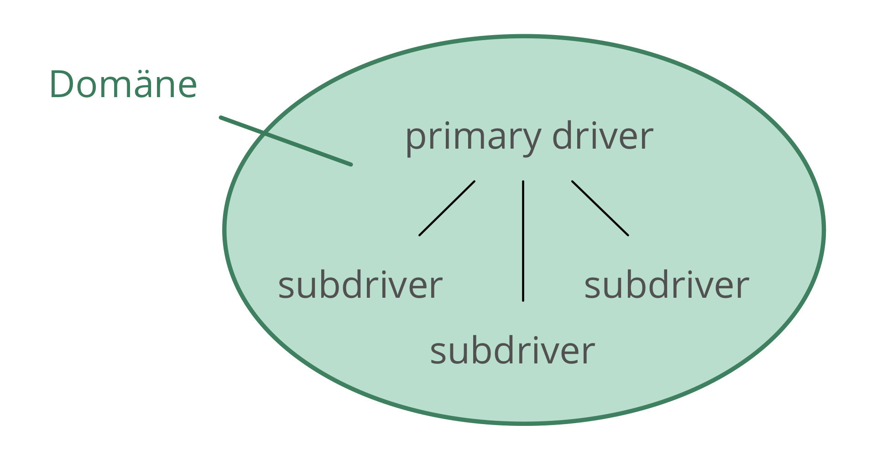
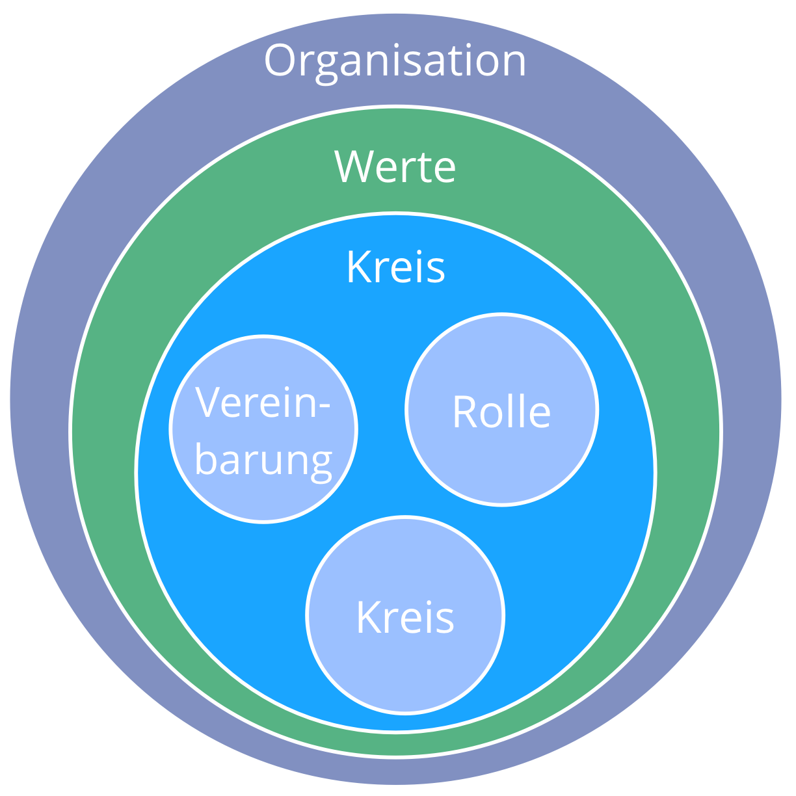
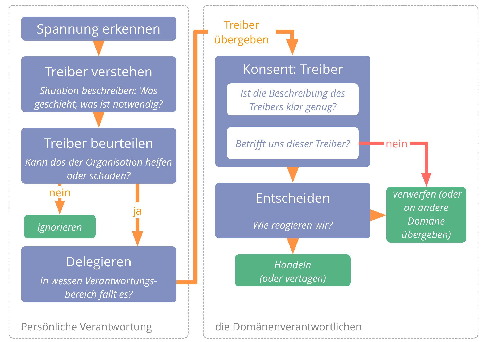
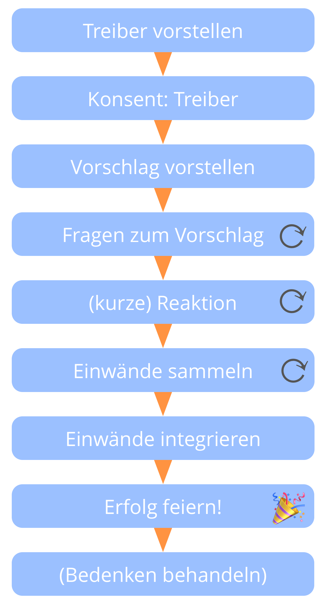
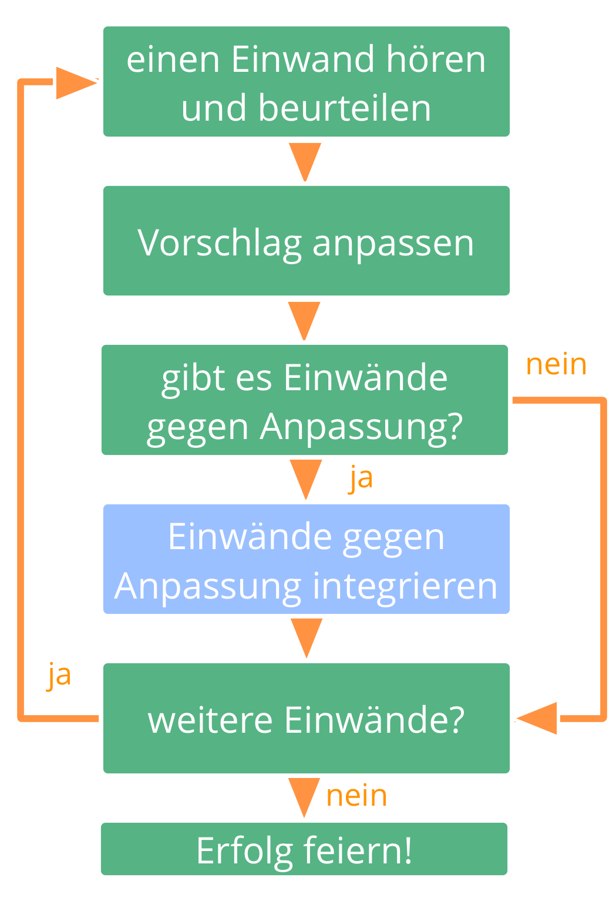
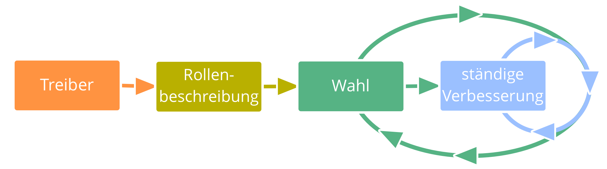
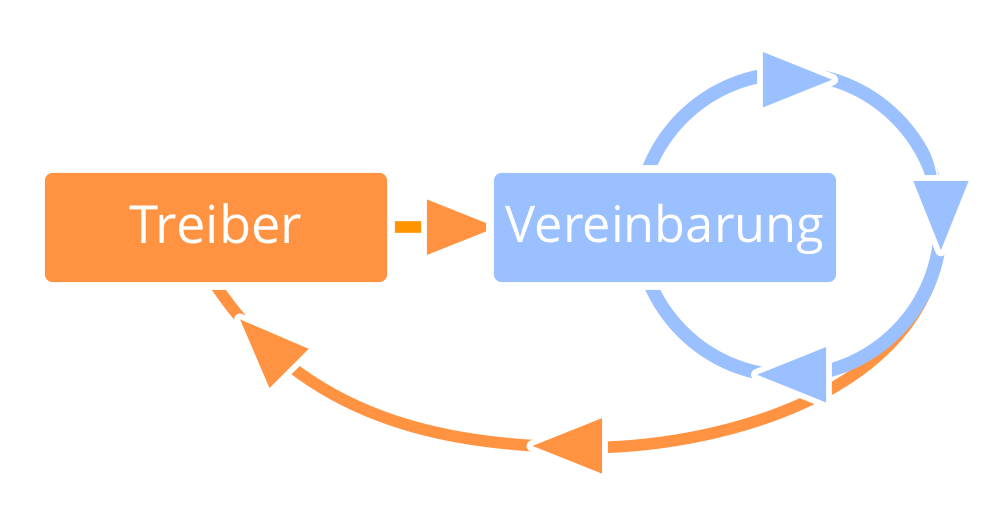
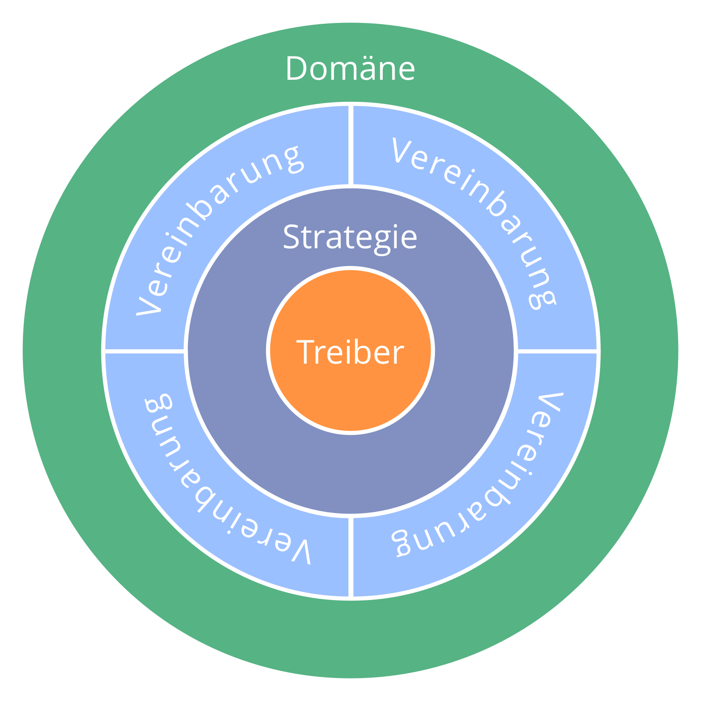

footer: ![] (img/by-sa-sm.png) B. Bockelbrink, J. Priest, L. David (de-v2018-01-08-rc3) - <http://sociocracy30.org>
slidenumbers: true
autoscale: true
theme: Plain Jane, 1

# [fit] Soziokratie 3.0

# Ein Praxisleitfaden

#### James Priest, Bernhard Bockelbrink, Liliana David

#### <http://sociocracy30.org>

---

# Soziokratie 3.0 - Ein Leitfaden zur Evolution agiler und resilienter Organisationen

### Effektive Zusammenarbeit in Organisationen beliebiger Größe

- **prinzipiengetrieben**: ein ganzheitlicher Weg zur Entwicklung einer agilen und soziokratischen Geisteshaltung 
- **flexibel**: unabhängige, sich gegenseitig verstärkende Muster, die Organisationen in allen Aspekten der Zusammenarbeit unterstützen, und die leicht an den eigenen Kontext angepasst werden können
- **kostenlos**:lizenziert unter einer Creative Commons Free Culture Lizenz

* * *

## Was habe ich davon?

Soziokratie 3.0 (oder kurz: "**S3**") bietet Dir eine umfangreiche Sammlung von Ideen und (Mustern), die sich in Organisationen als hilfreich erwiesen haben, um **Produktivität, Zusammenarbeit und Zufriedenheit zu verbessern**.

S3 unterstützt Dich dabei, herauszufinden, wie Du am besten Deine Ziele erreichst, und wie Du komplexe Herausforderungen meisterst, Schritt für Schritt, **und das ganz ohne Reorganisation oder groß angelegte Change-Initiativen**:

- Beginne dort, wo der Bedarf am größten ist, und wähle ein oder mehrere Muster für ein Experiment. **Bestimme selbst die passende Geschwindigkeit** und entwickle die erforderlichen Fähigkeiten unterwegs.

- Du wirst für **jede beliebige Position in der Organisation** Muster finden, die Dir weiterhelfen können.

* * *

## Inhalt

- eine kurze Einführung in die wesentlichen Konzepte, auf denen S3 basiert
- eine Beschreibung aller Muster in S3
- ein Anhang mit einer Änderungshistorie, Danksagungen, Info über die Autoren, einem Glossar und einem alphabetischen Verzeichnis der Muster

---

## Geschichte und Einflüsse

---

## Grundlegende Konzepte

Bevor Du in die Muster eintauchst, solltest Du Dich mit ein paar der wesentliche n Konzepte hinter S3 vertraut machen:

- Was ist ein Muster?
- Die sieben Prinzipien
- Treiber, Wert und Verschwendung
- Domänen, Delegation und Verantwortung
- Governance, Selbstorganisation und Teilautonomie

Im Anhang findest Du ein Glossar, das kurze Erklärungen dieser und weiterer Begriffe enthält.

---

## Muster

_Ein **Muster** ist eine Vorgehensweise, um einer bestimmten Herausforderungen erfolgreich zu begegnen._

- die Muster in S3 entstehen durch die Beobachtung vieler Organisationen bei der Lösung ihrer Probleme und dem Umgang mit ihren Herausforderungen
- die Muster können an den jeweiligen Kontext angepasst und dann weiterentwickelt werden
- die Muster sind thematisch in 10 Kategorien geordnet

---

## Alle Muster basieren auf den sieben Prinzipien

* * *

## Die sieben Prinzipien

**Effektivität:** *Investiere Zeit nur für das, was Dich dem Erreichen Deiner Ziele näher bringt.*

**Konsent:** *Tu etwas nur dann, wenn nichts dagegen spricht.*

**Empirismus:** *Überprüfe alle Annahmen durch Experiment, kontinuierliche Revision und Falsifikation.*

* * *

## Die Sieben Prinzipien (…)

**Kontinuierliche Verbesserung:** *Bevorzuge inkrementelle Veränderung, um stetiges empirisches Lernen zu ermöglichen.*

**Gleichstellung:** *Beziehe Menschen in die sie betreffenden Entscheidungsfindung und deren Entwicklung ein.*

**Transparenz:** *Mache alle Informationen für jeden in der Organisation zugänglich, es sei denn, es gibt einen wichtigen Grund für Vertraulichkeit.*

**Verantwortlichkeit:** *Handle, wenn es erforderlich ist; befolge, was Du vereinbart hast und behalte die gesamte Organisation im Blick.*

---

## Treiber

_Ein **Treiber** ist das Motiv einer Person oder Gruppe, in einer bestimmten Situation zu handeln._

Ein Treiber

- kann als Ausgangspunkt für Ziele, Vision oder "Bestimmung" dienen
- kann sich im Lauf der Zeit verändern

* * *

### Treiber: Wert und Verschwendung

_**Wert** ist die Bedeutung oder der Nutzen von etwas in Bezug  auf einen bestimmten Treiber_

_**Verschwendung** ist alles, was für die effektive Antwort auf einen Treiber nicht notwenig ist oder ihr sogar im Wege steht._

Über die Konzepte von Wert und Verschwendung können Organisationen, die Muster aus S3 verwenden, viele Praktiken und Ideen aus den Bereichen der**Lean Production** und der **lean Softwareentwicklung** nutzen, z.B.:

- Wertstromanalyse
- verschiedenster Strategien zur Vermeidung von Verschwendung
- die Kanban-Methode

---

## Domänen

_Eine **Domäne** ist ein eigener Arbeits-, Einfluss-  und Entscheidungsbereich innerhalb einer Organisation._

Alle Domänen befinden innerhalb der Domäne der Organisation, und können sich mit anderen Domänen überschneiden, oder auch vollständig in ihnen enthalten sein.

Domänen werden an Mitarbeiter delegiert (z.B. an eine Unit, eine Abteilung, ein Team oder eine Einzelperson), die dann - innerhalb der Grenzen des Autonomie- und Einflussbereiches dieser Domäne - dafür Verantwortung übernehmen.

* * *

## Domänen delegieren

Der letztendliche Verantwortung für eine Domäne verbleibt bei der delegierenden Person. Diese bestimmt:

- **Kernaufgaben** (die wesentlichen delegierten Arbeitsaufgaben und Entscheidungen)
- **Grenzen von Autonomie und Einfluss**, normalerweise in Bezug auf die Organisation selbst (z.B. Budget, Ressourcen, Delegationsstufe, Reporting)

* * *

## Treiber und Domänen

Eine Domäne kann in Bezug auf einen Organisationstreiber - den so genannten **Primärtreiber** - definiert werden: über die Menge der Subtreibern, deren Beantwortung Wert für die Organisation bezogen auf den Primärtreiber schafft

- **Hauptaufgaben**: direkt vom Primärtreiber abgeleitet
- **Einschränkungen**: bezogen auf die Organisation selbst

* * *

## Domänen und Verantwortlichkeit

- Verantwortlichkeit bezieht sich auf für alle Vereinbarungen, einschließlich Kreise, Rollen, und der Organisation selbst
- die primäre Verantwortlichkeit aller Mitarbeiter bezieht sich auf effektive Zusammenarbeit bei der Antwort auf Organisationstreiber
- Einzelpersonen und Gruppen sind jeweils verantwortlich für ihre Arbeit, und für ihre eigene Weiterentwicklung, die Organisation stellt die dafür erforderliche Unterstützung bereit
- jedes Mitglied einer Organisation ist verantwortlich dafür, seine Handlungen an den Werten der Organisation auszurichten

---

## Governance, Teilautonomie und Selbstorganisation

**Governance**: Fortwährend entscheiden, was zu tun ist, um Ziele zu erreichen, und Richtlinien festlegen, wie und wann Dinge getan werden.

**Selbststeuerung**: Eine Gruppe, sich innerhalb einer Grenzen einer Domäne selbst steuern (und führen).

**Selbstorganisation**: Menschen, die ihre Arbeit - innerhalb der durch Governance festgelegten Grenzen - selbst organisieren.

**Operatives Geschäft**: Mitarbeiter erledigen die anfallenden Arbeiten innerhalb des Rahmens, der durch Governance und Koordination gesetzt wurde

**Teilautonomie**: Die Autonomie der Mitarbeiter, innerhalb ihrer Domäne Wert zu schöpfen (begrenzt von den Einschränkungen der Domäne).

* * *

## Unterscheidung zwischen Governance und operativem Geschäft

Damit eine Organisation dazulernen kann und sich kontinuierlich verbessert, sollte sie alle wesentlichen Entscheidungen dokumentieren, prüfen und weiterentwickeln.

*Fragestellung: Profitiert etwas von einer Einzel- oder Gruppen-Entscheidung?*

- ja: Governance 
    - nicht von existierenden Vereinbarungen abgedeckt
    - muss vereinbart, entschieden, oder ergänzt werden
- nein: operatives Geschäft 
    - im Rahmen einer existierenden Vereinbarung (die Verantwortlichen können handeln)
    - muss erledigt werden

---

---

## Pattern 1.1: Auf Organisationstreiber reagieren

*Kläre, was geschieht und was der Bedarf der Organisation ist, und handle entsprechend.*

Antworten auf Treiber:

- Aktion
- Entscheidung (inkl. Delegation an Rollen, Kreise, Hilfsteams oder offene Domänen)

* * *

### Qualifiziere Organisationstreiber

Treiber, die in (direktem oder indirektem) Zusammenhang zum Primärtreiber der Organisation stehen, betrachtet man als **Organisationstreiber**. Andere Treiber fallen nicht in die Verantwortung (Domäne) der Organisation.

Eine einfache Möglichkeit, um organisatorische Treiber zu qualifizieren, ist die Frage:

*Würde eine Antwort auf diesen Treiber den Wertfluss bezogen auf einen bekannten Organisationstreiber verbessern? Kurz: Kann uns das helfen bzw. schaden?*

* * *

### Überprüfen von Treibern

Die Antwort auf einen Treiber ist üblicherweise ein Experiment, das über über längere Zeit in einem Lernprozess weiterentwickelt wird.

- Ist die Beschreibung der Situation immer noch zutreffend?
- Verbinden wir mit dieser Situation immer noch den gleichen Bedarf?
- Befindet sich der Treiber immer noch innerhalb unserer Domäne?
- Ist der Treiber immer noch relevant?

---

## Pattern 1.2: Navigiere nach Spannung

**Erkenne und beantworte Organisationstreiber.**

**Alle Mitarbeiter** richten ihre Aufmerksamkeit darauf, was der Organisation helfen oder schaden könnte, und suchen nach effektiven Antworten auf diese Treiber.

Eine **Spannung** ist eine persönliche Erfahrung: Ein Symptom von Unstimmigkeit zwischen persönlicher Wahrnehmung und Erwartung (oder Präferenz).

* * *

## Navigiere nach Spannung (…)

**Herausforderungen und Chancen** für eine Organisation können dadurch identifiziert werden, dass Mitarbeiter auf Spannungen aufmerksam werden.

Spüre Spannungen nach, und beschreibe, Situation und Bedarf, um **Treiber zu entdecken**. Manchmal zeigt diese Untersuchung auch Missverständnisse auf, wodurch sich die Spannung oft auflöst.

Die erkannten **Organisationstreiber** werden an die zuständige Domäne zur Bearbeitung weiter gereicht.

* * *

## Navigiere nach Spannung (…)

---

## Pattern 1.3: Treiber beschreiben

**Beschreibe Treiber, um sie zu verstehen, zu kommunizieren und sie im Gedächtnis zu behalten.**

Eine einfache Methode, einen Treiber zu beschreiben ist:

- eine kurze Beschreibung der Situation (Beobachtungen) 
- eine Beschreibung des Bedarfs (Defizit) der aus Sicht der Organisation aus dieser Situation heraus entsteht 

Bei Uneinigkeit über den Bedarf ist es oft hilfreich, spezifische Lösungsstrategien in der Treiberformulierung zu vermeiden.

* * *

> Beispiel einer Treiberbeschreibung:
> 
> *"Die Küche ist ein Durcheinander: Es gibt keine sauberen Tassen, das Waschbecken ist voller Geschirr und es ist unmöglich, sich schnell einen Kaffee holen und wieder an die Arbeit zu gehen. Wir müssen herausfinden, wie wir die Küche in einem brauchbaren Zustand halten können. "*

Die **Beschreibung eines Treibers** enthält gerade genug Informationen, um die Notwendigkeit einer Aktion oder einer Entscheidung zu kommunizieren. Weitere Details zum Treiber können in einem Anhang dokumentiert werden.

Ein Treiber kann - je nach Standpunkt - als Problem oder auch als Chance beschrieben werden.

---

## Pattern 1.4: Konsent-Entscheidung

**Ein (moderierter) Gruppenprozess zur Entscheidungsfindung.**

- sammle Einwände, und integriere das dahinterstehende Wissen, um Vorschläge und Vereinbarungen weiterzuentwickeln
- das Zurückhalten von Einwänden kann die Ziele einer Gruppe oder Organisation gefährden
- ungelöste Einwände verhindern, dass ein Vorschlag zu einer Vereinbarung wird
- Vorschläge müssen nur *gut und sicher genug* bis zum Termin der nächsten Überprüfung sein

* * *

### Impliziter Konsent-Vertrag

- Wenn es keine Einwände gegen eine Vereinbarung gibt, beabsichtige ich, diese Vereinbarung im Rahmen meiner Möglichkeiten umzusetzen.
- Ich stimme zu, Einwände einzubringen, sobald sie mir bewusst werden.

---

## Pattern 1.5: Einwand

_Ein **Einwand** ist ein Grund, weshalb etwas einer effektiven (oder effektiveren) Antwort auf einen Treiber im Weg steht._

Einwände enthalten Informationen, die darauf hindeuten:

- dass sicher (oder sehr wahrscheinlich) Schaden entstehen wird (der Vorschlag ist nicht sicher genug, um ihn auszuprobieren)
- dass man Vorschläge, Entscheidungen, bestehende Vereinbarungen oder Massnahmen signifikant verbessern kann

* * *

### Einwände qualifizieren

Es liegt in der Verantwortung des Einzelnen, mögliche Einwände zu erklären.

Die für die betreffende Aktion oder Entscheidung Verantwortlichen sind ebenfalls verantwortlich dafür, *Argumente zu bedenken und qualifizierte Einwände zu berücksichtigen*.

Das Zurückhalten von Einwänden kann die Fähigkeit von Personen, Gruppen oder der Organisation beeinträchtigen, auf Organisationstreiber zu reagieren.

Die Möglichkeit, * potentielle* Einwände jederzeit einbringen zu können bedeutet, dass Entscheidungen lediglich *gut genug für den Moment und sicher genug, um sie auszuprobieren * sein müssen.

* * *

### Einwände qualifizieren (…)

*Wie würde durch diese Entscheidung der Wertfluss (bezogen auf einen Organisationstreiber) behindert – oder eine Gelegenheit zur Verbesserung verpasst?*

Einwände verhindern …

- laufende und geplante Aktivitäten
- die Umsetzung von Entscheidungen
- das Weiterbestehen von Vereinbarungen ohne Überarbeitung
- das Vorschläge zu Vereinbarungen werden

* * *

### Einwände verstehen

Einige hilfreiche Fragen

- Inwiefern bezieht ich dieses Argument auf diesen Vorschlag bzw. diese Vereinbarung?
- Zeigt dieser Einwand auf, wie eine (vorgeschlagene oder bestehende) **Aktivität oder Vereinbarung …**: 
    - die Reaktion auf einen Organisationstreiber beeinträchtigt?
    - aktuell verbessert werden kann?
    - dem Beitrag eines Beteiligten im Weg steht?
    - im Widerspruch zu den Werten der Organisation steht?
    - als nicht ‘sicher genug’ anzusehen ist?

* * *

### Bedenken

Ein **Bedenken** ist die *Meinung*, dass eine Vereinbarung - auch wenn sie bereits als *gut und sicher genug* angesehen wird - weiter verbessert werden **könnte**.

Bedenken in der Konsensentscheidung:

- Bedenken können Änderungen der Vereinbarung bewirken (einschliesslich Kriterien und Häufigkeit der Evaluation) 
- Bedenken werden besprochen, wenn noch Zeit übrig ist, oder sie als wichtig eingeschätzt werden
- Bedenken werden protokolliert

Bei Unsicherheit darüber, ob ein Vorschlag sicher genug ist, können Bedenken als Einwände angemeldet werden, um das Risiko gemeinsam in der Gruppe abzuschätzen.

---

## Pattern 1.6: Einwände integrieren

* * *

### Eine Verfahren, um Einwände aufzulösen

---

## Pattern 1.7: Vereinbarungen prüfen

Die regelmässige Überprüfung aller Vereinbarungen ist essentiell für lernenden Organisation, um das Regelwerk fortwährend weiterzuentwickeln und obsolet gewordener Vereinbarungen («Verschwendung») zu eliminieren:

- Anpassung an sich verändernde Rahmenbedingungen
- Gelerntes integrieren 
    - *Wie hat uns diese Vereinbarung weitergeholfen?*
    - *Wie kann diese Vereinbarung verbessert werden?*
    - *Gibt es einen Grund, diese Vereinbarung nicht weiterzuführen?*

* * *

## Vereinbarungen prüfen (…)

- Vorbereitung
    
    - Termin für Überprüfung vereinbaren
    - Notwendige Informationen bereitstellen

- Folgeaktivität
    
    - Nächsten Überprüfungstermin vereinbaren
    - Dokumentation oder Benachrichtigung
    - Nachverfolgung von Aufgaben und Entscheidungen
    - Auswirkungen auf andere Vereinbarungen

* * *

## Vereinbarungen prüfen (…)

- Im einfachsten Fall beschränkt sich die Prüfung einer Vereinbarung darauf, festzustellen, dass sie weiterhin relevant ist und kein Einwand gegen das Weiterbestehen existiert. 
- Vereinbarungen werden häufig in *Steuerungsmeetings* überprüft. 
- Für manche Vereinbarungen ist es effektiver, einen eigenes Treffen für die Überprüfung einzuberufen. 
- Die Häufigkeit der Überprüfung wird nach Bedarf angepasst.
- Falls nötig, kann auch früher überprüft werden.
- Elemente dieses Prozesses können auch bei der Prüfung der Entscheidungen von Einzelpersonen angewendet werden.

---

## Pattern 1.8: die Betroffenen entscheiden

Involviere alle, die von einer Entscheidung betroffen sein werden, um Gleichstellung und Verantwortlichkeit sicher zu stellen. Vervollständige die Informationen, die zu dem Thema verfügbar sind.

Für grössere Gruppen:

- Moderiere einen mehrstufigen Prozess und bilde Gruppen, die Delegierte wählen
- Finde einen virtuellen, asynchronen, zeitlich gerahmten und gestuften Prozess

Erwäge, die Betroffenen auch bei Überprüfung und Weiterentwicklung der Entscheidungen miteinzubeziehen.

---

## Pattern 1.9: Proposal Forming

**Ein (moderiertes) Format zur gemeinsamen Gestaltung eines Vorschlags zur Antwort auf einen Treiber.**

- nutzt das kollektive Wissen und die Vielfalt der Perspektiven innerhalb einer Gruppe
- bezieht die gesamte Gruppe in die Gestaltung von Vereinbarungen mit ein
- fördert Verantwortlichkeit und Unterstützung der resultierenden Vereinbarung

Proposal forming kann auch von Einzelpersonen angewendet werden.

* * *

### Propsal Forming: Ablauf

- **Zustimmung zum Treiber**: *Ist dieser Treiber für uns relevant? Ist die Beschreibung von Situation und Bedarf treffend?*
- **Gemeinsames Verständnis des Treibers vertiefen**: Eine Einladung Fragen zu stellen, um mehr über den Treiber zu erfahren.
- **Überlegungen sammeln**, formuliert als Fragen in Bezug auf mögliche Lösungen. Diese Fragen deuten entweder auf Einschränkungen (Informationsfragen) oder Möglichkeiten (generative Fragen) hin.
- **Beantwortung** der Informationsfragen (soweit möglich)
- Überlegungen **priorisieren**
- **Ideen sammeln** als mögliche Bestandteile eines Vorschlags
- **Formulieren eines Vorschlags** zur Antwort auf den Treibers, unter Berücksichtigung der gesammelten Ideen und Informationen. Dieser Schritt erfolgt typischerweise in einer kleineren Gruppe von "Gestaltern".

* * *

### Gestalter aussuchen

- wer sollte dabei sein?
- wer will dabei sein?
- wer könne noch einen wertvollen Beitrag leisten?
- berücksichtige Expertise, besondere Perspektiven und Inspiration
- gibt es Einwände gegen diese Gestalter?

---

## Pattern 1.10: Wahl

**Ein Gruppenprozess für die Auswahl von Personen für Rollen.**

- Vermeide es, im Voraus Interesse an einer Rolle zu bekunden.
- Nominierungen werden aufgrund der Qualität der gehörten Argumente vorgenommen, nicht nach Mehrheiten.
- Jeder kann sich selbst nominieren, oder auch passen.
- Die nominierte Person wird immer zuletzt nach Einwänden gefragt.

Einwände gegen eine Nominierung können auf verschiedene Arten aufgelöst werden, z.B. durch Anpassung der Rollenbeschreibung oder durch Nominierung einer anderen Person.

**Hinweis:** Dieses Muster kann auch für die Auswahl zwischen mehreren Optionen verwendet werden.

---

## Pattern 1.11: Driver Mapping

Ein Workshop-Format um einer komplexen Situation effektiv zu begegnen: Unternehmensgründung, Projektbeginn, Umgang mit Hindernissen oder Chancen, oder die Ausrichtung der Organisationsstruktur am Wertfluss.

Kleine oder grosse Gruppen identifizieren und priorisieren Treiber, um in selbstorganisierenden Teams schnell vom Konzept zur Umsetzung zu gelangen.

* * *

## Driver Mapping (Fortsetzung)

* * *

### Driver Mapping: Vorlage für Domänen

---

---

## Pattern 2.1: Um Hilfe bitten

**Ein einfaches Protokoll, das Lernen, die Vermittlung von Fähigkeiten und den Aufbau von Beziehungen ermöglicht, und dabei die Autonomie des Einzelnen zu respektieren.**

Frage einen Kollegen, "*Wärest Du bereit, mir mit … zu helfen*?" Die Gefragte antwortet nur mit einem einfachen "*ja*" or "*nein*".

- wenn die Bitte abgelehnt wird, akzeptiert der Fragende das ohne Nachfrage oder gar Verhandlungen
- erscheint der Gefragten die Bitte unklar, bittet sie um weitere Informationen
- wenn Du eine Bitte um Hilfe annimmst, unterstütze deinen Kollegen, so gut du es dir dieser Situation möglich ist

---

## Pattern 2.2: Peer-Feedback

Lade einen Kollegen ein, dir konstruktives Feedback zu geben über:

- der Art und Weise, wie Du eine Rolle ausfüllst
- genererelles Feedback über deine Teilnahme in der Organisation, und deine Zusammenarbeit mit anderen
- weitere spezielle Aspekte, die dich interessieren

Bedenke

- gib dem Kollegen Zeit, sich auf das Gespräch vorzubereiten
- frage sowohl nach **Würdigungen** als auch nach **konstruktiven, handlungsorientierten Verbesserungsvorschlägen**
- frage nach, um das Feedback besser zu verstehen, aber vermeide Diskussion oder Bewertung
- entscheide nach dem Gespräch selbst, wie du mit dem Feedback umgehst

---

## Pattern 2.3: Entwicklungsgespräch

**Kollegen unterstützen sich gegenseitig dabei, sich in ihren Rollen und Gruppen zu weiterzuentwickeln.**

Der Rolleninhaber - oder die sich entwickelnde Gruppe - führt im Entwicklungsgespräch, indem sie den Prozess initiiert, und jeden Prozessschritt beginnt.

Stelle sicher, dass die eingeladenen Teilnehmer mit unterschiedlichen Perspektiven beitragen, und dass das Gespräch moderiert wird.

Verbesserungsvorschläge können sich auf persönliche Entwicklung, Zusammenarbeit, Strategie oder Anpassungen der Domänen-Beschreibung (inkl. Treiber) beziehen.

* * *

## Entwicklungsgespräch (…)

### Kontinuierliche Verbesserung der Fähigkeit, eine Rolle auszufüllen oder in Gruppen zusammenzuarbeiten.

---

## Pattern 2.4: Entwicklungsplan

**Ein Plan, um sich effektiver um eine Domäne zu kümmern, der von Delegierenden und Beauftragten vereinbart wird. **

Der Entwicklungsplan kann für einen Mitarbeiter in einer Rolle oder für eine Gruppe (z.B. eine Abteilung, ein Kreis, ein Team oder eine offene Domäne) erstellt werden.

Die Entwicklung kann sich auf eine Klarstellung von Treiber oder Domäne beziehen, auf eine Anpassung der Strategie, auf neue oder veränderte Vereinbarung, und auf konkrete Aufgaben für die Beauftragten oder auch für die Delegierenden.

Der Vorschlag für einen Entwicklungsplan wird, zusammen mit Empfehlungen für die Anpassung der Domäne, den Delegierenden vorgelegt, damit diese Einwände und Bedenken anmelden können.

* * *

---

---

## Pattern 3.1: Kunstvolle Teilnahme

Eine **Selbstverpflichtung** zur Entwicklung effektiver Zusammenarbeit und hilfreicher Interaktionen:

- proaktiv **Vereinbarungen berücksichtigen und umsetzen**, so gut es unter den aktuellen Bedingungen möglich ist
- **Bewusustesin und Verständnis ** individueller und kollektiver Bedürfnisse entwickeln
- die **notwendigen Fähigkeiten entwickeln**
- **andere dabei unterstützen** 
- wenn nötig, andere auf Hindernisse aufmerksam zu machen

Kunstvolle Teilnahme kann auch bedeuten, andere zu unterbrechen, Einwände zu erheben oder Vereinbarungen zu brechen.

* * *

### Vorteile der kunstvollen Teilnahme

- ermöglicht Mitgestaltung und Entwicklung von Vereinbarungen
- hilft Teams dabei, stärker zu werden
- fördert Selbstverantwortung, Integrität und Vertrauen
- unterstützt eine Kultur der gegenseitigen Unterstützung und der engen Zusammenarbeit
- die Wirkung wird verstärkt, wenn sich mehrere Mitarbeiter zur kunstvollen Teilnahme entschliessen

* * *

### Kuntvolle Teilnahme: Selbsteinschätzung

- Wie kann ich mich und andere darin unterstützen, kunstvoller teilzunehmen? 
- Welche meiner Interaktionen sind hinderlich oder ineffektiv?
- Welche Vereinbarungen finde ich schwierig einzuhalten oder mitzugestalten? Was kann ich dagegen tun?
- Welche Fähigkeiten könnte ich entwickeln um meine Kunstvolle Teilnahme zu unterstützen?
- Was würde Kunstvolle Teilnahme bedeuten in Bezug auf … 
    - meine Alltagsaktivitäten?
    - meine Zusammenarbeit und Interaktion mit Anderen?
    - die Organisation? Unsere Kunden?
    - das weitere Umfeld?

---

## Pattern 3.2: Die Sieben Prinzipien leben

* * *

## Wende die Sieben Prinzipien an (Fortsetzung)

- Richte die Zusammenarbeit an den Sieben Prinzipien aus
- Die Aneignung der Sieben Prinzipien vermindert das Bedürfnis nach expliziten Vereinbarungen und lenkt die Anpassung von S3-Mustern an das betriebliche Umfeld
- Die Werte einer Organisation müssen mit den Sieben Prinzipien von Sociocracy 3.0 übereinstimmen

---

## Pattern 3.3: Gemeinsame Werte

**Gestalte bewusst die Kultur der Organisation.**

*Ein **Wert** ist ein Verhalten steuerndes Prinzip. Werte definieren den Handlungsraum und ethische Bedingungen.*

- Jedes Mitglied bringt die Werte seiner Erfahrungen und Überzeugungen in die Organisation ein
- Eine Gruppe oder Organisation kann sich **auf gemeinsame Werte festlegen,** an welchen sich ihre Zusammenarbeit ausrichten soll

* * *

## Gemeinsame Werte (Fortsetzung)

- Werte bieten Anleitung in der Wahl angemessenen Handelns wo explizite Vereinbarungen fehlen
- Gemeinsame Werte festzulegen ist eine **Strategie** zur Unterstützung der Effektivität einer Organisation: 
    - Weniger Potential für **Missverständnisse**
    - Gemeinsame **Ausrichtung** von Entscheidungsfindung und Handeln
    - **Anziehung neuer Mitglieder, Partner und Kunden<0>, welche mit den Werten der Organisation übereinstimmen</li> </ul></li> 
        
        - Gemeinsame Werte sind eine Vereinbarung und somit Gegenstand **regelmässiger Überprüfung**</ul>

---

## Pattern 3.4: Governance-Moderator (Rolle)

Ein Governance-Moderator …

- ist verantwortlich für die Sicherstellung moderierter Governance-Meetings, dass diese auf Kurs bleiben und ausgewertet werden
- wird (üblicherweise) von einer Gruppe unter ihren Mitgliedern ausgewählt
- macht sich mit dem Governance-Backlog vertraut
- lädt oft Andere dazu ein, einzelne Tagesordnungspunkte zu moderieren

* * *

## Governance-Moderator (Fortsetzung)

Wenn S3 für Governance verwendet wird, macht sich der Moderator mit folgenden Patterns vertraut:

- Runden
- Proposal-Forming
- Konsententscheidung
- Rollenbesetzung
- Meetings evaluieren
- Einwände integrieren
- Entwicklungsgespräche

---

## Pattern 3.5: Vereinbarungen brechen

- Ist manchmal **notwendig** …
- … kann die Gemeinschaft aber **teuer** zu stehen kommen
- Sei verantwortungsvoll! 
    - **Räume** entstandene Unordnung auf
    - **Kläre die Situation** bei nächster Gelegenheit mit Betroffenen und Zuständigen
    - **Veranlasse Änderungen**, anstatt dieselbe Vereinbarung wiederholt zu brechen

---

## Pattern 3.6: Verantwortung und Verträge

Beim Eingehen formeller oder informeller Vereinbarungen mit Anderen:

- Sicherstellen, dass alle Seiten die Erwartungen kennen und beabsichtigen, die Vereinbarung einzuhalten
- Vereinbarungen treffen, die für alle Beteiligten vorteilhaft und realistisch einhaltbar sind

Übernimm die Verantwortung, wenn Du Vereinbarungen brichst.

* * *

## Verantwortung und Verträge (Fortsetzung)

Pflege Selbstverantwortung zum Schutz der Organisationskultur und helfe neuen Mitgliedern, sich darin einzufinden:

- Lege Erwartungen an neue Mitglieder fest (sowohl kulturelles Zusammenpassen als auch erforderliche Fähigkeiten)
- Der Vertrag muss die Organisationskultur ebenso wie die gesetzlichen Anforderungen berücksichtigen
- Erwäge eine Probezeit
- Kläre die Abläufe bei Vertragsverletzungen im Voraus

---

## Pattern 3.7: Gehaltstransparenz

- Transparente Gehälter müssen gerecht sein
- Gerechtigkeit hat mehrere orthogonale Dimensionen 
- Die Wahrnehmung von Gerechtigkeit hängt vom spezifischen organisatorischen Kontext ab
- Mitglieder und relevante Anspruchsgruppen (z.B. Investoren) sollten dabei berücksichtigt werden
- Eine Gehaltsformel erstellen 
    - Fester Anteil: Sicherstellung des Lebensunterhalts
    - Variabler Anteil: Gerechte Aufteilung von Gewinnen und Verlusten
- Vergütung für sich ändernde Rollen berücksichtigen
- Strategie für Übergang zu neuen Verträgen und Kompensations-Vereinbarungen planen

* * *

### Zwei Arten, Gehälter transparent zu machen

---

## Pattern 3.8: Hilfsrolle

**Wende das Rollen-Pattern auf externe Vertragspartner an.**

- Kläre und beschreibe den Treiber für die Rolle
- Erstelle eine Domänenbeschreibung
- Führe eine Wahl zur Besetzung der Rolle durch
- Beschränke die Vertragslaufzeit
- Plane regelmässige Entwicklungsgespräche ein

Hilfsrollen können auch rein operativen Charakter haben. Externe Vertragspartner geben Ihren Konsent, die Verantwortung für Ihre Rolle zu übernehmen.

---

## Pattern 3.9: Statuten

Verankere S3-Prinzipien und Pattern in Deinen Statuten, um **Rechtssicherheit** und **Organisationskultur** zu sichern

Möglichkeiten:

- Konsent und Äquivalenz in der Entscheidungsfindung
- Wahlverfahren für Führungsrollen
- Organisationsstruktur, Werte und Prinzipien
- Einfluss von Inhabern oder Aktionären
- Verteilung von Gewinnen und Verlusten

---

---

## Pattern 4.1: Einfluss delegieren

Dezentralisiere Macht in klar definierten Grenzen. Befähige Mitarbeiter, bei der Reaktion auf Organisationstreiber selbst zu entscheiden und zu handeln.

Die Delegierende unterstützt die Wertschöpfung der Mitarbeiter durch:

- klare Definition des Verantwortungs- und Autonomiebereichs
- Gewährleistung von fortwährendem Lernen und Weiterentwicklung
- weitere Unterstützung nach Bedarf

Korrigiere Rahmenbedingungen schrittweise, berücksichtige dabei Fähigkeit, Zuverlässigkeit und erzielte Ergebnisse.

Dezentralisiere so weit wie möglich, behalte so viel Einfluss wie nötig.

---

## Pattern 4.2: Kreis

_Ein **Kreis** ist eine teilautonome und selbststeuernde Gruppe gleichgestellter Personen, die gemeinsam eine Domäne verantworten._

Ein Kreis …

- kann andauernd oder zeitlich begrenzt bestehen
- kann selbstorganisierend sein
- ist selbst für seine Entwicklung und seine Vereinbarungen verantwortlich

* * *

## Kreis (…)

- **teilautonom** 
    - ein Kreis agiert innerhalb der Grenzen seiner Domäne
    - Jeder Kreis kann selbstständig Wert schaffen
- **selbstverwaltet**: 
    - einen Kreis entscheidet fortwährend, wie er in seiner Domäne Wert schöpft, und definiert inhaltliche und zeitliche Rahmenbedingungen für die zu erledigende Arbeit.

---

## Pattern 4.3: Rolle

**Delegation von Verantwortung einer Domäne an Personen.**

Eine Rolle deckt einen Verantwortungsbereich einer Domäne ab und wird an eine Person (den **Rollen-Inhaber**) gebunden, die die Autonomie für Entscheidungen und Aktionen hat, solange die Rahmenbedingungen der Rollen-Domäne nicht verletzt werden.

Der Rollen-Inhaber ist zuständig für das Erstellen der Strategie, um den Auftrag der Domäne zu erfüllen oder um die Domäne weiterzuentwickeln, falls Einsprüche von einem Stellvertreter kommen.

Eine Rolle ist ein einfacher Weg für eine Gruppe, um wiederkehrende Aufgaben in einem bestimmten Arbeitsbereich, an eine Person der Gruppe zu delegieren.

* * *

## Rolle (Forts.)

- Personen können in mehr als einer Rolle sein und Rollen können von mehreren Personen ausgeführt werden
- Personen die eine Rolle inne haben, werden durch Konsent und für eine bestimmte Dauer gewählt
- Kollegen unterstützen sich gegenseitig, um sich in der Rolle weiterzuentwickeln

Der Inhaber einer Rolle kann ein Logbuch und ein Steuerungs-Backlog führen, um seinen System zur Wertschöpfung zu entwickeln. 

**Anmerkung**: Richtlinien, Prozesse oder Protokolle, die von Mitarbeitern in Rollen erstellt und entwickelt werden, können wie Vereinbarungen behandelt werden.

* * *

### Rollen: Eine Möglichkeit, um Domänen zu verantworten

---

## Pattern 4.4: Verbindungen

**Ermögliche den Fluss von Information und Einfluss zwischen zwei Gruppen.**

Eine Gruppe wählt eines seiner Mitglieder, um ihre Interessen in den Steuerungsentscheidungen einer anderen Gruppe zu vertreten.

---

## Pattern 4.5: Doppelte Verbindung

**Ermögliche *bidirektionalen* Fluss von Information und Einfluss zwischen zwei Gruppen.**

Zwei voneinander abhängige Gruppen wählen jeweils eines ihrer Mitglieder, um ihre jeweiligen Interessen in der anderen Gruppe zu vertreten, um Entscheidungen zu treffen.

- Unterstützt Gleichstellung über Gruppengrenzen hinweg
- Kann in hierarchischen Strukturen helfen, wertvolle Informationen ans Licht zu bringen

---

## Pattern 4.6: Repräsentanten (Rolle)

Repräsentanten (auch: Delegierte oder Vertreter) …

- vertreten die Interessen einer Gruppe in einer anderen Gruppe
- werden für eine beschränkte Amtszeit gewählt
- nehmen als vollwertige Mitglieder an den **Steuerungsentscheidungen** des Kreises, in welchen sie delegiert wurden teil und können: 
    - Agendapunkte vorschlagen
    - an der Ausarbeitung von Vorschlägen mitwirken
    - (begründete) Einwände gegen Vereinbarungen oder Vorschläge erheben

---

## Pattern 4.7: Hilfsteam

Arbeit wird an eine Gruppe von Personen, dem Hilfsteam, delegiert.

Ein Hilfsteam:

- dient dem Delegierenden, um die eigene Kapazität zu vergrössern
- kann selbstorganisiert sein oder durch einen Koordinator, eingesetzt durch den Delegierenden, gesteuert werden
- richtet sich bezüglich Entscheidungen nach dem Delegierenden
- profitiert von einer klar definierten Domäne

Mitglieder eines Hilfsteams:

- können Einsprachen erheben gegenüber den Entscheidungen des Delegierende, falls sie direkt betroffen sind
- können Einträge in den Entscheidungs-Backlog des Delegators machen
- können eingeladen werden einen Stellvertreter in die Entscheidungsmeetings des Delegators zu schicken

---

## Pattern 4.8: Offene Domäne

**Eine Möglichkeit bewusst Verantwortung für eine Domäne zu übernehmen durch Einladung statt Zuweisung.**

Die Delegierende der Domäne definiert

- Primärtreiber, Hauptaufgaben und Rahmenbedingungen der offenen Domäne
- wer an der Bestellung der offenen Domäne mitwirken kann
- Einschränkungen in Bezug auf die Teilhabe der Delegierenden an den Steuerungsentscheidungen der Domäne

Die Delegierende der offenen Domäne ist verantwortlich dafür, dass regelmäßige Reviews stattfinden.

Abhängig von den von der Delegierenden gesetzten Rahmenbedingungen, beteiligen sich die Mitwirkenden an Arbeit, Koordination und/oder Steuerung der offenen Domäne.

---

## Pattern 4.9: offene Systeme

Eine Organisation kann davon profitieren, wenn bewusst kommuniziert wird und durch das Lernen von anderen.

Eine Organisation kann durch Anerkennung von gegenseitiger Abhängigkeit bewusst **Information von aussen, Einfluss oder Kompetenzen** annehmen, um Hilfe für Entscheidungen zu erhalten oder ein gemeinsames Lernen zu unterstützen.

* * *

## Offene Systeme (…)

- **Externe Experten** bieten zusätzliche Perspektive und bringen Wissen, Verständnis und Fähigkeiten
- **Vertreter von betroffenen Parteien** können zu Verständnis und Entscheidungsfindung beitragen, so dass auch die Organisation in Bezug auf ihre Ziele davon profitieren kann (siehe Muster: "Die Betroffenen entscheiden")

---

---

## Pattern 5.1: Patterns an Kontext anpassen

**Verändere und entwickle S3 Muster, so dass sie zu Deinem speziellen Kontext passen**

- stelle sicher, jeder von der Anpassung Betroffene … 
    - versteht warum es notwendig ist, das Pattern anzupassen
    - und dabei einbezogen oder repräsentiert wurde
- nutze die sieben Prinzipien als Anhaltspunkte für die Anpassung
- experimentiere mit jeder Veränderung lange genug, um Vorteile und mögliche Fallstricke herauszufinden
- teile wertvolle Anpassungen mit der S3 Community

---

## Pattern 5.2: Ein Pull-System für Organisationsentwicklung schaffen

**Gestalte eine Umgebung, die Mitglieder der Organisation dazu einlädt und befähigt, den Wandel selbst voran zu treiben:**

Veränderungen die Wert schaffen:

- Patterns einsetzen, die aktuelle, und wichtige Probleme lösen 
  - … ohne das zu beeinträchtigen, was bereits funktioniert
  - hole allen Beteiligten dort ab, wo sie stehen…
  - … und lasse sie gemeinsam ihr eigenes Tempo wählen
- jede Veränderung sollte auf Freiwilligkeit basieren

---

## Pattern 5.3: Als Beispiel dienen

**Führe als Vorbild.**

Verhalte dich so wie du möchtest dass andere sich verhalten.

---

## Pattern 5.4: Zu Veränderung einladen

**Ein Ansatz für einzelne Personen, um Wandel auszulösen und zu begleiten.**

- Sei der Wandel, den Du sehen möchtest
- Verwende S3-Pattern und passe sie an, wann immer das nützlich erscheint
- Erzähle darüber, wie und warum Du S3-Pattern verwendest, und erkläre Ergebnisse, Erfolge und Scheitern
- Lade andere dazu ein, mit Dir zu experimentieren

---

## Pattern 5.5: S3 per Open-Space

**Lade alle Mitarbeiter ein, sich Experimente für den Wandel zu überlegen und diese durchzuführen.**

- Beschreibe den Treiber dafür, S3-Muster in der Organisation zu verwenden
- Plane regelmässige Open-Space-Veranstaltungen ein: 
    - Lade alle Mitglieder dazu ein, Experimente zu planen und durchzuführen
    - lege die Rahmenbedingungen für Experimente fest (z. B. die Prinzipien von S3)
    - Überprüfe die Ergebnisse der Experimente beim nächsten Open-Space und lerne daraus
    - gestalte neue Experimente

---

## Pattern 5.6: Ständige Verbesserung des Arbeitsablaufes mit S3

**Entdecke Treiber und etabliere ein Metrik-basiertes Pull-System für Veränderungen in der Organisation.**

- führe für ein Team das Konsent-Prinzip die *Steuerung nach Spannung* ein, so dass das Team seine Arbeitsabläufe selbst verbessern kann
- erwäge die Einigung auf Werte und die Wahl eines Moderators 
- stosse kontinuierliche Verbesserung an (z.B. mit Kanban)
- Teammitglieder ziehen nach Bedarf S3 Patterns heran
- erweitere schrittweise den Bereich des Experiments
- suche bewusst nach Hindernissen 

* * *

### Verschwendung und kontinuierliche Verbesserung

**Verschwendung** *ist alles, was für die effektive Antwort auf einen Treiber nicht notwenig ist oder ihr sogar im Wege steht.*

- Verschwendung existiert in verschiedenen Formen und auf unterschiedlichen Abstraktionsebenen (Aufgaben, Abläufe, Organisationsstruktur, Denkmodelle…)
- Eine Vorgehensweise zur ständigen Verringerung von Verschwendung bewirkt eine natürliche Entwicklung einer Organisation hin zu größerer Effektivität
- Anpassung an ein sich veränderndes Umfeld passiert dabei ganz automatisch

---

---

### S3 fördert einen hypothesengetriebenen Ansatz zur Entscheidungsfindung

* * *

### Lebenszyklus von Vereinbarungen

---

## Pattern 6.1: Vereinbarung

_Eine **Vereinbarung** ist eine (gemeinsam) beschlossene Richtline, oder ein Prozess oder Protokoll, um den Wertfluss in der Organisation zu gestalten._

- Vereinbarungen beziehen sich auf Treiber 
- die Personen, die eine Vereinbarungen treffen, sind auch für diese Entscheidung verantwortlich
- Vereinbarungen werden **regelmässig geprüft**

**Anmerkung**: Richtlinien, Prozesse oder Protokolle, die von Mitarbeitern in Rollen erstellt und entwickelt werden, können wie Vereinbarungen behandelt werden.

* * *

### Vorlage für Vereinbarungen

---

## Pattern 6.2: Develop Strategy

_Eine **Strategie** ist der Ansatz, wie Mitarbeiter planen, in einer bestimmten Domäne Wert zu schöpfen._

- die Strategie wird jeweils von der Organisation, Gruppe bzw. dem Mitarbeiter in der Rolle selbst erarbeitet
- eine Strategie enthält typischerweise eine Beschreibung des angestrebten Ergebnisses
- da die Delegierende weiterhin für die Domäne verantwortlich bleibt, ist es hilfreich, wenn sie die Strategie prüft, potenzielle Hindernisse identifiziert und Verbesserungen vorschlägt 
- die Strategie ist eine Vereinbarung zwischen Delegierender und Domänenverantworliche(n) dar, die regelmäßig geprüft und angepasst werden sollte

* * *

## Strategie (…)

### Strategien werden in Experimenten und Lernschritten umgesetzt und verfeinert.

---

## Pattern 6.3: Domänen klären

Ein klares Verständnis der jeweiligen Verantwortungs- und Autonomiebereiche fördert Effizienz, effektive Zusammenarbeit und Agilität in der gesamten Organisation.

Eine einfache Möglichkeit, Domains zu klären ist mit einer **Domänenbeschreibung**, die folgendes enthält:

- Primärteiber
- Kernaufgaben
- Grenzen
- Bewertungskriterien für Entwicklungsgespräche
- Amtszeit (einer Rolle)
- (vorherige Versionen der Domänenbeschreibung)

* * *

## Domänen klären (…)

Domänenbeschreibungen können für eine Rollen, Positionen, Kreise, Teams, offene Domänen, Abteilungen, Geschäftseinheiten oder auch für die gesamte Organisation erstellt werden.

Je nach Bedarf kann man zuerst existierende Domänen klären, oder nur die neu geschaffenen.

---

## Pattern 6.4: Angestrebtes Ergebnis

- Eine knappe Beschreibung des erwarteten Ergebnisses einer Vereinbarung, Handlung, Strategie oder eines Projekts
- Spezifische *Evaluationskriterien* und Metriken können bei der Überprüfung der Ergebnisse hilfreich sein

---

## Pattern 6.5: Leistungen definieren

Eine **Leistung** wird als Ergebnis einer Vereinbarung in Reaktion auf einen Treiber angeboten. Leistungen umfassen Produkte, Materialien, Dienstleistungen, Erfahrungen und Transformationen.

Im Kontext einer Vereinbarung unterstützt die klare Definition von Leistungen das gemeinsame Verständnis:

- Beschreibe genügend detailliert
- Beziehe Dich auf andere Dokumente wo hilfreich oder notwendig

* * *

## Leistungen definieren (…)

Leistungen explizit zu definieren kann hilfreich sein zur Verbesserung von:

- Strategie der Organisation
- Strategie eines Kreises
- Entwicklungspläne
- Domänenbeschreibungen
- jeder anderen Vereinbarung (bspw. wirtschaftliche Ziele, Prozesse, Kundenkommunikation)

---

## Pattern 6.6: Evaluationskriterien

Klar definierte Evaluationskriterien können unterstüzen das gemeinsame Verständnis, ob eine Vereinbarung die erwünschten Ergebnisse gebracht hat.

- Wähle **einfache und eindeutige** Kriterien und dokumentiere sie (um Diskussionen bei der Überprüfung zu vermeiden)
- Definiere **handlungsorientierte Metriken** um Ergebnisse laufend verfolgen und abweichungen von beabsichtigten Ergebnissen erkennen zu können

---

## Pattern 6.7: Logbuch

Ein Logbuch ist ein (digitales) System zur Speicherung aller für den Betrieb einer Organisation und ihrer Teams relevanten Informationen. Das Logbuch ist allen Mitgliedern einer Organisation zugänglich; bestimmte Informationen werden nur dann vertraulich behandelt, wenn dafür ein guter Grund besteht.

Verbreitete Plattformen für Logbücher sind Wikis (wie DokuWiki oder MediaWiki), Content-Management-Systeme (z.B. WordPress), G Suite, Evernote oder Trello.

* * *

### Inhalt des Logbuchs

- Organisation:
    
    - Primärere Treiber, Strategie und Werte der Organisation
    - Organisationsstruktur (Domänen und Verbindungen)
    - Vereinbarungen 

- Kreis:
    
    - Kreisbeschreibung und Strategie
    - Vereinbarungen (einschließlich Beschreibung, Strategien und Entwicklungspläne der Subdomänen)
    - Rückstände und sonstige Informationen zur Kreisarbeit und -steuerung

* * *

### Inhalt des Logbuchs (…)

- Persönliche Logbücher 
    - Domänenbeschreibungen, Strategien und Entwicklungspläne
    - Steuerungs- und operative Backlogs für Rollen
    - Entscheidungen bezogen auf die Wertschöpfung in Rollen

---

## Pattern 6.8: Logbuchführer (Rolle)

Der Logbuchführer ist verantwortlich für die Pflege des Logbuchs des Kreises:

- Aufzeichnung von Details zu Vereinbarungen, Domänenbeschreibungen, Wahlen, Evalutionstermine, Sitzungsprotokolle etc.
- Organisation relevanter Informationen, und Verbesserung des Logbuch-Systems
- das Logbuch auf aktuellem Stand halten
- Zugang der Kreismitglieder (und der Gesamtorganisation, je nach Vereinbarung) zum Logbuch sicherstellen
- alle technischen Aspekte der Logbuchführung betreuen

---

---

## Pattern 7.1: Steuerungs-Meeting

Gruppen treffen sich in regelmäßigen Abständen um zu entscheiden, wie sie vorgehen, um ihre Ziele erreichen, und um inhaltliche und zeitliche und Rahmenbedingung für ihre Arbeit zu festzulegen.

Typische Merkmale eines Steuerungstreffen:

- moderiert 
- vorbereitet 
- zeitlich beschränkt (üblicherweise zwischen 90-120 Minuten)
- findet alle 4 Wochen statt

* * *

## Steuerungs-Meeting (…)

Ablauf eines typischen Steuerungstreffen:

- Eröffnungsrunde: einstimmen aufeinander, und auf die Ziele (bzw. den Treiber) der Gruppe
- Organisatorisches 
    - Konsent zum letzten Protokoll, Datum des nächsten Treffens etc.
    - Last-Minute-Agendapunkte, und Konsent zur Agenda
- Agendapunkte abarbeiten 
- Treffen evaluieren: Reflektion der Interaktionen, Erfolge zelebrieren, Verbesserungsvorschläge überlegen
- Abschluss

* * *

## Steuerungs-Meeting (…)

Typische Agendapunkte:

- kurze Berichte 
- Evaluation von Vereinbarungen
- neue Treiber, die Entscheidungen erfordern 
    - gemeinsam Situationen verstehen, die eine Reaktion erfordern 
    - Vorschläge erarbeiten und Vereinbarungen treffen 
    - neue Rollen und Gruppen schaffen 
    - existierende Rollen und Teams evaluieren
    - Personen in Rollen wählen

---

## Pattern 7.2: Retrospektive

Kontinuierliche Verbesserung der Arbeitsabläufe durch Reflexion und Lernen aus der Vergangenheit

- Ergebnis: Änderungen am Arbeitsprzess, neue Aufgaben, ad-hoc Vereinbarungen, sowie Treiber, die eine Vereinbarungen erfordern
- moderiertes Meeting (ca. 1h)
- findet in regelmäßigen Abständen statt (1-4 Wochen)
- Format wird jeweils an Situation und Kontext angepasst

* * *

### Ergebnis einer Retrospektive

* * *

### Fünf Phasen einer Retrospektive

1. Einstimmung 
2. Informationen sammeln
3. Erkenntnisse gewinnen
4. Maßnahmen beschließen
5. Abschluss

Die Website [plans-for-retrospectives.com](http://www.plans-for-retrospectives.com/) bietet zahlreiche Aktivitäten für alle Phasen.

---

## Pattern 7.3: Daily Standup

**Ein tägliches Meeting um Arbeitsaufgaben zu koordinieren, gemeinsames Lernen zu ermöglichen, und Produktivität und Effektivität erhöhen.**

- feste Time-Box (üblicherweise 15 min.)
- findet jeden Tag zur selben Zeit und am selben Ort statt
- die Gruppe versammelt sich um das Taskboard (oder ein anderes visuelles Projektmanagement-Werkzeug) 
    - Koordination der Arbeit für den Tag
    - Hindernisse und Blocker besprechen
    - Beschluss neuer oder Anpassung bestehender Vereinbarungen

---

## Pattern 7.4: Planungs- und Review-Meetings

Gruppen halten in regelmäßigen Abständen (1-4 Wochen) zeitlich begrenzte Meetings, um Iterationen zu planen und zu evaluieren

- Im Planungsmeeting werden die Arbeitspakete für die nächste Iteration ausgewählt und geschätzt
- Im Review werden die abgeschlossenen Arbeitspakete besprochen, um erforderliche Nachbesserungen und Änderungen für die nächste Iteration zu identifizieren

---

## Pattern 7.5: Koordinationsmeeting

**Halte regelmäßige Treffen (typischerweise wöchentlich), um Bericht zu erstatten und Arbeitsaufgaben zu koordinieren.**

- Moderiere das Treffen, und bevorzuge Runden anstatt Diskussionen,
- Falls möglich, erstelle vor dem Treffen eine Agenda 
    - Erwähne notwendige Vorbereitung seitens der Teilnehmer
    - Weitere Punkte können im Verlauf der Berichterstattung aufkommen

* * *

## Koordinationsmeeting

- Statusberichte 
    - Kreismetriken (falls vorhanden)
    - Projekte und Aufgaben
- Agendapunkte 
    - Informationen mitteilen
    - Aufgaben oder Projekte erfassen oder aktualisieren
    - Neue oder aktualisierte Vereinbarungen vorschlagen

---

---

## Pattern 8.1: Runden

**Eine Moderationstechnik, die die Gleichstellung in Gruppen unterstützt.**

- gib jedem im Kreis der Reihe nach die Gelegenheit, zu sprechen
- beginne jede Runde mit einer anderen Person, und ändere die Richtung (im oder gegen den Uhrzeigersinn), um den ersten und letzten Beitrag, sowie die Reihenfolge der Teilnehmer zu variieren

Erfahrene Gruppen entscheiden sich auch manchmal dafür, bestimmte Runden in S3-Gruppenprozessen durch andere Aktivitäten zu ersetzen.

---

## Pattern 8.2: Meetings moderieren

Bestimme für jedes Meeting einen Moderator. Auch ein unerfahrener Moderator kann der Gruppe helfen, sich auf das Thema zu fokussieren. 

- bereite eine Agenda vor
- wähle einen Moderator, der 
    - für jedes Thema eine passende Aktivität moderiert
    - schafft einen sicheren Rahmen und achtet auf die Zeit
    - sorgt am Schluß für eine kurze Evaluation jedes Meetings

---

## Pattern 8.3: Meetings evaluieren

**Investiere etwas Zeit in gemeinsame Reflektion am Ende jedes Meetings oder Workshops.**

Reflektiere über Interaktionen, zelebriere Erfolge und teile Verbesserungsvorschläge

- vor der Abschlussrunde
- reserviere 5 Minuten für ein einstündiges Meeting, und 15 Minuten für einen Tagesworkshop
- dokumentiere das Gelernte, und betrachte es vor dem nächsten Meeting
- kurze Formate: 
    - mehr / weniger / anfangen / aufhören / beibehalten
    - positiv / kritisch / Verbesserungsvorschläge

* * *

### Meetings evaluieren: ausführliches Format

Lade alle ein, in einer Runde kurz auf einige oder alle der folgenden Punkte einzugehen:

- Effektivität und Format
- Moderation und Teilnahme
- Umgang miteinander
- Würdigungen und Erfolge ("Mir gefiel...")
- Verbesserungsvorschläge ("ich wünschte...")
- Wilde Ideen und radikale Vorschläge ("Was wäre, wenn…")

---

## Pattern 8.4: Gastgeber(in) (Rolle)

Veranstalter ist verantwortlich für Vor- und Nachbereitung von Meetings, Workshops oder andere Veranstaltungen.

Die Rolle kann vorübergehend (z. B. nur für ein bestimmtes Ereignis) oder für einen definierten Zeitraum vergeben werden.

* * *

### Aufgaben der Gastgeberin

- Vorbereitung 
    - Ziele und gewünschte Ergebnisse identifizieren
    - Vorbereitung und Verteilung von Tagesordnung und Zeitplan
    - erforderliche Zeit schätzen
    - Teilnehmer aussuchen und einladen
    - Termin vereinbaren
    - Veranstaltungsort buchen (und bei Bedarf Anreise planen)
    - Raum vorbereiten, notwendige Materialien und Informationen bereitstellen
    - Wahl eines Moderators (und bei Bedarf eines Protokollführers) sicherstellen
- Nachverfolgung 
    - Raum aufräumen, Schlüssel zurückgeben etc.
    - dafür sorgen, dass das Protokoll verteil wird

---

## Pattern 8.5: Steuerungs-Backlog

_Ein **Steuerungs-Backlog** ist eine sichtbare, priorisierte Liste von Themen (Treibern), die in Bezug auf die Governance einer Domäne bearbeitet werden müssen._

- anstehende Berichte
- notwendige Entscheidungen
- Vorschläge, die erarbeitet und evaluiert werden müssen
- Vereinbarungen, die geprüft werden müssen
- Wahl von Mitarbeitern in Rollen

---

---

## Pattern 9.1: Backlog

_Ein **Backlog** (Aufgabenliste) ist eine sichtbare Liste aus (meist priorisierten)  Aufgaben, die noch abgearbeitet werden müssen._

Typische Backlogs:

- Arbeits-Backlog (To-Do-Liste)
- Sprint-Backlog
- Produkt-Backlog
- Impediment-Backlog

* * *

## Backlog (…)

- **Umsetzung** 
    - **analoges Backlog**: Haftnotizen an einer Wand, oder Karteikarten mit Magneten an einem Whiteboard
    - **digitales Backlog**: z.B. Google Sheets, Trello, Kanban Flow, Jira

* * *

## Backlog (…)

Jedes Element in einem (priorisierten) Backlog hat:

- eine **kurze Beschreibung**
- eine **eindeutige Referenznummer** (oder ein Link) für jedes Element 
- (eine **Positionsnummer** oder eine andere Form der Reihenfolge)
- **Abhängigkeiten** zu anderen Aufgaben oder Projekten
- **Fälligkeitsdatum** (falls erforderlich)
- (optional) ein Maß für **Wert** 
- (optional) ein Maß für **Aufwand** (oft als Zeit- oder Komplexitätsschätzung)

---

## Pattern 9.2: Backlogs priorisieren

Ordne **alle unerledigten Arbeitsaufgaben**, so dass die wichtigsten zuerst kommen:

- Arbeitsaufgaben werden von oben gezogen, wann immer Kapazität frei ist
- keine zwei Elemente können dieselbe Wichtigkeit haben, d.h. es ist notwendig, sich auf Prioritäten zu einigen und harte Entscheidungen zu treffen
- **Vorteile** 
    - der Fokus liegt immer auf den momentan wichtigsten Aufgaben
    - gemeinsames Verständnis von Prioritäten ermöglicht effektivere Zusammenarbeit

---

## Pattern 9.3: Arbeit visualisieren

Transparenz bzgl. des Status aller Arbeitsaufgaben, die anstehen, in Arbeit sind, oder bereits abgeschlossen wurden.

- essentiell für Selbstorganisation und Pull-Systeme
- das System muss für alle Betroffenen zugänglich sein
- **analog**: Haftnotizen an der Wand, oder Karteikarten, Magnete und Whiteboard
- **digital**: Trello, Kanbanery, Leankit, Jira, Google Sheets, etc.

* * *

### Für jede Arbeitsaufgabe sollten folgende Dinge ersichtlich sein:

- **Art der Aufgabe** (z.B. Kundenwunsch, Projektaufgabe, Report, Nachbesserung)
- **Startdatum** (und **Fälligkeitsdatum** falls erforderlich)
- **Priorität**
- **Zustand** der Aufgabe (z.B. "unerledigt", "in Arbeit", "Review" and "erledigt")
- Hindernisse oder Blockaden
- Bearbeiter
- Vereinbarungen und Erwartungenzum Arbeitsablauf (z.B. Definition of Done, Policies, Qualitätsstandards)
- nutze Farben, Symbole, Highlights etc.

---

## Pattern 9.4: Arbeiten nach Pull-System

- Mitarbeiter holen sich neue Arbeit, wenn sie Kapazität haben (anstatt dass ihnen Arbeit zugeteilt wird)
- priorisiere vorhandene Arbeitsaufgaben, so dass sichergestellt ist, dass die wichtigsten Aufgaben zuerst abgearbeitet werden
- verhindert die Überlastung des Systems, vor allem, wenn auch die laufenden Arbeitsaufgaben für jeden Mitarbeiter beschränkt wird

---

## Pattern 9.5: laufende Arbeit begrenzen

**Begrenze die Anzahl an Arbeitsaufgaben für jeden Schritt deiner Arbeitsprozesse**

laufende Arbeit beinhaltet

- die Anzahl der Elemente im Backlog
- gleichzeitige Projekte oder Aufgaben für Gruppen oder Personen
- Produkte im Portfolio

Wenn eine Aktion eine vereinbarten Grenze überschreiten würde, muss dies zuerst mit der Gruppe diskutiert werden

---

## Pattern 9.6: Fluss angleichen

- in einer effektiven Organisation **unterstützt der Fluss von Information und Einfluss den kontinuierlichen Wertfluss**
- wird Alignment durch die kontinuierliche Verbesserung von Vereinbarungen erreicht und aufrechterhalten

* * *

### Wertfluss

- der Wertfluss durch die Organisation wird durch (explizite und implizite) Vereinbarungen und Annahmen geleitet
- (noch) unfertige Arbeit wird als Verschwendung betrachtet, weil sie Ressourcen bindet, aber noch kein Wert geschaffen wurde
- kontinuierlicher Wertfluss verringert das Potenzial für die Akkumulation von Verschwendung 
    - zudem schafft er schnellere Rückmeldung und verstärkt dadurch das Lernpotenzial

---

## Pattern 9.7: Koordinator(in)

Die Person in der Rolle der Koordinatorin ist verantwortlich für die **Koordination der Arbeit einer Gruppe** und wird **für einen festgelegten Zeitraum gewählt**

- die Koordinatorin wird entweder von der Gruppe selbst gewählt, oder von der Delegierenden
- mehrere Koordinatorinnen können zusammenarbeiten, um Arbeit über mehrere Domänen hinweg zu koordinieren
- anstatt eine Koordinatorin zu wählen, kann sich eine Gruppe auch selbst organisieren

---

---

## Organisationsstruktur

Organisationsstruktur ist das momentane Gefüge von Domains und deren Verbindungen. Sie zeigt Orte der Macht, und die Kanäle, durch die Einfluss und Information fließen.

Eine effektive Organisationsstruktur:

- unterstützt den Wertfluss
- ermöglicht Zusammenarbeit
- behandelt Abhängigkeiten und macht sie explzit
- stellt sicher, das Information dort verfügbar ist, wo sie gebraucht wird
- verteilt Einflussmöglichkeiten nach tatsächlichem Bedarf
- entwickelt sich kontinuierlich, um sich an veränderte Rahmenbedingungen anzupassen

* * *

## Organisationsstruktur (…)

Die Grundbausteine für Organisationsstruktur sind interdependente und verbundene Domains.

Domänen werden verbunden zu Hierarchien oder **Heterarchien** (auch bekannt als komplexe adaptive Systeme oder Netzwerke, in denen mehrere funktionale Strukturen parallel existieren können).

* * *

### Strukturmuster

Soziokratie 3.0 beschreibt eine mehrere Mustern, um Organisationsstruktur zu entwickeln.

- Muster haben unterschiedliche Abstraktionsebenen
- unterschiedliche Strukturmuster lösen unterschiedliche Probleme
- Strukturmuster können nach Bedarf angepasst und kombiniert werden
- weiter Strukturmuster werden entdeckt entdeckt und beschrieben werden

---

## Pattern 10.1: Servicekreis

**Lagere Dienstleistungen aus, die von zwei oder mehr Domänen benötigt werden.**

Ein Servicekreis wird von Mitgliedern der Domänen besetzt, denen er dient, bei Bedarf können auch zusätzliche Personen hinzugezogen werden.

---

## Pattern 10.2: Delegiertenkreis

**Entscheide gemeinsam über den Umgang mit Treibern, die mehrere Domänen betreffen.**

Die Entscheidungen eines Delegiertentenkreises werden in den einzelnen Domänen ausgeführt, denen dieser Kreis dient.

Jeder Kreis wählt ein oder mehrere Mitglieder als Vertreter in den Delegiertenkreis.

Delegiertenkreise steuern eine Organisation nach dem Wertfluss, und ermöglichen die Integration einer Vielfalt an Perspektiven in Steuerungsentscheidungen.

---

## Pattern 10.3: Pfirsichorganisation

Wertschöpfung in komplexen und kompetitiven Umgebungen durch **Dezentralisierung** (von Ressourcen und Einfluss) und **direkte Interaktion** zwischen Mitarbeitern und den Kunden, für die sie Wert schöpfen.

- Kreise in der Peripherie schaffen Wert in direkten Austausch mit der Außenwelt (Kunden, Partner, Kommunen, Communities etc. 
- das Zentrum erbringt Dienstleistungen, um die Peripherie zu unterstützen
- die Peripherie verwaltet die Finanzen und steuert die Organisation
- verbinde Domänen so, dass Abhängigkeiten über den Fluss von Informations und Einfluss abgebildet werden

---

## Pattern 10.4: doppelt-verbundene Hierarchie

**Erzeuge Gleichstellung in hierarchischen Systemen.**

- die Organisation wird aus teilautonomen und selbststeuernden Kreise aufgebaut
- jeder Kreis wählt ein Mitglied zur Vertretung seiner Interessen in Steuerungsentscheidungen in den nächsthöheren Kreis, un umgekehrt
- eine funktionale Hierarchie ist weiterhin möglich (falls wertvoll)

---

## Pattern 10.5: Service-Organisation

**Zusammenarbeit mehrerer Stakeholder, und Ausrichtung auf ein gemeinsames Ziel (bzw. Treiber).**

- verbessert die Gleichstellung der beteiligten Organisationen
- ermöglicht die gemeinsame Ausrichtung über Abteilungs- und Organisationsgrenzen hinweg
- unterstützt die Zusammenarbeit zwischen Organisationen bzw. Abteilungen, die unterschiedlichen Ziele verfolgen, oder sich im Konflikt miteinander befinden
- geeignet für einmalige Projekte oder fortwährende Zusammenarbeit

**Anmerkung:** das Muster "Service-Organisation" auch als **Backbone-Organisation** bezeichnet.

---

## Pattern 10.6: Fraktal-Organisation

Mehrere Organisationen (oder Domänen) mit ähnlichen Strukturen und Zielen tauschen sich über Erfahrungen aus, und koordinieren ihre Aktivitäten (falls hilfreich).

- eine Möglichkeit, mehrere Organisationen gemeinsam zu steuern, und gleichzeitig die Autonomie der einzelnen Organisationen weitgehend zu erhalten
- diese Struktur fördert bedarfsorientiert Innovation und Erfahrungsaustausch auch in großen Communities

---

# Anhang

- Änderungsprotokoll 
- Links
- Lizenz
- Autoren
- Glossar
- Index der Muster

---

## Änderungen zum 10.11.2017

- verschiedene Klarstellungen und Korrekturen
- *Kreis*: Klärung der Beziehung zwischen Kreis und Domäne
- *Rolle*: Beschreibung überarbeitet
- *Runden*: Beschreibung aktualisiert
- *Offene Domänen*, *Hilfsteam* und *Offene Systeme* in die Kategorie "Organizationsentwicklung" verschoben
- mehrere Begriffe zum Glossar hinzugefügt

* * *

## Änderungen zum 21.10.2017

- Liliana David zu Autoren hinzugefügt
- den Begriff «Framework» ersetzt durch «Praktischer Leitfaden»
- Reihenfolge der Muster aktualisiert
- Index der Muster Patterns hinzugefügt 
- Glossar mit vielen relevanten Begriffen erstellet 
- Danksagungen hinzugefügt
- verschiedene kleine Überarbeitungen in Text und Illustrationen
- Vorlagen für Vereinbarungen und Entwicklungsplan angepasst

* * *

## Änderungen zum 21.10.2017 (Forts.)

- Einführung: 
    - added "what's in it for me?"
    - added definitions for governance, self-organization, semi-autonomy, operations to introduction
    - clarified domains and their relationship to drivers
    - fleshed out core concepts
    - made all principles actionable

* * *

## Änderungen zum 21.10.2017 (Forts.)

- *Artful Participation*: refined description
- *Agreement*: clarified that the concept of agreements is applicable to people in roles
- *Clarify Domains*: refined description
- *Circle*: updated definition, refined description
- *Driver*: updated definition
- *Development Plan*: refined template and description
- *Develop Strategy*: clarified definition of strategy, refined description
- *Double-Linked Hierarchy*: new illustration

* * *

## Changelog (2017-10-21 cont.)

- *Evaluate Agreements*: aligned questions to peer review
- *Governance Backlog*: updated definition
- *Logbook*: added details about governance to personal logbook
- *Objections*: clarified qualifying objections
- *Peer Review*: refined description
- *Respond to Organizational Driver*: integrated information about qualifying drivers
- *Role*: clarified role keeper may maintain a governance backlog, introduced the term "role keeper" for a person in a role
- *Proposal Forming*: added criteria for selecting tuners, added step for prioritizing considerations, small clarifications
- *Resolve Objections*: updated illustration to better reflect the process

* * *

## Changelog (2017-10-21 cont.)

**Renamed Patterns:**

- *Backbone Organization* to *Service Organization*
- *Effectiveness Review* to *Peer Review*
- *Strategy* to *Develop Strategy*
- *Domain Description* to *Clarify Domains*
- *Describing Deliverables* to *Describe Deliverables*

| added                                                           | removed                                                           |
| --------------------------------------------------------------- | ----------------------------------------------------------------- |
| _Describe Drivers_  
_Open Domain_  
_Delegate Influence_ | _Coordination Circle_  
_Nested Domains_  
_Qualify Driver_ |

---

## Links

**Neueste Version dieses Leitfadens**: <http://sociocracy30.org/guide/>

**S3 Webseite**: <http://sociocracy30.org>

Folge uns auf **Twitter**: [@sociocracy30](http://twitter.com/@sociocracy30)

---

## Lizenz

Dieses Werk von Bernhard Bockelbrink, James Priest und Liliana David ist lizenziert unter einer Creative Commons Namensnennung - Weitergabe unter gleichen Bedingungen 4.0 International Lizenz. Besuchen Sie <http://creativecommons.org/licenses/by-sa/4.0/>, um die Lizenz einzusehen.

Die aktuellste Fassung dieses Dokuments ist verfügbar unter <http://sociocracy30.org>

---

## Danksagungen

Soziokratie 3.0 ist das Ergebnis von über Generationen gesammelter Weisheit und Erfahrungen. Allen Mitwirkenden gemein ist das Streben danach, neue Wege zu harmonischer, bewusster und effektiver Zusammenarbeit zu entwickeln.

Besondere Anerkennung gebührt Gerard Endenburg und allen anderen, die viel Zeit in die Entwicklung und Dokumentation der Soziokratischen Kreismethode investierten, welche wiederum eine wesentliche Inspiration für Soziokratie 3.0 darstellt.

Weiterhin danken wir all jenen, die unermüdlich an der Förderung einer agilen Geisteshaltung arbeiten, und agile Praktiken entwicklen und teilen. 

Schlussendlich gebührt unser Dank unseren zahlreichen Kollegen und Kunden - sowie den Teilnehmern unserer Kurse und Workshops - die sich entschlossen haben, Soziokratie 3.0 kennenzulernen und damit zu experimentieren. Danke für Euer wertvolles und wertschätzendes Feedback, das uns hilft, zu lernen und zu wachsen, und die Muster in S3 weiterzuentwickeln.

* * *

## Danksagung (Forts.)

Folgenden Personen wollen wir besonders danken für ihren Beitrag zu Soziokratie 3.0, oder für ihre Arbeit, die S3 wesentlich beeinflusst hat:

Gojko Adzic, Lysa Adkins, Christopher Alexander, David J. Anderson, Ruth Andrade, Jurgen Appelo, Kent Beck, Sue Bell, Jesper Boeg, Kees Boeke, Mary Boone, John Buck, Betty Cadbury, Diana Leafe Christian, Mike Cohn, Stephen Covey, Gigi Coyle, Jef Cumps, David Deida, Esther Derby, Kourosh Dini, Jutta Eckstein, Frands Frydendal, Gerard Endenburg, Andreas Hertel, Andrei Iuoraia, Francois Knuckel, Diana Larsen, Helmut Leitner, Jim and Michele McCarthy, Pieter van der Meche, Daniel Mezick, Susanne Mühlbauer, Niels Pfläging, Mary and Tom Poppendieck, Karl Popper, Brian Robertson, Marshall Rosenberg, Dave Snowden, Hal and Sidra Stone, Ken Schwaber, Jeff Sutherland, Sharon Villines, Nathaniel Whitestone, Ken Wilber, Jack Zimmerman.

---

## James Priest

… bietet seine Unterstützung international an; Beratung zu Organisationsentwicklung, Lernbegleitung, sowie Mentoring für Menschen, die kollaborative, adaptive Organisationen in grösserem Rahmen entwickeln möchten.

[thriveincollaboration.com](http://thriveincollaboration.com)

<james@thriveincollaboration.com>

* * *

## Bernhard Bockelbrink

... unterstützt als Agile-Coach, Trainer und Berater Personen, Teams und Organisationen darin, komplexen Herausforderungen erfolgreich zu begegnen, und dabei eine Kultur effektiver, bewusster und freudvoller Zusammenarbeit zu entwickeln.

[evolvingcollaboration.com](http://evolvingcollaboration.com)

<bernhard.bockelbrink@gmail.com>

* * *

## Liliana David

… bietet ihre Unterstützung international an; Training, Prozessbegleitung und Mentoring für Gruppen und Organisationen mit dem Wunsch, grössere Effektivität und Gleichberechtigung in der Zusammenarbeit zu entwickeln.

[thriveincollaboration.com](http://thriveincollaboration.com)

<lili@thriveincollaboration.com>

---

# Glossar 

**Backlog**: Eine sichtbare Liste aus (meist priorisierten)  Aufgaben, die noch abgearbeitet werden müssen.
**Beauftragte**: Eine Person oder Gruppe, die die Verantwortlichkeit für eine Domäne übernimmt.
**Bedenken**: Die Ansicht, dass etwas den Wertfluss zu einem Organisationstreiber behindern - oder einer Verbesserung im Weg stehen - würde
**Benachbarte Treiber**: Zwei Treiber, die als direkte Antwort auf einen gemeinsamen Supertreiber bestehen, werden benachbarte Treiber genannt.
**Delegierende**: Eine Person oder Gruppe, die die Verantwortung für eine Domäne an andere delegiert .
**Domäne**: Ein eigener Arbeits-, Einfluss-  und Entscheidungsbereich innerhalb einer Organisation.
**Effektivität**: Investiere Zeit nur für das, was Dich dem Erreichen Deiner Ziele näher bringt.
**Einwand**: Ein Grund, weshalb etwas einer effektiven (oder effektiveren) Antwort auf einen Treiber im Weg steht.
**Empirismus**: Überprüfe alle Annahmen durch Experiment, kontinuierliche Revision und Falsifikation.
**Gewählte Werte**: Ein Satz von Prinzipien, für die sich eine Gruppe (oder eine Organisation) gemeinsam entschieden hat, um sie im Rahmen ihrer Zusammenarbeit umzusetzen.
**Gleichstellung**: Beziehe Menschen in die sie betreffenden Entscheidungsfindung und deren Entwicklung ein.
**Governance**: Fortwährend entscheiden, was zu tun ist, um Ziele zu erreichen, und Richtlinien festlegen, wie und wann Dinge getan werden.
**Kernaufgaben**: Die in einer bestimmten Domäne zentralen Arbeitsaufgaben und Entscheidungen.
**Komplexität**: Eine Umgebung, in dem die blinden Flecken unbekannt sind, das Verhältnis von Ursache und Wirkung nur retrospektiv erklärt werden kann, und Handlungen unvorhersehbare Veränderungen verursachen kann, aus denen man Muster ableiten kann. [nach: D. Snowden und M. Boone]
**Konsent**: Tu etwas nur dann, wenn nichts dagegen spricht.

---

# Glossar (…)

**Kreis**: Eine teilautonome und selbststeuernde Gruppe gleichgestellter Personen, die gemeinsam eine Domäne verantworten.
**Leistung**: Etwas, das als Ergebnis einer auf einen Treiber bezogenen Vereinbarung Verfügung gestellt wird. Leistungen umfassen Produkte, Rohstoffe, Dienstleistungen, Erfahrungen und Transformationen.
**Logbuch**: Ein (digitales) System zur Speicherung aller für den Betrieb einer Organisation und ihrer Teams relevanten Informationen.
**Muster**: Eine Vorgehensweise, um einer bestimmten Herausforderungen erfolgreich zu begegnen.
**Nachbardomäne**: Zwei Peer-Domänen befinden sich innerhalb der gleichen unmittelbaren übergeordneten Domäne, und können sich gegenseitig überschneiden.
**Operatives Geschäft**: Mitarbeiter erledigen die anfallenden Arbeiten innerhalb des Rahmens, der durch Governance und Koordination gesetzt wurde
**Organisation**: Eine Gruppe von Menschen, die auf ein gemeinsames Ziel hin zusammenarbeiten.
**Organisationstreiber**: Ein Treiber, der in (direktem oder indirektem) Zusammenhang zum Primärtreiber einer Organisation steht.
**Primärteiber**: Der Treiber, der eine Domäne begründet, wird als Primärtreiber dieser Domäne bezeichnet.
**Prinzip**: Eine Gesetzmäßigkeit, die einer Sache zugrunde liegt, oder ein Grundsatz für   Denken und Handeln.
**Rolle**: Eine Rolle ist ein Verantworungsbereich, der über eine Domäne definiert und an eine Person übertragen wird.
**SKM**: (die soziokratische Kreisorganisationsmethode) Eine egalitäre Governace-Methode für Organisationen, die auf einer soziokratischen Grundhaltung basiert, entwickelt in den Niederlanden von Gerard Endenburg.
**Selbstorgansation**: Menschen, die ihre Arbeit - innerhalb der durch Governance festgelegten Grenzen - selbst organisieren.
**Selbststeuerung**: Eine Gruppe, sich innerhalb einer Grenzen einer Domäne selbst steuern (und führen).
**Soziokratie**: Die Geisteshaltung, dass die von einer Entscheidung betroffenen Menschen diese Entscheidung beeinflussen können, wenn sie gute Gründe dafür haben.
**Steuerungs-Backlog**: Eine sichtbare, priorisierte Liste von Themen (Treibern), die in Bezug auf die Governance einer Domäne bearbeitet werden müssen.

---

# Glossar (…)

**Strategie**: Ein Ansatz, wie Mitarbeiter planen, in einer bestimmten Domäne Wert zu schöpfen.
**Subdomäne**: Eine Domäne, die vollständig in einer anderen Domäne enthalten ist.
**Subtreiber**: Ein Subtreiber entsteht als Folge der Reaktion einer Organisation auf einen Treiber (den Supertreiber), und ist essentiell für die erfolgreiche Reaktion auf den Superdriver.
**Superdomäne**: Eine Domäne, die vollständig in einer anderen Domäne enthalten ist.
**Supertreiber**: siehe Subtreiber
**Teilautonomie**: Die Autonomie der Mitarbeiter, innerhalb ihrer Domäne Wert zu schöpfen (begrenzt von den Einschränkungen der Domäne).
**Transparenz**: Mache alle Informationen für jeden in der Organisation zugänglich, es sei denn, es gibt einen wichtigen Grund für Vertraulichkeit.
**Treiber**: Das Motiv einer Person oder Gruppe, in einer bestimmten Situation zu handeln.
**Verantwortung**: Handle, wenn es erforderlich ist; befolge, was Du vereinbart hast und behalte die gesamte Organisation im Blick.
**Vereinbarung**: Eine (gemeinsam) beschlossene Richtline, oder ein Prozess oder Protokoll, um den Wertfluss in der Organisation zu gestalten.
**Verschwendung**: Alles, was für die effektive Antwort auf einen Treiber nicht notwenig ist oder ihr sogar im Wege steht.
**Wert**: Die Bedeutung oder der Nutzen von etwas in Bezug  auf einen bestimmten Treiber. Auch: ein wichtiges Prinzip für das Verhalten einer Person, oder in einer Gruppe (meist im Plural verwendet, Werte, oder Unternehmenswerte).
**Werte**: Eine Sammlung wichtiger Prinzipien für das Verhalten einer Person, oder in einer Gruppe. Nicht zu verwechseln mit dem Begriff "Wert" (Singular) in Zusammenhang mit Treibern.
**gemeinsame Ausrichtung**: Der Prozess, die Aktivitäten aller Teile einer Organisation auf die gemeinsamen Ziele hin auszurichten.
**kontinuierliche Verbesserung**: Bevorzuge inkrementelle Veränderung, um stetiges empirisches Lernen zu ermöglichen.
**verantworten**: die Verantwortung für etwas übernehmen, das getan werden muss.

---

Patterns  | Patterns (cont.)
--- | ---
Als Beispiel dienen - 5.3<br\>Angestrebtes Ergebnis - 6.4<br\>Arbeit visualisieren - 9.3<br\>Arbeiten nach Pull-System - 9.4<br\>Backlog - 9.1<br\>Backlogs priorisieren - 9.2<br\>Daily Standup - 7.3<br\>Delegiertenkreis - 10.2<br\>die Betroffenen entscheiden - 1.8<br\>Die Sieben Prinzipien leben - 3.2<br\>Domänen klären - 6.3<br\>doppelt-verbundene Hierarchie - 10.4<br\>Doppelte Verbindung - 4.5<br\>Driver Mapping - 1.11<br\>Einfluss delegieren - 4.1<br\>Einwand - 1.5<br\>Einwände integrieren - 1.6<br\>Entwicklungsgespräch - 2.3<br\>Entwicklungsplan - 2.4<br\>Evaluationskriterien - 6.6 | Fluss angleichen - 9.6<br\>Fraktal-Organisation - 10.6<br\>Gastgeber(in) - 8.4<br\>Gehaltstransparenz - 3.7<br\>Gemeinsame Werte - 3.3<br\>Governance-Moderator - 3.4<br\>Hilfsrolle - 3.8<br\>Hilfsteam - 4.7<br\>Konsent-Entscheidung - 1.4<br\>kontinuierliche Verbesserung des Arbeitsablaufs - 5.6<br\>Koordinationsmeeting - 7.5<br\>Koordinatior(in) - 9.7<br\>Kreis - 4.2<br\>Kunstvolle Teilnahme - 3.1<br\>laufende Arbeit begrenzen - 9.5<br\>Leistungen definieren - 6.5<br\>Logbuch - 6.7<br\>Logbuchführer - 6.8<br\>Meetings evaluieren - 8.3<br\>Meetings moderieren - 8.2

---

Patterns (cont.) | Patterns (cont.)
--- | ---
Navigiere nach Spannung - 1.2<br\>Offene Domäne - 4.8<br\>offene Systeme - 4.9<br\>Patterns an Kontext anpassen - 5.1<br\>Peer-Feedback - 2.2<br\>Pfirsichorganisation - 10.3<br\>Planungs- und Review-Meetings - 7.4<br\>Proposal Forming - 1.9<br\>Pull-System für Organisationsentwicklung schaffen - 5.2<br\>Reagiere auf Organisationstreiber - 1.1<br\>Repräsentant - 4.6<br\>Retrospektive - 7.2<br\>Rolle - 4.3<br\>Runden - 8.1<br\>S3 per Open-Space - 5.5<br\>Service-Organisation - 10.5<br\>Servicekreis - 10.1<br\>Statuten - 3.9<br\>Steuerungs-Backlog - 8.5<br\>Steuerungs-Meeting - 7.1 | Strategie entwickeln - 6.2<br\>Treiber beschreiben - 1.3<br\>Um Hilfe bitten - 2.1<br\>Verantwortung und Verträge - 3.6<br\>Verbindungen - 4.4<br\>Vereinbarung - 6.1<br\>Vereinbarungen brechen - 3.5<br\>Vereinbarungen prüfen - 1.7<br\>Wahl - 1.10<br\>Zu Veränderung einladen - 5.4
