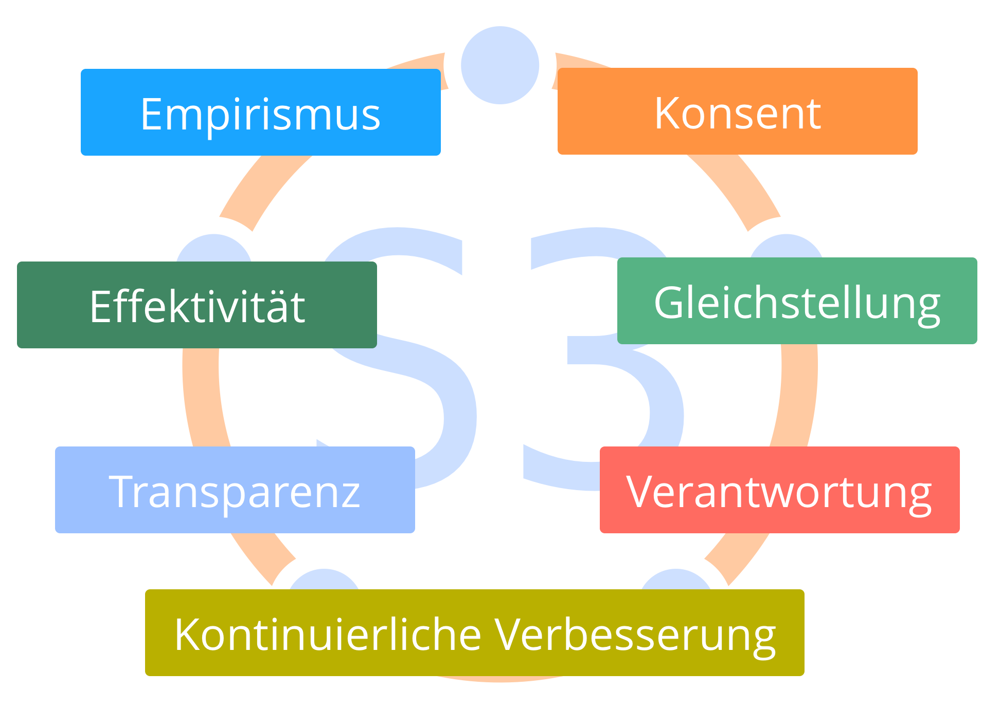
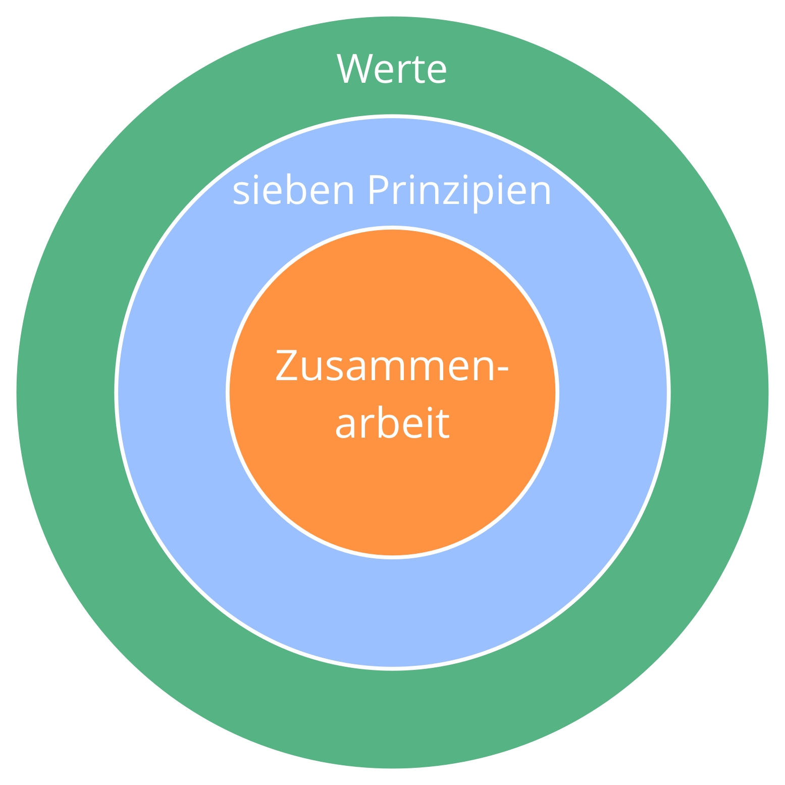

- Richte die Zusammenarbeit an den sieben Prinzipien aus.
- Eine Organisation oder Gruppe, die die Sieben Prinzipien anwendet, benötigt weniger expliziten Vereinbarungen, und kann S3-Muster besser an ihren Kontext anpassen.
- Die Werte einer Organisation sollten zu den Sieben Prinzipien passen.

[&#9654; Gemeinsame Werte](agree-on-values.html) [&#9664; Kunstvolle Teilnahme](artful-participation.html) [&#9650; Mitgestaltung ermöglichen](enablers-of-co-creation.html)

