# Einführung

## Soziokratie 3.0 - Ein Leitfaden zur Evolution agiler und resilienter Organisationen

### Effektive Zusammenarbeit in Organisationen beliebiger Größe

- **prinzipiengetrieben** - ein ganzheitlicher Weg zur Entwicklung einer agilen und soziokratischen Geisteshaltung
- **flexibel** - unabhängige, sich gegenseitig verstärkende Muster, die Organisationen in allen Aspekten der Zusammenarbeit unterstützen, und die leicht an den eigenen Kontext angepasst werden können
- **kostenlos** - lizenziert unter einer Creative Commons Free Culture Lizenz

## Was habe ich davon?

Soziokratie 3.0 (oder kurz: "**S3**") bietet Dir eine umfangreiche Sammlung von Ideen (Mustern), die sich in Organisationen als hilfreich erwiesen haben, um **Produktivität, Zusammenarbeit und Zufriedenheit zu verbessern**.

S3 unterstützt Dich dabei, herauszufinden, wie Du am besten Deine Ziele erreichst, und wie Du komplexe Herausforderungen meisterst. Schritt für Schritt, **und ganz ohne Reorganisation oder groß angelegte Change-Initiativen**:

- Beginne dort, wo der Bedarf am größten ist, und wähle ein oder mehrere Muster für ein Experiment. **Bestimme selbst die passende Geschwindigkeit** und entwickle die erforderlichen Fähigkeiten unterwegs.

- **Unabhängig von Deiner Position in der Organisation** wirst Du Muster finden, die Dir weiterhelfen können.

## Inhalt

- eine kurze Einführung in die wesentlichen Konzepte, auf denen S3 basiert
- eine Beschreibung aller Muster in S3
- ein Anhang mit einer Änderungshistorie, Danksagungen, Informationen über die Autoren, einem Glossar und einem alphabetischen Verzeichnis der Muster

## Geschichte und Einflüsse

## Grundlegende Konzepte

Bevor Du in die Muster eintauchst, solltest Du Dich mit einigen Konzepten vertraut machen, die das Verständnis von S3 erleichtern:

- Was ist ein Muster?
- Die sieben Prinzipien
- Treiber, Wert und Verschwendung
- Domänen, Delegation und Verantwortung
- Governance, Selbstorganisation und Teilautonomie

Im Anhang findest Du ein Glossar, das kurze Erklärungen dieser und weiterer Begriffe enthält.

## Muster

_Ein **Muster** ist eine Vorgehensweise, um einer bestimmten Herausforderung erfolgreich zu begegnen._

- Die Muster in S3 werden durch die Beobachtung vieler Organisationen bei der Lösung ihrer Probleme und dem Umgang mit ihren Herausforderungen entdeckt.
- Die Muster können an den jeweiligen Kontext angepasst und dann weiterentwickelt werden.
- Die Muster sind thematisch in 10 Kategorien geordnet.

## Alle Muster basieren auf den sieben Prinzipien

## Die sieben Prinzipien

**Effektivität:** *Investiere Zeit nur für das, was Dich dem Erreichen Deiner Ziele näher bringt.*

**Konsent:** *Handle nur, wenn keiner der Betroffenen einen Einwand hat.*

**Empirismus:** *Überprüfe alle Annahmen durch Experimente, achte auf kontinuierliche Revision und Falsifizierbarkeit.*

**Kontinuierliche Verbesserung:** *Bevorzuge inkrementelle Veränderung, um stetiges empirisches Lernen zu ermöglichen.*

**Gleichstellung:** *Beziehe Menschen in die sie betreffenden Entscheidungen und deren Entwicklung ein.*

**Transparenz:** *Mache alle Informationen für jeden in der Organisation zugänglich, es sei denn, es gibt einen wichtigen Grund für Vertraulichkeit.*

**Verantwortlichkeit:** *Handle, wenn es erforderlich ist; befolge, was Du vereinbart hast und behalte die gesamte Organisation im Blick.*

## Treiber

_Ein **Treiber** ist das Motiv einer Person oder Gruppe, in einer bestimmten Situation zu handeln._

Ein Treiber …

- kann als Ausgangspunkt für Ziele, Vision oder "Bestimmung" dienen
- kann sich im Lauf der Zeit verändern

### Treiber: Wert und Verschwendung

_**Wert** ist die Bedeutung oder der Nutzen von etwas in Bezug  auf einen bestimmten Treiber_

_**Verschwendung** ist alles, was für die effektive Antwort auf einen Treiber nicht notwenig ist oder ihr sogar im Wege steht._

Über das Konzept von Wert und Verschwendung können Organisationen, die Muster aus S3 verwenden, auch viele Praktiken und Ideen aus der **Lean Production** und der **Lean Softwareentwicklung** nutzen. Zum Beispiel:

- Wertstromanalyse
- verschiedene Strategien zur Vermeidung von Verschwendung
- die Kanban-Methode

## Domänen

_Eine **Domäne** ist ein eigener Arbeits-, Einfluss-  und Entscheidungsbereich innerhalb einer Organisation._

Alle Domänen befinden sich innerhalb der Domäne der Organisation, und können sich mit anderen Domänen überschneiden, oder auch vollständig in ihnen enthalten sein.

Domänen werden an Mitarbeiter delegiert (z.B. an eine Geschäftseinheit, eine Abteilung, ein Team oder eine Einzelperson), die dann – innerhalb der Grenzen des Autonomie- und Einflussbereiches dieser Domäne – die Verantwortung dafür übernehmen.

## Domänen delegieren

Wer eine Domäne delegiert (die *Delegierende*) bleibt weiterhin verantwortlich für diese Domäne, und definiert oft:

- **Kernaufgaben** (die wesentlichen delegierten Arbeitsaufgaben und Entscheidungen)
- **Einschränkungen von Autonomie und Einfluss**, normalerweise in Bezug auf die Organisation selbst (z.B. Budget, Ressourcen, Delegationsstufe, Reporting)

## Treiber und Domänen

Eine Domäne kann auch in Bezug auf einen Organisationstreiber - den so genannten **Primärtreiber** der Domäne - definiert werden: die Domäne ist die Menge derjenigen Subtreiber, die im Kontext der Antwort auf diesen Primärtreibers ebenfalls berücksichtigt werden müssen. Dazu gehören:

- **Kernaufgaben**: Treiber, die direkt vom Primärtreiber abgeleitet werden können
- **Einschränkungen**: Treiber, die sich auf die Organisation selbst beziehen

## Domänen und Verantwortlichkeit

- Verantwortlichkeit bezieht sich auf alle Vereinbarungen, einschließlich Kreise, Rollen, und der Organisation selbst
- die primäre Verantwortlichkeit aller Mitarbeiter bezieht sich auf effektive Zusammenarbeit bei der Antwort auf Organisationstreiber
- Einzelpersonen und Gruppen sind jeweils verantwortlich für ihre Arbeit, und für ihre eigene Weiterentwicklung. Die Organisation stellt die dafür erforderliche Unterstützung bereit
- jedes Mitglied einer Organisation ist verantwortlich dafür, seine Handlungen an den Werten der Organisation auszurichten

## Governance, Teilautonomie und Selbstorganisation

**Governance**: Fortwährend entscheiden, was zu tun ist, um Ziele zu erreichen, und Richtlinien dafür festlegen, wie und wann Dinge getan werden.

**Selbststeuerung**: Eine Gruppe, sich innerhalb einer Grenzen einer Domäne selbst steuert und selbst organisiert.

**Selbstorganisation**: Menschen, die ihre Arbeit - innerhalb der durch Governance festgelegten Grenzen - selbst organisieren.

**Operatives Geschäft**: Das Abarbeiten aller anfallenden Arbeiten, innerhalb des durch Governance und Koordination gesetzten Rahmens.

**Teilautonomie**: Die Autonomie der Mitarbeiter, innerhalb ihrer Domäne Wert zu schöpfen (begrenzt von den Einschränkungen der Domäne).

## Unterscheidung zwischen Governance und operativem Geschäft

Damit eine Organisation dazulernen kann und sich kontinuierlich verbessert, sollte sie alle wesentlichen Entscheidungen dokumentieren, prüfen und weiterentwickeln.

*Fragestellung: Profitiert etwas von einer Einzel- oder Gruppen-Entscheidung?*

- ja: Governance 
    - nicht von existierenden Vereinbarungen abgedeckt
    - muss vereinbart, entschieden, oder ergänzt werden
- nein: operatives Geschäft 
    - im Rahmen einer existierenden Vereinbarung (die Verantwortlichen können handeln)
    - muss erledigt werden

# Die Muster

## Mitgestaltung und Evolution 

###  Pattern 1.1: Auf Organisationstreiber reagieren

*Kläre, was geschieht und was der Bedarf der Organisation ist. Reagiere entsprechend.*

Reaktionen auf Treiber:

- Aktion
- Entscheidung (inkl. Delegation an Rollen, Kreise, Hilfsteams oder offene Domänen)

#### Organisationstreiber erkennen

Treiber, die in (direktem oder indirektem) Zusammenhang zum Primärtreiber der Organisation stehen, bezeichnet man als **Organisationstreiber**. Andere Treiber fallen nicht in die Verantwortung (Domäne) der Organisation.

Eine einfache Möglichkeit, zu erkennen, ob es sich um einen Organisationtreiber handelt, ist die Frage:

*Würde eine Antwort auf diesen Treiber den Wertfluss bezogen auf einen bestehenden Organisationstreiber verbessern? Kurz: Kann uns das helfen bzw. schaden?*

#### Überprüfen von Treibern

Die Antwort auf einen Treiber ist üblicherweise ein Experiment, das über längere Zeit in einem Lernprozess weiterentwickelt wird.

- Ist die Beschreibung der Situation immer noch zutreffend?
- Verbinden wir mit dieser Situation immer noch den gleichen Bedarf?
- Befindet sich der Treiber immer noch innerhalb unserer Domäne?
- Ist der Treiber immer noch relevant?

###  Pattern 1.2: Navigiere nach Spannung

**Erkenne und beantworte Organisationstreiber.**

**Alle Mitarbeiter** richten ihre Aufmerksamkeit darauf, was der Organisation helfen oder schaden könnte, und suchen nach effektiven Antworten auf diese Treiber.

Eine **Spannung** ist eine persönliche Erfahrung: Ein Symptom von Unstimmigkeit zwischen persönlicher Wahrnehmung und Erwartung (oder Präferenz).

**Herausforderungen und Chancen** für eine Organisation können dadurch identifiziert werden, dass Mitarbeiter auf Spannungen aufmerksam werden.

Spüre Spannungen nach, und beschreibe Situation und Bedarf der Organisation, um **Treiber zu entdecken**. Manchmal zeigt diese Untersuchung auch Missverständnisse auf, wodurch sich die Spannung oft auflöst.

Die erkannten **Organisationstreiber** werden an die zuständige Domäne zur Bearbeitung weiter gereicht.

##  Pattern 1.3: Organisationstreiber beschreiben

**Beschreibe Organisationstreiber, um sie zu verstehen, zu kommunizieren und sie im Gedächtnis zu behalten.**

Eine einfache Methode, einen Treiber zu beschreiben ist ein **knappe Zusammenfassung**:

- **Was gerade passiert:** 
    - die **aktuelle situation**
    - den **Effekt** dieser Situation auf die Organisation
- und **warum wir handeln sollten:** 
    - den **Bedarf** der Organisation bezogen auf diese Situation
    - die **Konsequenzen**, wenn dieser Bedarf gedeckt wird

Je nach Blickwinkel kann derselbe Treiber als Problem oder auch als Chance beschrieben werden.

Die **Zusammenfassung eines Treibers** enthält gerade genug Informationen, um die Notwendigkeit einer Aktion oder einer Entscheidung zu kommunizieren. Zusätzlich zur Zusammenfassung können noch weitere Hintergrundinformationen zum Treiber dokumentiert werden.

### Beispiel eines Organisationstreibers

> *"Die Küche ist ein Durcheinander: Es gibt keine sauberen Tassen, das Waschbecken ist voller Geschirr und es ist unmöglich, sich schnell einen Kaffee holen und wieder an die Arbeit zu gehen. Die Küche muss benutzbar sein, damit wir uns auf unsere Arbeit konzentrieren können."*

### 1. Aktuelle Situation

> *“Die Küche ist ein Durcheinander: Es gibt keine sauberen Tassen, das Waschbecken ist voller Geschirr...”*

Beschreibe die aktuelle Situation:

- Skizziere die wesentlichen Aspekte der Situation.
- Bemühe dich um Objektivität: beschreibe Beobachtungen, und vermeide Beurteilungen.

### 2. Effekt

> *“...es ist unmöglich, sich schnell einen Kaffee holen und wieder an die Arbeit zu gehen.”*

Erkläre den Effekt dieser Situation auf die Organisation:

- Zeige, **warum** sich die Organisation um diese Situation kümmern sollte: wie betrifft das die Organisation? 
- Benenne klar, ob ein Effekt belegt ist oder nur vermutet wird. 
- Erläutere Herausforderungen, Verluste, Chancen oder Nutzen. 

### 3. Bedarf

> *“Die Küche muss benutzbar sein...”*

Erkläre den Bedarf der Organisation bezogen auf diese Situation:

- Ein **Bedarf einer Organisation** ist etwas, das eine Gruppe (oder ein Individuum) benötigt, um sich effektiv um eine Domäne kümmern zu können. 
- Bei Uneinigkeit über den Bedarf ist es oft hilfreich, die Formulierung spezifischer Lösungsstrategien zu vermeiden.
- Benenne explizit, wer den Bedarf hat ("wir benötigen", "sie benötigen", "ich benötige").
- Vermeide es, spezifische Lösungen als Bedarf zu beschreiben.

### 4. Konsequenzen

> *“...damit wir uns auf unsere Arbeit konzentrieren können.”*

Beschreibe die Konsequenzen, wenn dieser Bedarf gedeckt wird:

- Beschreibe das angestrebte Ergebnis, potenzielle Vorteile oder Chancen.
- Die Konsequenzen können auch offensichtlich oder implizit sein, insbesondere wenn der Effekt der Situation auf die Organisation bereits gut beschrieben ist.

###  Pattern 1.4: Konsent-Entscheidung

**Ein (moderierter) Gruppenprozess zur Entscheidungsfindung.**

- sammle Einwände, und integriere das dahinterstehende Wissen, um Vorschläge und Vereinbarungen weiterzuentwickeln
- das Zurückhalten von Einwänden kann die Ziele einer Gruppe oder Organisation gefährden
- ungelöste Einwände verhindern, dass ein Vorschlag zu einer Vereinbarung wird
- Vorschläge müssen nur *gut und sicher genug* bis zum Termin der nächsten Überprüfung sein

#### Impliziter Konsent-Vertrag

- Wenn es keine Einwände gegen eine Vereinbarung gibt, beabsichtige ich, diese Vereinbarung im Rahmen meiner Möglichkeiten umzusetzen.
- Ich stimme zu, Einwände einzubringen, sobald sie mir bewusst werden.

###  Pattern 1.5: Einwand

_Ein **Einwand** ist ein Grund, warum ein Vorschlag, eine Entscheidung oder eine Handlung einer effektiv(er)en Antwort auf einen Treiber im Weg steht._

Einwände enthalten Informationen über Vorschläge, Entscheidungen, bestehende Vereinbarungen oder Massnahmen, die darauf hindeuten, 

- dass (zumindest sehr wahrscheinlich) Schaden entstehen wird, diese also nicht sicher genug sind, um sie auszuprobieren
- wie man sie signifikant verbessern kann 

#### Einwände qualifizieren

Es liegt in der Verantwortung des Einzelnen, mögliche Einwände zu einzubringen.

Die für die betreffende Aktion oder Entscheidung Verantwortlichen sind ebenfalls verantwortlich dafür, *Argumente zu bedenken und qualifizierte Einwände zu berücksichtigen*.

Das Zurückhalten von Einwänden kann die Fähigkeit von Personen, Gruppen oder der Organisation beeinträchtigen, auf Organisationstreiber zu reagieren.

Die Möglichkeit, *potentielle* Einwände jederzeit einbringen zu können bedeutet, dass Entscheidungen lediglich *gut genug für den Moment sein müssen, und sicher genug, um sie auszuprobieren*.

*Wie würde durch diese Entscheidung der Wertfluss (bezogen auf einen Organisationstreiber) behindert – oder eine Gelegenheit zur Verbesserung verpasst?*

Einwände verhindern …

- laufende und geplante Aktivitäten
- die Umsetzung von Entscheidungen
- das Weiterbestehen von Vereinbarungen ohne Überarbeitung
- das Vorschläge zu Vereinbarungen werden

#### Einwände verstehen

Einige hilfreiche Fragen

- Inwiefern bezieht ich dieses Argument auf diesen Vorschlag bzw. diese Vereinbarung?
- Zeigt dieser Einwand auf, wie eine (vorgeschlagene oder bestehende) **Aktivität oder Vereinbarung …**: 
    - die Reaktion auf einen Organisationstreiber beeinträchtigt?
    - hier und jetzt verbessert werden kann?
    - dem Beitrag eines Beteiligten im Weg steht?
    - im Widerspruch zu den Werten der Organisation steht?
    - nicht als ‘sicher genug’ angesehen werden kann?

#### Bedenken

Ein **Bedenken** ist die *Meinung*, dass eine Maßnahme, selbst wenn *keine Einwände mehr dagegen vorliegen*, trotzdem noch eine effektive(re) Antwort auf einen Organisationstreiber behindern **könnte**.

Bedenken in der Konsententscheidung:

- Bedenken können Wege aufzeigen, wie Vereinbarung verbessert werden können (einschliesslich Evaluationskriterien und -zeitpunkt) 
- Bedenken werden besprochen, wenn noch Zeit übrig ist, oder sie als wichtig eingeschätzt werden
- Bedenken werden protokolliert

Bei Unsicherheit darüber, ob ein Vorschlag sicher genug ist, können Bedenken als Einwände angemeldet werden, um das Risiko gemeinsam in der Gruppe abzuschätzen.

###  Pattern 1.6: Einwände integrieren

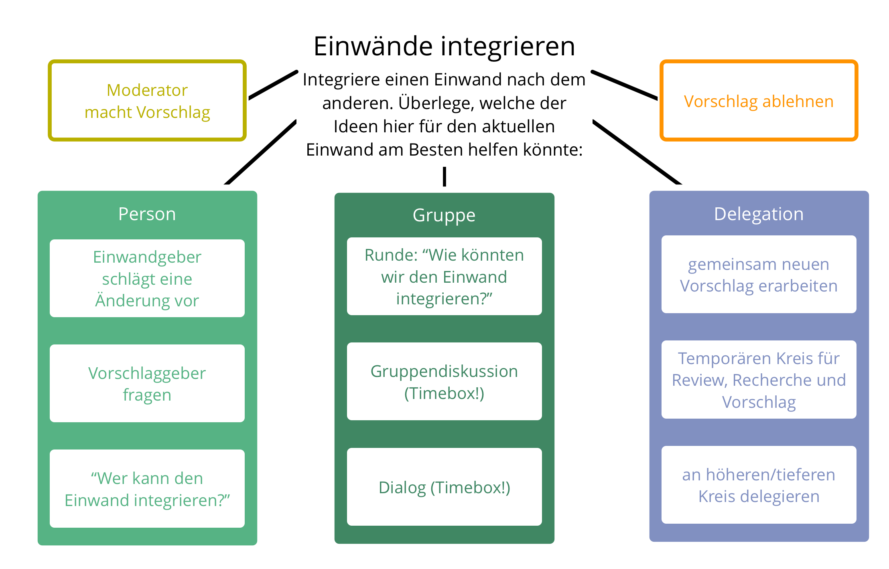

#### Ein Verfahren, um Einwände aufzulösen

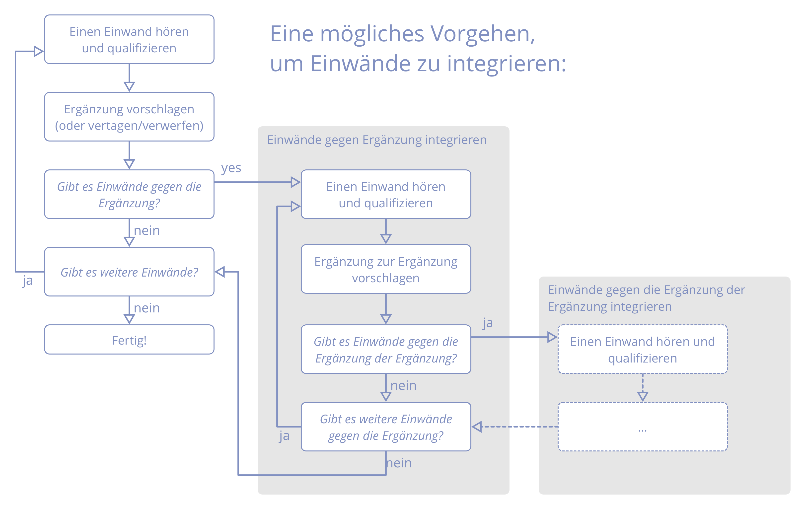

###  Pattern 1.7: Vereinbarungen prüfen

Die regelmässige Überprüfung aller Vereinbarungen ist essentiell für lernende Organisationen, um ihr Regelwerk fortwährend weiterzuentwickeln und Verschwendung durch obsolet gewordene Vereinbarungen zu reduzieren:

- Anpassung an sich verändernde Rahmenbedingungen
- Gelerntes integrieren 
    - *Wie hat uns diese Vereinbarung weitergeholfen?*
    - *Wie kann diese Vereinbarung verbessert werden?*
    - *Gibt es einen Grund, diese Vereinbarung nicht weiterzuführen?*

- Vorbereitung
    
    - Termin für Überprüfung vereinbaren
    - Notwendige Informationen bereitstellen

- Folgeaktivität
    
    - Nächsten Überprüfungstermin vereinbaren
    - Dokumentation oder Benachrichtigung
    - Nachverfolgung von Aufgaben und Entscheidungen
    - Auswirkungen auf andere Vereinbarungen

- Im einfachsten Fall beschränkt sich die Prüfung einer Vereinbarung darauf, festzustellen, dass sie weiterhin relevant ist und kein Einwand gegen das Weiterbestehen existiert. 
- Vereinbarungen werden häufig in *Steuerungsmeetings* überprüft. 
- Für manche Vereinbarungen ist es effektiver, einen gesonderten Termin für die Überprüfung zu vereinbaren. 
- Die Häufigkeit der Überprüfung wird nach Bedarf angepasst.
- Falls nötig, kann auch früher überprüft werden.
- Elemente dieses Prozesses können auch von Einzelpersonen bei der Prüfung ihrer Entscheidungen angewendet werden.

###  Pattern 1.8: die Betroffenen entscheiden

Involviere alle, die von einer Entscheidung betroffen sein werden, um Gleichstellung und Verantwortlichkeit sicher zu stellen. Vervollständige die Informationen, die zu dem Thema verfügbar sind.

Für grössere Gruppen:

- Moderiere einen mehrstufigen Prozess und bilde Gruppen, die Delegierte wählen
- Finde einen virtuellen, asynchronen, zeitlich gerahmten und gestuften Prozess

Erwäge, die Betroffenen auch bei der Überprüfung und Weiterentwicklung der Entscheidungen miteinzubeziehen.

###  Pattern 1.9: Proposal Forming

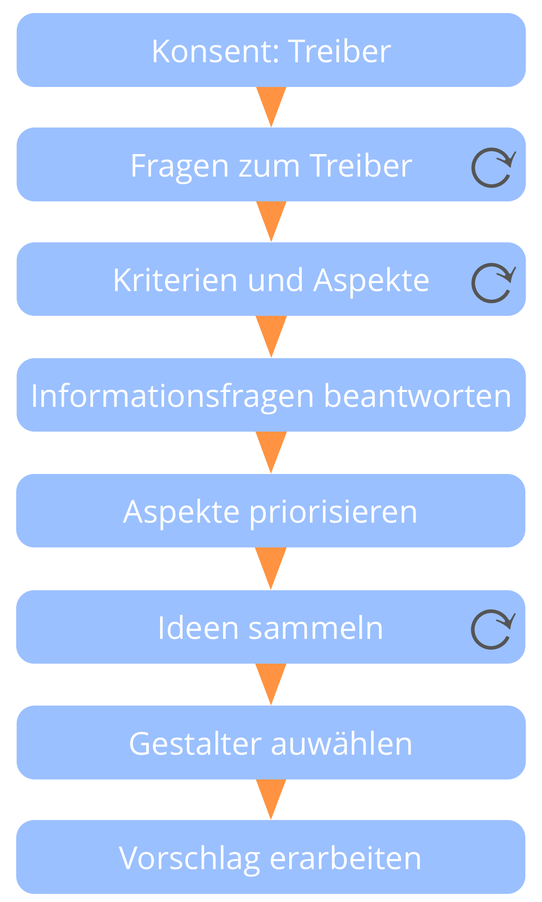

**Ein (moderiertes) Format zur gemeinsamen Gestaltung eines Vorschlags zur Antwort auf einen Treiber.**

- nutzt das kollektive Wissen und die Vielfalt der Perspektiven innerhalb einer Gruppe
- bezieht die gesamte Gruppe in die Gestaltung von Vereinbarungen mit ein
- fördert Verantwortlichkeit und Unterstützung der resultierenden Vereinbarung

Proposal forming kann auch von Einzelpersonen angewendet werden.

#### Proposal Forming: Ablauf

- **Zustimmung zum Treiber**: *Ist dieser Treiber für uns relevant? Ist die Beschreibung von Situation und Bedarf treffend?*
- **Gemeinsames Verständnis des Treibers vertiefen**: Eine Einladung Fragen zu stellen, um mehr über den Treiber zu erfahren.
- **Überlegungen sammeln**, formuliert als Fragen in Bezug auf mögliche Lösungen. Diese Fragen deuten entweder auf Einschränkungen (Informationsfragen) oder Möglichkeiten (generative Fragen) hin.
- **Beantwortung** der Informationsfragen (soweit möglich)
- Überlegungen **priorisieren**
- **Ideen sammeln** als mögliche Bestandteile eines Vorschlags
- **Formulieren eines Vorschlags** zur Antwort auf den Treiber, unter Berücksichtigung der gesammelten Ideen und Informationen. Dieser Schritt erfolgt typischerweise in einer kleineren Gruppe von "Gestaltern".

#### Gestalter aussuchen

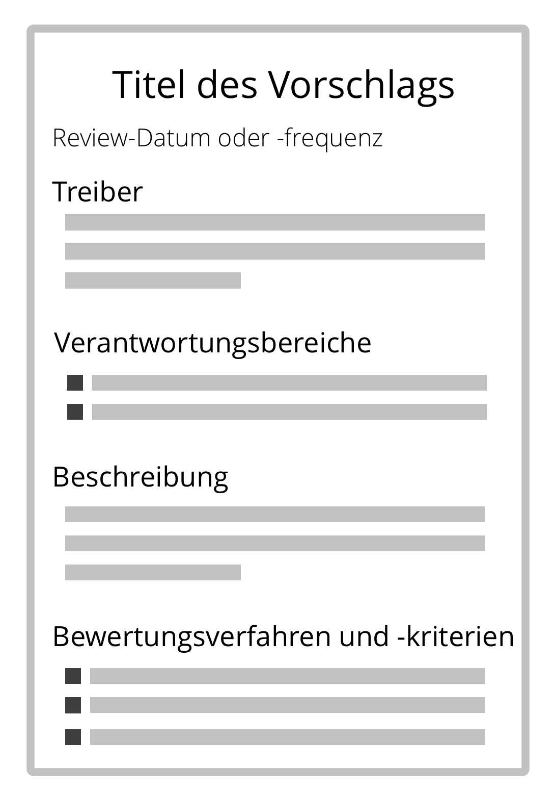

- Wer sollte dabei sein?
- Wer will dabei sein?
- Wer könnte sonst noch einen wertvollen Beitrag leisten?
- Berücksichtige Expertise, besondere Perspektiven und Inspiration.
- Gibt es Einwände gegen diese Gestalter?

###  Pattern 1.10: Wahl

**Ein Gruppenprozess für die Auswahl von Personen für Rollen.**

- Vermeide es, im Voraus Interesse an einer Rolle zu bekunden.
- Nominierungen werden aufgrund der Qualität der gehörten Argumente vorgenommen, nicht nach Mehrheiten.
- Jeder kann sich selbst nominieren, oder auch passen.
- Die nominierte Person wird immer zuletzt nach Einwänden gefragt.

Einwände gegen eine Nominierung können auf verschiedene Arten aufgelöst werden, z.B. durch Anpassung der Rollenbeschreibung oder durch Nominierung einer anderen Person.

**Hinweis:** Dieses Muster kann auch für die Auswahl zwischen mehreren Optionen verwendet werden.

###  Pattern 1.11: Driver Mapping

Ein Workshop-Format um einer komplexen Situation effektiv zu begegnen: Unternehmensgründung, Projektbeginn, Umgang mit Hindernissen oder Chancen, oder die Ausrichtung der Organisationsstruktur am Wertfluss.

Kleine oder grosse Gruppen identifizieren und priorisieren Treiber, um in selbstorganisierenden Teams schnell vom Konzept zur Umsetzung zu gelangen.

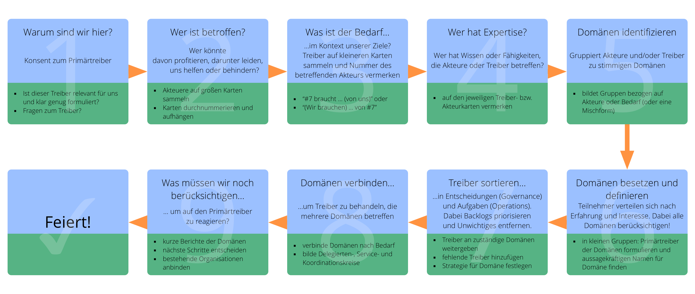

#### Driver Mapping: Vorlage für Domänen

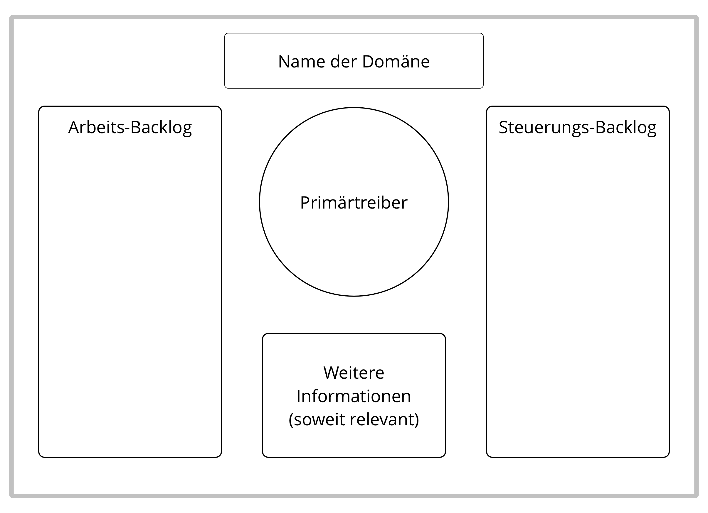

## Gemeinsame Entwicklung 

###  Pattern 2.1: Um Hilfe bitten

**Ein einfaches Protokoll, das Lernen, die Vermittlung von Fähigkeiten und den Aufbau von Beziehungen unterstützt, und dabei die Autonomie des Einzelnen respektiert.**

Frage einen Kollegen, "*Wärest Du bereit, mir mit … zu helfen*?" Die gefragte Person antwortet nur mit einem einfachen "*ja*" or "*nein*".

- wenn die Bitte abgelehnt wird, akzeptiert der Fragende das ohne Nachfrage oder gar Verhandlungen
- erscheint der gefragten Person die Bitte unklar, bittet sie um weitere Informationen
- wenn Du eine Bitte um Hilfe annimmst, unterstütze deinen Kollegen, so gut es dir in dieser Situation möglich ist

###  Pattern 2.2: Peer-Feedback

Lade einen Kollegen ein, dir konstruktives Feedback zu geben über:

- die Art und Weise, wie Du eine Rolle ausfüllst
- generelles Feedback über deine Teilnahme in der Organisation, und deine Zusammenarbeit mit anderen
- weitere spezielle Aspekte, die dich interessieren

Bedenke:

- gib dem Kollegen Zeit, sich auf das Gespräch vorzubereiten
- frage sowohl nach **Würdigungen** als auch nach **konstruktiven, handlungsorientierten Verbesserungsvorschlägen**
- frage nach, um das Feedback besser zu verstehen, aber vermeide Diskussion oder Bewertung
- entscheide nach dem Gespräch selbst, wie du mit dem Feedback umgehst

###  Pattern 2.3: Entwicklungsgespräch

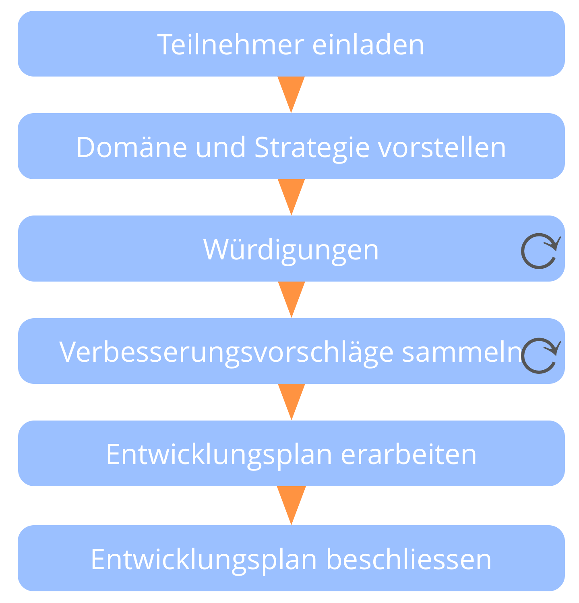

**Kollegen unterstützen sich gegenseitig dabei, sich in ihren Rollen und Gruppen weiterzuentwickeln.**

Der Rolleninhaber - oder die sich entwickelnde Gruppe - führt im Entwicklungsgespräch, indem sie den Prozess initiiert, und jeden Prozessschritt beginnt.

Stelle sicher, dass die eingeladenen Teilnehmer unterschiedliche Perspektiven beitragen, und dass das Gespräch moderiert wird.

Verbesserungsvorschläge können sich auf persönliche Entwicklung, Zusammenarbeit, Strategie oder Anpassungen der Domänen-Beschreibung (inkl. Treiber) beziehen.

#### Kontinuierliche Verbesserung der Fähigkeit, eine Rolle auszufüllen oder in Gruppen zusammenzuarbeiten.

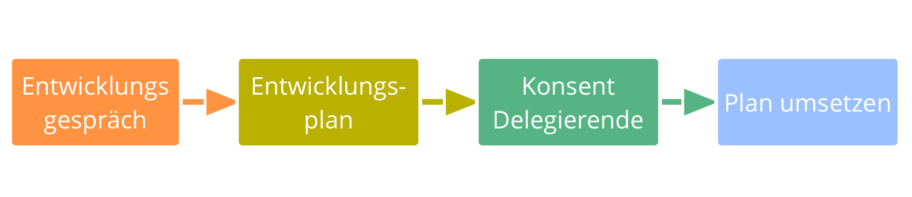

###  Pattern 2.4: Entwicklungsplan

**Ein Plan, um sich effektiver um eine Domäne zu kümmern, der von Delegierenden und Beauftragten vereinbart wird.**

Der Entwicklungsplan kann für einen Mitarbeiter in einer Rolle oder für eine Gruppe (z.B. eine Abteilung, einen Kreis, ein Team oder eine offene Domäne) erstellt werden.

Die Entwicklung kann sich auf eine Klarstellung von Treiber oder Domäne beziehen, auf eine Anpassung der Strategie, auf neue oder veränderte Vereinbarung, und auf konkrete Aufgaben für die Beauftragten oder auch für die Delegierenden.

Der Entwicklungsplan (inklusive aller zugehörigen Empfehlungen zu Änderungen der Beschreibungen von Domänen oder Treibern) erfordert Konsent von Delegierenden und Beauftragten.

## Mitgestaltung ermöglichen 

###  Pattern 3.1: Kunstvolle Teilnahme

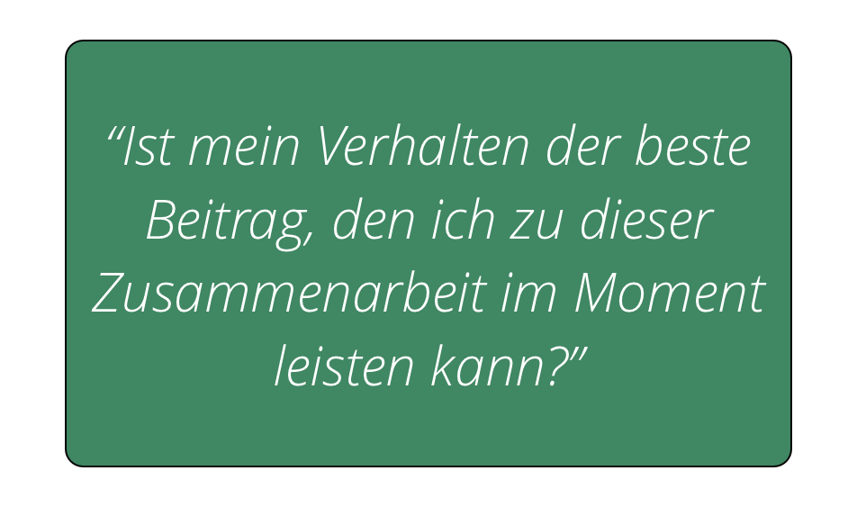

Eine **Selbstverpflichtung** zur Entwicklung effektiver Zusammenarbeit und hilfreicher Interaktionen:

- **berücksichtige und befolge alle Vereinbarungen**, so gut es dir unter den momentanen Bedingungen möglich ist
- entwickle **Bewusstsein und Verständnis** für individuelle und kollektive Bedürfnisse
- entwickle die dazu **erforderlichen Fähigkeiten**
- **unterstütze andere**, dasselbe zu tun 
- mache andere auf Hindernisse aufmerksam, wenn nötig

Kunstvolle Teilnahme kann im Einzelfall auch bedeuten, andere zu unterbrechen, Einwände zu erheben oder Vereinbarungen zu brechen.

#### Vorteile der kunstvollen Teilnahme

- ermöglicht Mitgestaltung und Entwicklung von Vereinbarungen
- hilft Teams dabei, stärker zu werden
- fördert Selbstverantwortung, Integrität und Vertrauen
- unterstützt eine Kultur der gegenseitigen Unterstützung und der engen Zusammenarbeit
- die Wirkung wird verstärkt, wenn sich mehrere Mitarbeiter zur kunstvollen Teilnahme entschliessen

#### Kunstvolle Teilnahme: Selbsteinschätzung

- Wie kann ich mich und andere darin unterstützen, kunstvoller teilzunehmen? 
- Welche meiner Interaktionen sind hinderlich oder ineffektiv?
- Welche Vereinbarungen finde ich schwierig einzuhalten oder mitzugestalten? Was kann ich dagegen tun?
- Welche Fähigkeiten könnte ich entwickeln um meine kunstvolle Teilnahme zu unterstützen?
- Was würde kunstvolle Teilnahme bedeuten in Bezug auf … 
    - meine Alltagsaktivitäten?
    - meine Zusammenarbeit und Interaktion mit Anderen?
    - die Organisation? Unsere Kunden?
    - das weitere Umfeld?

###  Pattern 3.2: Die sieben Prinzipien leben

- Richte die Zusammenarbeit an den sieben Prinzipien aus.
- Eine Organisation oder Gruppe, die die Sieben Prinzipien anwendet, benötigt weniger expliziten Vereinbarungen, und kann S3-Muster besser an ihren Kontext anpassen.
- Die Werte einer Organisation sollten zu den Sieben Prinzipien passen.

###  Pattern 3.3: Gemeinsame Werte

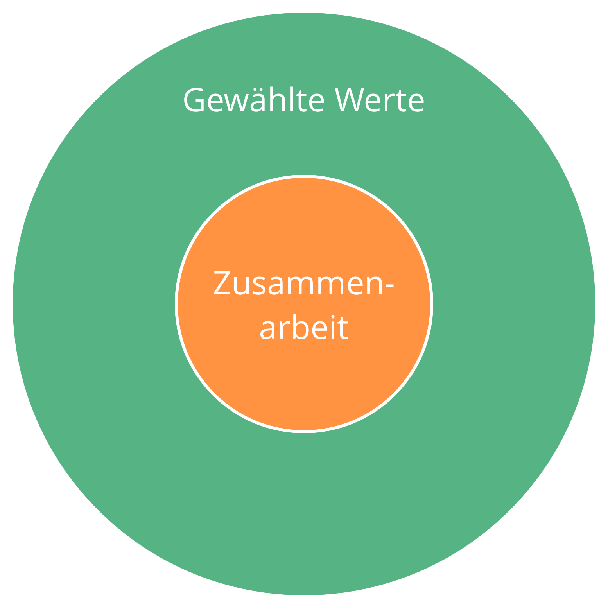

**Gestalte bewusst die Kultur der Organisation.**

*Ein **Wert** ist ein Prinzip, an dem Personen ihr Verhalten ausrichten. Werte begrenzen den Handlungsspielraum und definieren ethische Rahmenbedingungen.*

- Jedes Mitglied einer Organisation bringt eigene Werte mit, die aus persönlichen Erfahrungen und Überzeugungen resultieren.
- Eine Gruppe oder Organisation kann sich **auf gemeinsame Werte einigen,** an dienen sie ihre Zusammenarbeit ausrichten.

- aus Werten kann angemessenes Handeln abgeleitet werden, auch wenn es für etwas keine explizite Vereinbarungen gibt
- die Einigung auf gemeinsame Werte ist eine **Strategie** zur Unterstützung der Effektivität einer Organisation: 
    - geringeres Potential für **Missverständnisse**
    - gemeinsame **Ausrichtung** von Entscheidungen und Aktivität
    - **Attraktion neuer Mitarbeiter, Partner und Kunden**, die sich mit den Werten der Organisation identifizieren
- Gemeinsame Werte sind eine Vereinbarung, und sollten daher **regelmässiger überprüft und weiterentwickelt** werden.

###  Pattern 3.4: Governance-Moderator (Rolle)

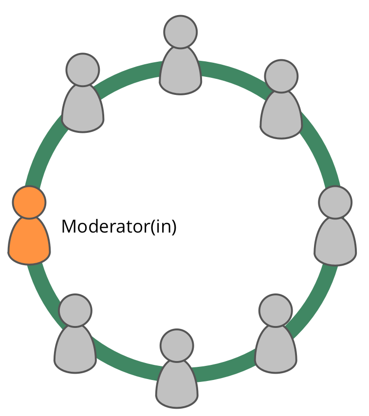

Ein Governance-Moderator …

- ist verantwortlich dafür, dass Steuerungs-Meetings moderiert werden, so dass diese auf Kurs bleiben und am Ende des Meetings ausgewertet werden
- wird (in der Regel) von einer Gruppe selbst und aus ihren Mitgliedern ausgewählt
- macht sich mit dem Steuerungs-Backlog vertraut
- lädt oft Andere dazu ein, einzelne Tagesordnungspunkte zu moderieren

Der Governance-Moderator sollte sich auch mit folgenden Patterns vertraut machen:

- Runden
- Proposal Forming
- Konsententscheidung
- Rollenbesetzung
- Meetings evaluieren
- Einwände integrieren
- Entwicklungsgespräche

###  Pattern 3.5: Vereinbarungen brechen

- Ist manchmal **notwendig** …
- … kann allerdings auch die **Gemeinschaft belasten**
- Übernimm die Verantwortung: 
    - **Beseitige** die entstandenen Störungen
    - **Kläre die Situation** bei nächster Gelegenheit mit Betroffenen und Zuständigen
    - **Initiiere Änderungen**, anstatt dieselbe Vereinbarung wiederholt zu brechen

###  Pattern 3.6: Verantwortung und Verträge

Wenn Du formelle oder informelle Vereinbarungen mit Anderen eingehst:

- Stelle sicher, dass alle Parteien die an sie gestellten Erwartungen kennen und auch beabsichtigen, die Vereinbarung einzuhalten.
- Verifiziere, dass die Vereinbarung für alle Parteien vorteilhaft ist, und die Erwartungen realistisch sind.

Übernimm die Verantwortung, wenn Du Vereinbarungen brichst.

Um die Organisationskultur zu erhalten, fördere Selbstverantwortung und ermögliche neuen Mitgliedern einen möglichst reibungslosen Start:

- Kläre Erwartungen an neue Mitglieder in Bezug auf erforderliche Fähigkeiten und kulturelle Übereinstimmung.
- Gestalte Verträge so, dass sie die gesetzlichen Anforderungen erfüllen und zur Organisationskultur passen.
- Erwäge eine Probezeit.
- Kläre die Abläufe bei Vertragsverletzungen im Voraus.

###  Pattern 3.7: Gehaltstransparenz

- transparente Gehälter müssen gerecht sein
- Gerechtigkeit hat mehrere voneinander unabhängige Dimensionen 
- die Wahrnehmung von Gerechtigkeit hängt vom spezifischen organisatorischen Kontext ab
- Mitglieder und relevante Anspruchsgruppen (z.B. Investoren) sollten dabei berücksichtigt werden
- entwickle eine Gehaltsformel: 
    - fester Anteil: soll den Lebensunterhalt sicherstellen
    - variabler Anteil: gerechte Verteilung von Gewinn und Verlust
- berücksichtige Vergütung für sich ändernde Rollen
- entwickle eine Strategie für den Übergang zu den neuen Verträgen und Kompensationsvereinbarungen

#### Zwei Möglichkeiten, um Gehälter offenzulegen

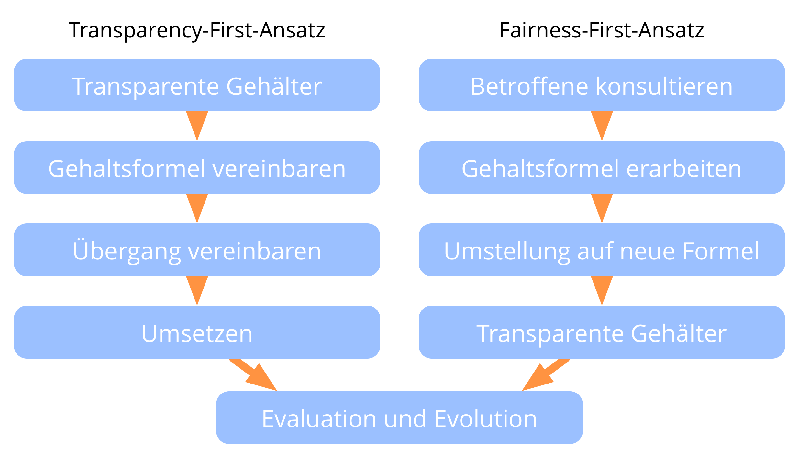

###  Pattern 3.8: Hilfsrolle

**Wende das Muster "Rolle" auf externe Vertragspartner an.**

- Kläre und beschreibe den Treiber für die Rolle
- beschreibe die Domäne
- führe eine Wahl zur Besetzung der Rolle durch
- begrenze die Laufzeit von Verträgen
- plane regelmässige Entwicklungsgespräche ein

Hilfsrollen können auch rein operativen Charakter haben. Externe Vertragspartner geben Konsent, die Verantwortung für ihre Rolle zu übernehmen.

###  Pattern 3.9: Statuten

Verankere S3-Prinzipien und Pattern in Deinen Statuten, um **Rechtssicherheit** und **Organisationskultur** zu sichern

Bedenke:

- Konsent und Gleichstellung in der Entscheidungsfindung
- das Auswahlverfahren für Führungsrollen
- Organisationsstruktur, Werte und Prinzipien
- Einfluss von Eigentümern oder Aktionären
- Verteilung von Gewinn und Verlust

## Organisationsentwicklung 

###  Pattern 4.1: Einfluss delegieren

Dezentralisiere Macht in klar definierten Grenzen. Befähige Mitarbeiter, bei der Reaktion auf Organisationstreiber selbst zu entscheiden und zu handeln.

Die Delegierende unterstützt die Wertschöpfung der Mitarbeiter durch:

- klare Definition des Verantwortungs- und Autonomiebereichs
- Gewährleistung von fortwährendem Lernen und Weiterentwicklung
- weitere Unterstützung nach Bedarf

Korrigiere Rahmenbedingungen schrittweise, berücksichtige dabei Fähigkeit, Zuverlässigkeit und erzielte Ergebnisse.

Dezentralisiere so weit wie möglich, behalte so viel Einfluss wie nötig.

###  Pattern 4.2: Kreis

_Ein **Kreis** ist eine teilautonome und selbststeuernde Gruppe gleichgestellter Personen, die gemeinsam eine Domäne verantworten._

Ein Kreis …

- kann andauernd oder zeitlich begrenzt bestehen
- kann selbstorganisierend sein
- ist selbst für seine Entwicklung und seine Vereinbarungen verantwortlich

- **teilautonom** 
    - ein Kreis ist innerhalb der Grenzen seiner Domäne autonom
    - jeder Kreis kann selbstständig Wert schaffen
- **selbstverwaltet**: 
    - ein Kreis entscheidet fortwährend, wie er in seiner Domäne Wert schöpft, und definiert inhaltliche und zeitliche Rahmenbedingungen für die zu erledigende Arbeit

###  Pattern 4.3: Rolle

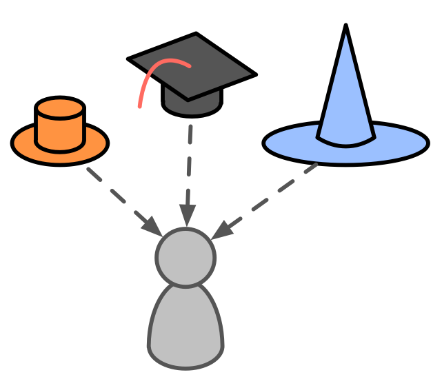

**Delegation von Verantwortung einer Domäne an Personen.**

Eine Rolle ist ein Verantwortungsbereich, der durch eine Domäne definiert und an eine Person (den **Inhaber** der Rolle) delegiert wird. Der Rolleninhaber kann innerhalb des durch die Domäne vorgegebenen Rahmens autonom entscheiden und handeln.

Der Inhaber einer Rolle schlägt eine Strategie zur Wertschöpfung in seiner Domäne vor, und entwickelt diese gemeinsam mit der Delegierenden.

Eine Rolle ist ein einfacher Weg für eine Gruppe, um wiederkehrende Aufgaben oder einen bestimmten Arbeitsbereich an eines ihrer Mitglieder zu delegieren.

- eine Person kann mehrere Rollen innehaben, und eine Rolle kann von mehreren Personen ausgefüllt werden
- Personen die eine Rolle inne haben, werden per Konsent und für einen festgelegten Zeitraum gewählt
- Kollegen unterstützen sich gegenseitig dabei, sich in ihren jeweiligen Rollen weiterzuentwickeln

Der Inhaber einer Rolle kann ein Logbuch und ein Steuerungs-Backlog führen, um sein System zur Wertschöpfung zu entwickeln. 

**Anmerkung**: Richtlinien, Prozesse oder Protokolle, die von Mitarbeitern in Rollen erstellt und entwickelt werden, können genauso wie Vereinbarungen behandelt und entwickelt werden.

#### Rollen: Eine Möglichkeit, um Domänen zu verantworten

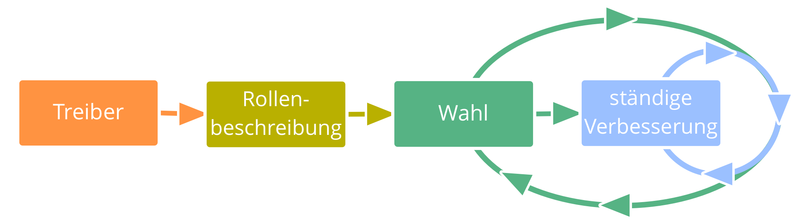

###  Pattern 4.4: Verbindungen

**Ermögliche den Fluss von Information und Einfluss zwischen zwei Gruppen.**

Eine Gruppe bestimmt eines ihrer Mitglieder, um ihre Interessen in den Steuerungsentscheidungen einer anderen Gruppe zu vertreten.

###  Pattern 4.5: Doppelte Verbindung

**Ermögliche *bidirektionalen* Fluss von Information und Einfluss zwischen zwei Gruppen.**

Zwei voneinander abhängige Gruppen wählen jeweils eines ihrer Mitglieder, das die Interessen seiner Gruppe in den Steuerungsentscheidungen der jeweils anderen Gruppe vertritt.

- Die doppelte Verbindung unterstützt Gleichstellung über Gruppengrenzen hinweg.
- In hierarchischen Strukturen kann die doppelte Verbindung helfen, wertvolle Informationen ans Licht zu bringen.

###  Pattern 4.6: Repräsentant (Rolle)

Repräsentanten (auch: Delegierte oder Vertreter):

- vertreten die Interessen einer Gruppe in einer anderen Gruppe
- werden für einen befristeten Zeitraum gewählt
- nehmen als vollwertige Mitglieder an den **Steuerungsentscheidungen** der Gruppe, in die sie delegiert wurden teil. Dort können sie: 
    - Agendapunkte vorschlagen
    - an der Ausarbeitung von Vorschlägen mitwirken
    - (begründete) Einwände gegen Vereinbarungen oder Vorschläge erheben

###  Pattern 4.7: Hilfsteam

Eine Gruppe, die von einer Delegierenden beauftragt wird, konkrete Anforderungen innerhalb festgelegter Rahmenbedingungen abzuarbeiten.

Ein Hilfsteam:

- dient der Delegierenden, um ihre Kapazität zu erhöhen
- kann selbstorganisiert sein oder durch einen Koordinator gesteuert werden, der in der Regel von der Delegierenden bestimmt wird
- wird von der Delegierenden geführt
- profitiert von einer klar definierten Domäne

Mitglieder eines Hilfsteams:

- können Einwände gegen diejenigen Entscheidungen der Delegierenden erheben, die sie direkt betreffen
- können Themen zum Steuerungs-Backlog der Delegierenden hinzufügen
- werden in machen Fällen von der Delegierenden aufgefordert, Repräsentanten in das Steuerungsmeeting der Delegierenden zu entsenden

###  Pattern 4.8: Offene Domäne

**Eine Möglichkeit, die Verantwortung für eine Domäne bewusst einzuladen, statt zu zuzuweisen.**

Die Delegierende der Domäne definiert

- Primärtreiber, Hauptaufgaben und Rahmenbedingungen der offenen Domäne
- wer in der offenen Domäne mitwirken kann
- die Teilhabe der Delegierenden an den Steuerungsentscheidungen der Domäne

Die Delegierende der offenen Domäne ist verantwortlich dafür, dass regelmäßige Reviews stattfinden.

Die Rahmenbedingungen, die von der Delegierenden festgelegt wurden, bestimmen, inwieweit sich die Mitwirkenden zusätzlich zu den operativen Aufgaben auch den Steuerungsaufgaben der offenen Domäne beteiligt sind.

###  Pattern 4.9: offene Systeme

Eine Organisation kann davon profitieren, sich bewusst mit Außenstehenden auszutauschen und von ihnen zu lernen.

Wenn eine Organisation anerkennt, dass sie und ihr Umfeld voneinander abhängig sind, kann sie bewusst **externes Wissen, Kompetenz und Einfluss** einladen, um sie bei Entscheidungen und gemeinsamem Lernen zu unterstützen.

- **Externe Experten** können neue Perspektiven, Wissen und Fähigkeiten einbringen
- **Vertreter betroffener Parteien** können zu Verständnis und Entscheidungsfindung beitragen, so dass gemeinsame Ziele bessern erreicht werden können (siehe Muster: "Die Betroffenen entscheiden")

## S3 einführen 

###  Pattern 5.1: Muster an Kontext anpassen

**Verändere und entwickle S3 Muster, so dass sie zu Deinem speziellen Kontext passen.**

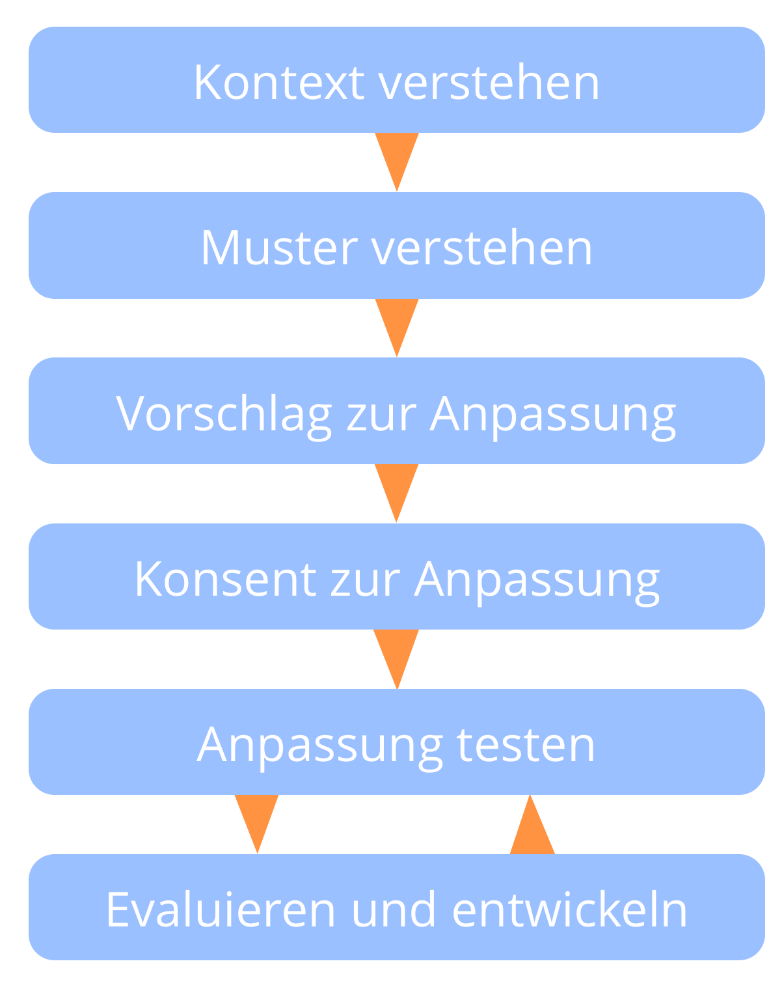

- stelle bei der Anpassung eines Musters sicher, dass alle Betroffenen 
    - versteht warum es notwendig ist, das Muster zu verändern
    - bei der Anpassung einbezogen wird oder zumindest repräsentiert ist
- nutze die sieben Prinzipien als Anhaltspunkte für die Anpassung
- experimentiere mit jeder Veränderung lange genug, um Vorteile und mögliche Fallstricke herauszufinden
- teile wertvolle Anpassungen mit der S3 Community

###  Pattern 5.2: Ein Pull-System für Organisationsentwicklung schaffen

**Gestalte eine Umgebung, die Mitglieder der Organisation dazu einlädt und befähigt, den Wandel selbst voran zu treiben.**

Veränderungen die Wert schaffen:

- Muster einsetzen, die aktuelle, und wichtige Probleme lösen… 
  - … ohne das zu beeinträchtigen, was bereits funktioniert
  - hole alle Beteiligten dort ab, wo sie stehen…
  - … und lasse sie gemeinsam ihr eigenes Tempo wählen
- jede Veränderung sollte freiwillig geschehen

###  Pattern 5.3: Als Beispiel dienen

**Führe als Vorbild.**

Verhalte Dich selbst so, wie Du es Dir von anderen wünschst.

###  Pattern 5.4: Zu Veränderung einladen

**Ein Ansatz für einzelne Personen, um Wandel auszulösen und zu begleiten.**

- Verhalte dich selbst so, wie Du es Dir auch von anderen wünschst.
- Verwende S3-Muster und passe sie an, wann immer das nützlich erscheint
- Erzähle darüber, wie und warum Du S3-Muster verwendest, und erkläre Ergebnisse, Erfolge und Scheitern
- Lade dazu ein, mit Dir zu experimentieren

###  Pattern 5.5: S3 per Open-Space

**Lade alle Mitarbeiter ein, Experimente zur Entwicklung der Organisation zu überlegen und durchzuführen.**

- Beschreibe den Treiber dafür, S3-Muster in der Organisation zu verwenden
- Plane regelmässige Open-Space-Veranstaltungen ein: 
    - lade alle Mitglieder dazu ein, um dort Experimente zu planen
    - lege die Rahmenbedingungen für Experimente fest (z. B. die Prinzipien von S3)
    - überprüfe die Ergebnisse der Experimente beim nächsten Open-Space, um daraus zu lernen
    - gestalte neue Experimente

###  Pattern 5.6: Ständige Verbesserung des Arbeitsablaufes mit S3

**Entdecke Treiber und etabliere ein metrik-basiertes Pull-System für Veränderungen in der Organisation.**

- führe für ein Team das Konsent-Prinzip und das Muster *Navigiere nach Spannung* ein, so dass das Team seine Arbeitsabläufe selbst verbessern kann
- erwäge die Wahl eines Moderators und die Einigung auf gemeinsame Werte
- initiiere kontinuierliche Verbesserung (z.B. per Kanban)
- Teammitglieder führen nach Bedarf selbst weite S3-Muster ein
- erweitere schrittweise den Bereich des Experiments (z.B. auf weitere Teams)
- suche bewusst nach Hindernissen, um diese aufzulösen 

#### Verschwendung und kontinuierliche Verbesserung

**Verschwendung** *ist alles, was für die effektive Antwort auf einen Treiber nicht notwenig ist oder ihr sogar im Wege steht.*

- Verschwendung existiert in verschiedenen Formen und auf unterschiedlichen Abstraktionsebenen (Aufgaben, Abläufe, Organisationsstruktur, Denkmodelle…)
- Eine Vorgehensweise zur ständigen Verringerung von Verschwendung bewirkt eine natürliche Entwicklung einer Organisation hin zu größerer Effektivität
- Anpassung an ein sich veränderndes Umfeld passiert dabei ganz automatisch

## Klare Vereinbarungen 

### Lebenszyklus von Vereinbarungen

###  Pattern 6.1: Vereinbarung

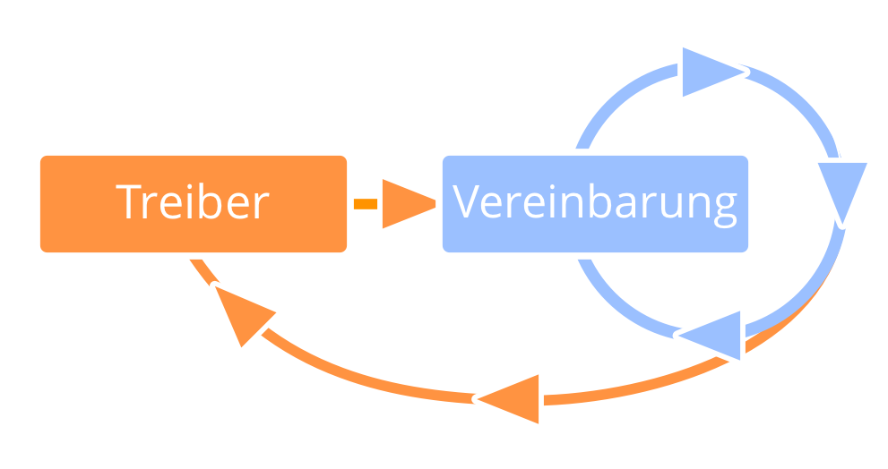

_Eine **Vereinbarung** ist eine (gemeinsam) beschlossene Richtlinie, oder ein Prozess oder Protokoll, um den Wertfluss in der Organisation zu gestalten._

- Vereinbarungen beziehen sich auf Treiber 
- die **Verantwortung** für eine Vereinbarung liegt bei den Personen, die diese Vereinbarung getroffen haben
- Vereinbarungen werden **regelmäßig geprüft**

**Anmerkung**: Richtlinien, Prozesse oder Protokolle, die von Mitarbeitern in Rollen erstellt und entwickelt werden, können wie Vereinbarungen behandelt werden.

#### Vorlage für Vereinbarungen

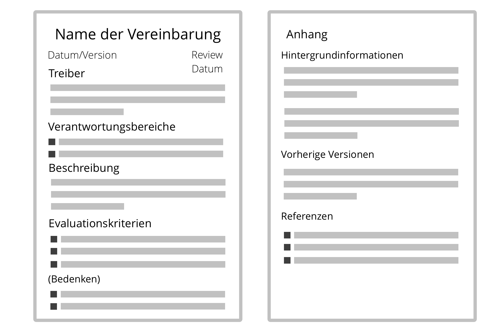

###  Pattern 6.2: Strategie entwickeln

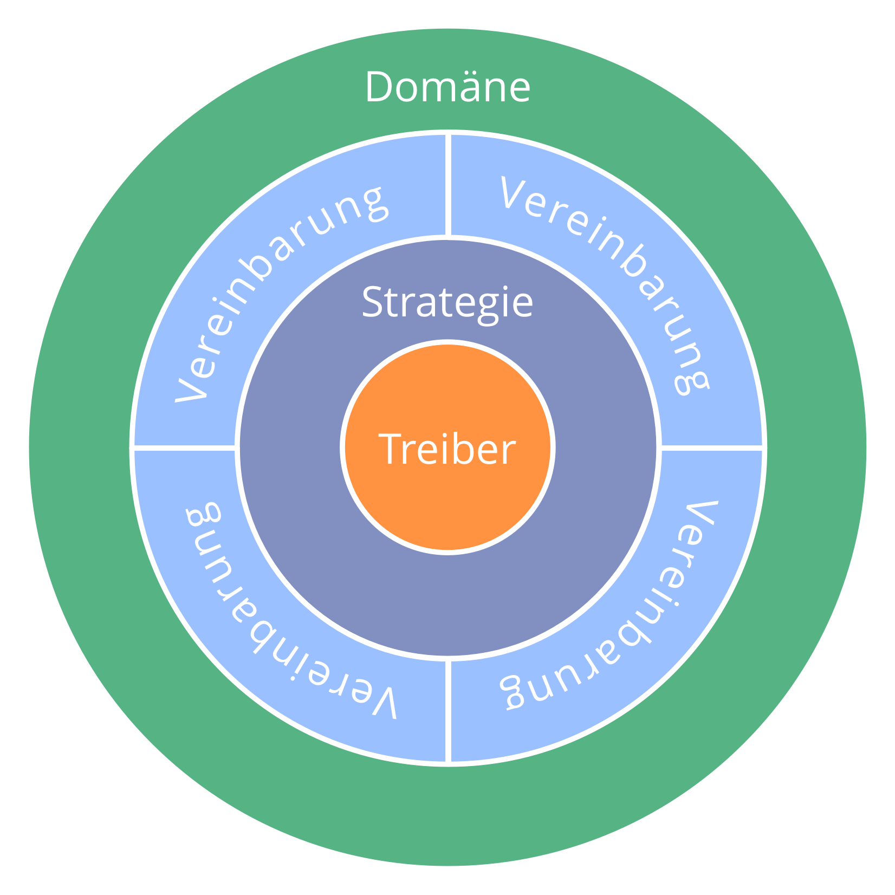

_Eine **Strategie** ist der Ansatz, wie Mitarbeiter planen, in einer bestimmten Domäne Wert zu schöpfen._

- die Strategie wird jeweils von der Organisation, Gruppe bzw. dem Mitarbeiter in der Rolle selbst erarbeitet
- eine Strategie enthält typischerweise eine Beschreibung des angestrebten Ergebnisses
- da die Delegierende weiterhin für die Domäne verantwortlich bleibt, ist es hilfreich, wenn sie die Strategie prüft, potenzielle Hindernisse identifiziert und Verbesserungsvorschläge einbringt 
- die Strategie ist eine Vereinbarung zwischen Delegierender und Domänenverantworliche(n), die regelmäßig geprüft und angepasst werden sollte

#### Strategien werden durch Experimente umgesetzt und mit den gewonnenen Erkenntnissen iterativ verfeinert.

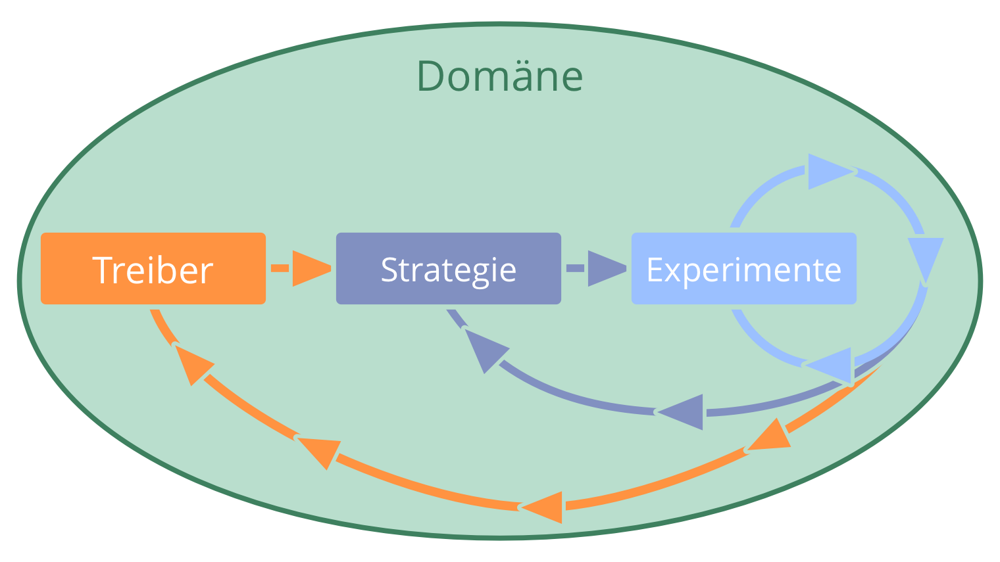

###  Pattern 6.3: Domänen klären

Ein klares Verständnis der jeweiligen Verantwortungs- und Autonomiebereiche fördert Effizienz, effektive Zusammenarbeit und Agilität in der gesamten Organisation.

Eine einfache Möglichkeit, Domänen zu klären ist eine **Domänenbeschreibung**, mit folgendem Inhalt:

- Primärtreiber
- Kernaufgaben
- Einschränkungen
- Bewertungskriterien für Entwicklungsgespräche
- Amtszeit (für Rollen)
- (vorherige Versionen der Domänenbeschreibung)

Domänenbeschreibungen können für Rollen, Positionen, Kreise, Teams, offene Domänen, Abteilungen, Geschäftseinheiten oder auch für die gesamte Organisation erstellt werden.

Je nach Bedarf kann man in einer Organisation zuerst existierende Domänen klären, oder nur die Domänen, die neu geschaffenen werden.

###  Pattern 6.4: Angestrebtes Ergebnis

- Eine knappe Beschreibung des erwarteten Ergebnisses einer Vereinbarung, Handlung, Strategie oder eines Projekts
- Spezifische *Evaluationskriterien* und Metriken können bei der Überprüfung der Ergebnisse hilfreich sein

###  Pattern 6.5: Leistungen definieren

Eine **Leistung** wird als Ergebnis einer Vereinbarung in Reaktion auf einen Treiber angeboten. Leistungen umfassen Produkte, Materialien, Dienstleistungen, Erfahrungen und Transformationen.

Im Kontext einer Vereinbarung unterstützt die klare Definition von Leistungen das gemeinsame Verständnis:

- beschreibe ausreichend detailliert
- beziehe dich auf andere Dokumente, wo hilfreich oder notwendig

Leistungen explizit zu definieren kann hilfreich sein zur Weiterentwicklung:

- der Strategie der Organisation
- der Strategie eines Kreises
- eines Entwicklungsplans für einerRolle oder einen Kreises
- der Beschreibung einer Domäne
- jeder anderen Vereinbarung (z.B. wirtschaftliche Ziele, Arbeitsprozesse, Kundenkommunikation)

###  Pattern 6.6: Evaluationskriterien

Klar definierte Evaluationskriterien können helfen, ein gemeinsames Verständnis dafür zu entwickeln, ob eine Vereinbarung die erwünschten Ergebnisse gebracht hat.

- Wähle **einfache und eindeutige** Kriterien und dokumentiere sie (um Diskussionen bei der Überprüfung zu vermeiden).
- Definiere **handlungsorientierte Metriken**, um Ergebnisse laufend verfolgen und Abweichungen von beabsichtigten Ergebnissen erkennen zu können.

###  Pattern 6.7: Logbuch

Ein Logbuch ist ein (digitales) System zur Speicherung aller für den Betrieb einer Organisation und ihrer Teams relevanten Informationen. Das Logbuch ist allen Mitgliedern einer Organisation zugänglich; einzelne Informationen können vertraulich behandelt werden, wenn dafür ein guter Grund besteht.

Verbreitete Plattformen für Logbücher sind Wikis (wie DokuWiki oder MediaWiki), Content-Management-Systeme (z.B. WordPress), G Suite, Evernote oder Trello.

#### Inhalt des Logbuchs

- Organisation:
    
    - Primärtreiber, Strategie und Werte der Organisation
    - Organisationsstruktur (Domänen und ihre Verbindungen)
    - Vereinbarungen 

- Kreis:
    
    - Beschreibung des Kreises, Strategie
    - Vereinbarungen (einschließlich Beschreibung, Strategien und Entwicklungspläne der Subdomänen)
    - Backlogs und weitere Informationen zu Arbeit und Steuerung des Kreises

- Persönliche Logbücher 
    - Domänenbeschreibungen, Strategien und Entwicklungspläne
    - Steuerungs- und operative Backlogs für Rollen
    - Entscheidungen bezogen auf die Wertschöpfung in Rollen

###  Pattern 6.8: Logbuchführer (Rolle)

Der Logbuchführer ist verantwortlich für die Pflege des Logbuchs des Kreises:

- Dokumentation von relevanten Details zu Vereinbarungen, Domänenbeschreibungen, Wahlen, Evalutionsterminen, Sitzungsprotokollen etc.
- Organisation der Information, und Verbesserung des Logbuch-Systems
- Aktualisierung des Logbuchs
- Sicherstellung des Zugangs der Kreismitglieder (und der Gesamtorganisation, je nach Vereinbarung) zum Logbuch
- Betreuung aller technischen Aspekte der Logbuchführung

## Fokussierte Interaktionen 

###  Pattern 7.1: Steuerungs-Meeting

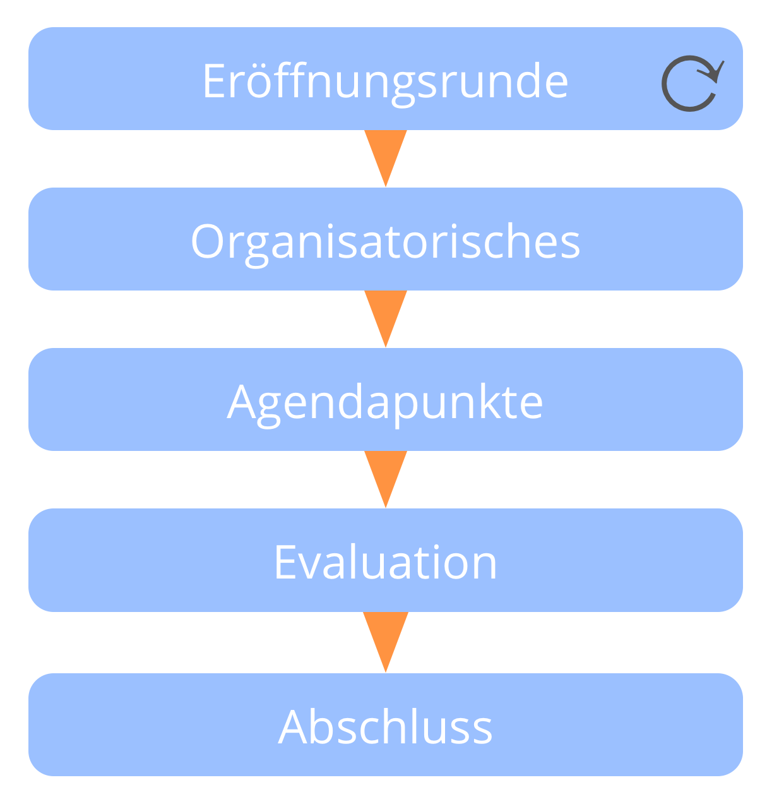

Gruppen treffen sich in regelmäßigen Abständen um zu entscheiden, wie sie vorgehen, um ihre Ziele zu erreichen, und um inhaltliche und zeitliche und Rahmenbedingung für ihre Arbeit festzulegen.

Ein Steuerungstreffen ist meistens:

- moderiert 
- vorbereitet 
- zeitlich beschränkt (i.d. R. zwischen 90 und 120 Minuten)
- ... und findet alle 4 Wochen statt

Ablauf eines typischen Steuerungstreffen:

- Eröffnungsrunde: einstimmen aufeinander, und auf die Ziele (bzw. den Treiber) der Gruppe
- Organisatorisches 
    - Konsent zum letzten Protokoll, Datum des nächsten Treffens etc.
    - Last-Minute-Agendapunkte, und Konsent zur Agenda
- Agendapunkte abarbeiten 
- Treffen evaluieren: Reflexion der Interaktionen, Erfolge zelebrieren, Verbesserungsvorschläge überlegen
- Abschluss

Typische Agendapunkte:

- kurze Berichte 
- Evaluation von Vereinbarungen
- neue Treiber, die Entscheidungen erfordern 
    - gemeinsam Situationen verstehen, die eine Reaktion erfordern 
    - Vorschläge erarbeiten und Vereinbarungen treffen 
    - neue Rollen und Gruppen schaffen 
    - existierende Rollen und Teams evaluieren
    - Personen in Rollen wählen

###  Pattern 7.2: Retrospektive

Kontinuierliche Verbesserung der Arbeitsabläufe durch Reflexion und Lernen aus der Vergangenheit

- Ergebnis: Änderungen am Arbeitsprozess, neue Aufgaben, ad-hoc Vereinbarungen, sowie Treiber, die eine Vereinbarungen erfordern
- moderiertes Meeting (ca. 1h)
- findet in regelmäßigen Abständen statt (1-4 Wochen)
- Format wird jeweils an Situation und Kontext angepasst

#### Ergebnis einer Retrospektive

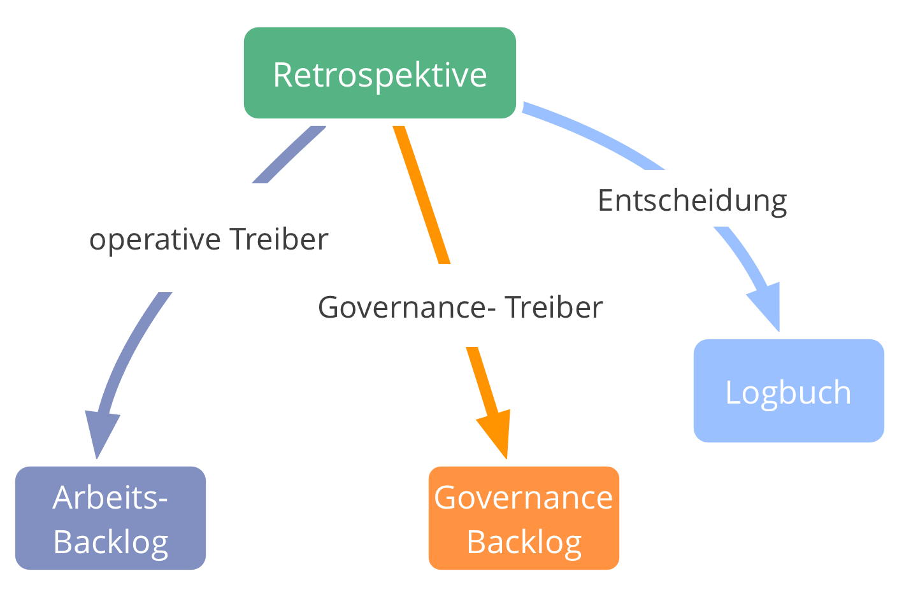

#### Fünf Phasen einer Retrospektive

1. Einstimmung 
2. Informationen sammeln
3. Erkenntnisse gewinnen
4. Maßnahmen beschließen
5. Abschluss

Die Website [plans-for-retrospectives.com](http://www.plans-for-retrospectives.com/) bietet zahlreiche Aktivitäten für alle Phasen.

###  Pattern 7.3: Daily Standup

**Ein tägliches Meeting um Arbeitsaufgaben zu koordinieren, Produktivität und Effektivität zu erhöhen, und gemeinsames Lernen zu ermöglichen.**

- feste Timebox (üblicherweise 15 min.)
- findet jeden Tag zur selben Zeit und am selben Ort statt
- die Gruppe versammelt sich um das Taskboard (oder ein anderes visuelles Projektmanagement-Werkzeug) 
    - Koordination der Arbeit für den Tag
    - Hindernisse und Blocker besprechen
    - Beschluss neuer oder Anpassung bestehender Vereinbarungen

###  Pattern 7.4: Planungs- und Review-Meetings

Gruppen halten in regelmäßigen Abständen (1-4 Wochen) zeitlich begrenzte Meetings, um Iterationen zu planen und zu evaluieren

- Im Planungsmeeting werden die Arbeitspakete für die nächste Iteration ausgewählt und dabei, soweit erforderlich, Zeitschätzungen durchgeführt.
- Im Review werden die abgeschlossenen Arbeitspakete besprochen, um erforderliche Nachbesserungen und Änderungen für die nächste Iteration zu identifizieren.

###  Pattern 7.5: Koordinationsmeeting

**Halte regelmäßige Treffen (typischerweise wöchentlich), um Bericht zu erstatten und Arbeitsaufgaben zu koordinieren.**

- sorge für Moderation, und bevorzuge Runden (anstatt Diskussionen)
- erstelle die Agenda möglichst vor dem Meeting: 
    - stelle alle Informationen bereit, die die Teilnehmer zur Vorbereitung benötigen
    - aus den Berichten können sich während des Meetings neue Agendapunkte ergeben

### Koordinationsmeeting

- Statusberichte: 
    - Kreismetriken (falls vorhanden)
    - Projekte und Aufgaben
- Agendapunkte 
    - Informationen weitergeben
    - Aufgaben und Projekte aktualisieren oder erfassen
    - neue Vereinbarungen treffen oder bestehende aktualisieren

## Effektive Meetings 

###  Pattern 8.0: Meetings evaluieren

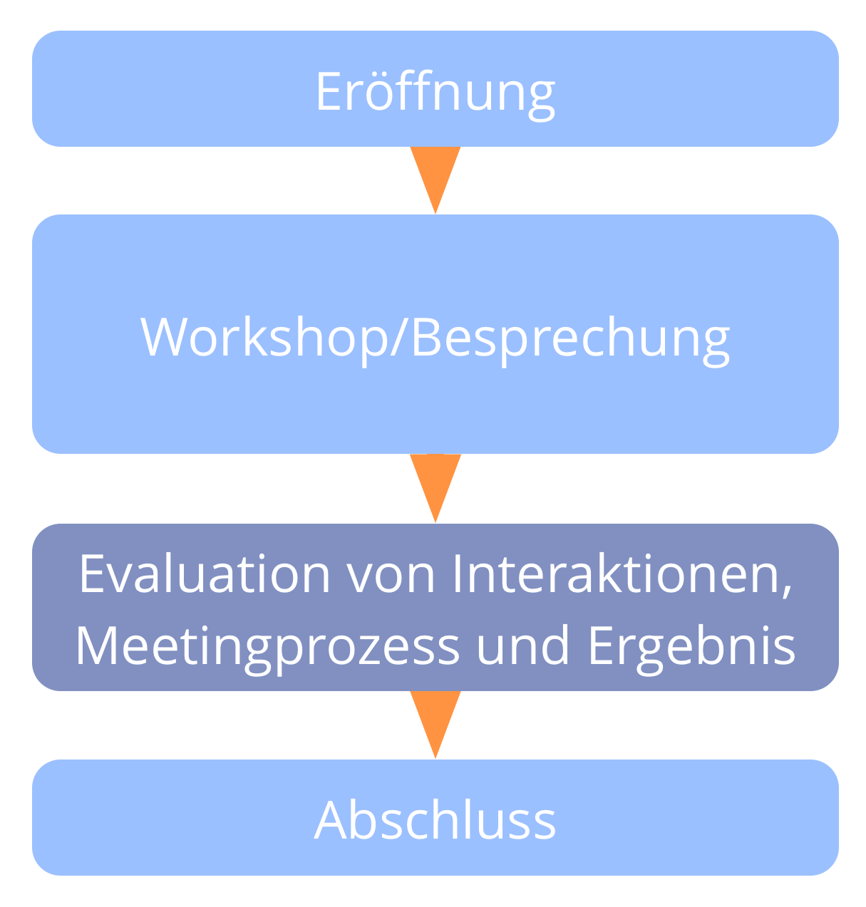

**Investiere etwas Zeit in gemeinsame Reflexion am Ende jedes Meetings oder Workshops.**

Gemeinsam über Interaktionen nachdenken, Erfolge feiern und Verbesserungsvorschläge machen.

- vor der Abschlussrunde
- reserviere 5 Minuten für ein einstündiges Meeting, und 15 Minuten für einen Tagesworkshop
- dokumentiere das Gelernte, und betrachte es vor dem nächsten Meeting
- kurze Formate: 
    - mehr / weniger / anfangen / aufhören / beibehalten
    - positiv / kritisch / Verbesserungsvorschläge

#### Meetings evaluieren: ausführliches Format

Lade alle ein, in einer Runde kurz auf einige oder alle der folgenden Punkte einzugehen:

- Effektivität und Format
- Moderation und Teilnahme
- Umgang miteinander
- Würdigungen und Erfolge ("Mir gefiel …")
- Verbesserungsvorschläge ("Ich wünschte …")
- Wilde Ideen und radikale Vorschläge ("Was wäre, wenn …")

###  Pattern 8.1: Runden

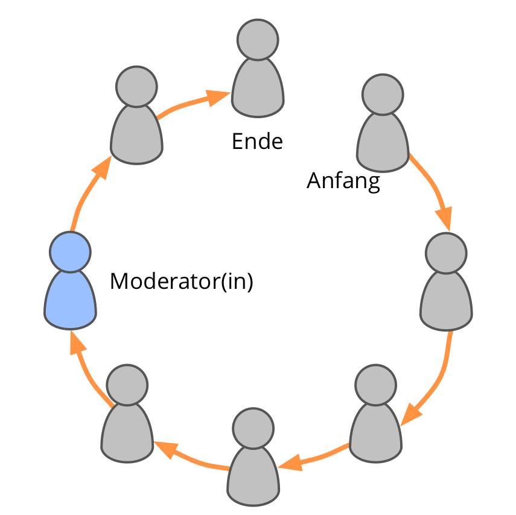

**Eine Moderationstechnik, die die Gleichstellung in Gruppen unterstützt.**

- Gib jedem im Kreis der Reihe nach die Gelegenheit, zu sprechen.
- Beginne jede Runde mit einer anderen Person, und ändere die Richtung (im oder gegen den Uhrzeigersinn), um den ersten und letzten Beitrag, sowie die Reihenfolge der Teilnehmer zu variieren.

Erfahrene Gruppen entscheiden sich manchmal dafür, bestimmte Runden in S3-Gruppenprozessen durch andere Formate zu ersetzen.

###  Pattern 8.2: Meetings moderieren

Bestimme für jedes Meeting einen Moderator. Auch ein unerfahrener Moderator kann der Gruppe helfen, sich auf das Thema zu fokussieren. 

- bereite eine Agenda vor
- wähle einen Moderator, der … 
    - für jedes Thema eine passende Aktivität moderiert
    - einen sicheren Rahmen schafft und auf die Zeit achtet
    - am Ende jedes Meetings eine kurze Evaluation durchführt

###  Pattern 8.4: Gastgeber(in) (Rolle)

Die Gastgeberin ist verantwortlich für Vor- und Nachbereitung von Meetings, Workshops oder anderer Veranstaltungen.

Die Rolle kann vorübergehend (z. B. nur für eine bestimmte Veranstaltung) oder für einen definierten Zeitraum vergeben werden.

#### Aufgaben der Gastgeberin

- Vorbereitung 
    - Ziele und gewünschte Ergebnisse identifizieren
    - Tagesordnung und Zeitplan vorbereiten und verteilen
    - erforderliche Zeit schätzen
    - Teilnehmer aussuchen und einladen
    - Termin vereinbaren
    - Veranstaltungsort buchen (und bei Bedarf Anreise planen)
    - Raum vorbereiten, notwendige Materialien und Informationen bereitstellen
    - Wahl eines Moderators (und bei Bedarf eines Protokollführers) sicherstellen
- Nachbereitung 
    - Raum aufräumen, Schlüssel zurückgeben etc.
    - sicherstellen, dass das Protokoll verteil wird

###  Pattern 8.5: Steuerungs-Backlog

_Ein **Steuerungs-Backlog** ist eine sichtbare, priorisierte Liste von Themen (Treibern), die in Bezug auf die Governance einer Domäne bearbeitet werden müssen._

- anstehende Berichte
- notwendige Entscheidungen
- Vorschläge, die erarbeitet und evaluiert werden müssen
- Vereinbarungen, die geprüft werden müssen
- Besetzung von Rollen

## Arbeitsorganisation 

###  Pattern 9.1: Backlog

_Ein **Backlog** (Aufgabenliste) ist eine sichtbare Liste aus (meist priorisierten)  Aufgaben, die noch abgearbeitet werden müssen._

Typische Backlogs:

- Arbeits-Backlog (To-Do-Liste)
- Sprint-Backlog
- Produkt-Backlog
- Impediment-Backlog

- **Umsetzung** 
    - **analoges Backlog**: Haftnotizen an einer Wand, oder Karteikarten mit Magneten an einem Whiteboard
    - **digitales Backlog**: z.B. Google Sheets, Trello, Kanban Flow, Jira, Asana

Jedes Element in einem (priorisierten) Backlog hat:

- eine **kurze Beschreibung**
- eine **eindeutige Referenznummer** (oder ein Link) für jedes Element 
- (eine **Priorität** oder ein anderes Merkmal, das die Reihenfolge anzeigt)
- **Abhängigkeiten** zu anderen Aufgaben oder Projekten
- **Fälligkeitsdatum** (falls erforderlich)
- (optional) ein Maß für **Wert** 
- (optional) ein Maß für **Aufwand** (oft als Zeit- oder Komplexitätsschätzung)

###  Pattern 9.2: Backlogs priorisieren

Ordne **alle unerledigten Aufgaben** so, dass die wichtigsten zuerst kommen:

- Aufgaben werden von oben gezogen, sobald Kapazität frei wird
- keine zwei Elemente können dieselbe Wichtigkeit haben, d.h. es ist notwendig, sich auf Prioritäten zu einigen und harte Entscheidungen zu treffen
- **Vorteile** 
    - der Fokus liegt immer auf den momentan wichtigsten Aufgaben
    - gemeinsames Verständnis von Prioritäten ermöglicht effektivere Zusammenarbeit

###  Pattern 9.3: Arbeit visualisieren

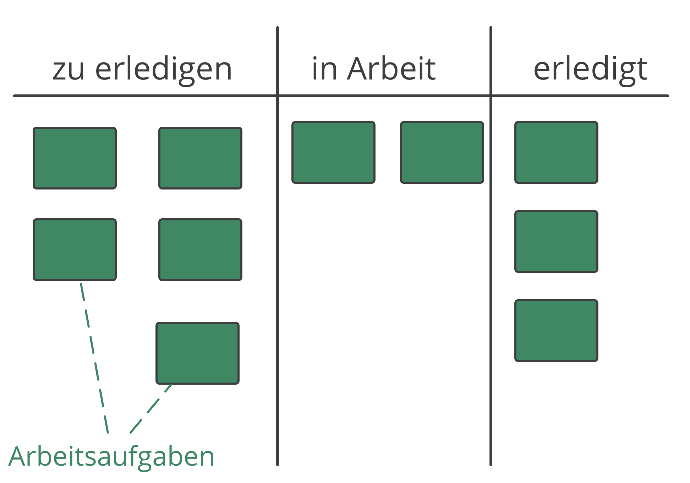

Transparenz bzgl. des Status aller Arbeitsaufgaben, die anstehen, in Arbeit sind, oder bereits abgeschlossen wurden.

- essentiell für Selbstorganisation und Pull-Systeme
- das System muss für alle Betroffenen zugänglich sein
- **analog**: Haftnotizen an der Wand, oder Karteikarten, Magnete und Whiteboard
- **digital**: Trello, Kanbanery, Leankit, Jira, Google Sheets, etc.

#### Für jede Arbeitsaufgabe sollten folgende Dinge ersichtlich sein:

- **Art der Aufgabe** (z.B. Kundenwunsch, Projektaufgabe, Report, Nachbesserung)
- **Startdatum** (und **Fälligkeitsdatum** falls erforderlich)
- **Priorität**
- **Zustand** der Aufgabe (z.B. "unerledigt", "in Arbeit", "Review" and "erledigt")
- Hindernisse oder Blockaden
- Bearbeiter
- Vereinbarungen und Erwartungen zum Arbeitsablauf (z.B. Definition of Done, Policies, Qualitätsstandards)
- nutze Farben, Symbole, Highlights etc.

###  Pattern 9.4: Arbeiten nach Pull-System

- Mitarbeiter holen sich neue Arbeit, wenn sie Kapazität haben (anstatt dass ihnen Arbeit zugeteilt wird)
- priorisiere vorhandene Arbeitsaufgaben, so dass sichergestellt ist, dass die wichtigsten Aufgaben zuerst abgearbeitet werden
- Pull-Systeme verhindert die Überlastung des Systems (dieser Effekt wird noch verstärkt, wenn man zusätzlich auch Zahl der gleichzeitigen Arbeitsaufgaben pro Mitarbeiter beschränkt)

###  Pattern 9.5: Laufende Arbeit begrenzen

**Begrenze die Anzahl an Arbeitsaufgaben für jeden Schritt deiner Arbeitsprozesse**

Laufende Arbeit beinhaltet

- die Anzahl der Elemente im Backlog
- gleichzeitige Projekte oder Aufgaben für Gruppen oder Personen
- Produkte im Portfolio

Wenn eine Aktion eine vereinbarten Grenze überschreiten würde, muss dies zuerst mit der Gruppe diskutiert werden

###  Pattern 9.6: Fluss angleichen

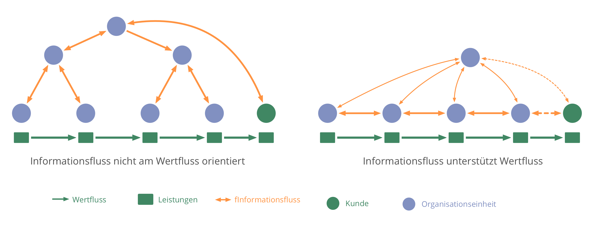

- In einer effektiven Organisation **unterstützt der Fluss von Information und Einfluss den kontinuierlichen Wertfluss**.
- Beide Flüsse können durch die kontinuierliche Verbesserung von Vereinbarungen schrittweise angeglichen werden.

#### Wertfluss

- Der Wertfluss durch die Organisation wird durch (explizite und implizite) Vereinbarungen und Annahmen geleitet.
- Noch unfertige Arbeit wird als Verschwendung betrachtet, weil sie Ressourcen bindet, aber noch kein Wert geschaffen wurde.
- Kontinuierlicher Wertfluss sorgt dafür, dass sich weniger Verschwendung ansammeln kann. 
    - Zudem schafft er schnellere Rückmeldung und verstärkt dadurch das Lernpotenzial.

###  Pattern 9.7: Koordinator(in)

Die Koordinatorin ist verantwortlich für die **Koordination der Arbeit einer Gruppe** und wird **für einen festgelegten Zeitraum gewählt**

- die Koordinatorin wird entweder von der Gruppe selbst gewählt, oder von der Delegierenden
- mehrere Koordinatorinnen können zusammenarbeiten, um Arbeit über mehrere Domänen hinweg zu koordinieren
- anstatt eine Koordinatorin zu wählen, kann sich eine Gruppe auch selbst organisieren

## Organisationsstruktur 

Organisationsstruktur ist das momentane Gefüge von Domänen und deren Verbindungen. Sie zeigt Entscheidungskompetenzen und die Kanäle, durch die Einfluss und Information fließen.

Eine effektive Organisationsstruktur:

- unterstützt den Wertfluss
- ermöglicht Zusammenarbeit
- behandelt Abhängigkeiten und macht sie explizit
- stellt sicher, das Information dort verfügbar ist, wo sie gebraucht wird
- verteilt Einflussmöglichkeiten nach tatsächlichem Bedarf
- entwickelt sich kontinuierlich, um sich an veränderte Rahmenbedingungen anzupassen

Die Grundbausteine für Organisationsstruktur sind voneinander abhängige und verbundene Domänen.

Domänen werden verbunden zu Hierarchien oder **Heterarchien** (auch bekannt als komplexe adaptive Systeme oder Netzwerke, in denen mehrere funktionale Strukturen parallel existieren können).

### Strukturmuster

Soziokratie 3.0 beschreibt verschiedene Strukturmuster, aus denen eine große Vielfalt von unterschiedlichen Organisationsstrukturen entwickelt werden kann.

- Muster haben unterschiedliche Abstraktionsebenen
- unterschiedliche Strukturmuster lösen unterschiedliche Probleme
- Strukturmuster können nach Bedarf angepasst und kombiniert werden
- weitere Strukturmuster werden entdeckt und beschrieben werden
###  Pattern 10.0: doppelt verbundene Hierarchie

**Erzeuge Gleichstellung in hierarchischen Systemen.**

- die Organisation wird aus teilautonomen und selbststeuernden Kreise aufgebaut
- jeder Kreis wählt ein Mitglied zur Vertretung seiner Interessen in Steuerungsentscheidungen in den nächsthöheren Kreis, und umgekehrt
- eine funktionale Hierarchie ist weiterhin möglich (falls wertvoll)

###  Pattern 10.1: Servicekreis

**Lagere Dienstleistungen aus, die von zwei oder mehr Domänen benötigt werden.**

Ein Servicekreis wird von Mitgliedern der Domänen besetzt, denen er dient; bei Bedarf können auch zusätzliche Personen hinzugezogen werden.

###  Pattern 10.2: Delegiertenkreis

**Entscheide gemeinsam über den Umgang mit Treibern, die mehrere Domänen betreffen.**

Die Entscheidungen eines Delegiertentenkreises werden in den einzelnen Domänen ausgeführt, denen dieser Kreis dient.

Jeder Kreis wählt ein oder mehrere Mitglieder als Vertreter in den Delegiertenkreis.

Delegiertenkreise steuern eine Organisation nach dem Wertfluss, und ermöglichen die Integration einer Vielfalt an Perspektiven in Steuerungsentscheidungen.

###  Pattern 10.3: Pfirsichorganisation

Wertschöpfung in komplexen und kompetitiven Umgebungen durch **Dezentralisierung** (von Ressourcen und Einfluss) und **direkte Interaktion** zwischen Mitarbeitern und den Kunden, für die sie Wert schöpfen.

- Kreise in der Peripherie schaffen Wert in direktem Austausch mit der Außenwelt (Kunden, Partner, Kommunen, Communities etc.) 
- das Zentrum erbringt Dienstleistungen, um die Peripherie zu unterstützen
- die Peripherie verwaltet die Finanzen und steuert die Organisation
- verbinde Domänen so, dass Abhängigkeiten über den Fluss von Informations und Einfluss abgebildet werden

###  Pattern 10.5: Service-Organisation

**Zusammenarbeit mehrerer Stakeholder, und Ausrichtung auf ein gemeinsames Ziel (bzw. Treiber).**

- verbessert die Gleichstellung der beteiligten Organisationen
- ermöglicht gemeinsame Ausrichtung über Abteilungs- und Organisationsgrenzen hinweg
- unterstützt die Zusammenarbeit zwischen Organisationen bzw. Abteilungen, die unterschiedlichen Ziele verfolgen, oder sich im Konflikt miteinander befinden
- geeignet für einmalige Projekte oder fortwährende Zusammenarbeit

**Anmerkung:** das Muster "Service-Organisation" wird gelegentlich auch als **Backbone-Organisation** bezeichnet.

###  Pattern 10.6: Fraktal-Organisation

Mehrere Organisationen (oder Domänen) mit ähnlichen Strukturen und Zielen tauschen sich über Erfahrungen aus, und koordinieren ihre Aktivitäten (falls hilfreich).

- eine Möglichkeit, mehrere Organisationen gemeinsam zu steuern, und gleichzeitig die Autonomie der einzelnen Organisationen weitgehend zu erhalten
- diese Struktur fördert bedarfsorientiert Innovation und Erfahrungsaustausch auch in großen Communities

# Anhang

## Änderungsprotokoll 

### Änderungen zum 21.3.2018

- das Muster *Treiber beschreiben* wurde umbenannt in *Organisationstreiber beschreiben*
- *Organisationstreiber beschreiben*: Erklärung der vier Aspekte eines Treibers: aktuelle Situation, Effekt der Situation auf die Organisation, Bedarf der Organisation in Bezug auf die Situation, und die Konsequenzen, wenn der Bedarf gedeckt wird
- *Bedarf* zum Glossar hinzugefügt

### Änderungen zum 16.11.2017

- kleine Korrekturen
- Glossareinträge für *Kreis* und *Rolle* an Beschreibung der Muster angepasst
- *Entwicklungsplan*: Zuständigkeiten genauer erklärt
- *Rolle*: Entwicklung der Strategie genauer erklärt

### Änderungen zum 10.11.2017

- verschiedene Klarstellungen und Korrekturen
- *Kreis*: Klärung der Beziehung zwischen Kreis und Domäne
- *Rolle*: Beschreibung überarbeitet
- *Runden*: Beschreibung aktualisiert
- *Offene Domänen*, *Hilfsteam* und *Offene Systeme* in die Kategorie "Organisationsentwicklung" verschoben
- mehrere Begriffe zum Glossar hinzugefügt

### Änderungen zum 21.10.2017

- Liliana Davids zu Autoren hinzugefügt
- den Begriff «Framework» fallen gelassen (ersetzt durch «Praktischer Leitfaden»)
- Reihenfolge der Patterns aktualisiert
- Index aller Patterns hinzugefügt 
- Glossar hinzugefügt 
- Danksagungen hinzugefügt
- mehrere kleinere Klärungen und Korrekturen an Texten und Illustrationen
- Vorlagen für Vereinbarungen und Entwicklungsplan angepasst

- Einführung: 
    - neuer Abschnitt "was habe ich davon?"
    - Definitionen für Governance, Selbstorganisation, Teilautonomie und operatives Geschäft hinzugefügt
    - Klärung von Domänen und ihrer Beziehung zu Treibern 
    - Kernkonzepte besser erklärt
    - handlungsorientierte Beschreibung der Prinzipien

- *Kunstvolle Teilnahme*: Beschreibung überarbeitet
- *Vereinbarung*: Erklärung, dass das Konzept von Vereinbarungen auch innerhalb einer Rolle angewendet werden kann
- *Domänen klären*: Beschreibung überarbeitet
- *Kreis*: Beschreibung überarbeitet und aktualisiert
- *Treiber*: Definition überarbeitet
- *Entwicklungsplan*: Beschreibung und Vorlage überarbeitet
- *Strategie entwickeln*: Beschreibung überarbeitet, klare Definition von Strategie
- *doppelt verbundene Hierarchie*: neue Illustration

- *Vereinbarungen prüfen*: Fragen an Peer-Review angepasst
- *Steuerungs-Backlog*: Definition überarbeitet
- *Logbuch*: Informationen zu Governance in persönlichen Logbüchern
- *Einwände*: Abschnitt zur Qualifikation von Einwänden überarbeitet
- *Peer-Review*: Beschreibung überarbeitet
- *Auf Organisationstreiber reagieren*: Abschnitt zur Qualifikation von Treibern eingefügt
- *Rolle*: der Inhaber einer Rolle kann ein Steuerungsbacklog führen
- *Proposal Forming*: Beschreibung überarbeitet, Schritt zur Priorisierung der Kriterien hinzugefügt, Fragen zur Auswahl von Gestaltern hinzugefügt, 
- *Einwände integrieren*: neue Illustration

**Folgende Muster wurden umbenannt:**

- *Backbone-Organisation* in *Serviceorganisation*
- *Entwicklungsgespräch* (nur auf Englisch umbenannt)
- *Strategie* in *Strategie entwickeln*
- *Domänenbeschreibung* in *Domänen klären*
- *Leistungen definieren* (nur auf Englisch umbenannt)

**Folgende Muster wurden hinzugefügt:**

- *Einfluss delegieren*
- *Treiber beschreiben*
- *Offene Domäne*

**Folgende Muster wurden entfernt:**

- *Koordinationskreis*
- *Verschachtelte Domänen*
- *Treiber beurteilen*

## Links

**Neueste Version dieses Praxisleitfadens**: <http://sociocracy30.org/guide/>

**S3 Webseite**: <http://sociocracy30.org>

Folge uns auf **Twitter**: [@sociocracy30](http://twitter.com/@sociocracy30)

## Lizenz

Dieses Werk von Bernhard Bockelbrink, James Priest und Liliana David ist lizenziert unter der Creative Commons Attribution-ShareAlike 4.0 International License. Besuchen Sie <http://creativecommons.org/licenses/by-sa/4.0/>, um die Lizenz einzusehen.

Die aktuellste Fassung dieses Praxisleitfadens ist verfügbar unter <http://sociocracy30.org>

## Danksagung

Soziokratie 3.0 ist das Ergebnis von über Generationen gesammelter Weisheit und Erfahrungen. Allen Mitwirkenden gemein ist das Streben danach, neue Wege zu harmonischer, bewusster und effektiver Zusammenarbeit zu entwickeln.

Besondere Anerkennung gebührt Gerard Endenburg und allen anderen, die viel Zeit in die Entwicklung und Dokumentation der Soziokratischen Kreismethode investierten, welche wiederum eine wesentliche Inspiration für Soziokratie 3.0 darstellt.

Weiterhin danken wir all jenen, die unermüdlich an der Förderung einer agilen Geisteshaltung arbeiten, und agile Praktiken entwicklen und teilen. 

Schlussendlich gebührt unser Dank unseren zahlreichen Kollegen und Kunden - sowie den Teilnehmern unserer Kurse und Workshops - die sich entschlossen haben, Soziokratie 3.0 kennenzulernen und damit zu experimentieren. Danke für Euer wertvolles und wertschätzendes Feedback, das uns hilft, zu lernen und zu wachsen, und die Muster in S3 weiterzuentwickeln.

Folgenden Personen wollen wir besonders danken für ihren Beitrag zu Soziokratie 3.0, oder für ihre Arbeit, die S3 wesentlich beeinflusst hat:

Gojko Adzic, Lysa Adkins, Christopher Alexander, David J. Anderson, Ruth Andrade, Jurgen Appelo, Kent Beck, Sue Bell, Jesper Boeg, Kees Boeke, Mary Boone, John Buck, Betty Cadbury, Diana Leafe Christian, Mike Cohn, Stephen Covey, Gigi Coyle, Jef Cumps, David Deida, Esther Derby, Kourosh Dini, Jutta Eckstein, Frands Frydendal, Gerard Endenburg, Andreas Hertel, Andrei Iuoraia, Francois Knuckel, Diana Larsen, Helmut Leitner, Jim and Michele McCarthy, Pieter van der Meche, Daniel Mezick, Susanne Mühlbauer, Niels Pfläging, Mary and Tom Poppendieck, Karl Popper, Brian Robertson, Marshall Rosenberg, Dave Snowden, Hal and Sidra Stone, Ken Schwaber, Jeff Sutherland, Sharon Villines, Nathaniel Whitestone, Ken Wilber, Jack Zimmerman.

## James Priest

… bietet seine Unterstützung international an; Beratung zu Organisationsentwicklung, Lernbegleitung, sowie Mentoring für Menschen, die kollaborative, adaptive Organisationen in grösserem Rahmen entwickeln möchten.

[thriveincollaboration.com](http://thriveincollaboration.com)

<james@thriveincollaboration.com>

## Bernhard Bockelbrink

... unterstützt als Agile-Coach, Trainer und Berater Personen, Teams und Organisationen darin, komplexen Herausforderungen erfolgreich zu begegnen, und dabei eine Kultur effektiver, bewusster und freudvoller Zusammenarbeit zu entwickeln.

[evolvingcollaboration.com](http://evolvingcollaboration.com)

<bernhard.bockelbrink@gmail.com>

## Liliana David

… bietet ihre Unterstützung international an; Training, Prozessbegleitung und Mentoring für Gruppen und Organisationen mit dem Wunsch, grössere Effektivität und Gleichberechtigung in der Zusammenarbeit zu entwickeln.

[thriveincollaboration.com](http://thriveincollaboration.com)

<lili@thriveincollaboration.com>

## Glossar 

**(etwas) verantworten**: Die Verantwortung für etwas übernehmen, das getan werden muss.

**Backlog**: Eine sichtbare Liste aus (meist priorisierten)  Aufgaben, die noch abgearbeitet werden müssen.

**Beauftragte**: Eine Person oder Gruppe, die die Verantwortlichkeit für eine Domäne übernimmt.

**Bedarf**: Ein Bedarf ist ein Mangel an etwas, das erwünscht ist oder als notwendig erachtet wird

**Bedenken**: Die Ansicht, dass etwas den Wertfluss zu einem Organisationstreiber behindern - oder einer Verbesserung im Weg stehen - würde

**Benachbarte Treiber**: Zwei Treiber, die als direkte Antwort auf einen gemeinsamen Supertreiber bestehen.

**Delegierende**: Eine Person oder Gruppe, die die Verantwortung für eine Domäne an andere delegiert.

**Domäne**: Ein eigener Arbeits-, Einfluss-  und Entscheidungsbereich innerhalb einer Organisation.

**Effektivität**: Investiere Zeit nur für das, was Dich dem Erreichen Deiner Ziele näher bringt.

**Einwand**: Ein Grund, warum ein Vorschlag, eine Entscheidung oder eine Handlung einer effektiv(er)en Antwort auf einen Treiber im Weg steht.

**Empirismus**: Überprüfe alle Annahmen durch Experimente, achte auf kontinuierliche Revision und Falsifizierbarkeit.

**Gewählte Werte**: Ein Satz von Prinzipien, für die sich eine Gruppe (oder eine Organisation) gemeinsam entschieden hat, um sie im Rahmen ihrer Zusammenarbeit umzusetzen.

**Gleichstellung**: Beziehe Menschen in die sie betreffenden Entscheidungen und deren Entwicklung ein.

**Governance**: Fortwährend entscheiden, was zu tun ist, um Ziele zu erreichen, und Richtlinien dafür festlegen, wie und wann Dinge getan werden.

**Kernaufgaben**: Die für eine bestimmte Domäne wesentlichen Arbeitsaufgaben und Entscheidungen.

**Komplexität**: Eine Umgebung, in der die blinden Flecken unbekannt sind, das Verhältnis von Ursache und Wirkung nur retrospektiv erklärt werden kann, und Handlungen unvorhersehbare Veränderungen verursachen können. [nach: D. Snowden und M. Boone]

**Konsent**: Handle nur, wenn keiner der Betroffenen einen Einwand hat.

**Kreis**: Eine teilautonome und selbststeuernde Gruppe gleichgestellter Personen, die gemeinsam eine Domäne verantworten.

**Leistung**: Produkte, Rohstoffe, Dienstleistungen, Erfahrungen oder Transformationen, die als Ergebnis einer auf einen Treiber bezogenen Vereinbarung zur Verfügung gestellt werden.

**Logbuch**: Ein (digitales) System zur Speicherung aller für die Organisation und ihre Teams relevanten Informationen.

**Muster**: Eine Vorgehensweise, um einer bestimmten Herausforderung erfolgreich zu begegnen.

**Nachbardomäne**: Zwei Peer-Domänen befinden sich innerhalb der gleichen unmittelbaren übergeordneten Domäne, und können sich gegenseitig überschneiden.

**Operatives Geschäft**: Das Abarbeiten aller anfallenden Arbeiten, innerhalb des durch Governance und Koordination gesetzten Rahmens.

**Organisation**: Eine Gruppe von Menschen, die zusammenarbeiten, um ein gemeinsames Ziel zu erreichen.

**Organisationstreiber**: Ein Treiber, der in (direktem oder indirektem) Zusammenhang zum Primärtreiber einer Organisation steht.

**Primärtreiber**: Der Treiber, der eine Domäne begründet, wird als Primärtreiber dieser Domäne bezeichnet.

**Prinzip**: Eine Gesetzmäßigkeit, die einer Sache zugrunde liegt, oder ein Grundsatz für   Denken und Handeln.

**Rolle**: Ein Verantwortungsbereich, der über eine Domäne definiert und an eine Person übertragen wird.

**SKM**: (die soziokratische Kreisorganisationsmethode) Eine egalitäre Governance-Methode für Organisationen, die auf einer soziokratischen Grundhaltung basiert, entwickelt in den Niederlanden von Gerard Endenburg.

**Selbstorganisation**: Menschen, die ihre Arbeit - innerhalb der durch Governance festgelegten Grenzen - selbst organisieren.

**Selbststeuerung**: Eine Gruppe, sich innerhalb einer Grenzen einer Domäne selbst steuert und selbst organisiert.

**Soziokratie**: Die Geisteshaltung, dass die von einer Entscheidung betroffenen Menschen diese Entscheidung beeinflussen können, wenn sie gute Gründe dafür haben.

**Steuerungs-Backlog**: Eine sichtbare, priorisierte Liste von Themen (Treibern), die in Bezug auf die Governance einer Domäne bearbeitet werden müssen.

**Strategie**: Ein Ansatz, wie Mitarbeiter planen, in einer bestimmten Domäne Wert zu schöpfen.

**Subdomäne**: Eine Domäne, die vollständig in einer anderen Domäne enthalten ist.

**Subtreiber**: Ein Subtreiber entsteht als Folge der Reaktion einer Organisation auf einen Treiber (den Supertreiber), und ist essentiell für die erfolgreiche Reaktion auf den Supertreiber.

**Superdomäne**: Eine Domäne, die eine andere Domäne vollständig enthält.

**Supertreiber**: siehe Subtreiber

**Teilautonomie**: Die Autonomie der Mitarbeiter, innerhalb ihrer Domäne Wert zu schöpfen (begrenzt von den Einschränkungen der Domäne).

**Transparenz**: Mache alle Informationen für jeden in der Organisation zugänglich, es sei denn, es gibt einen wichtigen Grund für Vertraulichkeit.

**Treiber**: Das Motiv einer Person oder Gruppe, in einer bestimmten Situation zu handeln.

**Verantwortung**: Handle, wenn es erforderlich ist; befolge, was Du vereinbart hast und behalte die gesamte Organisation im Blick.

**Vereinbarung**: Eine (gemeinsam) beschlossene Richtlinie, oder ein Prozess oder Protokoll, um den Wertfluss in der Organisation zu gestalten.

**Verschwendung**: Alles, was für die effektive Antwort auf einen Treiber nicht notwenig ist oder ihr sogar im Wege steht.

**Wert**: Die Bedeutung oder der Nutzen von etwas in Bezug auf einen bestimmten Treiber. Auch: ein wichtiges Prinzip für das Verhalten einer Person, oder in einer Gruppe (meist im Plural verwendet, "Werte", oder "Unternehmenswerte").

**Werte**: Eine Sammlung wichtiger Prinzipien für das Verhalten einer Person, oder in einer Gruppe. Nicht zu verwechseln mit dem Begriff "Wert" (Singular) in Zusammenhang mit Treibern.

**gemeinsame Ausrichtung**: Der Prozess, die Aktivitäten aller Teile einer Organisation auf die gemeinsamen Ziele hin auszurichten.

**kontinuierliche Verbesserung**: Bevorzuge inkrementelle Veränderung, um stetiges empirisches Lernen zu ermöglichen.

