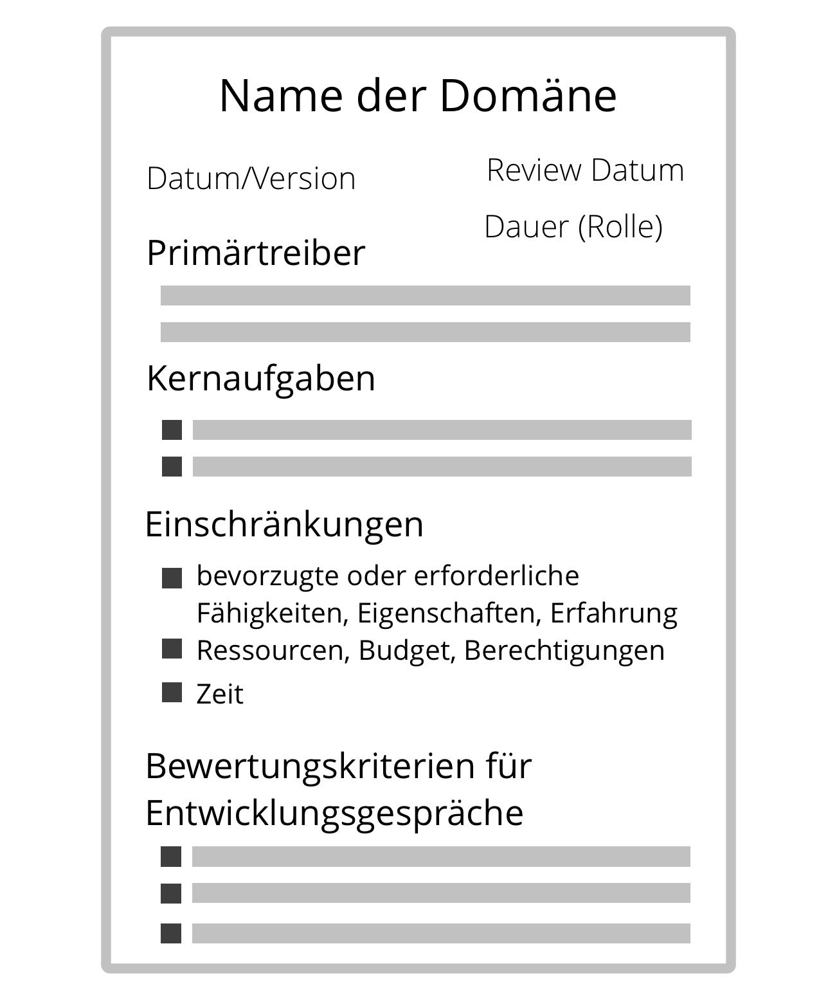

**Ein klares Verständnis der jeweiligen Verantwortungs- und Autonomiebereiche fördert Effizienz, effektive Zusammenarbeit und Agilität in der gesamten Organisation.**

Eine einfache Möglichkeit, <dfn data-info="Domäne: Ein eigener Arbeits-, Einfluss-  und Entscheidungsbereich innerhalb einer Organisation.">Domänen</dfn> klar zu bestimmen ist eine **Domänenbeschreibung**, mit folgendem Inhalt:

- <dfn data-info="Primärtreiber: Der Primärtreiber einer Domäne ist der übergeordnete Treiber, den die Verantwortlichen für diese Domäne beantworten.">Primärtreiber</dfn> (der **Bedarf der Organisation**, auf den innerhalb dieser Domäne reagiert werden soll)
- **Kernaufgaben** (wesentliche Leistungen, etwaige kritische Risiken, die beachtet werden müssen, sowie weitere essentielle Arbeitsaufgaben und Entscheidungen, die delegiert wurden)
- **Einschränkungen von Autonomie und Einfluss** der *Beauftragten*, normalerweise in Bezug auf die Organisation selbst (z.B. Abhängigkeiten, Mitbestimmung der <dfn data-info="Delegierende: Eine Person oder Gruppe, die die Verantwortung für eine Domäne an andere delegiert.">Delegierenden</dfn>, oder Reporting)
- **Ressourcen** (Zeit, Geld, Infrastruktur, Rechte, Werkzeuge
- **Evaluationskriterien** und Zeitplan für die Evaluation
- Amtszeit (für Rollen)

Domänenbeschreibungen können für [Rollen](role.html), Positionen, [Kreise](circle.html), <dfn data-info="Team: Eine Gruppe von Menschen, die zusammenarbeiten, um ein gemeinsames Ziel zu erreichen.">Teams</dfn>, [offene Domänen](open-domain.html), Abteilungen, Geschäftseinheiten oder auch für die gesamte Organisation erstellt werden.

Eine weitere Möglichkeit, Domänen zu bestimmen, ist das ausfüllen einer [S3 Delegation Canvas](http://s3canvas.sociocracy30.org/s3-delegation-canvas.html).

[&#9654; Das angestrebte Ergebnis klären](clarify-intended-outcome.html) [&#9664; Strategie entwickeln](develop-strategy.html) [&#9650; Klare Vereinbarungen](defining-agreements.html)

