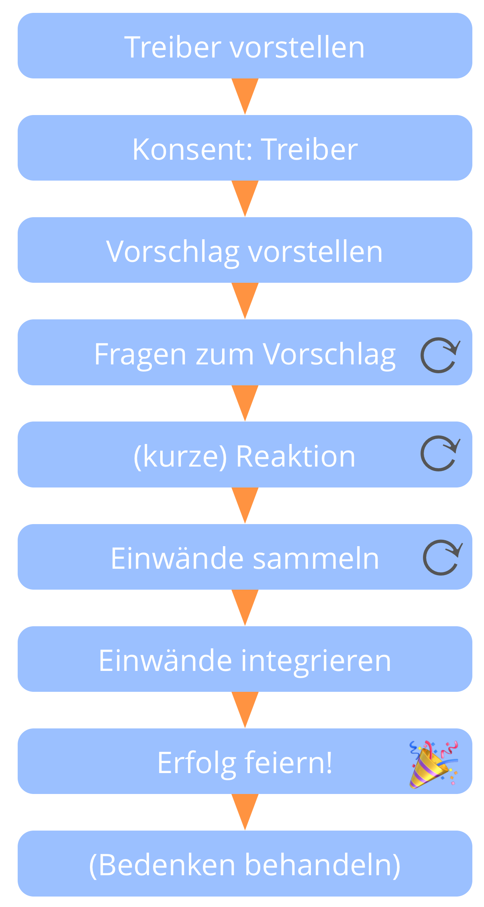

**Ein (moderierter) Gruppenprozess zur Entscheidungsfindung: sammle Einwände, und integriere das dahinterstehende Wissen, um Vorschläge und bestehende Vereinbarungen weiterzuentwickeln**

Vorschläge werden zu <dfn data-info="Vereinbarung: Eine (gemeinsam) beschlossene Richtlinie, oder ein Prozess oder Protokoll, um den Wertfluss in der Organisation zu gestalten.">Vereinbarungen</dfn>, wenn sie als *gut und sicher genug* bis zum Termin der nächsten Überprüfung betrachtet werden.

Ungelöste <dfn data-info="Einwand: Eine _Argument_, warum eine geplante Handlung oder Entscheidung die effektive Reaktion auf einen Organisationstreiber verhindert.">Einwände</dfn> verhindern, dass ein Vorschlag zu einer Vereinbarung wird.

Das Zurückhalten von Einwänden kann die Ziele eines Teams oder der gesamten Organisation gefährden.

### Impliziter Konsent-Vertrag

1. Wenn es keine Einwände gegen eine Vereinbarung gibt, beabsichtige ich, diese Vereinbarung im Rahmen meiner Möglichkeiten umzusetzen.
2. Ich stimme zu, Einwände einzubringen, sobald sie mir bewusst werden.

[&#9654; Einwand](objection.html) [&#9664; Organisationstreiber beschreiben](describe-organizational-drivers.html) [&#9650; Mitgestaltung und Evolution](co-creation-and-evolution.html)

