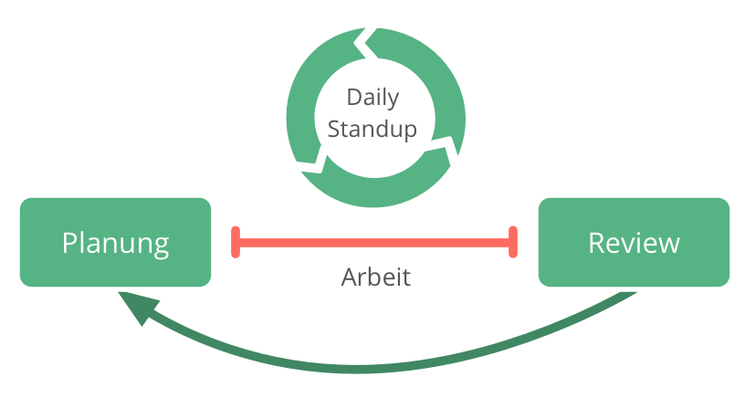

**Ein tägliches Meeting um Arbeitsaufgaben zu koordinieren, Produktivität und Effektivität zu erhöhen, und gemeinsames Lernen zu ermöglichen.**

- feste Timebox (üblicherweise 15 min.)
- findet jeden Tag zur selben Zeit und am selben Ort statt
- die Gruppe versammelt sich um das Taskboard (oder ein anderes visuelles Projektmanagement-Werkzeug) 
    - Koordination der Arbeit für den Tag
    - Hindernisse und Blocker besprechen
    - Beschluss neuer oder Anpassung bestehender Vereinbarungen

[&#9664; Retrospektive](retrospective.html) | [&#9650; Fokussierte Interaktionen](focused-interactions.html) | [&#9654; Planungs- und Review-Meetings](planning-and-review-meetings.html)

