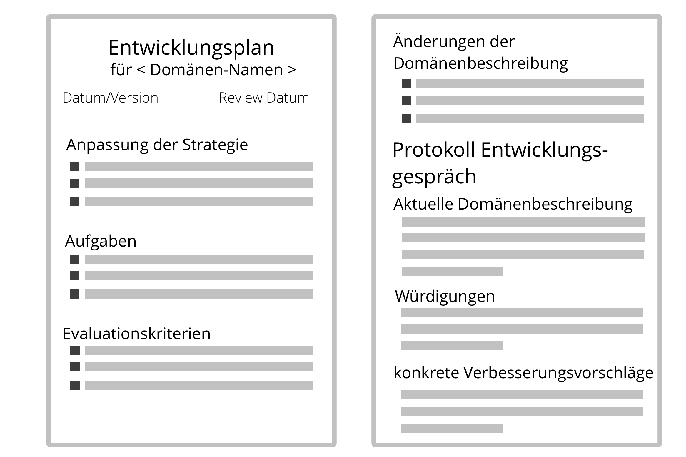

**Ein Plan, um sich effektiver um eine Domäne zu kümmern, der von Delegierenden und Beauftragten vereinbart wird.**

Der Entwicklungsplan kann für einen Mitarbeiter in einer Rolle oder für eine Team (z.B. eine Abteilung, einen [Kreis](circle.html), ein Team oder eine [offene Domäne](open-domain.html)) erstellt werden.

Die Entwicklung kann sich auf eine Klarstellung von [Treiber](organizational-driver.html) oder <dfn data-info="Domäne: Ein eigener Arbeits-, Einfluss-  und Entscheidungsbereich innerhalb einer Organisation.">Domäne</dfn> beziehen, auf eine Anpassung der <dfn data-info="Strategie: Der generelle Ansatz, wie Mitarbeiter planen, in einer bestimmten Domäne Wert zu schöpfen.">Strategie</dfn>, auf neue oder veränderte Vereinbarung, und auf konkrete Aufgaben für die Beauftragten oder auch für die Delegierenden.

Der Entwicklungsplan (inklusive aller zugehörigen Empfehlungen zu Änderungen der Beschreibungen von <dfn data-info="Domäne: Ein eigener Arbeits-, Einfluss-  und Entscheidungsbereich innerhalb einer Organisation.">Domänen</dfn> oder <dfn data-info="Organisationstreiber: Ein Treiber ist das Motiv einer Person oder Gruppe, auf eine bestimmte Situation zu reagieren. Ein Treiber wird als **Organisationstreiber** betrachtet, wenn eine Reaktion darauf der Organisation hilft, Wert zu schaffen, Verschwendung zu reduzieren oder Schaden abzuwenden.">Treibern</dfn>) erfordert Konsent von <dfn data-info="Delegierende: Eine Person oder Gruppe, die die Verantwortung für eine Domäne an andere delegiert.">Delegierenden</dfn> und <dfn data-info="Beauftragte: Eine Person oder Gruppe, die die Verantwortlichkeit für eine Domäne übernimmt.">Beauftragten</dfn>.

[&#9654; Zusammenarbeit ermöglichen](enablers-of-collaboration.html) [&#9664; Entwicklungsgespräch](peer-review.html) [&#9650; gemeinsame Entwicklung](peer-development.html)

