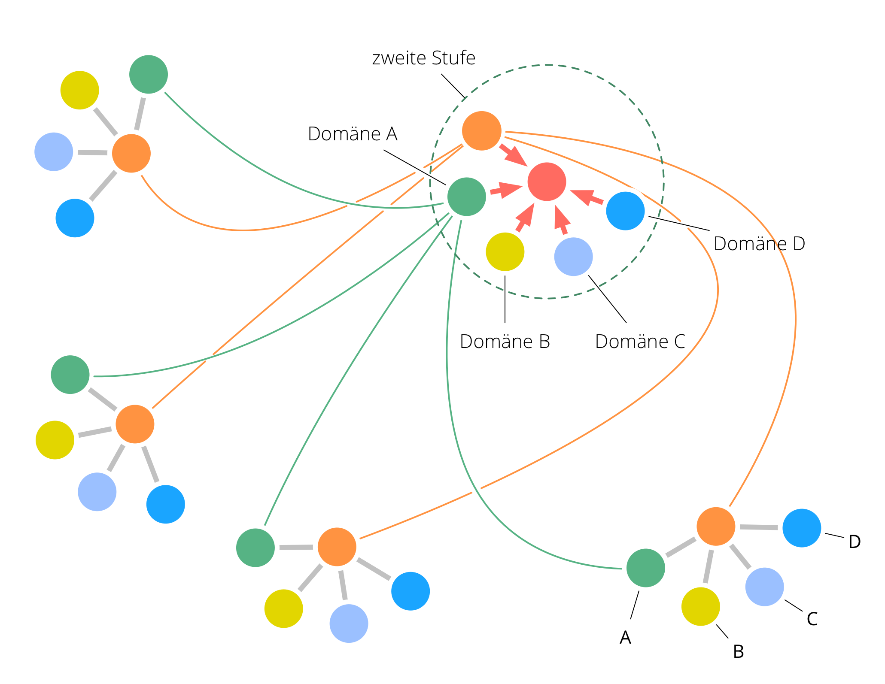

**Mehrere Konstituenten (Organisationen oder Projekte) mit einem gemeinsamen oder ähnlichen Primärtreiber(n) entwickeln gemeinsame ihrer Funktionsbereiche, richten ihr Handeln aneinander aus und treffen gemeinsam übergeordnete Governance-Entscheidungen (z.B. Strategien)**.

Eine Fraktalorganisation ermöglicht es auch großen Netzwerken auf eine sich rasch verändernde Umgebung zu reagieren.

Dieses Muster kann auch rekursiv angewendet werden, um mehrere Fraktalorganisationen zu einer größeren zu verbinden.

### Voraussetzungen

Eine Fraktalorganisation wird verbindet entweder mehrere zunächst unabhängige Organisationen, die einen gemeinsamen (Primär-)<dfn data-info="Treiber: Das Motiv einer Person oder Gruppe, in einer bestimmten Situation zu handeln.">Treiber</dfn> haben, oder mehrere Zweigstellen, Abteilungen oder Projekte innerhalb einer Organisation.

Um eine Fraktalorganisation zu ermöglichen, müssen die <dfn data-info="Konstituente: Ein Team (z. B. ein Kreis, Team, Abteilung, Niederlassung, Projekt oder Organisation), das einen Repräsentanten bevollmächtigt, in seinem Namen in anderen Teams oder Organisationen zu handeln.">Konstituenten</dfn> (d.h. die einzelnen Organisationen, Zweigstellen, Abteilungen oder Projekte) mehrere funktionale <dfn data-info="Domäne: Ein eigener Arbeits-, Einfluss-  und Entscheidungsbereich innerhalb einer Organisation.">Domänen</dfn> (z.B. Buchhaltung, Produktmanagement, oder Entwicklung) gemeinsam haben.

### Ebenen

Eine Fraktalorganisation hat mindestens drei Ebenen:

- erste ebene: die **Konstituenten** (d.h. einzelne Organisationen, bzw. Zweigstellen, Abteilungen oder Projekte innerhalb einer Organisation)
- zweite Ebene: **funktionsspezifische [Delegiertenkreise](delegate-circle.html)**, in denen Erkenntnisse geteilt und gemeinsame Vereinbarungen über alle Domänen dieses Funktionsbereiches getroffen und weiterentwickelt werden.
- dritte Ebene: ein **funktionsübergreifender Delegiertenkreis**, der Entscheidungen zu übergeordneten Treibern trifft, die alle Konstituenten betreffen.

### Entstehung einer Fraktalorganisation

1. Bildung der **zweiten Ebene**: In jeder der Konstituenten bestimmen die Mitglieder jedes gemeinsamen (und relevanten) Funktionsbereiches, wer sie im **funktionsspezifischen Delegiertenkreis** vertritt. Repräsentant werden für einen vorher festgelegten befristeten Zeitraum gewählt, danach findet eine erneute Wahl statt.
2. Bildung der **dritten Ebene**: jeder Delegiertenkreis der zweiten Ebene wählt einen Delegierten, die dann gemeinsam den **funktionsübergreifenden Delegiertenkreis** bilden.

### Auswirkung auf die Organisation(en)

Jede Konstituente:

- erhält Zugang zu Erfahrungen, Wissen und Fähigkeiten der anderen Konstituenten, was Effektivität und Potenzial zur Innovation erhöhet
- kann ihre Ressourcen, Infrastruktur und Erfahrungen nach Bedarf und Möglichkeit anderen Konstituenten zur Verfügung stellen 

Die zweite und dritte Ebene:

- können Entscheidungen gleichzeitig in mehrere Instanzen einer funktionsspezifischen Domäne testen und bekommt dadurch umfangreiches Feedback für schnellere und zielgerichtetere Weiterentwicklung 
- steuert das Gesamtsystem, und erhält dabei Autonomie und Handlungsfähigkeit der Konstituenten

[&#9654; Mitgestaltung und Evolution](co-creation-and-evolution.html) [&#9664; Serviceorganisation](service-organization.html) [&#9650; Organisationsstruktur](organizational-structure.html)

