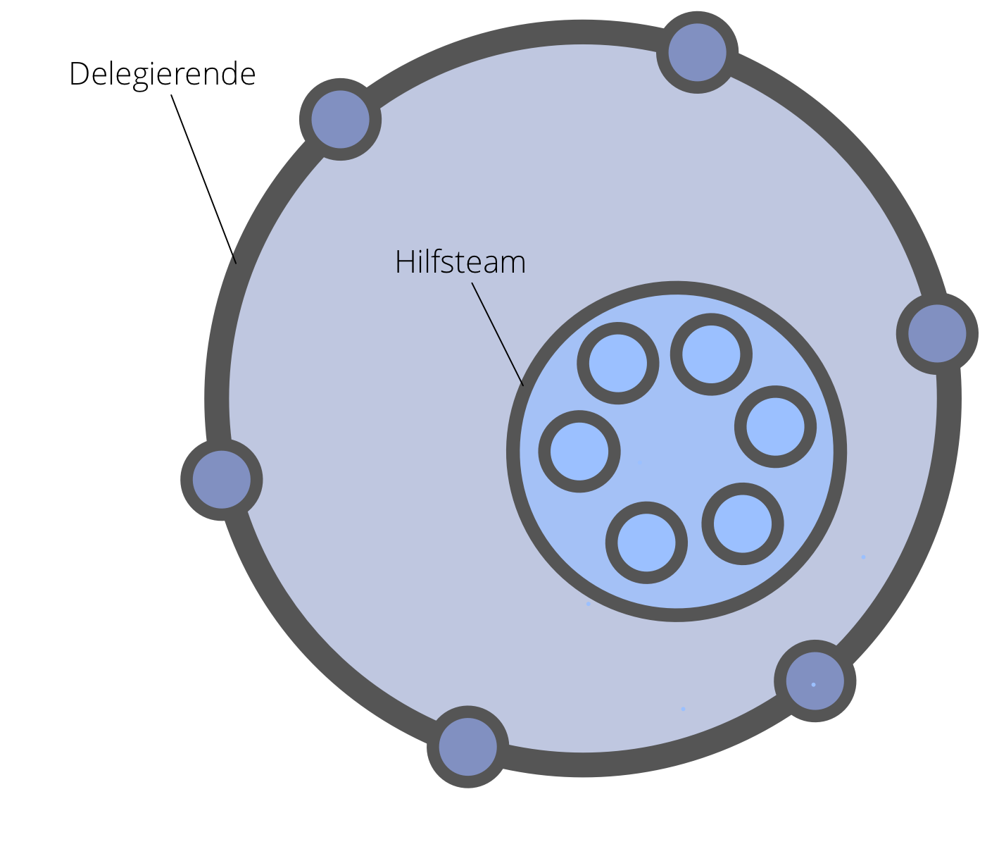

**Delegiere konkrete Anforderungen an eine Arbeitsgruppen aus gleichgestellten Mitarbeitern.**

Ein Hilfsteam:

- bietet der <dfn data-info="Delegierende: Eine Person oder Gruppe, die die Verantwortung für eine Domäne an andere delegiert.">Delegierenden</dfn> eine Möglichkeit, ihre Kapazität zu erhöhen
- kann selbstorganisiert sein oder durch einen [Koordinator](coordinator.html) gesteuert werden, der in der Regel von der Delegierenden bestimmt wird
- wird von der Delegierenden geführt
- profitiert von einer klar definierten <dfn data-info="Domäne: Ein eigener Arbeits-, Einfluss-  und Entscheidungsbereich innerhalb einer Organisation.">Domäne</dfn>

Mitglieder eines Hilfsteams:

- können Einwände gegen diejenigen Entscheidungen der Delegierenden erheben, die sie direkt betreffen
- können Themen zum <dfn data-info="Steuerungs-Backlog: Eine sichtbare, priorisierte Liste von Themen (Treibern), die in Bezug auf die Governance einer Domäne bearbeitet werden müssen.">Steuerungsbacklog</dfn> der Delegierenden hinzufügen
- werden in machen Fällen von der Delegierenden aufgefordert, [Repräsentanten](representative.html) zu Steuerungsentscheidungen der Delegierenden zu entsenden

[&#9654; Offene Domäne](open-domain.html) [&#9664; Repräsentant(in)](representative.html) [&#9650; Organisationsentwicklung](building-organizations.html)

