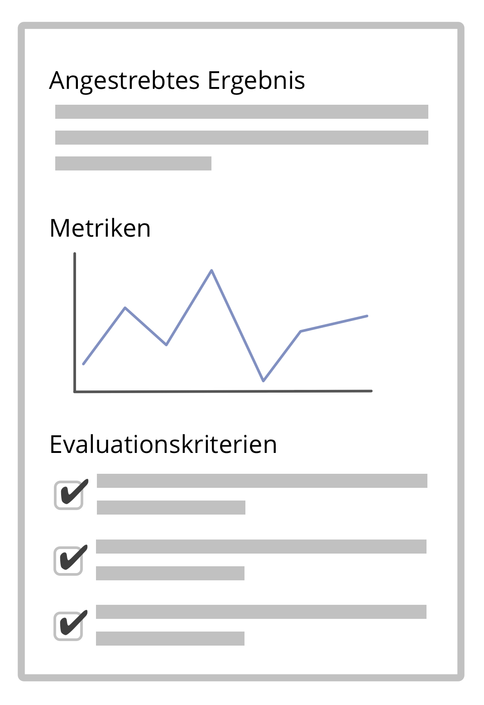

- Eine knappe Beschreibung des erwarteten Ergebnisses einer Vereinbarung, Handlung, Strategie oder eines Projekts
- Spezifische *Evaluationskriterien* und Metriken können bei der Überprüfung der Ergebnisse hilfreich sein

[&#9654; Leistungen definieren](describe-deliverables.html) [&#9664; Domänen klären](clarify-domains.html) [&#9650; Klare Vereinbarungen](defining-agreements.html)

