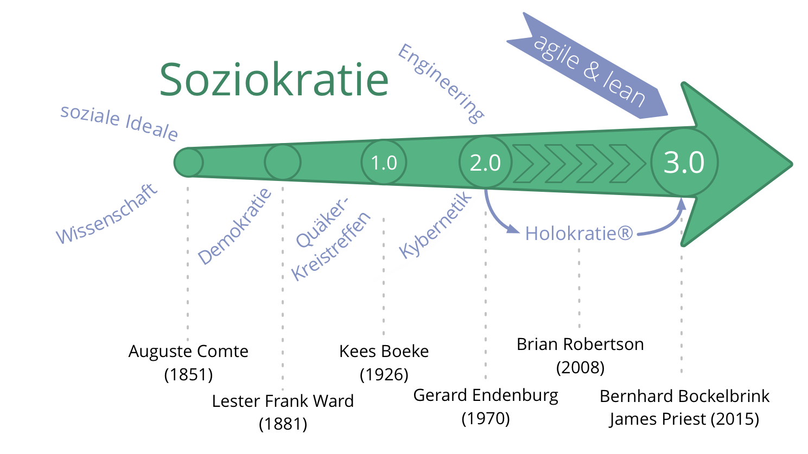
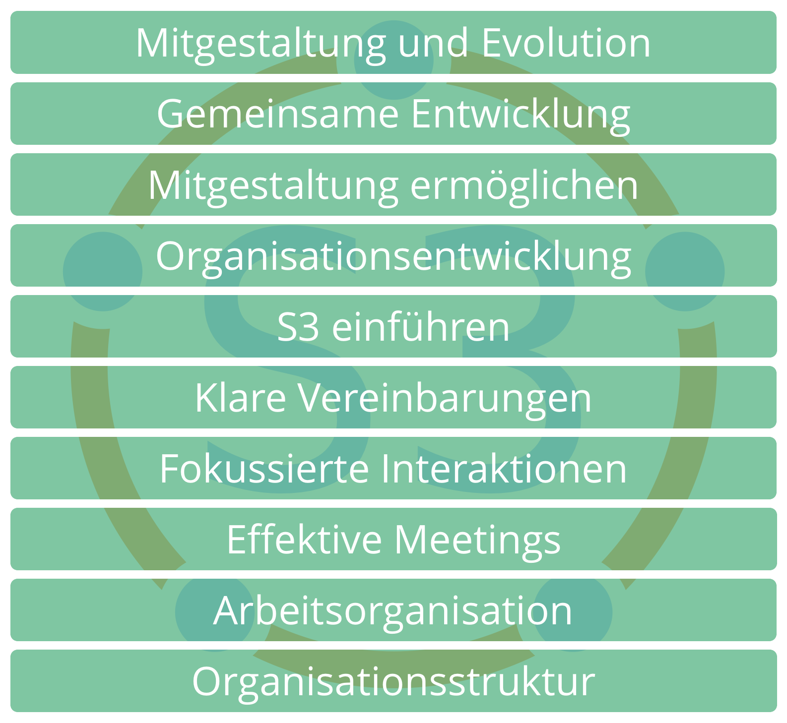
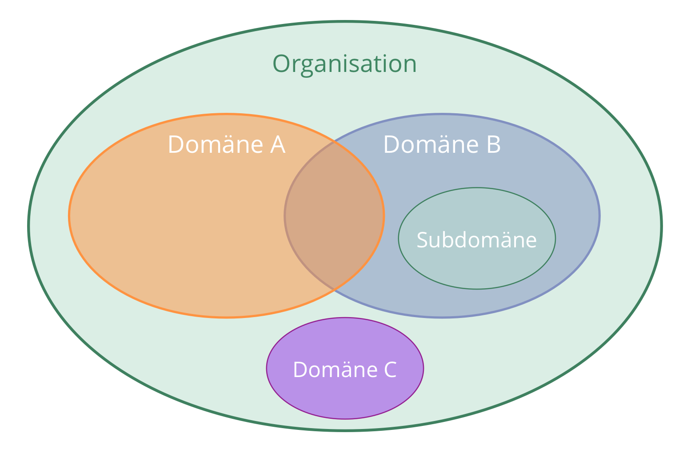

## Soziokratie 3.0 - Ein Leitfaden zur Evolution agiler und resilienter Organisationen

### Effektive Zusammenarbeit in Organisationen beliebiger Größe

- **prinzipiengetrieben** - ein ganzheitlicher Weg zur Entwicklung einer agilen und soziokratischen Geisteshaltung
- **flexibel** - unabhängige, sich gegenseitig verstärkende Muster, die Organisationen in allen Aspekten der Zusammenarbeit unterstützen, und die leicht an den eigenen Kontext angepasst werden können
- **kostenlos** - lizenziert unter einer Creative Commons Free Culture Lizenz

### Was habe ich davon?

Soziokratie 3.0 — kurz: "**S3**" — bietet Dir eine umfangreiche Sammlung von Ideen (Mustern), die sich in Organisationen als hilfreich erwiesen haben, um **Produktivität, Zusammenarbeit und Zufriedenheit zu verbessern**.

S3 unterstützt dich dabei, herauszufinden, wie du am besten deine Ziele erreichst, und wie du komplexe Herausforderungen meisterst. Schritt für Schritt, **und das ganz ohne Reorganisation oder groß angelegte Change-Initiativen**:

- Beginne dort, wo der Bedarf am größten ist, und wähle ein oder mehrere Muster für ein Experiment. **Bestimme selbst die passende Geschwindigkeit** und entwickle die erforderlichen Fähigkeiten unterwegs.

- **Unabhängig von Deiner Position in der Organisation** wirst Du Muster finden, die Dir weiterhelfen können.

### Inhalt dieses Praxisleitfadens

- eine kurze Einführung in die wesentlichen Konzepte, auf denen S3 basiert
- eine Beschreibung aller Muster in S3
- ein Anhang: 
    - Protokoll der Aktualisierungen dieses Praxisleitfadens
    - Danksagungen und Informationen zu den Autoren
    - die Lizenz
    - Glossar und Index
## Geschichte und Einflüsse

## Treiber für die Entwicklung von Soziokratie 3.0

> *Wir trafen uns 2014, um gemeinsam eine Bibliothek von frei verfügbaren Lernmaterialien herzustellen, die die Ideen der Soziokratie, Agile und Lean integrieren. Dabei entdeckten wir, dass kleine wie große Organisationen ein auf ihren spezifischen Kontext passendes Angebot aus Praktiken und Strukturen benötigen, das ihnen ermöglicht, eine agile und soziokratische Geisteshaltung zu entwickeln, um ihren eigenen Weg zu mehr Effektivität, Alignment, Wohlbefinden und Erfüllung zu finden.*
## Grundlegende Konzepte

Bevor Du in die Muster eintauchst, solltest Du Dich mit einigen Konzepten vertraut machen, die das Verständnis von S3 erleichtern:

- Was ist ein Muster?
- Die sieben Prinzipien
- Organisationen verstehen: 
    - Treiber, Wert und Verschwendung
    - Domänen, Delegation und Verantwortung
    - Governance und operatives Geschäft

Im Anhang findest Du ein Glossar, das kurze Erklärungen dieser und weiterer Begriffe enthält.
## Muster

_Ein **Muster** ist eine Vorgehensweise, um einer bestimmten Herausforderung erfolgreich zu begegnen._

- Die Muster in S3 werden durch die Beobachtung vieler Organisationen bei der Lösung ihrer Probleme und dem Umgang mit ihren Herausforderungen entdeckt.
- Die Muster können an den jeweiligen Kontext angepasst und dann weiterentwickelt werden.
- Die Muster sind thematisch in 10 Kategorien geordnet.

## Die sieben Prinzipien

Alle Muster basieren auf den sieben Prinzipien:

**Das Prinzip der Effektivität:** *Investiere Zeit nur in das, was Dich dem Erreichen Deiner Ziele näher bringt.*

**Das Prinzip des Konsent:** *Suche nach möglichen Einwänden gegen Entscheidungen, bringe sie ein, und kümmere dich darum, dass das in ihnen enthaltene Wissen integriert wird.*

**Das Prinzip des Empirismus:** *Prüfe alle Annahmen durch Experimente und kontinuierliche Revision.*

**Das Prinzip der kontinuierlichen Verbesserung:** *Bevorzuge inkrementelle Veränderung, um stetiges empirisches Lernen zu ermöglichen.*

**Das Prinzip der Gleichstellung:** *Beziehe Menschen in die sie betreffenden Entscheidungen und deren Entwicklung ein.*

**Das Prinzip der Transparenz:** *Mache alle Informationen für jeden in der Organisation zugänglich, es sei denn, es gibt einen wichtigen Grund für Vertraulichkeit.*

**Das Prinzip der Verantwortlichkeit:** *Handle, wenn es erforderlich ist; befolge, was Du vereinbart hast und behalte die gesamte Organisation im Blick.*

### Das Prinzip der Verantwortlichkeit

*Handle, wenn es erforderlich ist; befolge, was Du vereinbart hast und behalte die gesamte Organisation im Blick.*

Handle in allen Domänen, für die du verantwortlich bist, innerhalb der Grenzen bestehender Vereinbarungen. Das betrifft die Organisation selbst, Teams, deren Teil du bist, und Rollen, die du übernommen hast.

Jeder Mitarbeiter ist verantwortlich für die effektive Zusammenarbeit aller bei der Antwort auf Organisationstreiber

Einzelpersonen und Gruppen sind jeweils verantwortlich für ihre eigene Arbeit, und für ihre Weiterentwicklung, und dafür, sich gegenseitig zu unterstützen.

jedes Mitglied einer Organisation ist verantwortlich dafür, seine Handlungen an den Werten der Organisation auszurichten
## Organisationen verstehen
### Treiber

_Ein **Treiber** ist das Motiv einer Person oder Gruppe, in einer bestimmten Situation zu handeln._

Ein Treiber …

- kann als Ausgangspunkt für Ziele, Vision oder "Bestimmung" dienen
- kann sich im Lauf der Zeit verändern

### Treiber: Wert und Verschwendung

_**Wert** ist die Bedeutung oder der Nutzen von etwas in Bezug  auf einen bestimmten Treiber_

_**Verschwendung** ist alles, was für die effektive Antwort auf einen Treiber nicht erforderlich ist, oder ihr sogar im Wege steht._

Über das Konzept von Wert und Verschwendung können Organisationen, die Muster aus S3 verwenden, auch viele Praktiken und Ideen aus der **Lean Production** und der **Lean Softwareentwicklung** nutzen. Zum Beispiel:

- Wertstromanalyse
- verschiedene Strategien zur Vermeidung von Verschwendung
- die Kanban-Methode
### Domänen

_Eine **Domäne** ist ein eigener Arbeits-, Einfluss-  und Entscheidungsbereich innerhalb einer Organisation._

Alle Domänen befinden sich innerhalb der Domäne der Organisation, und können sich mit anderen Domänen überschneiden, oder auch vollständig in ihnen enthalten sein.

Domänen werden an Mitarbeiter delegiert (z.B. an eine Geschäftseinheit, eine Abteilung, ein Team oder eine Einzelperson), die dann – innerhalb der Grenzen des Autonomie- und Einflussbereiches dieser Domäne – die Verantwortung dafür übernehmen.

### Domänen delegieren

Wer eine Domäne delegiert (die *Delegierende*) bleibt weiterhin verantwortlich für diese Domäne, stellt die erforderlichen **Ressourcen** bereit und definiert oft:

- den **Bedarf** der Organisation, aus dem heraus die Domäne entstanden ist
- **Kernaufgaben** (wesentliche Leistungen, etwaige kritische Risiken, die beachtet werden müssen, sowie weitere essentielle Arbeitsaufgaben und Entscheidungen, die delegiert wurden)
- **Einschränkungen von Autonomie und Einfluss** der *Beauftragten*, normalerweise in Bezug auf die Organisation selbst (z.B. Abhängigkeiten, Mitbestimmung der Delegierenden, oder Reporting)

### Treiber und Domänen

Eine Domäne kann auch in Bezug auf Organisationstreiber beschrieben werden:

- ausgehend vom so genannten **Primärtreiber** der Domäne (dem übergeordneten Treiber, auf den die Domänenverantwortlichen antworten)
- sowie die Menge derjenigen Subtreiber, die im Kontext der Antwort auf diesen Primärtreibers ebenfalls berücksichtigt werden müssen: 
    - **Kernaufgaben**: alle Treiber, die direkt vom Primärtreiber abgeleitet werden können
    - Treiber für **Beschränkungen der Domäne**, die sich in der Regel auf die Organisation selbst beziehen

### Governance und operatives Geschäft

Aktivitäten in einer Organisation fallen typischerweise in eine der folgenden zwei Kategorien

_Bezogen auf Organisationen bezeichnet **Governance** alle Tätigkeiten, die mit der Festlegung von Zielen und den aus diesen Zielen resultierenden Steuerungsaufgaben zu tun haben: Menschen mit der entsprechenden Befugnissen treffen bewusst Entscheidungen, die die Wertschöpfung  der Organisation (und die der Teams und Personen innerhalb der Organisation)  mittel- und langfristig steuern, und entwickeln diese Entscheidungen stetig anhand der gewonnenen Erkenntnisse weiter. Diese Entscheidungen begrenzen Handlungsspielräume, lenken zukünftige Entscheidungen, Verteilen Ressourcen und legen Details zu Leistungen fest._

_Das **operative Geschäft** umfasst die zur Wertschöpfung erforderliche Arbeit, so wie die Organisation des Tagesgeschäfts, gelenkt durch Governance-Entscheidungen._

### Verwandte Konzepte

**Selbststeuerung**: Eine Gruppe, sich innerhalb einer Grenzen einer Domäne selbst steuert und selbst organisiert.

**Teilautonomie**: Die Freiheit der Beauftragten, selbst zu entscheiden, wie sie in ihrer Domäne Wert schöpfen  werden, die dann weiter begrenzt wird durch ihre eigenen Steuerungsentscheidungen, und durch Einwände (u.A. von der Delegierenden und von Repräsentanten).

**Selbstorganisation**: Alle Aktivitäten und Prozesse, durch die sich eine Gruppe mittels lokaler Interaktionen und ohne externen Einfluss organisiert. In jeder Organisation und in jedem Team koexistieren Selbstorganisation und externer Einfluss.

Je nach den Einschränkungen der Domäne, die die Delegierende festlegt, haben Teams mehr oder weniger Autonomie, Steuerungsentscheidungen zu treffen und ihr operatives Geschäft zu gestalten, sind also mehr oder weniger selbststeuernd und selbstorganisierend.

[&#9654; Mitgestaltung und Evolution](co-creation-and-evolution.html)

