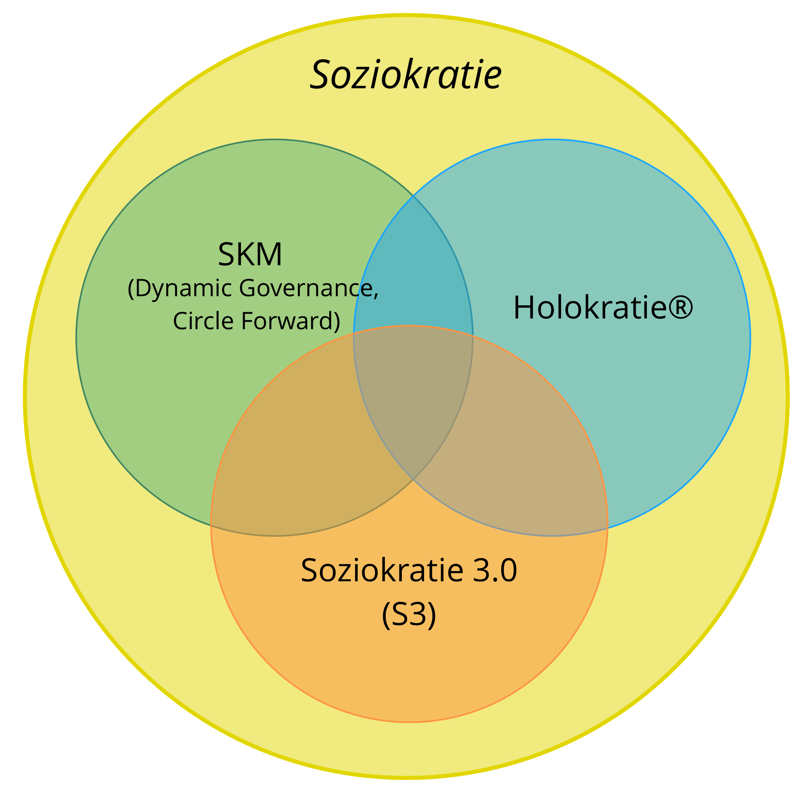

## Soziokratie 3.0 - Ein Leitfaden zur Evolution agiler und resilienter Organisationen

### Effektive Zusammenarbeit in Organisationen beliebiger Größe

Soziokratie 3.0 — **kurz "S3"** — ist eine praktischer Anleitung um agile und resiliente Organisationen beliebiger Größe zu entwickeln, vom kleinen Start-Up bis hin zu zu großen internationalen Netzwerkorganisationen oder auch organisationsübergreifenden Kollaborationen. Gleichzeitig ist S3 auch ein ein ganzheitlicher Weg, die Vertrauenswürdigkeit einer Organisation zu fördern und eine **agile und soziokratische Geisteshaltung** zu entwickeln.

S3 bietet dir eine umfangreiche Sammlung von Ideen (sogenannte "Muster"), die sich in Organisationen als hilfreich erwiesen haben, um **Produktivität, Zusammenarbeit und Zufriedenheit zu verbessern**.

Diese Muster unterstützen dich dabei, herauszufinden, wie du am besten deine Ziele erreichst, und wie du komplexe Herausforderungen meisterst. Schritt für Schritt, **und das ganz ohne Reorganisation oder groß angelegte Change-Initiativen**:

Beginne dort, wo der Bedarf am größten ist, und wähle ein oder mehrere Muster für ein Experiment. **Bestimme selbst die passende Geschwindigkeit** und entwickle die erforderlichen Fähigkeiten unterwegs.

**Unabhängig von Deiner Position in der Organisation** wirst Du Muster finden, die Dir weiterhelfen können.

Soziokratie 3.0 ist:

- **flexibel** - unabhängige, sich gegenseitig verstärkende Muster, die Organisationen in allen Aspekten der Zusammenarbeit unterstützen, und die leicht an den eigenen Kontext angepasst werden können
- **prinzipiengetrieben:** die sieben Kernprinzipien agiler und soziokratischer Zusammenarbeit spiegeln sich in jedem Muster wider
- **kostenlos** - lizenziert unter einer Creative Commons Free Culture Lizenz

### Was habe ich davon?

**Soziokratie 3.0:**

- bietet eine ganzheitliche Sammlung von prinzipienbasierten Mustern für Zusammenarbeit, die es ermöglichen, komplexe Problem durch schrittweise Veränderung anzugehen.
- unterstützt Menschen dabei, die ihnen momentan zur Verfügung stehende Information zur kontinuierlichen Verbesserung ihrer Arbeitsprozesse, Produkte, Dienstleistungen und Fähigkeiten zu verwenden.
- hilft Organisationen, das Talent ihrer bestehenden Mitarbeiter bestmöglich einzusetzen, und flexible Organisationsstrukturen herauszubilden, die den Informationsfluss und die Führungsstrukturen an den Wertfluss der Organisation anpassen. 
- bietet einen organischen, iterativen Ansatz für Veränderung, der Menschen und Organisationen dort abholt, wo sie gerade stehen, und sie in ihrem speziellen Kontext dabei unterstützt, in ihrem eigenen Tempo und ihren eigenen Bedürfnissen gemäß weiterzugehen.
- nutzt die kollektive Intelligenz einer Gruppe
- ermöglicht die Entwicklung von Strategien, die "qualitativ angemessen" sind und ein "ausreichendes Maß an Sicherheit" besitzen.
- fördert Verantwortungsbewusstsein und Verbindlichkeit.
- wirkt transformativ auf die einzelnen Mitarbeiter und auf die gesamte Organisation.

**Soziokratie 3.0 kann angewendet werden in …**

- Start-Ups
- kleine und mittelständische Betriebe
- große internationale Netzwerkorganisationen
- Familien
- investorenfinanzierte Unternehmen
- Gemeinden und Gemeinschaftseinrichtungen
- und vieles mehr...

### Inhalt dieses Praxisleitfadens

- etwas zur Geschichte von S3 sowie eine kurze Einführung in die wesentlichen Konzepte, auf denen S3 basiert
- eine Beschreibung aller Muster in S3
- ein Anhang: 
    - Protokoll der Aktualisierungen dieses Praxisleitfadens
    - Danksagungen und Informationen zu den Autoren
    - die Lizenz
    - Selbstverpflichtung für Praktizierende und Lehrende von Soziokratie 3.0
    - Glossar und Index
## Die Geschichte von Soziokratie 3.0

Die wörtliche Bedeutung des Begriffes **Soziokratie** ist "Herrschaft der Gefährten": _sozio_ — vom lateinischen _socius_ — bedeutet "Gefährte", oder "Kamerad", und das Suffix _-kratie_ — vom altgriechischen _κράτος_ (krátos) — bedeutet "Herrschaft" bzw. "Regierung".

Der Begriff "Soziokratie" kann bis zum Jahre 1851 zurückverfolgt werden, damals schlug **Auguste Comté** bezogen auf die Gesellschaft wie Anwendung eines wissenschaftlichen Ansatzes vor: Staaten sollten von Experten zum Thema Gesellschaft regiert werden. Diese Experten nannte er "Soziologen". Er hielt diese Zukunft für unabwendbar, auch wenn er anerkannte, dass das damals noch nicht realisierbar, war.

Einige Jahrzehnte später verwendete **Lester Frank Ward** das Wort 'Soziokratie' zur Beschreibung einer Gesellschaftsordnung, in der die Menschen in enger Beziehung zueinander stehen und gemeinsam regieren. Anstatt den Fokus auf die Soziologen zu legen, wollte er dem einzelnen Bürger mehr Macht und mehr Verantwortung geben, und wies den Soziologen eine Rolle als Forscher und Berater zu.

Im Jahr 1926 gründete der niederländische Reformpädagoge und Quäker **Kees Boeke** eine Schule, die auf dem Konsentprinzip beruhte. Mitarbeitende und Schüler wurden als gleichberechtigte Mitglieder an der Leitung der Schule beteiligt. Alle Entscheidungen mussten für alle akzeptabel sein. Er begründete seine Form der Soziokratie auf den Traditionen der Quäker, und beschrieb sie in "Soziokratie: Demokratie wie sie sein könnte" (1945) als Weiterentwicklung der Demokratie.

**Gerard Endenburg**, ein Schüler Bockes und ebenfalls Quäker begann, die Soziokratie im Familienunternehmen Endenburg Elektrotechniek anzuwenden. Er begründete und entwickelte die *Soziokratische Kreismethode (SKM)*, indem er die Boekes Form der Soziokratie mit Ingenieurswissenschaften und mit Kybernetik verband. 1978 gründete er das 'Sociocratisch Centrum' in Utrecht (das noch heute als "Soziokratisches Zentrum" in Rotterdam weiterbesteht) zur Förderung der Soziokratie innerhalb und außerhalb der Niederlande. Seit 1994 sind in den Niederlanden alle Organisationen, die Soziokratische Kreismethode anwenden, von der gesetzlichen Verpflichtung befreit, einen Betriebsrat zu haben.

Während der späten 1990er und frühen 2000er Jahre begannen auch einige Menschen ausserhalb der Niederlande, die Soziokratie zu entdecken. Aber als 2007 das Buch "We the People" von **Sharon Villines und John Buck** erschien, wurde die Soziokratie zunächst einem breiteren englischsprachigen Publikum zugänglich, und von dort aus begann die Verbreitung in weitere Sprachen.

Soziokratie hat sich in vielen Organisationen und Gemeinschaften auf der ganzen Welt bewährt, aber man kann noch lange nicht von einer viralen Verbreitung sprechen.

**James Priest und Bernhard Bockelbrink** begannen 2014 ihre Zusammenarbeit damit, gemeinfreie Lernmaterialien herzustellen, in denen sie die Ideen der Soziokratie mit Agilität und Lean Thinking und Lean kombinierten. Dabei entdeckten sie, dass kleine wie große Organisationen ein auf ihren spezifischen Kontext passendes Angebot aus Praktiken und Strukturen benötigen, das ihnen ermöglicht, eine agile und soziokratische Geisteshaltung zu entwickeln, um ihren eigenen Weg zu mehr Effektivität, Alignment, Wohlbefinden und Erfüllung zu finden. Die erste Fassung von **Soziokratie 3.0** erschien im März 2015.

Kurz darauf begann auch **Liliana David**, an der Weiterentwicklung von S3 mitzuwirken. 

Sie arbeiten nun gemeinsam daran, S3 so zu gestallten, dass es für möglichst viele Organisationen verfügbar und wertvoll ist, und stellen dazu gemeinfreie Materialien unter einer **Creative Commons Free Culture Lizenz** bereit, die es allen Interessierten ermöglichen sollen, S3 zu erforschen, anzuwenden und weiterzugeben.

### Die Soziokratie-3.0-Bewegung

Durch das steigende Interesse an Soziokratie 3.0 wächst auch eine Gemeinschaft von Personen — Berater, Coaches, Trainer, und Anwender von S3 in ganz verschiedenen Kontexten — die das S3 innewohnende transformative Potenzial wertschätzen, das sowohl Organisationen als auch deren Mitglieder hilft, das sich zu entwickeln und zu entfalten. Viele aus dieser Gemeinschaft stellen freundlicherweise Zeit zur Verfügung, S3 zu erforschen und weiterzutragen, zusammenzuarbeiten, voneinander zu lernen und ihre Erfahrungen zu dokumentieren, so dass mit den so gewonnene Erkenntnissen S3 selbst weiterentwickelt werden kann.
## Die Entstehung von Soziokratie 3.0

Die ersten Konzepte zur Soziokratie als Regierungsform stammen aus dem Jahre 1851. Seit damals wurde sie von vielen Menschen und Organisationen weiterentwickelt und angepasst, u.A. von Gerard Endenburg, von der The Sociocracy Group (TSG) und von Brian Robertson (HolacracyOne).

Dennoch blieb die Soziokratie außerhalb der Niederlande bis vor kurzem weitgehend unbekannt.

Wir lieben die Soziokratie, weil wir sehen, wie Organisationen und ihre Mitglieder gedeihen, wenn Sie Ideen daraus umsetzen.

Wir lieben auch die agile Methoden, Lean Thinking, Kanban, die Core Protocols, gewaltfreie Kommunikation und zahlreiche andere Ideen. Und wir denken, dass die Welt dadurch besser wird, dass sich immer mehr Organisationen aus diesem Füllhorn neuer Ideen zu bedienen, und lernen, diese Ideen mit dem zu verbinden, was sie bereits kennen.

Deshalb haben wir beschlossen, einen Teil unserer Zeit darauf zu verwenden, die Soziokratie weiterzuentwickeln und mit anderen wichtigen Ideen zu integrieren, um sie für so viele Organisationen wie möglich zugänglich und anwendbar zu machen.

Um dieses Ziel zu erreichen, halten wir es für erforderlich, eine solide Marke aufzubauen, eine radikal neue Form der Verbreitung zu etablieren, und die *Soziokratischen Kreismethode* so zu erweitern, dass deren praktische Anwendbarkeit verbessert wird.

### Der Name "Soziokratie 3.0"

Der Name "*Soziokratie 3.0*" verbindet den respektvollen Umgang mit der Herkunft der Soziokratie mit der Andeutung eines wichtigen Schrittes nach vorne.

Der Name soll auch Verwechslungen mit der *Soziokratische Kreismethode* (SKM) zu vermeiden, die von The Sociocracy Group (TSG) gelehrt wird. 

### Eine neue Form der Verbreitung

*Soziokratie 3.0* beruht auf einem dezentralen Verteilungsmodell. Im Vergleich dazu, wie die Soziokratie bisher an Personen und Organisationen vermittelt wurde, stellt das einen radikalen Paradigmenwechsel dar, der auf viel positive Resonanz stößt.

Durch zwei Strategien unterstützen wir "virale" Verbreitung:

* **Soziokratie 3.0 ist offen:** Wir wollen die Entstehung eines lebendigen Ökosystems aus Anwendungen und Abwandlungen der Soziokratie fördern, in dem Menschen ihre Erfahrungen und Anpassungen miteinander teilen und diskutieren. Daher legen wir einen Schwerpunkt auf die Kommunikation der hinter Soziokratie 3.0 stehenden Prinzipien, und auf die explizite Einladung, alles nach Bedarf anzupassen, zu erweitern und neu zu kombinieren.
* **Soziokratie 3.0 ist frei**: Um die Eintrittsbarrieren für Menschen und für Organisationen zu senken, bieten wir unsere Materialien zum Lernen, zur Ausübung und zur Vermittlung von *Soziokratie 3.0* unter einer *Creative Commons Free Culture Lizenz* an. Jeder kann diese Materialen einfach verwenden, auch in einem kommerziellen Kontext oder als Grundlage für die Erstellung eigener Materialien[^solange das Resultat unter derselben Lizenz verfügbar ist], ohne uns erst um Erlaubnis fragen zu müssen. Wir ermutigen ausdrücklich andere Organisationen, Berater, Coaches, Moderatoren und Trainer, unserem Beispiel zu folgen und auch ihre Ressourcen freizugeben.

### Die Evolution der Soziokratischen Kreismethode

Wir wollen eines ausdrücklich klarstellen: Soziokratie 3.0 richtet sich nicht an diejenigen, die die *Soziokratische Kreismethode* (SKM) anwenden, und auch nicht an The Sociocracy Group (TSG). SKM ist bereits gut entwickelt, und einige Menschen sind mit dieser Methode offensichtlich weitestgehend zufrieden.

Dennoch gibt es unserer Erfahrung einige Hindernisse, die es Organisationen schwer machen, mit Soziokratie zu experimentieren. Durch *Soziokratie 3.0* versuchen wir aktiv, diese Hindernisse auszuräumen und den Einstieg zu erleichtern.

#### Minimierung von Risiko und Widerstand

*Soziokratie 3.0* holt Organisationen genau dort ab, wo sie gerade stehen, und unterstützt sie auf ihrem Weg durch schrittweise und kontinuierliche Verbesserung. Radikale Veränderung oder Reorganisation sind nicht erforderlich. *Soziokratie 3.0* bietet eine Sammlung unabhängiger und prinzipienbasierter Muster an, aus denen sich eine Organisation nach Bedarf bedienen kann, um effektiver zu werden. Alle Muster beziehen sich auf dieselben Grundprinzipien, so dass sie leicht an den speziellen Kontext einer Organisation angepasst werden können.

#### Verlagerung des Fokus von Zielen (oder Sinn) hin zum Bedarf

*Soziokratie 3.0* verschiebt den primären Fokus weg von Vision, Mission, Zielen oder Sinn ("Purpose") zum Ausgangspunkt der Motivation für Veränderung, und hilft, einer Organisation, zu entdecken, was ihr Bedarf ist, und sich dann an diesem Bedarf auszurichten. Organisationen, die bereits bedarfsgetrieben, wertgetrieben oder kundenzentrisch sind, finden das unmittelbar einleuchtend.

Mit *Soziokratie 3.0* ist der Sinn ("Purpose") immer implizit klar - Wertschöpfung bezogen auf den Bedarf der Organisation.

#### Reduktion auf das Wesentliche

Betrachtet man die offiziellen Normen, kann die *Soziokratische Kreismethode* durchaus riesig und furchterregend wirken. Durch die Konzentration auf das Wesentliche bietet *Soziokratie 3.0* demgegenüber einen leichtgewichtigen Rahmen für Anpassung und Entwicklung einer Organisation.

Das bedeutet nicht, dass alles immer ganz einfach ist: auch die Anwendung von Mustern aus *Soziokratie 3.0* bedeutet ein gewisse Investition in Lernen und Veränderung antrainierter Gewohnheiten. Daher ist es umso wichtiger, schrittweise vorzugehen, und nur die Muster anzuwenden, die man auch tatsächlich gerade benötigt, es ist sinnlos, Dinge zu ändern, die bereits gut genug sind.

#### Integration von Ideen aus den agilen Methoden und aus Lean Thinking

Bezogen auf operative Tätigkeiten und insbesondere auf die der Kultur der Zusammenarbeit innerhalb der Organisation versteht sich die *Soziokratischen Kreismethode* als "leere Methode". Viele Organisationen richten bereit ihre operativen Tätigkeiten an agilen Prinzipien und Lean Thinking aus, oder streben eine derartige Transformation an. Wir halten das für eine großartige Idee, und haben *Soziokratie 3.0* deshalb so gestaltet, dass sie gut zu agilen und lean Organisationen passt.

#### Neue Wege zur Entwicklung von Organisationsstruktur

Die *Soziokratische Kreismethode* kennt nur eine einzige Organisationsstruktur, die anhand von hierarchischen Domänen modelliert ist. Wir beobachten zunehmend die Entstehung von kollaborativen Multi-Stakeholder-Umgebungen, die einen Bedarf an einer breiteren Vielfalt an Mustern für Organisationsstrukturen haben. Die Entwicklung hilfreicher Organisationsstrukturen passiert ganz natürlich, sobald man beginnt, Informationsfluss und Führungsstrukturen an die Wertschöpfung anzugleichen. Dazu stellt *Soziokratie 3.0* eine Palette an Strukturmustern bereit, die leicht miteinander kombiniert werden können um die eigene Organisationsstruktur flexibel und bedarfsgerecht weiterzuentwickeln.

*James Priest, Bernhard Bockelbrink und Liliana David*
## Grundlegende Konzepte

Bevor Du in die Muster eintauchst, solltest Du Dich mit einigen Konzepten vertraut machen, die das Verständnis von S3 erleichtern:

- Was ist ein Muster?
- Die sieben Prinzipien
- Organisationen verstehen: 
    - Treiber, Wert und Verschwendung
    - Domänen, Delegation und Verantwortung
    - Governance und operatives Geschäft

Im Anhang findest Du ein Glossar, das kurze Erklärungen dieser und weiterer Begriffe enthält.
### Muster

_Ein **Muster** ist eine Vorgehensweise, um einer bestimmten Herausforderung erfolgreich zu begegnen._

- Die Muster in S3 werden durch die Beobachtung vieler Organisationen bei der Lösung ihrer Probleme und dem Umgang mit ihren Herausforderungen entdeckt.
- Die Muster können an den jeweiligen Kontext angepasst und dann weiterentwickelt werden.
- Die Muster sind thematisch in 10 Kategorien geordnet.

### Die sieben Prinzipien

Soziokratie basiert auf sieben Prinzipien, die eine Basis für die Kultur einer Organisation bilden. Da sich diese sieben Prinzipien in allen Mustern widerspiegeln, ist das Verständnis dieser Prinzipien hilfreich für Anwendung der Muster, und besonders wertvoll, wenn man ein Muster an die eigenen Bedürfnisse anpasst.

Die Anwendung von Soziokratie 3.0 hilft Menschen, den Nutzen dieser Prinzipien immer besser zu verstehen, sowohl für den Einzelnen als auch für die gesamte Organisationen.

**Das Prinzip der Effektivität:** *Investiere Zeit nur in das, was Dich dem Erreichen Deiner Ziele näher bringt.*

**Das Prinzip des Konsent:** *Suche nach möglichen Einwänden gegen Entscheidungen, bringe sie ein, und kümmere dich darum, dass das in ihnen enthaltene Wissen integriert wird.*

**Das Prinzip des Empirismus:** *Prüfe alle Annahmen durch Experimente und kontinuierliche Revision.*

**Das Prinzip der kontinuierlichen Verbesserung:** *Bevorzuge inkrementelle Veränderung, um stetiges empirisches Lernen zu ermöglichen.*

**Das Prinzip der Gleichstellung:** *Beziehe Menschen in die sie betreffenden Entscheidungen und deren Entwicklung ein.*

**Das Prinzip der Transparenz:** *Mache alle Informationen für jeden in der Organisation zugänglich, es sei denn, es gibt einen wichtigen Grund für Vertraulichkeit.*

**Das Prinzip der Verantwortlichkeit:** *Handle, wenn es erforderlich ist; befolge, was Du vereinbart hast und behalte die gesamte Organisation im Blick.*

#### Das Prinzip der Verantwortlichkeit

*Handle, wenn es erforderlich ist; befolge, was Du vereinbart hast und behalte die gesamte Organisation im Blick.*

Handle in allen Domänen, für die du verantwortlich bist, innerhalb der Grenzen bestehender Vereinbarungen. Das betrifft die Organisation selbst, Teams, deren Teil du bist, und Rollen, die du übernommen hast.

Jeder Mitarbeiter ist verantwortlich für die effektive Zusammenarbeit aller bei der Antwort auf Organisationstreiber

Einzelpersonen und Gruppen sind jeweils verantwortlich für ihre eigene Arbeit, und für ihre Weiterentwicklung, und dafür, sich gegenseitig zu unterstützen.

jedes Mitglied einer Organisation ist verantwortlich dafür, seine Handlungen an den Werten der Organisation auszurichten
### Organisationen verstehen
#### Treiber

_Ein **Treiber** ist das Motiv einer Person oder Gruppe, in einer bestimmten Situation zu handeln._

Ein Treiber …

- kann als Ausgangspunkt für Ziele, Vision oder "Bestimmung" dienen
- kann sich im Lauf der Zeit verändern

##### Treiber, Wert und Verschwendung

_**Wert** ist die Bedeutung oder der Nutzen von etwas in Bezug  auf einen bestimmten Treiber_

_**Verschwendung** ist alles, was für die effektive Antwort auf einen Treiber nicht erforderlich ist, oder ihr sogar im Wege steht._

Über das Konzept von Wert und Verschwendung können Organisationen, die Muster aus S3 verwenden, auch viele Praktiken und Ideen aus der **Lean Production** und der **Lean Softwareentwicklung** nutzen. Zum Beispiel:

- Wertstromanalyse
- verschiedene Strategien zur Vermeidung von Verschwendung
- die Kanban-Methode
#### Domänen

_Eine **Domäne** ist ein eigener Arbeits-, Einfluss-  und Entscheidungsbereich innerhalb einer Organisation._

Alle Domänen befinden sich innerhalb der Domäne der Organisation, und können sich mit anderen Domänen überschneiden, oder auch vollständig in ihnen enthalten sein.

Domänen werden an Mitarbeiter delegiert (z.B. an eine Geschäftseinheit, eine Abteilung, ein Team oder eine Einzelperson), die dann – innerhalb der Grenzen des Autonomie- und Einflussbereiches dieser Domäne – die Verantwortung dafür übernehmen.

##### Domänen delegieren

Wer eine Domäne delegiert (die *Delegierende*) bleibt weiterhin verantwortlich für diese Domäne, stellt die erforderlichen **Ressourcen** bereit und definiert oft:

- den **Bedarf** der Organisation, aus dem heraus die Domäne entstanden ist
- **Kernaufgaben** (wesentliche Leistungen, etwaige kritische Risiken, die beachtet werden müssen, sowie weitere essentielle Arbeitsaufgaben und Entscheidungen, die delegiert wurden)
- **Einschränkungen von Autonomie und Einfluss** der *Beauftragten*, normalerweise in Bezug auf die Organisation selbst (z.B. Abhängigkeiten, Mitbestimmung der Delegierenden, oder Reporting)

##### Treiber und Domänen

Eine Domäne kann auch in Bezug auf Organisationstreiber beschrieben werden:

- ausgehend vom so genannten **Primärtreiber** der Domäne (dem übergeordneten Treiber, auf den die Domänenverantwortlichen antworten)
- sowie die Menge derjenigen Subtreiber, die im Kontext der Antwort auf diesen Primärtreibers ebenfalls berücksichtigt werden müssen: 
    - **Kernaufgaben**: alle Treiber, die direkt vom Primärtreiber abgeleitet werden können
    - Treiber für **Beschränkungen der Domäne**, die sich in der Regel auf die Organisation selbst beziehen

### Governance und operatives Geschäft

S3 versucht, Produktivität zu ermöglichen, indem die Mitarbeiter einerseits so vieles wie möglich selbst erledigen und entscheiden können, und dabei andererseits die Zusammenarbeit im Sinne einer insgesamt erfolgreichen und effektiven Organisation gewährleistet bleibt. 

Die größere Autonomie der Einzelpersonen und Teams erfordert klare Vereinbarungen (d.h. Richtlinien und Grenzen), die eine reibungslose Zusammenarbeit zwischen diesen Teams und Einzelpersonen ermöglichen und die die Erreichung sowohl kurzfristiger als auch langfristiger Ziele unterstützen. Regelmäßige Überprüfung und schrittweise Weiterentwicklung der Vereinbarungen stellen sicher, dass die Vereinbarungen der Organisation helfen.

Während eine Entscheidung, die nur kurzfristige Auswirkungen hat auf leicht spontan getroffen und angepasst werden kann, profitieren wichtigere Entscheidungen, die längerfristig das Handeln der Betroffenen längerfristig der Menschen anleiten und einschränken, oft von partizipativeren und bewussteren [Entscheidungsprozessen](consent-decision-making.html).

Derartige Vereinbarungen sollten dokumentiert werden, damit man sie an alle Betroffenen kommunizieren kann, damit auch zu einem späteren Zeitpunkt die Entscheidung in allen relevanten Details nachvollziehbar sind, und natürlich um sie effektiv [prüfen und weiterentwickeln entwickeln](evaluate-and-evolve-agreements.html). Die von einer Vereinbarung betroffenen Personen werden im Idealfall natürlich auch bei der [Entstehung und Entwicklung](those-affected-decide.html) dieser Vereinbarungen eingebunden.

Daher ist es wertvoll, zwischen zwei Kategorien von Aktivitäten in einer Organisation zu unterscheiden, von denen wir ein als "Governance" bezeichnen, und die andere als "operative Tätigkeiten".:

_**Governance** in einer Organisation (oder einer ihrer Domänen) bezeichnet die Summer aller Aktivitäten, die dazu dienen, Ziele zu bestimmen und dann die Entscheidungen zu treffen und weiterzuentwickeln, die die Menschen dahin führen, diese Ziele zu erreichen._

_Das **operative Geschäft** umfasst die zur Wertschöpfung erforderliche Arbeit, so wie die Organisation des Tagesgeschäfts, gelenkt durch Governance-Entscheidungen._

Für jede Domäne in einer Organisation gibt es eine *Leitung*: eine oder mehrere Personen, die bevollmächtigt sind, diejenigen Vereinbarungen zu erarbeiten und weiterzuentwickeln, die bestimmen, wie operativen Mitarbeiter in dieser Domäne Wert schöpfen.

Es gibt viele Möglichkeiten, die Verantwortung für operative Tätigkeiten und Governance aufzuteilen. Die Leitung kann entweder an eine Einzelperson übertragen werden, z.B. an einen Team- oder Abteilungsleiter, oder an eine Gruppe, so teilen sich z.B. in einem Kreis alle Mitglieder des Kreises die Leitung (im Rahmen der Domäne des Kreises).

**Steuerungsentscheidungen** setzen Grenzen für den Handlungsspielraum und leiten zukünftige Entscheidungen.

Dazu gehören:

- Domänen festlegen
- Einfluss delegieren
- Zuteilung von Ressourcen und Kapazität
- Leistungen spezifizieren und deren Umsetzung priorisieren

Steuerungsentscheidungen können jederzeit und an jedem Ort getroffen werden, nicht nur in speziellen Meetings, allerdings bewährt sich oft, ein [regelmäßigen Meeting zur Gestaltung und Weiterentwicklung von Steuerungsentscheidungen](governance-meeting.html) abzuhalten.

#### Verwandte Konzepte

**Selbststeuerung**: Eine Gruppe, sich innerhalb einer Grenzen einer Domäne selbst steuert und selbst organisiert.

**Teilautonomie**: Die Freiheit der Beauftragten, selbst zu entscheiden, wie sie in ihrer Domäne Wert schöpfen  werden, die zusätzlich durch ihre eigenen Steuerungsentscheidungen sowie durch Einwände (u.A. von der Delegierenden und von Repräsentanten) begrenzt wird.

**Selbstorganisation**: Alle Aktivitäten und Prozesse, durch die ein Team seine tägliche Arbeit ohne externen Einfluss, aber im Rahmen der durch Governance vorgegebenen Grenzen selbst organisiert. In jeder Organisation und in jedem Team koexistieren Selbstorganisation und externer Einfluss.

Je nach den Einschränkungen der Domäne, die die Delegierende festlegt, haben Teams mehr oder weniger Autonomie, Steuerungsentscheidungen zu treffen und ihr operatives Geschäft zu gestalten, sind also mehr oder weniger selbststeuernd und selbstorganisierend.

[&#9654; Mitgestaltung und Evolution](co-creation-and-evolution.html)

