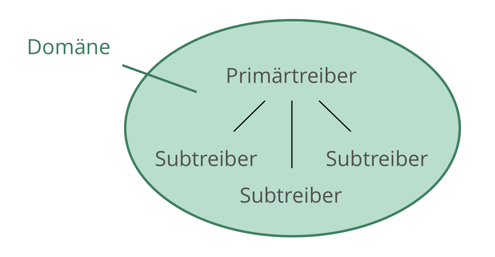
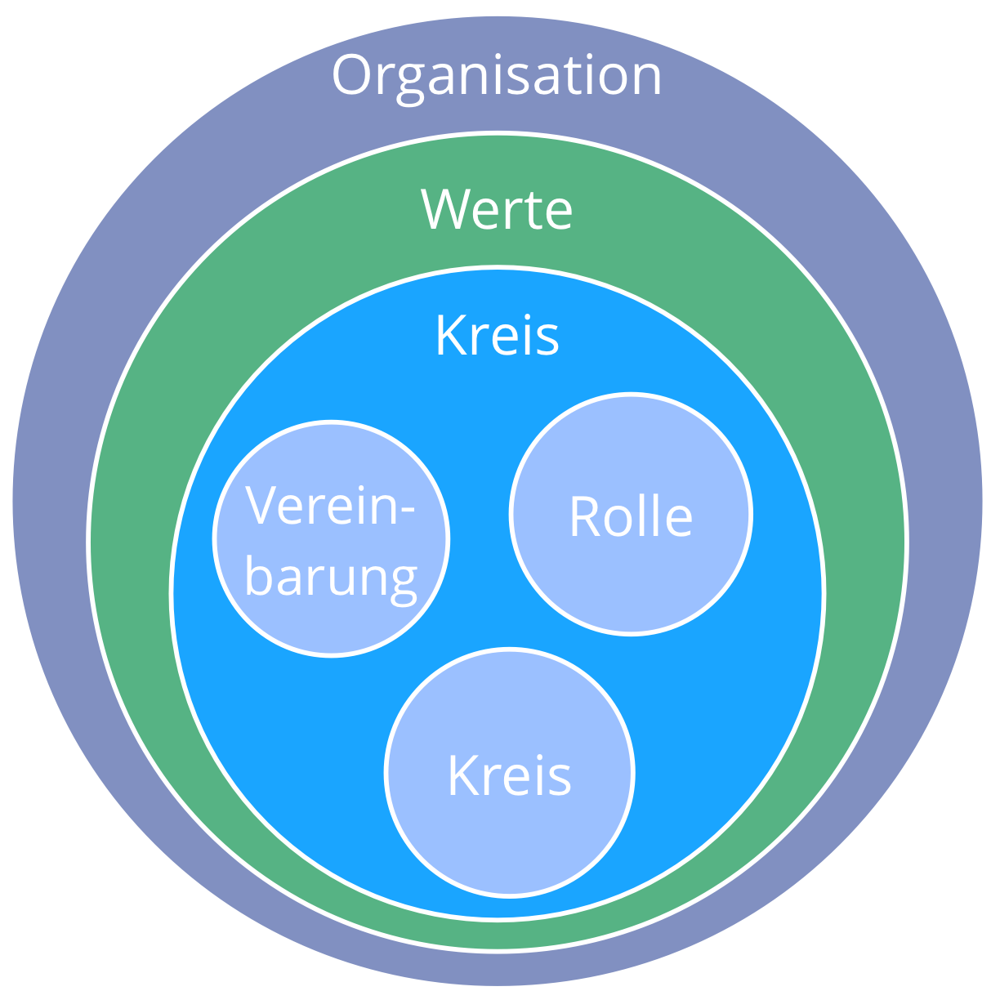

## Soziokratie 3.0 - Ein Leitfaden zur Evolution agiler und resilienter Organisationen

### Effektive Zusammenarbeit in Organisationen beliebiger Größe

- **prinzipiengetrieben** - ein ganzheitlicher Weg zur Entwicklung einer agilen und soziokratischen Geisteshaltung
- **flexibel** - unabhängige, sich gegenseitig verstärkende Muster, die Organisationen in allen Aspekten der Zusammenarbeit unterstützen, und die leicht an den eigenen Kontext angepasst werden können
- **kostenlos** - lizenziert unter einer Creative Commons Free Culture Lizenz

## Was habe ich davon?

Soziokratie 3.0 (oder kurz: "**S3**") bietet Dir eine umfangreiche Sammlung von Ideen (Mustern), die sich in Organisationen als hilfreich erwiesen haben, um **Produktivität, Zusammenarbeit und Zufriedenheit zu verbessern**.

S3 unterstützt Dich dabei, herauszufinden, wie Du am besten Deine Ziele erreichst, und wie Du komplexe Herausforderungen meisterst. Schritt für Schritt, **und ganz ohne Reorganisation oder groß angelegte Change-Initiativen**:

- Beginne dort, wo der Bedarf am größten ist, und wähle ein oder mehrere Muster für ein Experiment. **Bestimme selbst die passende Geschwindigkeit** und entwickle die erforderlichen Fähigkeiten unterwegs.

- **Unabhängig von Deiner Position in der Organisation** wirst Du Muster finden, die Dir weiterhelfen können.

## Inhalt

- eine kurze Einführung in die wesentlichen Konzepte, auf denen S3 basiert
- eine Beschreibung aller Muster in S3
- ein Anhang mit einer Änderungshistorie, Danksagungen, Informationen über die Autoren, einem Glossar und einem alphabetischen Verzeichnis der Muster
## Geschichte und Einflüsse

## Grundlegende Konzepte

Bevor Du in die Muster eintauchst, solltest Du Dich mit einigen Konzepten vertraut machen, die das Verständnis von S3 erleichtern:

- Was ist ein Muster?
- Die sieben Prinzipien
- Treiber, Wert und Verschwendung
- Domänen, Delegation und Verantwortung
- Governance, Selbstorganisation und Teilautonomie

Im Anhang findest Du ein Glossar, das kurze Erklärungen dieser und weiterer Begriffe enthält.
## Muster

_Ein **Muster** ist eine Vorgehensweise, um einer bestimmten Herausforderung erfolgreich zu begegnen._

- Die Muster in S3 werden durch die Beobachtung vieler Organisationen bei der Lösung ihrer Probleme und dem Umgang mit ihren Herausforderungen entdeckt.
- Die Muster können an den jeweiligen Kontext angepasst und dann weiterentwickelt werden.
- Die Muster sind thematisch in 10 Kategorien geordnet.
## Alle Muster basieren auf den sieben Prinzipien

## Die sieben Prinzipien

**Effektivität:** *Investiere Zeit nur für das, was Dich dem Erreichen Deiner Ziele näher bringt.*

**Konsent:** *Handle nur, wenn keiner der Betroffenen einen Einwand hat.*

**Empirismus:** *Überprüfe alle Annahmen durch Experimente, achte auf kontinuierliche Revision und Falsifizierbarkeit.*

**Kontinuierliche Verbesserung:** *Bevorzuge inkrementelle Veränderung, um stetiges empirisches Lernen zu ermöglichen.*

**Gleichstellung:** *Beziehe Menschen in die sie betreffenden Entscheidungen und deren Entwicklung ein.*

**Transparenz:** *Mache alle Informationen für jeden in der Organisation zugänglich, es sei denn, es gibt einen wichtigen Grund für Vertraulichkeit.*

**Verantwortlichkeit:** *Handle, wenn es erforderlich ist; befolge, was Du vereinbart hast und behalte die gesamte Organisation im Blick.*
## Treiber

_Ein **Treiber** ist das Motiv einer Person oder Gruppe, in einer bestimmten Situation zu handeln._

Ein Treiber …

- kann als Ausgangspunkt für Ziele, Vision oder "Bestimmung" dienen
- kann sich im Lauf der Zeit verändern

### Treiber: Wert und Verschwendung

_**Wert** ist die Bedeutung oder der Nutzen von etwas in Bezug  auf einen bestimmten Treiber_

_**Verschwendung** ist alles, was für die effektive Antwort auf einen Treiber nicht notwenig ist oder ihr sogar im Wege steht._

Über das Konzept von Wert und Verschwendung können Organisationen, die Muster aus S3 verwenden, auch viele Praktiken und Ideen aus der **Lean Production** und der **Lean Softwareentwicklung** nutzen. Zum Beispiel:

- Wertstromanalyse
- verschiedene Strategien zur Vermeidung von Verschwendung
- die Kanban-Methode
## Domänen

_Eine **Domäne** ist ein eigener Arbeits-, Einfluss-  und Entscheidungsbereich innerhalb einer Organisation._

Alle Domänen befinden sich innerhalb der Domäne der Organisation, und können sich mit anderen Domänen überschneiden, oder auch vollständig in ihnen enthalten sein.

Domänen werden an Mitarbeiter delegiert (z.B. an eine Geschäftseinheit, eine Abteilung, ein Team oder eine Einzelperson), die dann – innerhalb der Grenzen des Autonomie- und Einflussbereiches dieser Domäne – die Verantwortung dafür übernehmen.

## Domänen delegieren

Wer eine Domäne delegiert (die *Delegierende*) bleibt weiterhin verantwortlich für diese Domäne, und definiert oft:

- **Kernaufgaben** (die wesentlichen delegierten Arbeitsaufgaben und Entscheidungen)
- **Einschränkungen von Autonomie und Einfluss**, normalerweise in Bezug auf die Organisation selbst (z.B. Budget, Ressourcen, Delegationsstufe, Reporting)

## Treiber und Domänen

Eine Domäne kann auch in Bezug auf einen Organisationstreiber - den so genannten **Primärtreiber** der Domäne - definiert werden: die Domäne ist die Menge derjenigen Subtreiber, die im Kontext der Antwort auf diesen Primärtreibers ebenfalls berücksichtigt werden müssen. Dazu gehören:

- **Kernaufgaben**: Treiber, die direkt vom Primärtreiber abgeleitet werden können
- **Einschränkungen**: Treiber, die sich auf die Organisation selbst beziehen

## Domänen und Verantwortlichkeit

- Verantwortlichkeit bezieht sich auf alle Vereinbarungen, einschließlich Kreise, Rollen, und der Organisation selbst
- die primäre Verantwortlichkeit aller Mitarbeiter bezieht sich auf effektive Zusammenarbeit bei der Antwort auf Organisationstreiber
- Einzelpersonen und Gruppen sind jeweils verantwortlich für ihre Arbeit, und für ihre eigene Weiterentwicklung. Die Organisation stellt die dafür erforderliche Unterstützung bereit
- jedes Mitglied einer Organisation ist verantwortlich dafür, seine Handlungen an den Werten der Organisation auszurichten
## Governance, Teilautonomie und Selbstorganisation

**Governance**: Fortwährend entscheiden, was zu tun ist, um Ziele zu erreichen, und Richtlinien dafür festlegen, wie und wann Dinge getan werden.

**Selbststeuerung**: Eine Gruppe, sich innerhalb einer Grenzen einer Domäne selbst steuert und selbst organisiert.

**Selbstorganisation**: Menschen, die ihre Arbeit - innerhalb der durch Governance festgelegten Grenzen - selbst organisieren.

**Operatives Geschäft**: Das Abarbeiten aller anfallenden Arbeiten, innerhalb des durch Governance und Koordination gesetzten Rahmens.

**Teilautonomie**: Die Autonomie der Mitarbeiter, innerhalb ihrer Domäne Wert zu schöpfen (begrenzt von den Einschränkungen der Domäne).

## Unterscheidung zwischen Governance und operativem Geschäft

Damit eine Organisation dazulernen kann und sich kontinuierlich verbessert, sollte sie alle wesentlichen Entscheidungen dokumentieren, prüfen und weiterentwickeln.

*Fragestellung: Profitiert etwas von einer Einzel- oder Gruppen-Entscheidung?*

- ja: Governance 
    - nicht von existierenden Vereinbarungen abgedeckt
    - muss vereinbart, entschieden, oder ergänzt werden
- nein: operatives Geschäft 
    - im Rahmen einer existierenden Vereinbarung (die Verantwortlichen können handeln)
    - muss erledigt werden

[&#9654; Mitgestaltung und Evolution](co-creation-and-evolution.html)

