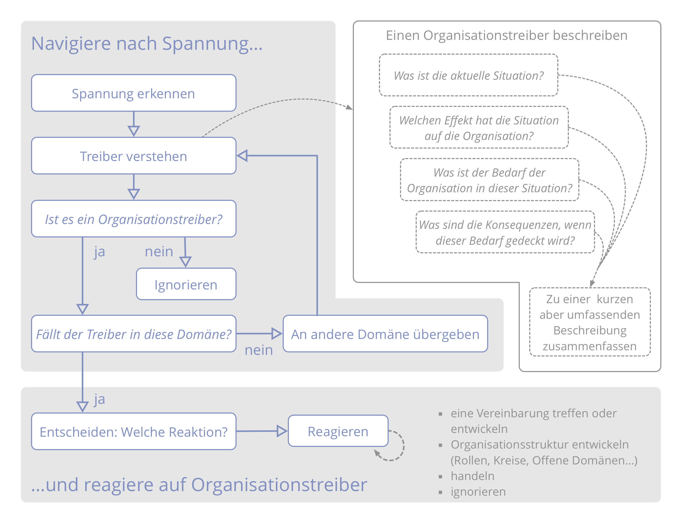

**Gehe bewusst mit Spannung um, die du in Bezug auf die Organisation empfindest: untersuche die zugrundeliegenden Ursachen und übergib die dabei entdeckten Treiber an die zuständige Domäne.**

**Herausforderungen und Chancen** für eine Organisation werden durch ihre Mitglieder aufgedeckt, in dem diese den Gründen nachspüren, warum sie Spannung empfinden.

**Anmerkung:** Eine *Spannung* ist eine persönliche Erfahrung: Ein Symptom von Unstimmigkeit zwischen persönlicher Wahrnehmung und Erwartung (oder Präferenz).

Spüre Spannungen nach, und beschreibe Situation und Bedarf der Organisation, um **Treiber zu entdecken**. Manchmal zeigt diese Untersuchung auch Missverständnisse auf, wodurch sich die Spannung oft auflöst.

[&#9654; Organisationstreiber beschreiben](describe-organizational-drivers.html) [&#9664; Reagiere auf Organisationstreiber](respond-to-organizational-drivers.html) [&#9650; Mitgestaltung und Evolution](co-creation-and-evolution.html)

