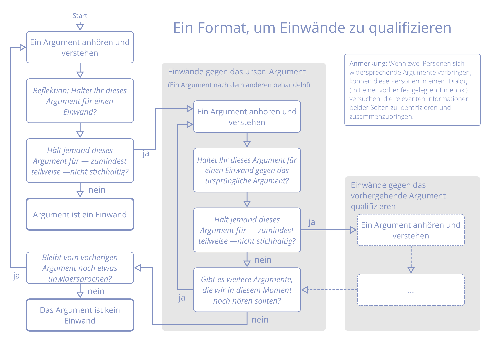

_Ein **Einwand** ist ein _Argument_, warum eine geplante Handlung oder Entscheidung die effektive Reaktion auf einen Organisationstreiber verhindert._

Einwände offenbaren Information über **unbeabsichtigte Folgen**, oder über **Verbesserungsmöglichkeiten<0>.
 

Es liegt in der Verantwortung des Einzelnen, Einwände gegen Entscheidungen, bestehende <dfn data-info="Vereinbarung: Eine gemeinsam beschlossene Richtlinie, ein Prozess, ein Protokoll oder eine Policy, die den den Wertfluss in der Organisation steuert.">Vereinbarungen</dfn> oder Handlungen zu erheben.

Das Zurückhalten von Einwänden kann die Fähigkeit von Personen, Teams oder der gesamten Organisation beeinträchtigen, effektiv auf <dfn data-info="Organisationstreiber: Ein Treiber ist das Motiv einer Person oder Gruppe, auf eine bestimmte Situation zu reagieren. Ein Treiber wird als **Organisationstreiber** betrachtet, wenn eine Reaktion darauf der Organisation hilft, Wert zu schaffen, Verschwendung zu reduzieren oder Schaden abzuwenden.">Organisationstreiber</dfn> zu reagieren.

Die Möglichkeit, *potentielle* Einwände jederzeit einbringen zu können bedeutet, dass Entscheidungen lediglich *gut genug für den Moment sein müssen, und sicher genug, um sie auszuprobieren*.

Die für die betreffende Aktion oder Entscheidung Verantwortlichen sind ebenfalls verantwortlich dafür, *Argumente zu bedenken und Einwände zu berücksichtigen*.

Berücksichtige bei der Suche nach potenziellen Einwänden:

- warum das <dfn data-info="Angestrebtes Ergebnis: Das erwartete Ergebnis einer Vereinbarung, Aktion, Projekt oder Strategie.">angestrebte Ergebnis</dfn> nicht (vollständig) erreicht werden kann: **Effektivität**
- warum es verschwenderisch wäre, dem Vorschlag (oder der existierenden Vereinbarung) zu folgen: **Effizienz**
- die negativen Konsequenzen, die an anderer Stelle entstehen würden (in derselben <dfn data-info="Domäne: Ein eigener Arbeits-, Einfluss-  und Entscheidungsbereich innerhalb einer Organisation.">Domäne</dfn>, in der größeren Organisation, oder auch darüberhinaus): **Seiteneffekte**

Nutze die von Einwänden aufgedeckten Informationen zur Verbesserung

- laufender und geplanter Aktivitäten
- der Ausführung von Entscheidungen
- bestehender Vereinbarungen
- Vorschlägen
- dem gemeinsamen Verständnis von Treibern

### Einwände qualifizieren

Nicht alle vorgebrachten Argumente sind Einwände. Unterscheide zwischen Einwänden, die immer nützliche Informationen enthüllen, und sonstigen Argumenten, die nur auf Annahmen oder Vorlieben basieren.

Um herauszufinden, um ob ein vorgebrachtes Argument tatsächlich einen Einwand darstellt, könnte ein Moderator z.B. folgende Frage stellen:

*"Denkt Ihr, dass es sich bei diesem Argument um einen Einwand handelt?"*

Wenn alle Teilnehmer dem Argument zustimmen, handelt es sich üblicherweise um einen Einwand. Falls nicht, versuche, hinter dem Argument einen tatsächlichen Einwand zu finden, oder Missverständnisse aufzudecken.

### Einwände verstehen

Hilfreiche Fragen zum gemeinsamen Verständnis von Einwänden:

- Inwiefern bezieht ich dieses Argument auf diesen Vorschlag bzw. diese Vereinbarung?
- Zeigt dieser Einwand auf, wie eine (vorgeschlagene oder bestehende) **Aktivität oder Vereinbarung …**: 
    - die Reaktion auf einen Organisationstreiber beeinträchtigt?
    - hier und jetzt verbessert werden kann?
    - dem Beitrag eines Beteiligten im Weg steht?
    - im Widerspruch zu den Werten der Organisation steht?
    - nicht als ‘sicher genug’ angesehen werden kann?

### Bedenken

_Ein **Bedenken** ist eine Annahme, dass etwas - auch in der Abwesenheit von Einwänden - eine effektiv(er)en Antwort auf einen Organisationstreiber behindern **könnte**._

In einer [Konsent-Entscheidung](consent-decision-making.html) können Bedenken Wege aufzeigen, wie eine Vereinbarung weiterentwickelt werden kann, z.B. über die Anpassung von Evaluationskriterien und -zeitpunkt.

Bringe Bedenken ein, wenn du sie als wichtig erachtest, und protokolliere sie im mindesten Falle mit Evaluationskriterien.

Wenn du im Zweifel bist, ob es sich bei einem Argument um einen Einwand oder ein Bedenken handelt, frage die Gruppe, ob sie es für einen Einwand halten.

[&#9654; Einwände integrieren](resolve-objections.html) [&#9664; Konsententscheidung](consent-decision-making.html) [&#9650; Mitgestaltung und Evolution](co-creation-and-evolution.html)

