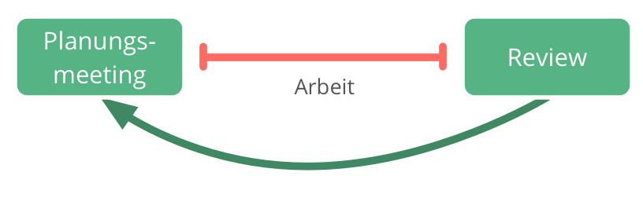

**Teams halten in regelmäßigen Abständen (1-4 Wochen) zeitlich begrenzte Meetings, um Iterationen zu planen und zu evaluieren**

**Planungsmeeting**: Wähle Arbeitspakete für die nächste Iteration aus, und sorge dafür, dass es zu jedem der ausgewählten Arbeitspakete eine Aufwandsschätzung gibt

**Reviewmeeting**: Abnahme fertiggestellter Arbeitspakete, Diskussion von erforderlichen Nachbessrungen und Änderungen für folgende Iterationen 

[&#9654; Koordinationsmeeting](coordination-meeting.html) [&#9664; Daily Standup](daily-standup.html) [&#9650; Fokussierte Interaktionen](focused-interactions.html)

