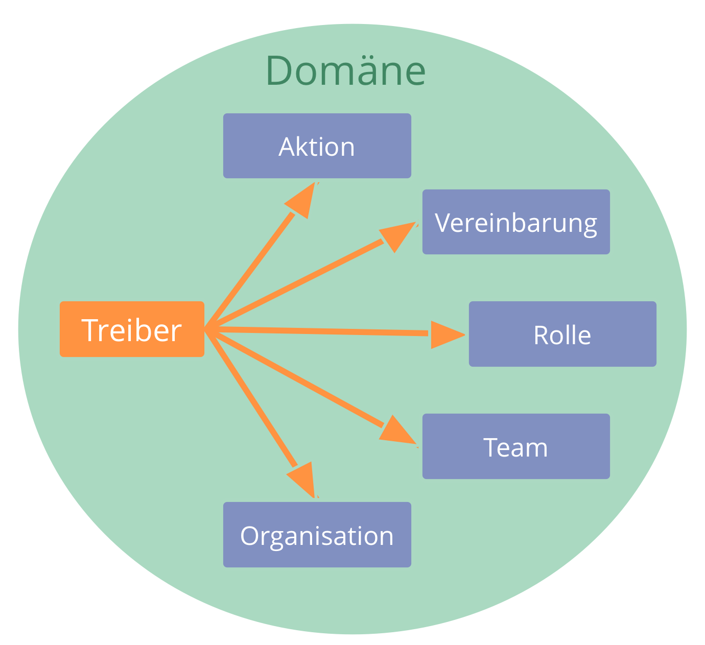
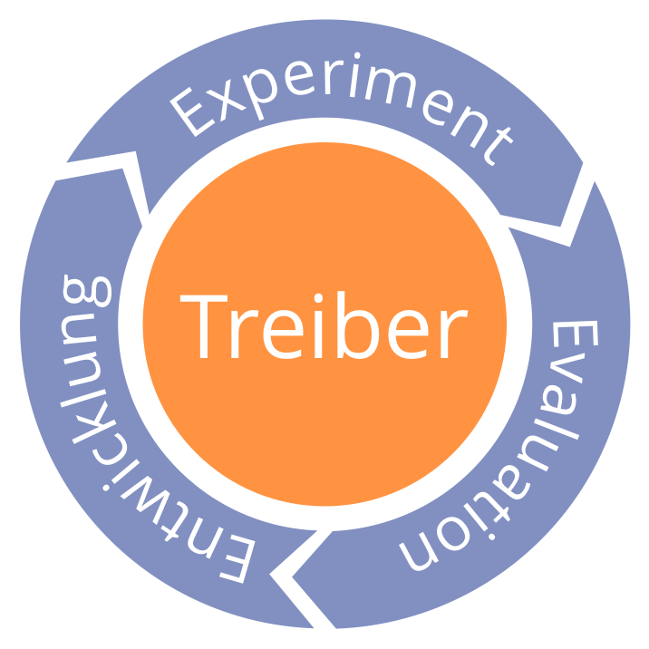

*Kläre, was geschieht und was der Bedarf der Organisation ist, und handle entsprechend.*

Antworten auf Treiber:

- Aktion
- Entscheidung (inkl. Delegation an Rollen, Kreise, Hilfsteams oder offene Domänen)

### Qualifiziere Organisationstreiber

Treiber, die in (direktem oder indirektem) Zusammenhang zum Primärtreiber der Organisation stehen, betrachtet man als **Organisationstreiber**. Andere Treiber fallen nicht in die Verantwortung (Domäne) der Organisation.

Eine einfache Möglichkeit, um organisatorische Treiber zu qualifizieren, ist die Frage:

*Würde eine Antwort auf diesen Treiber den Wertfluss bezogen auf einen bekannten Organisationstreiber verbessern? Kurz: Kann uns das helfen bzw. schaden?*

### Überprüfen von Treibern

Die Antwort auf einen Treiber ist üblicherweise ein Experiment, das über über längere Zeit in einem Lernprozess weiterentwickelt wird.

- Ist die Beschreibung der Situation immer noch zutreffend?
- Verbinden wir mit dieser Situation immer noch den gleichen Bedarf?
- Befindet sich der Treiber immer noch innerhalb unserer Domäne?
- Ist der Treiber immer noch relevant?

[&#9650; Mitgestaltung und Evolution](co-creation-and-evolution.html) | [&#9654; Navigiere nach Spannung](navigate-via-tension.html)

